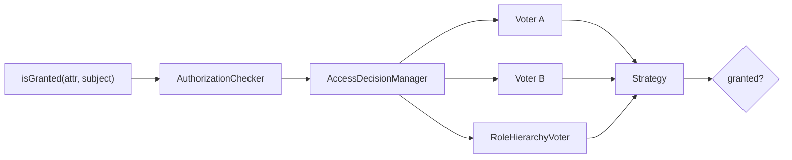

# Authorization

!!! tip "In a nutshell"
    Authorization answers *"is this token allowed to do X?"*. Every check —
    `#[IsGranted]`, `denyAccessUnlessGranted()`, Twig `is_granted()`,
    `access_control` — funnels through `isGranted()` → `AccessDecisionManager` →
    voters.
    Exam hook: only the `isGranted()` path can pass a **subject**; `access_control`
    is URL-based only.

!!! example "Real-world analogy"
    Authorization is which doors your badge opens. The gate already knows *who*
    you are (the token); now each locked door asks "is this badge allowed
    through?". `isGranted()` is you tapping the reader — the **voters** behind it
    decide whether the light turns green.

!!! abstract "Learning objectives"
    By the end of this chapter you can:

    - [ ] Explain how `isGranted()` reaches the `AccessDecisionManager` and voters.
    - [ ] Enforce access with `denyAccessUnlessGranted()` and `#[IsGranted]`.
    - [ ] Distinguish role checks from attribute/voter checks.

    **Syllabus:** `Security → Authorization` ·
    **Level:** Expert ·
    **Est. time:** 30 min ·
    **Prerequisites:** [Authentication](authentication.md) · [Roles](roles.md)

    **Examen Symfony 8 :** OUI

---

## Pour les nuls

### L'idée en une phrase
L'autorisation répond à "ce badge a-t-il le droit d'ouvrir cette porte ?" — une fois qu'on sait déjà qui tu es (authentification), reste à savoir ce que tu peux faire.

### Imagine dans la vraie vie
L'autorisation, ce sont les portes que ton badge ouvre. Le portail sait déjà *qui* tu es (le token) ; chaque porte verrouillée demande ensuite "ce badge peut-il passer ?". `isGranted()` est le moment où tu poses ton badge sur le lecteur — les **voters** derrière décident si le voyant passe au vert.

### Dans Symfony
`#[IsGranted('EDIT', subject: 'produit')]` peut vérifier non seulement le rôle de l'utilisateur, mais aussi si *cet* utilisateur précis peut éditer *ce* produit précis — une vérification bien plus fine qu'un simple `access_control` basé sur l'URL.

### Exemple simple
```php
#[IsGranted('ROLE_ADMIN')]
public function admin(): Response { /* ... */ }
```

### Comment le mémoriser 🧠
Seul le chemin `isGranted()`/`#[IsGranted]` peut passer un **sujet** (un objet précis à vérifier) — `access_control` dans `security.yaml` ne connaît que l'URL, jamais l'objet métier concerné.

---

## Theory

**Authorization** answers *"is this token allowed to do X?"*. It runs **after**
authentication: given an authenticated `TokenInterface`, the app asks
"**is the token granted attribute A (optionally on subject S)?**".

An **attribute** is any string you vote on: a role (`ROLE_ADMIN`), a special
attribute (`IS_AUTHENTICATED_FULLY`, `PUBLIC_ACCESS`), or a domain permission
(`EDIT`, `POST_VIEW`) resolved by a custom [voter](voters.md).

The single entry point is `AuthorizationCheckerInterface::isGranted($attribute,
$subject = null)`. Everything — `#[IsGranted]`, `denyAccessUnlessGranted()`,
Twig's `is_granted()`, `access_control` — funnels through it.

```php
// Single entry point — every check funnels through isGranted():
$authChecker->isGranted('ROLE_ADMIN');          // role attribute
$authChecker->isGranted('EDIT', $post);         // custom attribute + subject

// Same funnel from a controller:
#[IsGranted('POST_VIEW', subject: 'post')]      // declarative attribute
$this->denyAccessUnlessGranted('EDIT', $post);  // imperative, throws on failure

// Twig:  ... 
// security.yaml: access_control rules run the same voters (URL-based only)
```

!!! question "Predict first"
    You call `isGranted('ROLE_ADMIN')` on a logged-out visitor. Does it throw, or
    return a value?

??? note "Reveal"
    It returns `false` — no exception. With no token the `AuthorizationChecker`
    substitutes a `NullToken` and still runs the voters; `AuthenticatedVoter`
    denies the role. `null` bites only *inside* a voter, where `$token->getUser()`
    can be `null`.

## Deep Dive — how it works internally

### The decision path



1. `AuthorizationCheckerInterface`
   (`Symfony\Component\Security\Core\Authorization\AuthorizationChecker`)
   pulls the current token from `TokenStorageInterface`.
2. It calls
   `AccessDecisionManagerInterface::decide(TokenInterface $token, array $attributes, mixed $subject = null)`.
3. The `AccessDecisionManager` iterates every registered **voter**
   (`VoterInterface`), collecting `ACCESS_GRANTED` (1), `ACCESS_DENIED` (-1) or
   `ACCESS_ABSTAIN` (0).
4. A **strategy** (affirmative by default) turns the votes into a final
   `true`/`false`. See [Voters & Voting Strategies](voters.md).

Built-in voters include `RoleVoter` and `RoleHierarchyVoter` (roles),
`AuthenticatedVoter` (the `IS_AUTHENTICATED_*` attributes) and
`ExpressionVoter` (`allow_if` expressions).

```yaml
# Which built-in voter handles which attribute:
access_control:
    - { path: ^/admin,   roles: ROLE_ADMIN }              # RoleVoter / RoleHierarchyVoter
    - { path: ^/profile, roles: IS_AUTHENTICATED_FULLY }  # AuthenticatedVoter
    # allow_if expressions are evaluated by ExpressionVoter:
    - { path: ^/reports, allow_if: "is_granted('ROLE_AUDITOR') and request.isSecure()" }
```

!!! note "Source reference"
    `Symfony\Component\Security\Core\Authorization\AccessDecisionManager::decide()`
    — [symfony/symfony `8.0`](https://github.com/symfony/symfony/blob/8.0/src/Symfony/Component/Security/Core/Authorization/AccessDecisionManager.php).

### Three ways to enforce

| Mechanism | Where | Note |
|---|---|---|
| `#[IsGranted]` | Controller/method | Throws `AccessDeniedException` (→ 403) |
| `denyAccessUnlessGranted()` | Inside a controller | Same exception, imperative |
| `access_control` | `security.yaml` | URL-pattern rules, first match wins |

`#[IsGranted]` is `Symfony\Component\Security\Http\Attribute\IsGranted`. On an
anonymous request to a protected resource, the thrown `AccessDeniedException`
is caught and turned into the **entry point** (login redirect) if the user is
not authenticated, or a **403** if they are but lack the attribute.

```php
use Symfony\Component\Security\Http\Attribute\IsGranted;

#[IsGranted('ROLE_ADMIN')]   // throws AccessDeniedException when denied
public function dashboard(): Response
{
    // anonymous user -> AccessDeniedException -> entry point (login redirect)
    // authenticated user without ROLE_ADMIN -> 403 response
    return $this->render('admin/dashboard.html.twig');
}
```

### Roles vs attributes

- **Roles** are the coarse layer: `ROLE_*` strings carried on the token,
  expanded by the [role hierarchy](roles.md), voted on by `RoleHierarchyVoter`.
- **Attributes + voters** are the fine-grained layer: business rules like
  "can this user edit *this* post?" that need the **subject**. Roles cannot
  express per-object rules; voters can.

### Null behavior

The token can be **absent**. On an anonymous request the `AuthorizationChecker`
reads a `null` token from storage; rather than crash, it substitutes a
**`NullToken`** (`Symfony\Component\Security\Core\Authentication\Token\NullToken`)
and votes as usual. So `isGranted('ROLE_ADMIN')` on a logged-out user is a clean
`false`, not an error: `AuthenticatedVoter` denies the `IS_AUTHENTICATED_*`
attributes for a `NullToken`, while `PUBLIC_ACCESS` still grants.

```php
// Anonymous request: storage holds null, the checker substitutes a NullToken
$authChecker->isGranted('ROLE_ADMIN');             // false — clean denial, no error
$authChecker->isGranted('IS_AUTHENTICATED_FULLY'); // false — AuthenticatedVoter denies
$authChecker->isGranted('PUBLIC_ACCESS');          // true — always granted
```

Where `null` actually bites is *inside* a voter: `$token->getUser()` is `null`
for an unauthenticated token, so guard with an `instanceof` check before touching
user data (see [Voters](voters.md)).

!!! note "Null in real life"
    `null` here is tapping a door reader with no badge: the reader still runs its
    check and simply refuses — it does not break.

## Configuration & code

=== "PHP Attributes"

    ```php
    <?php
    declare(strict_types=1);

    namespace App\Controller;

    use App\Entity\Post;
    use Symfony\Bundle\FrameworkBundle\Controller\AbstractController;
    use Symfony\Component\HttpFoundation\Response;
    use Symfony\Component\Routing\Attribute\Route;
    use Symfony\Component\Security\Http\Attribute\IsGranted;

    #[IsGranted('ROLE_USER')]                       // class-wide guard
    final class PostController extends AbstractController
    {
        #[Route('/posts/{id}/edit', name: 'post_edit')]
        #[IsGranted('EDIT', subject: 'post')]       // voter decides on $post
        public function edit(Post $post): Response
        {
            // Imperative alternative to the attribute:
            $this->denyAccessUnlessGranted('EDIT', $post);

            return $this->render('post/edit.html.twig', ['post' => $post]);
        }
    }
    ```

=== "Twig"

    ```twig
    {# templates/post/show.html.twig #}
    
        <a href="{{ path('post_edit', {id: post.id}) }}">Edit</a>
    

    
        <a href="{{ path('admin_dashboard') }}">Admin</a>
    
    ```

=== "YAML"

    ```yaml
    # config/packages/security.yaml
    security:
        access_control:
            - { path: ^/admin, roles: ROLE_ADMIN }
            - { path: ^/profile, roles: IS_AUTHENTICATED_FULLY }
    ```

## Best practices & anti-patterns

| ✅ Do | ❌ Avoid |
|---|---|
| Use voters for per-object rules | Encoding object logic in role names |
| `#[IsGranted]` for controller guards | Manual `if ($user->isAdmin())` checks |
| Check `is_granted()` in templates | Hiding-only (also enforce server-side) |
| Keep attributes semantic (`EDIT`) | Leaking storage details into attributes |

## When (not) to use it / alternatives

Use roles for broad capabilities and `access_control` for URL-space rules; reach
for [voters](voters.md) whenever the decision depends on the **subject** or
runtime state. For declarative controller guards prefer `#[IsGranted]`; use
`denyAccessUnlessGranted()` when the decision is computed mid-action.

!!! danger "Certification traps"
    - `isGranted('EDIT', $post)` passes the **subject** to voters; `access_control`
      **cannot** pass a subject (it is URL-based only).
    - An `AccessDeniedException` for an **unauthenticated** user triggers the
      **entry point** (login), not a raw 403.
    - `#[IsGranted]` lives in
      `Symfony\Component\Security\Http\Attribute\IsGranted` — not in the DI or
      Routing namespaces.
    - Template `is_granted()` is convenience only; it does **not** replace
      server-side enforcement.

!!! warning "Common mistakes"
    - Assuming `access_control` can check object permissions — it cannot.
    - Forgetting that `isGranted()` with an unauthenticated token still runs
      voters (e.g. `PUBLIC_ACCESS` grants; `AuthenticatedVoter` denies).

## Exercises

1. **(Advanced)** Guard a controller action so only holders of `ROLE_EDITOR`
   can reach it, using an attribute.
2. **(Expert)** Explain why per-post edit permission must be a voter attribute,
   not a role.

??? success "Solutions"

    **1.** Add `#[IsGranted('ROLE_EDITOR')]` above the method (or the class).

    **2.** Roles are static strings on the token with no notion of a subject.
    "Can edit *this* post" depends on the `$post` instance (e.g. ownership), so it
    must be an attribute like `EDIT` resolved by a voter that receives `$post` as
    the subject via `isGranted('EDIT', $post)`.

## Certification questions

*Question d'entraînement inspirée du syllabus — jamais une question officielle de l'examen.*

??? question "Q1. Which check can pass a subject to voters?"
    - [x] A. `isGranted('EDIT', $post)` ✅
    - [ ] B. An `access_control` rule
    - [ ] C. `role_hierarchy`
    - [ ] D. The firewall `pattern`

    **Why:** Only the `isGranted()`/`#[IsGranted]`/`denyAccessUnlessGranted()`
    path carries a subject; `access_control` is URL-based.
    **Ref:** [Voters](https://symfony.com/doc/8.0/security/voters.html).

??? question "Q2. `#[IsGranted]` fails for an anonymous user. What happens?"
    - [ ] A. Immediate 403 always
    - [x] B. The entry point starts authentication (e.g. login redirect) ✅
    - [ ] C. 404
    - [ ] D. The request continues

    **Why:** An unauthenticated `AccessDeniedException` is converted to an entry
    point response; an authenticated one yields 403.
    **Ref:** [Access control](https://symfony.com/doc/8.0/security.html#access-control).

??? question "Q3. Which interface does `isGranted()` ultimately delegate to?"
    - [ ] A. `AuthenticatorInterface`
    - [ ] B. `UserProviderInterface`
    - [x] C. `AccessDecisionManagerInterface` ✅
    - [ ] D. `TokenStorageInterface`

    **Why:** The `AuthorizationChecker` reads the token then calls
    `AccessDecisionManager::decide()`.
    **Ref:** [AccessDecisionManager](https://github.com/symfony/symfony/blob/8.0/src/Symfony/Component/Security/Core/Authorization/AccessDecisionManager.php).

## Key takeaways

- Authorization = "is this token granted attribute A on subject S?".
- Path: `isGranted()` → `AuthorizationChecker` → `AccessDecisionManager` → voters.
- Enforce via `#[IsGranted]`, `denyAccessUnlessGranted()`, or `access_control`.
- Only the imperative/attribute path carries a subject; use voters for per-object rules.

## Last-minute revision

!!! tip "Cheat sheet"
    - `#[IsGranted('ROLE_X')]` / `#[IsGranted('PERM', subject: 'x')]`.
    - `denyAccessUnlessGranted($attr, $subject)` → `AccessDeniedException` → 403.
    - Twig: `is_granted(attr, subject)`.
    - Voter votes: GRANTED 1 / ABSTAIN 0 / DENIED -1.

## Connections

- **Depends on:** [Authentication](authentication.md) — authorization needs the
  token authentication produced.
- **Reused in:** [Voters](voters.md) — every `isGranted()` ends in a voter
  decision.
- **Reused in:** [Controllers](../controllers/index.md) — `#[IsGranted]` and
  `denyAccessUnlessGranted()` guard controller actions.
- **Confused with:** [Access Control Rules](access-control.md) — only the
  `isGranted()` path can pass a subject; `access_control` is URL-only.

## Official References
- [Symfony docs — Authorization](https://symfony.com/doc/8.0/security.html#access-control-authorization)
- [Symfony docs — Voters](https://symfony.com/doc/8.0/security/voters.html)
- [Symfony source — AuthorizationChecker](https://github.com/symfony/symfony/blob/8.0/src/Symfony/Component/Security/Core/Authorization/AuthorizationChecker.php)

## Video references

!!! tip "Watch & learn"
    These are official, continuously-updated video channels — search them for
    "Symfony security" to reinforce this chapter. We link stable channels rather than
    individual videos so the references never rot.

    - [SymfonyCasts screencasts](https://symfonycasts.com/tracks/symfony) — scripted, code-along tutorials.
    - [Symfony official YouTube](https://www.youtube.com/@SymfonyOfficial) — SymfonyCon conference talks & keynotes.
    - [Official docs for this topic](https://symfony.com/doc/8.0/security/voters.html) — some Symfony doc pages embed a screencast.

## Confidence check

I'm ready when I can:

- [ ] explain **why** authorization runs after authentication
- [ ] enforce access with `#[IsGranted]` and `denyAccessUnlessGranted()`
- [ ] debug why `isGranted()` returns `false` for an anonymous user
- [ ] spot when a check needs a subject (voter) vs a role
- [ ] trace `isGranted()` → `AccessDecisionManager` → voters internally

---

<small>Related: [Voters & Voting Strategies](voters.md) · [Roles](roles.md) ·
[Access Control Rules](access-control.md) · [Authentication](authentication.md)</small>
