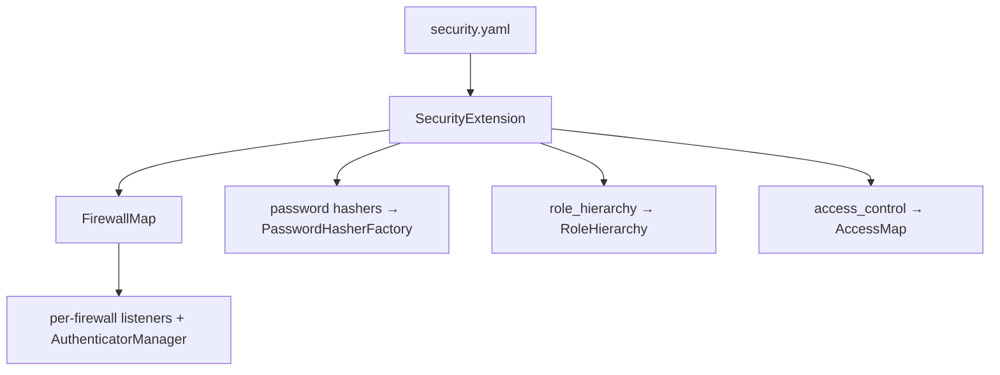

# Configuration (security.yaml)

!!! tip "In a nutshell"
    `security.yaml` est l'unique surface déclarative — `providers`, `firewalls`,
    `access_control`, `password_hashers`, `role_hierarchy` — compilée en une
    `FirewallMap` et en services propres à chaque firewall.
    Piège d'examen : Symfony 8 a **supprimé** `enable_authenticator_manager` ;
    le système d'authenticators est le seul qui existe.

!!! example "Real-world analogy"
    `security.yaml` est le plan directeur du bâtiment. Un seul document câble le
    bureau des archives (`providers`), chaque poste de sécurité (`firewalls`), les
    règles affichées sur les portes (`access_control`), la spécification de la
    déchiqueteuse (`password_hashers`) et les niveaux d'habilitation
    (`role_hierarchy`). `SecurityExtension` est l'entrepreneur qui transforme le
    plan en câblage réel (des services + une `FirewallMap`).

!!! abstract "Learning objectives"
    À la fin de ce chapitre, vous saurez :

    - [ ] Structurer `security.yaml` : `providers`, `firewalls`, `access_control`,
      `password_hashers`, `role_hierarchy`.
    - [ ] Expliquer comment la configuration est compilée en services et en firewall map.
    - [ ] Identifier ce qui a changé en Symfony 8 (plus de `enable_authenticator_manager`).

    **Syllabus:** `Security → Configuration` ·
    **Level:** Advanced → Expert ·
    **Est. time:** 30 min ·
    **Prerequisites:** [Authentication](authentication.md) ·
    [Dependency Injection](../dependency-injection/index.md)

---

## Theory

`config/packages/security.yaml` est l'unique surface déclarative du bundle
Security. Cinq clés de premier niveau comptent pour l'examen :

| Key | Rôle |
|---|---|
| `providers` | D'où viennent les utilisateurs ([Providers](providers.md)) |
| `firewalls` | Configuration d'authentification par espace d'URL ([Firewalls](firewalls.md)) |
| `access_control` | Règles d'autorisation basées sur l'URL ([Access Control](access-control.md)) |
| `password_hashers` | Comment les mots de passe sont hachés ([Password Hashers](password-hashers.md)) |
| `role_hierarchy` | Héritage des roles ([Roles](roles.md)) |

```yaml
# config/packages/security.yaml — the five exam keys at a glance
security:
    providers:
        app_users: { entity: { class: App\Entity\User } }
    firewalls:
        main: { lazy: true, provider: app_users }
    access_control:
        - { path: ^/admin, roles: ROLE_ADMIN }
    password_hashers:
        Symfony\Component\Security\Core\User\PasswordAuthenticatedUserInterface: 'auto'
    role_hierarchy:
        ROLE_ADMIN: [ROLE_USER]
```

!!! question "Predict first"
    Vous définissez deux `providers` mais un firewall omet `provider:`. Symfony
    choisit-il le premier ?

??? note "Reveal"
    Non — c'est une **erreur de configuration**. Avec plus d'un provider, il n'y a
    pas de défaut implicite ; chaque firewall doit nommer son `provider:`
    explicitement. Seul un provider unique est utilisé automatiquement.

## Deep Dive — how it works internally

### Config → services

La `SecurityExtension` du `SecurityBundle` lit cet arbre et, pour **chaque
firewall**, compile un jeu de services dédié : un `FirewallContext`, ses
listeners, la liste des authenticators, un `AuthenticatorManager` et (sauf en
stateless) un `ContextListener`. Tous les contextes sont indexés dans une
`FirewallMap` (`Symfony\Bundle\SecurityBundle\Security\FirewallMap`). À
l'exécution, l'unique listener `Firewall` demande à la map quel contexte
correspond à la request.



Principaux services générés :

- **`security.firewall.map`** → `FirewallMap`
- **`security.access.map`** → `AccessMap` (les règles `access_control` compilées)
- **`security.password_hasher_factory`** → `PasswordHasherFactory`
- **`security.role_hierarchy`** → `RoleHierarchy`

```console
# Each config key compiles to a container service — inspect them:
$ php bin/console debug:container security.firewall.map            # FirewallMap
$ php bin/console debug:container security.access.map              # AccessMap (access_control)
$ php bin/console debug:container security.password_hasher_factory # PasswordHasherFactory
$ php bin/console debug:container security.role_hierarchy          # RoleHierarchy
```

!!! note "Source reference"
    `Symfony\Bundle\SecurityBundle\DependencyInjection\SecurityExtension` —
    [symfony/symfony `8.0`](https://github.com/symfony/symfony/blob/8.0/src/Symfony/Bundle/SecurityBundle/DependencyInjection/SecurityExtension.php).

### What changed in Symfony 8

- **`enable_authenticator_manager` a disparu.** En 7.x, elle valait déjà `true`
  par défaut et était dépréciée ; en 8.0, la clé n'existe plus. Le système
  d'authenticators est le seul système.
- Les anciennes clés d'authentification `anonymous`, `guard` et celles basées sur
  les providers sont supprimées.
- `UserInterface::eraseCredentials()` a été supprimée ; il n'existe aucune
  configuration pour cela — effacez les données sensibles via `__serialize()`
  sur votre classe utilisateur (voir [Users](users.md)).

```php
// Symfony 8: enable_authenticator_manager, anonymous and guard keys are GONE.
// eraseCredentials() was removed too — scrub secrets via __serialize():
final class User implements UserInterface
{
    public ?string $plainPassword = null;

    public function __serialize(): array
    {
        $data = (array) $this;
        unset($data['plainPassword']); // never written to the session
        return $data;
    }
    // ...getRoles(), getUserIdentifier()
}
```

### Ordering matters

`firewalls` et `access_control` sont tous deux évalués **de haut en bas, premier
match gagnant**. Placez les patterns les plus spécifiques en premier ; le
firewall attrape-tout (souvent `main`, sans `pattern`) vient en dernier. Le
firewall `dev` (avec `security: false`) doit venir en premier pour que le
profiler et les assets ne soient jamais interceptés.

```yaml
# Both lists are evaluated top-to-bottom — first match wins:
firewalls:
    dev:                          # must be FIRST: security: false zone
        pattern: ^/(_(profiler|wdt)|css|images|js)/
        security: false
    main:                         # no pattern → catch-all, always LAST
        lazy: true
access_control:
    - { path: ^/admin/users, roles: ROLE_SUPER_ADMIN }  # most specific first
    - { path: ^/admin, roles: ROLE_ADMIN }              # broader rule after
```

## Configuration & code

=== "YAML"

    ```yaml
    # config/packages/security.yaml
    security:
        password_hashers:
            Symfony\Component\Security\Core\User\PasswordAuthenticatedUserInterface: 'auto'

        providers:
            app_users:
                memory:
                    users:
                        admin@example.com: { password: '$2y$13$...', roles: ['ROLE_ADMIN'] }

        role_hierarchy:
            ROLE_ADMIN: [ROLE_USER]
            ROLE_SUPER_ADMIN: [ROLE_ADMIN, ROLE_ALLOWED_TO_SWITCH]

        firewalls:
            dev:
                pattern: ^/(_(profiler|wdt)|css|images|js)/
                security: false
            main:
                lazy: true
                provider: app_users
                form_login:
                    login_path: app_login
                    check_path: app_login
                logout:
                    path: app_logout

        access_control:
            - { path: ^/admin, roles: ROLE_ADMIN }
            - { path: ^/login, roles: PUBLIC_ACCESS }
    ```

=== "Console"

    ```console
    $ php bin/console debug:config security
    $ php bin/console debug:firewall main
    $ php bin/console security:hash-password
    ```

## Best practices & anti-patterns

| ✅ Do | ❌ Avoid |
|---|---|
| Firewall `dev` (`security: false`) en premier | Protéger `_profiler`/les assets |
| `password_hashers: … 'auto'` | Figer un algorithme sans `migrate_from` |
| Firewall/règle le plus spécifique en premier | L'attrape-tout avant les patterns spécifiques |
| Un provider par firewall (ou le défaut) | Un provider ambigu quand plusieurs sont définis |

## When (not) to use it / alternatives

`security.yaml` est l'emplacement canonique ; la configuration PHP
(`config/packages/security.php`) est équivalente si vous préférez les config
builders typés. Les surcharges propres à un environnement vivent dans
`config/packages/<env>/`.

!!! danger "Certification traps"
    - **Pas de `enable_authenticator_manager` en Symfony 8** — le mentionner est
      un signal d'alerte à l'examen.
    - Les clés de `password_hashers` sont des **noms de classes/interfaces**
      (généralement `PasswordAuthenticatedUserInterface`), pas des noms de
      providers.
    - Si **plus d'un** provider est défini, un firewall sans `provider:` explicite
      provoque une erreur — il n'y a pas de défaut implicite.
    - `security: false` sur un firewall le rend entièrement public **et arrête**
      la correspondance des firewalls suivants (premier match gagnant).

!!! warning "Common mistakes"
    - Oublier le firewall `dev`, puis se demander pourquoi le profiler renvoie
      un 302 vers la page de login.
    - Placer le firewall attrape-tout `main` avant `^/api`, si bien que les
      requests API tombent dans le mauvais contexte.

## Exercises

1. **(Advanced)** Ajoutez un firewall `^/api` stateless au-dessus de `main` et
   une `role_hierarchy` où `ROLE_ADMIN` implique `ROLE_USER`.
2. **(Expert)** Expliquez quels services la `SecurityExtension` compile par
   firewall.

??? success "Solutions"

    **1.**
    ```yaml
    firewalls:
        api:  { pattern: ^/api, stateless: true, provider: app_users }
        main: { lazy: true, provider: app_users, form_login: ~ }
    role_hierarchy:
        ROLE_ADMIN: [ROLE_USER]
    ```
    Ordre : `api` avant `main` pour que `/api/*` corresponde en premier.

    **2.** Pour chaque firewall, elle construit un `FirewallContext` regroupant
    les listeners du firewall, la liste des authenticators, un
    `AuthenticatorManager`, un listener d'exceptions et (sauf `stateless`) un
    `ContextListener` ; tous les contextes sont enregistrés dans la
    `FirewallMap`.

## Certification questions

??? question "Q1. In Symfony 8, `enable_authenticator_manager` is…"
    - [ ] A. Required and set to `true`
    - [ ] B. Optional, default `false`
    - [x] C. Removed — the authenticator system is the only one ✅
    - [ ] D. Renamed to `authenticator: true`

    **Why:** La clé existait (et était dépréciée) en 7.x ; la 8.0 l'a supprimée.
    **Ref:** [Security config](https://symfony.com/doc/8.0/security.html).

??? question "Q2. The `password_hashers` map is keyed by…"
    - [ ] A. Firewall name
    - [ ] B. Provider name
    - [x] C. User class / interface name ✅
    - [ ] D. Algorithm name

    **Why:** Vous associez une classe utilisateur (généralement
    `PasswordAuthenticatedUserInterface`) à un algorithme comme `auto`.
    **Ref:** [Password hashing](https://symfony.com/doc/8.0/security/passwords.html).

??? question "Q3. Two providers are defined; a firewall omits `provider:`. Result?"
    - [ ] A. It uses the first provider
    - [x] B. Configuration error — provider is ambiguous ✅
    - [ ] C. It merges both providers
    - [ ] D. Anonymous access

    **Why:** Avec plusieurs providers, il n'y a pas de défaut implicite ; chaque
    firewall doit en nommer un.
    **Ref:** [User providers](https://symfony.com/doc/8.0/security/user_providers.html).

## Key takeaways

- Cinq clés : `providers`, `firewalls`, `access_control`, `password_hashers`,
  `role_hierarchy`.
- La `SecurityExtension` compile la configuration en une `FirewallMap` + des services par firewall.
- Les firewalls et `access_control` s'évaluent de haut en bas, premier match gagnant.
- Symfony 8 a supprimé `enable_authenticator_manager` et les anciennes clés d'authentification.

## Last-minute revision

!!! tip "Cheat sheet"
    - Firewall `dev` (`security: false`) en premier ; l'attrape-tout `main` en dernier.
    - `password_hashers: PasswordAuthenticatedUserInterface: 'auto'`.
    - Plusieurs providers ⇒ chaque firewall a besoin de `provider:`.
    - `debug:config security`, `debug:firewall`, `security:hash-password`.

## Connections

- **Depends on:** [Dependency Injection](../dependency-injection/index.md) — la
  `SecurityExtension` compile le YAML en services du container.
- **Reused in:** [Firewalls](firewalls.md) — chaque bloc de firewall devient un
  `FirewallContext` dans la `FirewallMap`.
- **Reused in:** [Providers](providers.md) — la clé `providers` câble le
  chargement des utilisateurs.
- **Confused with:** [Access Control Rules](access-control.md) — les `firewalls`
  configurent *l'authentification* ; `access_control` configure *l'autorisation*.

## Official References
- [Symfony docs — Security configuration](https://symfony.com/doc/8.0/security.html)
- [Symfony docs — SecurityBundle config reference](https://symfony.com/doc/8.0/reference/configuration/security.html)
- [Symfony source — SecurityExtension](https://github.com/symfony/symfony/blob/8.0/src/Symfony/Bundle/SecurityBundle/DependencyInjection/SecurityExtension.php)

## Video references

!!! tip "Watch & learn"
    Voici des chaînes vidéo officielles et mises à jour en continu — cherchez-y
    « Symfony security » pour consolider ce chapitre. Nous lions des chaînes stables
    plutôt que des vidéos individuelles pour que les références ne périment jamais.

    - [SymfonyCasts screencasts](https://symfonycasts.com/tracks/symfony) — tutoriels scénarisés à suivre en codant.
    - [Symfony official YouTube](https://www.youtube.com/@SymfonyOfficial) — conférences et keynotes des SymfonyCon.
    - [Official docs for this topic](https://symfony.com/doc/8.0/security.html) — certaines pages de la doc Symfony intègrent un screencast.

## Confidence check

Je suis prêt quand je peux :

- [ ] expliquer **pourquoi** `security.yaml` est une surface déclarative unique
- [ ] structurer les cinq clés et ordonner correctement firewalls et règles
- [ ] déboguer une redirection du profiler causée par un firewall `dev` manquant
- [ ] repérer le piège : `enable_authenticator_manager` n'existe plus
- [ ] expliquer ce que la `SecurityExtension` compile par firewall en interne

---

<small>Related: [Firewalls](firewalls.md) · [Providers](providers.md) ·
[Access Control Rules](access-control.md) · [Password Hashers](password-hashers.md)</small>
