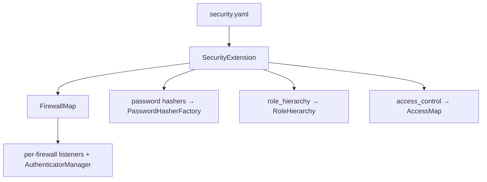

# Configuration (security.yaml)

!!! tip "In a nutshell"
    `security.yaml` is the single declarative surface — `providers`, `firewalls`,
    `access_control`, `password_hashers`, `role_hierarchy` — compiled into a
    `FirewallMap` and per-firewall services.
    Exam hook: Symfony 8 **removed** `enable_authenticator_manager`; the
    authenticator system is the only one.

!!! abstract "Learning objectives"
    By the end of this chapter you can:

    - [ ] Lay out `security.yaml`: `providers`, `firewalls`, `access_control`,
      `password_hashers`, `role_hierarchy`.
    - [ ] Explain how the config compiles into services and the firewall map.
    - [ ] Identify what changed for Symfony 8 (no `enable_authenticator_manager`).

    **Syllabus:** `Security → Configuration` ·
    **Level:** Advanced → Expert ·
    **Est. time:** 30 min ·
    **Prerequisites:** [Authentication](authentication.md) ·
    [Dependency Injection](../dependency-injection/index.md)

---

## Theory

`config/packages/security.yaml` is the single declarative surface for the
Security bundle. Five top-level keys matter for the exam:

| Key | Purpose |
|---|---|
| `providers` | Where users come from ([Providers](providers.md)) |
| `firewalls` | Per-URL-space auth config ([Firewalls](firewalls.md)) |
| `access_control` | URL-based authorization rules ([Access Control](access-control.md)) |
| `password_hashers` | How passwords are hashed ([Password Hashers](password-hashers.md)) |
| `role_hierarchy` | Role inheritance ([Roles](roles.md)) |

## Deep Dive — how it works internally

### Config → services

`SecurityBundle`'s `SecurityExtension` reads this tree and, for **each firewall**,
compiles a dedicated set of services: a `FirewallContext`, its listeners, the
list of authenticators, an `AuthenticatorManager`, and (unless stateless) a
`ContextListener`. All contexts are indexed in a `FirewallMap`
(`Symfony\Bundle\SecurityBundle\Security\FirewallMap`). At runtime the single
`Firewall` listener asks the map which context matches the request.



Key generated services:

- **`security.firewall.map`** → `FirewallMap`
- **`security.access.map`** → `AccessMap` (the compiled `access_control` rules)
- **`security.password_hasher_factory`** → `PasswordHasherFactory`
- **`security.role_hierarchy`** → `RoleHierarchy`

!!! note "Source reference"
    `Symfony\Bundle\SecurityBundle\DependencyInjection\SecurityExtension` —
    [symfony/symfony `8.0`](https://github.com/symfony/symfony/blob/8.0/src/Symfony/Bundle/SecurityBundle/DependencyInjection/SecurityExtension.php).

### What changed in Symfony 8

- **`enable_authenticator_manager` is gone.** In 7.x it was already default
  `true` and deprecated; in 8.0 the key does not exist. The authenticator system
  is the only system.
- The legacy `anonymous`, `guard`, and provider-based auth keys are removed.
- `UserInterface::eraseCredentials()` was removed; there is no config for it —
  erase sensitive data via `__serialize()` on your user class (see [Users](users.md)).

### Ordering matters

Both `firewalls` and `access_control` are matched **top-to-bottom, first match
wins**. Put the most specific patterns first; the catch-all firewall (often
`main`, no `pattern`) goes last. The `dev` firewall (with `security: false`)
must come first so profiler/assets are never intercepted.

## Configuration & code

=== "YAML"

    ```yaml
    # config/packages/security.yaml
    security:
        password_hashers:
            Symfony\Component\Security\Core\User\PasswordAuthenticatedUserInterface: 'auto'

        providers:
            app_users:
                memory:
                    users:
                        admin@example.com: { password: '$2y$13$...', roles: ['ROLE_ADMIN'] }

        role_hierarchy:
            ROLE_ADMIN: [ROLE_USER]
            ROLE_SUPER_ADMIN: [ROLE_ADMIN, ROLE_ALLOWED_TO_SWITCH]

        firewalls:
            dev:
                pattern: ^/(_(profiler|wdt)|css|images|js)/
                security: false
            main:
                lazy: true
                provider: app_users
                form_login:
                    login_path: app_login
                    check_path: app_login
                logout:
                    path: app_logout

        access_control:
            - { path: ^/admin, roles: ROLE_ADMIN }
            - { path: ^/login, roles: PUBLIC_ACCESS }
    ```

=== "Console"

    ```console
    $ php bin/console debug:config security
    $ php bin/console debug:firewall main
    $ php bin/console security:hash-password
    ```

## Best practices & anti-patterns

| ✅ Do | ❌ Avoid |
|---|---|
| `dev` firewall (`security: false`) first | Protecting `_profiler`/assets |
| `password_hashers: … 'auto'` | Pinning a fixed algo without `migrate_from` |
| Most-specific firewall/rule first | Catch-all before specific patterns |
| One provider per firewall (or default) | Ambiguous provider with multiple defined |

## When (not) to use it / alternatives

`security.yaml` is the canonical place; PHP config
(`config/packages/security.php`) is equivalent when you prefer typed config
builders. Environment-specific overrides live in `config/packages/<env>/`.

!!! danger "Certification traps"
    - **No `enable_authenticator_manager` in Symfony 8** — mentioning it is a red
      flag on the exam.
    - `password_hashers` keys are **class/interface names** (usually
      `PasswordAuthenticatedUserInterface`), not provider names.
    - If **more than one** provider is defined, a firewall without an explicit
      `provider:` errors — there is no implicit default.
    - `security: false` on a firewall makes it fully public **and stops** the rest
      of the firewall matching (first match wins).

!!! warning "Common mistakes"
    - Forgetting the `dev` firewall, then wondering why the profiler 302s to login.
    - Putting the catch-all `main` firewall before `^/api`, so API requests hit
      the wrong context.

## Exercises

1. **(Advanced)** Add a stateless `^/api` firewall above `main` and a
   `role_hierarchy` where `ROLE_ADMIN` implies `ROLE_USER`.
2. **(Expert)** Explain what services `SecurityExtension` compiles per firewall.

??? success "Solutions"

    **1.**
    ```yaml
    firewalls:
        api:  { pattern: ^/api, stateless: true, provider: app_users }
        main: { lazy: true, provider: app_users, form_login: ~ }
    role_hierarchy:
        ROLE_ADMIN: [ROLE_USER]
    ```
    Order: `api` before `main` so `/api/*` matches first.

    **2.** For each firewall it builds a `FirewallContext` bundling the firewall
    listeners, the authenticator list, an `AuthenticatorManager`, an exception
    listener and (unless `stateless`) a `ContextListener`; all contexts are
    registered in the `FirewallMap`.

## Certification questions

??? question "Q1. In Symfony 8, `enable_authenticator_manager` is…"
    - [ ] A. Required and set to `true`
    - [ ] B. Optional, default `false`
    - [x] C. Removed — the authenticator system is the only one ✅
    - [ ] D. Renamed to `authenticator: true`

    **Why:** The key existed (and was deprecated) in 7.x; 8.0 removed it.
    **Ref:** [Security config](https://symfony.com/doc/current/security.html).

??? question "Q2. The `password_hashers` map is keyed by…"
    - [ ] A. Firewall name
    - [ ] B. Provider name
    - [x] C. User class / interface name ✅
    - [ ] D. Algorithm name

    **Why:** You map a user class (commonly `PasswordAuthenticatedUserInterface`)
    to an algorithm like `auto`.
    **Ref:** [Password hashing](https://symfony.com/doc/current/security/passwords.html).

??? question "Q3. Two providers are defined; a firewall omits `provider:`. Result?"
    - [ ] A. It uses the first provider
    - [x] B. Configuration error — provider is ambiguous ✅
    - [ ] C. It merges both providers
    - [ ] D. Anonymous access

    **Why:** With multiple providers there is no implicit default; each firewall
    must name one.
    **Ref:** [User providers](https://symfony.com/doc/current/security/user_providers.html).

## Key takeaways

- Five keys: `providers`, `firewalls`, `access_control`, `password_hashers`,
  `role_hierarchy`.
- `SecurityExtension` compiles the config into a `FirewallMap` + per-firewall services.
- Firewalls and `access_control` are first-match, top-to-bottom.
- Symfony 8 removed `enable_authenticator_manager` and legacy auth keys.

## Last-minute revision

!!! tip "Cheat sheet"
    - `dev` firewall (`security: false`) first; catch-all `main` last.
    - `password_hashers: PasswordAuthenticatedUserInterface: 'auto'`.
    - Multiple providers ⇒ each firewall needs `provider:`.
    - `debug:config security`, `debug:firewall`, `security:hash-password`.

## Official References
- [Symfony docs — Security configuration](https://symfony.com/doc/current/security.html)
- [Symfony docs — SecurityBundle config reference](https://symfony.com/doc/current/reference/configuration/security.html)
- [Symfony source — SecurityExtension](https://github.com/symfony/symfony/blob/8.0/src/Symfony/Bundle/SecurityBundle/DependencyInjection/SecurityExtension.php)

---

<small>Related: [Firewalls](firewalls.md) · [Providers](providers.md) ·
[Access Control Rules](access-control.md) · [Password Hashers](password-hashers.md)</small>
</content>
