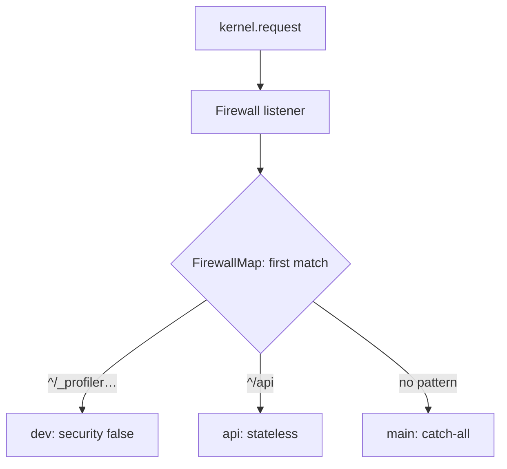

# Firewalls

!!! tip "In a nutshell"
    Un firewall définit *comment* les requests d'une zone d'URL sont
    authentifiées ; exactement **un seul** est actif par request — le premier
    dont le matcher correspond.
    Piège d'examen : `security: false` (p. ex. le firewall `dev`) compte quand
    même comme le match, il doit donc venir en premier.

!!! example "Real-world analogy"
    Un firewall est le poste de sécurité à l'entrée d'un bâtiment. Chaque aile a
    son propre poste avec ses propres règles (lecteurs de badge pour le
    personnel, registre pour les visiteurs), mais vous ne passez qu'un **seul**
    poste en entrant — le premier dont vous franchissez la zone. Le poste décide
    *comment* vous prouvez qui vous êtes, pas dans quelles pièces vous pouvez
    entrer.

!!! abstract "Learning objectives"
    À la fin de ce chapitre, vous saurez :

    - [ ] Expliquer comment une request est associée à exactement un firewall.
    - [ ] Configurer `pattern`/`host`/`methods`, le firewall `dev` et `security: false`.
    - [ ] Raisonner sur les firewalls `lazy` et le partage de `context`.

    **Syllabus:** `Security → Firewalls` ·
    **Level:** Expert ·
    **Est. time:** 30 min ·
    **Prerequisites:** [Configuration](configuration.md) · [Authentication](authentication.md)

---

## Theory

Un **firewall** est une configuration de sécurité qui s'applique à une tranche
de votre espace d'URL. Malgré son nom, un firewall ne fait pas (seulement)
barrage — il définit **comment les requests de sa zone sont authentifiées**.
Exactement **un seul** firewall est actif par request : le **premier** dont le
matcher correspond.

Voyez les firewalls comme la couche d'*authentification* (qui êtes-vous, par
zone d'URL) et [`access_control`](access-control.md) comme la couche
d'*autorisation* (en avez-vous le droit) — ce sont deux choses distinctes.

!!! question "Predict first"
    Vous listez `main` (sans `pattern`) avant `api` (`pattern: ^/api`). Quel
    firewall traite une request vers `/api/orders` ?

??? note "Reveal"
    `main`. Les firewalls fonctionnent en premier-match et `main` n'a pas de
    pattern, donc il correspond à tout — `api` n'est jamais atteint. Placez les
    patterns spécifiques en premier ; le catch-all sans pattern va en dernier.

## Deep Dive — how it works internally

### Matching

Le listener `Firewall` (`Symfony\Component\Security\Http\Firewall`) s'exécute
sur `kernel.request` avec la priorité **8** (après le routing). Il demande à la
`FirewallMap` le `FirewallContext` dont le `RequestMatcher` correspond, en
évaluant les firewalls **de haut en bas, premier match gagnant**.

Le matcher d'un firewall peut combiner :

| Key | Matches on |
|---|---|
| `pattern` | Regex de chemin (ancrée, p. ex. `^/api`) |
| `host` | Regex d'hôte |
| `methods` | Méthodes HTTP |
| `request_matcher` | Un service `RequestMatcherInterface` personnalisé |



!!! note "Source reference"
    `Symfony\Component\Security\Http\Firewall` et
    `Symfony\Bundle\SecurityBundle\Security\FirewallMap` —
    [symfony/symfony `8.0`](https://github.com/symfony/symfony/blob/8.0/src/Symfony/Component/Security/Http/Firewall.php).

### The special `dev` firewall

```yaml
dev:
    pattern: ^/(_(profiler|wdt)|css|images|js)/
    security: false
```

`security: false` désactive entièrement la sécurité pour cette zone (aucun
listener, aucun token). Il existe pour que le **profiler et les assets de dev ne
soient jamais interceptés** par une redirection vers le login. Comme le matching
est en premier-match, il doit apparaître **en premier**. Un firewall
`security: false` qui correspond *compte quand même comme le match*, donc les
firewalls suivants ne sont pas évalués.

### Lazy firewalls

`lazy: true` enveloppe le token storage afin de différer l'authentification
jusqu'à ce que le token soit réellement **lu** (p. ex. `is_granted()`,
`getUser()`). Pour les pages entièrement publiques, aucune session n'est chargée
et aucun authenticator ne s'exécute — un vrai gain de performance. Le template
de projet par défaut l'active sur `main`.

### Stateless firewalls

`stateless: true` saute le `ContextListener`, donc aucun token n'est
stocké/restauré dans la session. Idéal pour les API ; voir
[Authentication](authentication.md).

### Firewall context sharing

Par défaut, chaque firewall possède son **propre** contexte d'authentification —
un login sur un firewall ne se propage pas à un autre. Définissez le **même nom
de `context:`** sur deux firewalls pour partager le token de session entre eux ;
définissez des contexts distincts (ou fiez-vous aux valeurs par défaut) pour les
isoler (p. ex. un espace client vs un espace admin avec des logins séparés).

!!! info "Expert note"
    Un firewall `security: false` n'est *pas* un firewall vide — il n'enregistre
    **aucun** listener de sécurité et compte quand même comme le match, donc rien
    en dessous n'est évalué. C'est exactement pourquoi le firewall
    `dev`/profiler doit être en premier : il doit remporter le match *avant*
    qu'un firewall protecteur puisse rediriger le profiler vers une page de
    login.

??? example "Debugging story"
    **Symptôme :** le profiler Symfony et la web debug toolbar renvoyaient sans
    cesse un 302 vers `/login` en `dev`. **Diagnostic :** un firewall `main` trop
    large (sans `pattern`) était listé *au-dessus* du firewall `dev`, il
    correspondait donc en premier à `/_profiler/...` et son entry point
    redirigeait. **Correctif :** remonter le firewall `dev`
    (`pattern: ^/(_(profiler|wdt)|css|images|js)/`, `security: false`) tout en
    haut. **À éviter :** le firewall `dev` est toujours en premier — le
    premier-match fait de l'ordre une question de correction, pas de style.

??? abstract "Source-code tour"
    - `Symfony\Component\Security\Http\Firewall` — le listener `kernel.request`
      (priorité 8) qui pilote tout.
    - `Symfony\Bundle\SecurityBundle\Security\FirewallMap` — résout la request
      vers un unique `FirewallContext`.
    - `...\Security\FirewallContext` — regroupe les listeners du firewall retenu
      et la gestion des exceptions.
    - `Symfony\Component\HttpFoundation\RequestMatcherInterface` — comment
      `pattern`/`host`/`methods` deviennent un matcher.
    - `...\Http\Firewall\ContextListener` — stocke/restaure le token dans la
      session sauf si le firewall est `stateless`.

## Configuration & code

=== "YAML"

    ```yaml
    # config/packages/security.yaml
    security:
        firewalls:
            dev:
                pattern: ^/(_(profiler|wdt)|css|images|js)/
                security: false
            api:
                pattern: ^/api
                stateless: true
                provider: app_users
            admin:
                host: admin\.example\.com
                lazy: true
                provider: app_users
                context: shared          # shares token with 'main'
                form_login: { login_path: admin_login, check_path: admin_login }
            main:
                lazy: true
                provider: app_users
                context: shared
                form_login: { login_path: app_login, check_path: app_login }
                logout: { path: app_logout }
    ```

=== "Console"

    ```console
    $ php bin/console debug:firewall
    $ php bin/console debug:firewall main --events
    ```

## Best practices & anti-patterns

| ✅ Do | ❌ Avoid |
|---|---|
| Le firewall `dev` en premier | Placer le catch-all avant les firewalls spécifiques |
| `lazy: true` sur les firewalls web | Une auth immédiate qui charge une session pour des pages publiques |
| `stateless: true` pour les API | Partager le context entre des firewalls sans rapport |
| Ancrer les patterns (`^/api`) | Des patterns non ancrés qui matchent trop large |

## When (not) to use it / alternatives

Utilisez plusieurs firewalls quand différentes zones d'URL nécessitent une
authentification différente (form login en session pour le site, tokens bearer
pour `/api`). Utilisez un seul firewall plus `access_control` quand la méthode
d'authentification est uniforme et que seule l'*autorisation* varie selon le
chemin.

!!! danger "Certification traps"
    - **Le premier match gagne** — un firewall `main` trop large placé avant
      `^/api` avale les requests d'API. Ordonnez du spécifique vers le général.
    - `security: false` n'est **pas** équivalent à un firewall vide ; il
      désactive entièrement la couche de sécurité et **compte quand même comme le
      match**.
    - Un firewall sélectionne **l'authentification** ; **l'autorisation** est
      séparée (`access_control`, voters). Un utilisateur « dans » un firewall
      peut toujours se voir refuser l'accès.
    - `lazy: true` diffère l'auth jusqu'à la lecture du token — les pages
      publiques la sautent.

!!! warning "Common mistakes"
    - Oublier d'ancrer le `pattern` (`api` matche aussi `/my-api-docs`).
    - S'attendre à ce qu'un login sous un firewall en authentifie un autre sans
      `context` partagé.

## Exercises

1. **(Advanced)** Configurez un firewall stateless `^/api` et un firewall
   catch-all stateful séparés, dans le bon ordre.
2. **(Expert)** Expliquez pourquoi `security: false` doit précéder les autres
   firewalls.

??? success "Solutions"

    **1.** Voir l'onglet de configuration : `api` (`pattern: ^/api`,
    `stateless: true`) est listé **avant** `main` (sans pattern, le catch-all).

    **2.** Les firewalls fonctionnent en premier-match. Si un firewall plus
    large correspondait en premier, les chemins `dev`/profiler seraient
    interceptés par la sécurité (redirections vers le login sur le profiler).
    Lister `security: false` en premier garantit que ces chemins contournent la
    sécurité avant qu'un firewall protecteur soit considéré.

## Certification questions

??? question "Q1. How many firewalls are active for a given request?"
    - [ ] A. All that match
    - [x] B. Exactly one — the first matching ✅
    - [ ] C. One per HTTP method
    - [ ] D. Zero or many

    **Why:** La `FirewallMap` renvoie le premier context correspondant ; le
    matching s'arrête là.
    **Ref:** [Firewalls](https://symfony.com/doc/current/security.html#the-firewall).

??? question "Q2. What does `security: false` do?"
    - [x] A. Disables the security layer for that zone (still counts as the match) ✅
    - [ ] B. Denies all access
    - [ ] C. Enables anonymous voting
    - [ ] D. Makes the firewall stateless

    **Why:** Il désactive tous les listeners de sécurité pour les requests
    correspondantes ; utilisé pour le profiler/les assets.
    **Ref:** [Security config](https://symfony.com/doc/current/security.html).

??? question "Q3. Two firewalls should share a logged-in session. What do you set?"
    - [ ] A. The same `provider`
    - [ ] B. `stateless: true` on both
    - [x] C. The same `context:` name ✅
    - [ ] D. Nothing — it is automatic

    **Why:** Le partage exige une clé `context` explicitement identique ; sinon
    chaque firewall possède son propre token.
    **Ref:** [Firewall context](https://symfony.com/doc/current/security.html).

## Key takeaways

- Un firewall par request : le premier matcher gagne (ordre spécifique →
  général).
- Matching sur `pattern`/`host`/`methods`/`request_matcher`.
- Firewall `dev` + `security: false` en premier ; protège le profiler/les
  assets.
- `lazy` diffère l'auth ; `stateless` saute la session ; `context` partage les
  tokens.

## Last-minute revision

!!! tip "Cheat sheet"
    - Firewall = zone d'authentification ; `access_control` = autorisation.
    - Le premier match gagne — `dev`/`security: false` en premier, catch-all en
      dernier.
    - `lazy: true` = auth à la lecture du token ; `stateless: true` = pas de
      token en session.
    - Même `context:` ⇒ login partagé.

## Connections

- **Depends on:** [Configuration](configuration.md) — la `SecurityExtension`
  compile chaque firewall en un `FirewallContext` + une `FirewallMap`.
- **Depends on:** [Event Dispatcher](../architecture/events.md) — le `Firewall`
  s'exécute comme listener `kernel.request`.
- **Reused in:** [Authentication](authentication.md) — le firewall retenu
  exécute ses authenticators.
- **Confused with:** [Access Control Rules](access-control.md) — les firewalls
  sélectionnent *l'authentification* ; `access_control` gère *l'autorisation*.

## Official References
- [Symfony docs — The firewall](https://symfony.com/doc/current/security.html#the-firewall)
- [Symfony docs — Security config reference](https://symfony.com/doc/current/reference/configuration/security.html)
- [Symfony source — Firewall](https://github.com/symfony/symfony/blob/8.0/src/Symfony/Component/Security/Http/Firewall.php)

## Video references

!!! tip "Watch & learn"
    Voici des chaînes vidéo officielles, mises à jour en continu — cherchez-y
    « Symfony security » pour consolider ce chapitre. Nous lions des chaînes
    stables plutôt que des vidéos individuelles pour que les références ne
    périment jamais.

    - [SymfonyCasts screencasts](https://symfonycasts.com/tracks/symfony) — tutoriels scénarisés à suivre en codant.
    - [Symfony official YouTube](https://www.youtube.com/@SymfonyOfficial) — conférences et keynotes SymfonyCon.
    - [Official docs for this topic](https://symfony.com/doc/current/security.html#the-firewall) — certaines pages de la doc Symfony intègrent un screencast.

## Confidence check

Je suis prêt quand je peux :

- [ ] expliquer **pourquoi** exactement un firewall est actif par request
- [ ] configurer les firewalls `dev`/`api`/`main` dans le bon ordre
- [ ] déboguer un profiler qui redirige vers le login (ordre des firewalls)
- [ ] repérer le piège : `security: false` compte quand même comme le match
- [ ] expliquer `lazy`, `stateless` et le `context` partagé en interne

---

<small>Related: [Configuration](configuration.md) · [Authentication](authentication.md) ·
[Access Control Rules](access-control.md) · [Providers](providers.md)</small>
