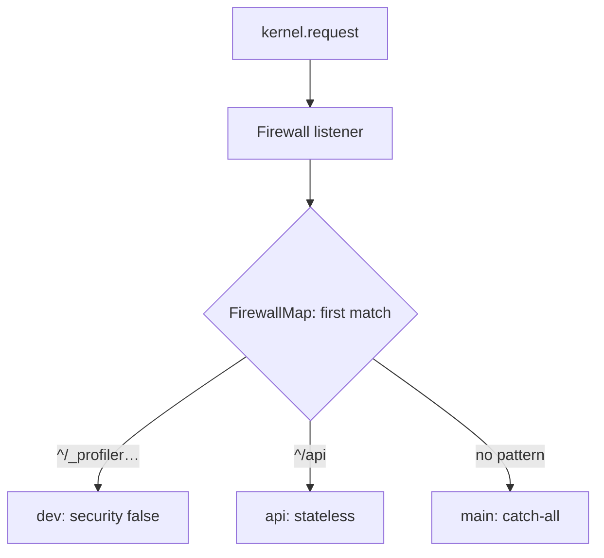

# Firewalls

!!! tip "In a nutshell"
    A firewall defines *how* requests in a URL zone are authenticated; exactly
    **one** is active per request — the first whose matcher matches.
    Exam hook: `security: false` (e.g. the `dev` firewall) still counts as the
    match, so it must come first.

!!! example "Real-world analogy"
    A firewall is the security desk at a building entrance. Each wing has its own
    desk with its own rules (badge readers for staff, a sign-in sheet for
    visitors), but you pass exactly **one** desk on the way in — the first whose
    area you step into. The desk decides *how* you prove who you are, not which
    rooms you may enter.

!!! abstract "Learning objectives"
    By the end of this chapter you can:

    - [ ] Explain how a request is matched to exactly one firewall.
    - [ ] Configure `pattern`/`host`/`methods`, the `dev` firewall and `security: false`.
    - [ ] Reason about `lazy` firewalls and `context` sharing.

    **Syllabus:** `Security → Firewalls` ·
    **Level:** Expert ·
    **Est. time:** 30 min ·
    **Prerequisites:** [Configuration](configuration.md) · [Authentication](authentication.md)

---

## Theory

A **firewall** is a security configuration that applies to a slice of your URL
space. Despite the name, a firewall does not (only) block — it defines **how
requests in its area are authenticated**. Exactly **one** firewall is active per
request: the **first** whose matcher matches.

Think of firewalls as the *authentication* layer (who are you, per URL zone) and
[`access_control`](access-control.md) as the *authorization* layer (are you
allowed) — they are separate.

!!! question "Predict first"
    You list `main` (no `pattern`) before `api` (`pattern: ^/api`). Which firewall
    handles a request to `/api/orders`?

??? note "Reveal"
    `main`. Firewalls are first-match and `main` has no pattern, so it matches
    everything — `api` is never reached. Order specific patterns first; the
    pattern-less catch-all goes last.

## Deep Dive — how it works internally

### Matching

The `Firewall` listener (`Symfony\Component\Security\Http\Firewall`) runs on
`kernel.request` at priority **8** (after routing). It asks the `FirewallMap`
for the `FirewallContext` whose `RequestMatcher` matches, evaluating firewalls
**top-to-bottom, first match wins**.

A firewall matcher can combine:

| Key | Matches on |
|---|---|
| `pattern` | Path regex (anchored, e.g. `^/api`) |
| `host` | Host regex |
| `methods` | HTTP methods |
| `request_matcher` | A custom `RequestMatcherInterface` service |



!!! note "Source reference"
    `Symfony\Component\Security\Http\Firewall` and
    `Symfony\Bundle\SecurityBundle\Security\FirewallMap` —
    [symfony/symfony `8.0`](https://github.com/symfony/symfony/blob/8.0/src/Symfony/Component/Security/Http/Firewall.php).

### The special `dev` firewall

```yaml
dev:
    pattern: ^/(_(profiler|wdt)|css|images|js)/
    security: false
```

`security: false` disables security entirely for that zone (no listeners, no
token). It exists so the **profiler and dev assets are never intercepted** by a
login redirect. Because matching is first-match, it must appear **first**. A
matched `security: false` firewall still *counts as the match*, so later
firewalls are not evaluated.

### Lazy firewalls

`lazy: true` wraps the token storage so authentication is deferred until the
token is actually **read** (e.g. `is_granted()`, `getUser()`). For fully public
pages, no session is loaded and no authenticator runs — a real performance win.
The default project template enables it on `main`.

### Stateless firewalls

`stateless: true` skips the `ContextListener`, so no token is stored/restored in
the session. Ideal for APIs; see [Authentication](authentication.md).

### Firewall context sharing

By default each firewall has its **own** authentication context — a login on one
firewall does not carry to another. Set the **same `context:` name** on two
firewalls to share the session token between them; set distinct contexts (or
rely on defaults) to isolate them (e.g. a customer area vs an admin area with
separate logins).

!!! info "Expert note"
    A `security: false` firewall is *not* an empty firewall — it registers **no**
    security listeners at all and still counts as the match, so nothing below it
    is evaluated. That is exactly why the `dev`/profiler firewall must be first:
    it must win the match *before* any protecting firewall can redirect the
    profiler to a login page.

??? example "Debugging story"
    **Symptom:** the Symfony profiler and web debug toolbar kept 302-ing to
    `/login` in `dev`. **Diagnosis:** a broad `main` firewall (no `pattern`) was
    listed *above* the `dev` firewall, so it matched `/_profiler/...` first and its
    entry point redirected. **Fix:** move the `dev` firewall
    (`pattern: ^/(_(profiler|wdt)|css|images|js)/`, `security: false`) to the top.
    **Avoid:** the `dev` firewall is always first — first-match means order is
    correctness, not style.

??? abstract "Source-code tour"
    - `Symfony\Component\Security\Http\Firewall` — the `kernel.request` listener
      (priority 8) that drives everything.
    - `Symfony\Bundle\SecurityBundle\Security\FirewallMap` — resolves the request
      to a single `FirewallContext`.
    - `...\Security\FirewallContext` — bundles the matched firewall's listeners and
      exception handling.
    - `Symfony\Component\HttpFoundation\RequestMatcherInterface` — how `pattern`/
      `host`/`methods` become a matcher.
    - `...\Http\Firewall\ContextListener` — stores/restores the token in the
      session unless the firewall is `stateless`.

## Configuration & code

=== "YAML"

    ```yaml
    # config/packages/security.yaml
    security:
        firewalls:
            dev:
                pattern: ^/(_(profiler|wdt)|css|images|js)/
                security: false
            api:
                pattern: ^/api
                stateless: true
                provider: app_users
            admin:
                host: admin\.example\.com
                lazy: true
                provider: app_users
                context: shared          # shares token with 'main'
                form_login: { login_path: admin_login, check_path: admin_login }
            main:
                lazy: true
                provider: app_users
                context: shared
                form_login: { login_path: app_login, check_path: app_login }
                logout: { path: app_logout }
    ```

=== "Console"

    ```console
    $ php bin/console debug:firewall
    $ php bin/console debug:firewall main --events
    ```

## Best practices & anti-patterns

| ✅ Do | ❌ Avoid |
|---|---|
| `dev` firewall first | Placing catch-all before specific ones |
| `lazy: true` on web firewalls | Eager auth loading a session for public pages |
| `stateless: true` for APIs | Sharing context between unrelated firewalls |
| Anchor patterns (`^/api`) | Unanchored patterns matching too much |

## When (not) to use it / alternatives

Use multiple firewalls when different URL zones need different authentication
(session form login for the site, bearer tokens for `/api`). Use one firewall
plus `access_control` when the auth method is uniform and only the *authorization*
differs per path.

!!! danger "Certification traps"
    - **First match wins** — a broad `main` firewall before `^/api` swallows API
      requests. Order specific → general.
    - `security: false` is **not** the same as an empty firewall; it disables the
      security layer entirely and **still counts as the match**.
    - A firewall selects **authentication**; **authorization** is separate
      (`access_control`, voters). A user "in" a firewall can still be denied.
    - `lazy: true` defers auth until the token is read — public pages skip it.

!!! warning "Common mistakes"
    - Forgetting to anchor `pattern` (`api` matches `/my-api-docs` too).
    - Expecting a login under one firewall to authenticate another without a
      shared `context`.

## Exercises

1. **(Advanced)** Configure separate stateless `^/api` and stateful catch-all
   firewalls in the correct order.
2. **(Expert)** Explain why `security: false` must precede other firewalls.

??? success "Solutions"

    **1.** See the config tab: `api` (`pattern: ^/api`, `stateless: true`) is
    listed **before** `main` (no pattern, the catch-all).

    **2.** Firewalls are first-match. If a broader firewall matched first, the
    `dev`/profiler paths would be intercepted by security (login redirects on the
    profiler). Listing `security: false` first guarantees those paths bypass
    security before any protecting firewall is considered.

## Certification questions

??? question "Q1. How many firewalls are active for a given request?"
    - [ ] A. All that match
    - [x] B. Exactly one — the first matching ✅
    - [ ] C. One per HTTP method
    - [ ] D. Zero or many

    **Why:** The `FirewallMap` returns the first matching context; matching stops
    there.
    **Ref:** [Firewalls](https://symfony.com/doc/current/security.html#the-firewall).

??? question "Q2. What does `security: false` do?"
    - [x] A. Disables the security layer for that zone (still counts as the match) ✅
    - [ ] B. Denies all access
    - [ ] C. Enables anonymous voting
    - [ ] D. Makes the firewall stateless

    **Why:** It turns off all security listeners for matching requests, used for
    the profiler/assets.
    **Ref:** [Security config](https://symfony.com/doc/current/security.html).

??? question "Q3. Two firewalls should share a logged-in session. What do you set?"
    - [ ] A. The same `provider`
    - [ ] B. `stateless: true` on both
    - [x] C. The same `context:` name ✅
    - [ ] D. Nothing — it is automatic

    **Why:** Sharing requires an explicit matching `context` key; otherwise each
    firewall has its own token.
    **Ref:** [Firewall context](https://symfony.com/doc/current/security.html).

## Key takeaways

- One firewall per request: first matcher wins (order specific → general).
- Match on `pattern`/`host`/`methods`/`request_matcher`.
- `dev` firewall + `security: false` first; protects the profiler/assets.
- `lazy` defers auth; `stateless` skips the session; `context` shares tokens.

## Last-minute revision

!!! tip "Cheat sheet"
    - Firewall = authentication zone; `access_control` = authorization.
    - First match wins — `dev`/`security: false` first, catch-all last.
    - `lazy: true` = auth on token read; `stateless: true` = no session token.
    - Same `context:` ⇒ shared login.

## Connections

- **Depends on:** [Configuration](configuration.md) — `SecurityExtension` compiles
  each firewall into a `FirewallContext` + `FirewallMap`.
- **Depends on:** [Event Dispatcher](../architecture/events.md) — the `Firewall`
  runs as a `kernel.request` listener.
- **Reused in:** [Authentication](authentication.md) — the matched firewall runs
  its authenticators.
- **Confused with:** [Access Control Rules](access-control.md) — firewalls select
  *authentication*; `access_control` handles *authorization*.

## Official References
- [Symfony docs — The firewall](https://symfony.com/doc/current/security.html#the-firewall)
- [Symfony docs — Security config reference](https://symfony.com/doc/current/reference/configuration/security.html)
- [Symfony source — Firewall](https://github.com/symfony/symfony/blob/8.0/src/Symfony/Component/Security/Http/Firewall.php)

## Confidence check

I'm ready when I can:

- [ ] explain **why** exactly one firewall is active per request
- [ ] configure `dev`/`api`/`main` firewalls in the correct order
- [ ] debug a profiler that redirects to login (firewall ordering)
- [ ] spot the trap that `security: false` still counts as the match
- [ ] explain `lazy`, `stateless` and shared `context` internally

---

<small>Related: [Configuration](configuration.md) · [Authentication](authentication.md) ·
[Access Control Rules](access-control.md) · [Providers](providers.md)</small>
