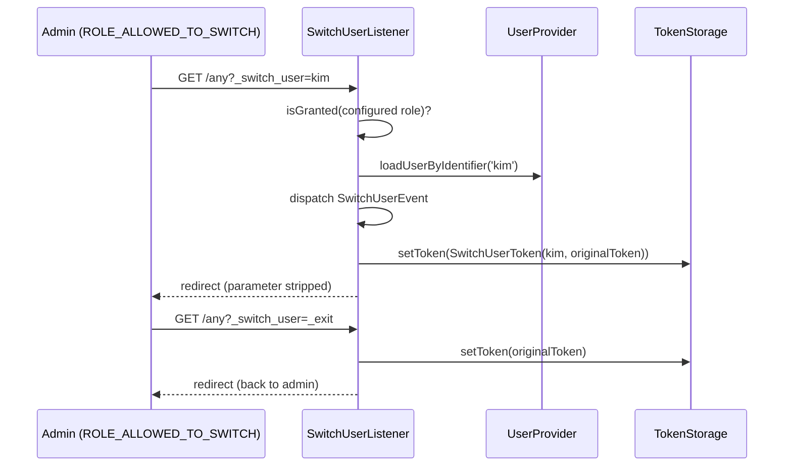

# Impersonation d'utilisateur (switch_user)

!!! tip "In a nutshell"
    `switch_user` sur un firewall permet à un utilisateur privilégié (rôle par
    défaut `ROLE_ALLOWED_TO_SWITCH`) de devenir un autre utilisateur via
    `?_switch_user=identifier` et de revenir avec `?_switch_user=_exit`. Pendant
    le switch, le token d'origine est conservé à l'intérieur d'un
    `SwitchUserToken`. Piège d'examen : vérifiez l'impersonation avec l'attribut
    **`IS_IMPERSONATOR`** — l'ancien style `ROLE_PREVIOUS_ADMIN` est legacy.

!!! example "Real-world analogy"
    Un superviseur du support muni d'un badge maître peut temporairement
    « pointer » comme n'importe quel employé pour voir le bâtiment exactement
    comme cet employé le voit. Le gardien conserve le propre badge du
    superviseur à l'accueil (le token d'origine) et le lui rend quand le
    superviseur signe le registre de sortie (`_exit`). Chaque échange est
    consigné dans le registre du gardien — et seuls les porteurs de badge
    disposant de l'habilitation maître peuvent le faire.

!!! abstract "Learning objectives"
    À la fin de ce chapitre, vous saurez :

    - [ ] Activer `switch_user` sur un firewall et personnaliser ses options `role`/`parameter`.
    - [ ] Basculer avec `?_switch_user=identifier` et sortir avec `?_switch_user=_exit`.
    - [ ] Utiliser `IS_IMPERSONATOR` pour détecter (et restreindre) l'impersonation.
    - [ ] Expliquer comment `SwitchUserListener` échange le token et conserve l'original.
    - [ ] Exploiter `SwitchUserEvent` pour l'audit ou la résolution personnalisée de l'utilisateur cible.

    **Syllabus:** `Security → Impersonation` ·
    **Level:** Expert ·
    **Est. time:** 20 min ·
    **Prerequisites:** [Firewalls](firewalls.md) · [Roles](roles.md)

---

## Theory

L'**impersonation** permet à un utilisateur authentifié et privilégié d'agir en
tant qu'un autre utilisateur sans connaître son mot de passe — précieux pour le
support (« montrez-moi exactement ce que voit ce client ») et pour déboguer des
problèmes de permissions.

Elle s'active **par firewall** :

```yaml
security:
    firewalls:
        main:
            # ...
            switch_user: true
```

Avec les valeurs par défaut, tout utilisateur disposant de
`ROLE_ALLOWED_TO_SWITCH` peut ajouter `?_switch_user=<user-identifier>` à une
URL pour devenir cet utilisateur, et `?_switch_user=_exit` pour redevenir
lui-même. Le rôle requis et le nom du paramètre de requête sont tous deux
configurables :

```yaml
switch_user: { role: ROLE_ALLOWED_TO_SWITCH, parameter: _switch_user }
```

Pendant l'impersonation, le système de sécurité remplace le token courant par
un `SwitchUserToken` qui **enveloppe le token d'origine**. C'est ce qui rend
trois choses possibles :

1. La sortie restaure exactement l'authentification d'origine.
2. `is_granted('IS_IMPERSONATOR')` répond à « l'utilisateur courant est-il en train de switcher ? ».
3. Le code peut inspecter *qui* se cache réellement derrière la session (journalisation d'audit).

`IS_IMPERSONATOR` est l'attribut moderne ; la vérification historique de style
rôle `ROLE_PREVIOUS_ADMIN` est legacy et ne doit plus apparaître dans du code
Symfony 8.

```php
// Modern check — true only while the active token is a SwitchUserToken:
if ($this->isGranted('IS_IMPERSONATOR')) {
    // show the "exit impersonation" banner
}

// The SwitchUserToken wraps the admin's original authentication:
if ($token instanceof SwitchUserToken) {
    $admin = $token->getOriginalToken()->getUserIdentifier(); // audit trail
}

// Legacy spelling — do NOT use in Symfony 8:
// $this->isGranted('ROLE_PREVIOUS_ADMIN');
```

## Deep Dive — how it works internally

La fonctionnalité est implémentée par
`Symfony\Component\Security\Http\Firewall\SwitchUserListener`, enregistré sur
le firewall lorsque `switch_user` est activé. À chaque request, il recherche le
paramètre configuré :

1. **Switch :** il vérifie que le token *courant* dispose du rôle configuré
   (par défaut `ROLE_ALLOWED_TO_SWITCH`), charge l'utilisateur cible depuis le
   user provider via son identifiant, dispatche un `SwitchUserEvent`, puis
   stocke un
   `Symfony\Component\Security\Core\Authentication\Token\SwitchUserToken` dans
   le token storage. Le nouveau token transporte l'utilisateur cible **plus**
   le token d'origine (`getOriginalToken()`).
2. **Exit :** pour `_exit`, il ressort le token d'origine du
   `SwitchUserToken`, dispatche à nouveau `SwitchUserEvent` (avec l'utilisateur
   d'origine comme cible) et le restaure.
3. Dans les deux cas, il redirige vers la même URI **avec le paramètre
   retiré**, afin que le switch ne soit pas rejoué au rafraîchissement.



!!! question "Predict first"
    Pendant l'impersonation, que retourne
    `is_granted('ROLE_ALLOWED_TO_SWITCH')` — la réponse de l'*admin* ou celle
    de l'*utilisateur cible* ?

??? note "Reveal"
    La réponse de l'**utilisateur cible** (généralement `false`). Le token
    actif est le `SwitchUserToken` construit pour l'utilisateur cible, donc
    toutes les vérifications de rôles utilisent les rôles de la cible. Seuls
    `IS_IMPERSONATOR` (et `getOriginalToken()`) révèlent l'admin caché derrière
    le rideau — c'est précisément le but de l'impersonation : vous voyez
    l'application *en tant que* l'autre utilisateur.

!!! note "Source reference"
    `Symfony\Component\Security\Http\Firewall\SwitchUserListener` —
    [symfony/symfony `8.0`](https://github.com/symfony/symfony/blob/8.0/src/Symfony/Component/Security/Http/Firewall/SwitchUserListener.php)
    — et
    [`SwitchUserToken`](https://github.com/symfony/symfony/blob/8.0/src/Symfony/Component/Security/Core/Authentication/Token/SwitchUserToken.php).

### `SwitchUserEvent` — audit and custom targeting

`Symfony\Component\Security\Http\Event\SwitchUserEvent` est dispatché à chaque
switch **et** à chaque sortie. Usages typiques :

- **Journalisation d'audit :** enregistrer qui a switché vers qui, et quand
  (indispensable dans les applications réglementées).
- **Identifiant d'utilisateur personnalisé :** par défaut, la valeur du
  paramètre est transmise au user provider comme identifiant. Pour permettre
  aux admins de switcher par autre chose (par exemple l'e-mail alors que les
  identifiants sont des UUID), un listener peut rechercher l'utilisateur
  lui-même et remplacer l'utilisateur cible sur l'event — consultez le
  [guide officiel](https://symfony.com/doc/8.0/security/impersonating_user.html)
  pour le pattern supporté dans votre version exacte.
- **Restrictions supplémentaires :** lever une exception depuis le listener
  pour interdire un switch (par exemple interdire d'impersonner d'autres
  admins).

## Configuration & code

=== "YAML"

    ```yaml
    # config/packages/security.yaml
    security:
        firewalls:
            main:
                # ...
                switch_user:
                    role: ROLE_ALLOWED_TO_SWITCH   # default
                    parameter: _switch_user        # default

        role_hierarchy:
            ROLE_SUPER_ADMIN: [ROLE_ADMIN, ROLE_ALLOWED_TO_SWITCH]

        access_control:
            # defence in depth: require the role on URLs that carry the parameter
            - { path: ^/admin, roles: ROLE_ADMIN }
    ```

=== "PHP (audit listener)"

    ```php
    <?php
    declare(strict_types=1);

    namespace App\EventListener;

    use Psr\Log\LoggerInterface;
    use Symfony\Component\EventDispatcher\Attribute\AsEventListener;
    use Symfony\Component\Security\Http\Event\SwitchUserEvent;

    #[AsEventListener]
    final class SwitchUserAuditListener
    {
        public function __construct(private readonly LoggerInterface $logger)
        {
        }

        public function __invoke(SwitchUserEvent $event): void
        {
            $this->logger->notice('User switch', [
                'impersonator' => $event->getToken()?->getUserIdentifier(),
                'target' => $event->getTargetUser()->getUserIdentifier(),
            ]);
        }
    }
    ```

=== "Twig / checks"

    ```twig
    
        <a href="{{ path(app.current_route, app.current_route_parameters|merge({'_switch_user': '_exit'})) }}">
            Exit impersonation
        </a>
    
    ```

    ```php
    <?php
    declare(strict_types=1);

    use Symfony\Component\Security\Core\Authentication\Token\SwitchUserToken;
    use Symfony\Component\Security\Core\Authentication\Token\TokenInterface;

    function impersonatorIdentifier(TokenInterface $token): ?string
    {
        // Who is really behind the session?
        return $token instanceof SwitchUserToken
            ? $token->getOriginalToken()->getUserIdentifier()
            : null;
    }
    ```

Utilisation depuis le navigateur :

```text
https://example.com/somewhere?_switch_user=kim      # become "kim"
https://example.com/somewhere?_switch_user=_exit    # back to yourself
```

## Best practices & anti-patterns

| ✅ À faire | ❌ À éviter |
|---|---|
| Accorder `ROLE_ALLOWED_TO_SWITCH` à quelques comptes audités | L'ajouter à `ROLE_USER` « par commodité » |
| Journaliser chaque `SwitchUserEvent` (switch *et* sortie) | Une impersonation silencieuse et intraçable |
| Vérifier `is_granted('IS_IMPERSONATOR')` pour la bannière de sortie | Tester la chaîne legacy `ROLE_PREVIOUS_ADMIN` |
| Interdire les cibles sensibles dans un listener `SwitchUserEvent` | Laisser le support impersonner des super-admins |
| Conserver le paramètre par défaut sauf collision | Faire fuiter le nom du paramètre dans des URL/logs partagés |

## When (not) to use it / alternatives

Utilisez-la pour le **support et le débogage** : reproduire un bug propre à un
utilisateur ou guider un client sur son propre écran. Ne l'utilisez **pas**
comme mécanisme d'authentification d'API ni pour « agir au nom de »
utilisateurs dans des jobs en arrière-plan — c'est le rôle d'une délégation
explicite au niveau du domaine ou du
[login programmatique](programmatic-login.md) (dans les tests). Si vous avez
seulement besoin de *consulter* les données d'un autre utilisateur, un écran
d'administration en lecture seule est plus sûr qu'un échange complet de
session.

!!! danger "Certification traps"
    - La vérification moderne est l'attribut **`IS_IMPERSONATOR`** ;
      `ROLE_PREVIOUS_ADMIN` est l'écriture legacy — mauvaise réponse en
      Symfony 8.
    - La sortie utilise le **même paramètre** avec la valeur spéciale `_exit`
      (`?_switch_user=_exit`), pas une route dédiée.
    - Pendant le switch, `getRoles()`/`isGranted()` reflètent l'utilisateur
      **cible** ; l'identité de l'admin ne survit que dans
      `SwitchUserToken::getOriginalToken()`.
    - `switch_user` se configure **par firewall**, et le rôle requis vaut par
      défaut `ROLE_ALLOWED_TO_SWITCH` (personnalisable via `role`).
    - `SwitchUserEvent` se déclenche **à la fois** au switch et à la sortie.

!!! warning "Common mistakes"
    - Oublier que le user provider doit pouvoir charger la cible avec la valeur
      que vous passez — la valeur du paramètre est un **identifiant
      d'utilisateur**, pas un ID ni un e-mail, sauf si votre provider en décide
      autrement.
    - Imbriquer les switches : vous ne pouvez pas impersonner alors que vous
      impersonnez déjà — sortez d'abord.

## Exercises

1. **(Advanced)** Activez `switch_user` sur le firewall `main` de sorte que
   seul `ROLE_SUPPORT` puisse switcher, avec un paramètre nommé `_become`, et
   ajoutez une bannière Twig avec un lien de sortie affichée uniquement pendant
   l'impersonation.
2. **(Expert)** Écrivez un event listener qui (a) journalise chaque switch avec
   les identifiants de l'impersonateur et de la cible et (b) lève une exception
   pour interdire d'impersonner tout utilisateur possédant `ROLE_ADMIN`.

??? success "Solutions"

    **1.** `switch_user: { role: ROLE_SUPPORT, parameter: _become }` sur le
    firewall ; bannière protégée par `is_granted('IS_IMPERSONATOR')` avec un
    lien vers l'URL courante plus `?_become=_exit`.

    **2.** Écoutez `SwitchUserEvent` (par exemple avec `#[AsEventListener]`) ;
    journalisez `$event->getToken()?->getUserIdentifier()` →
    `$event->getTargetUser()->getUserIdentifier()` ; si
    `in_array('ROLE_ADMIN', $event->getTargetUser()->getRoles(), true)`, levez
    une `AccessDeniedException`. Rappelez-vous que l'event se déclenche aussi à
    la sortie — sautez le veto quand la cible est l'utilisateur du token
    d'origine.

## Certification questions

??? question "Q1. How does a privileged user stop impersonating?"
    - [ ] A. `?_switch_user=exit`
    - [x] B. `?_switch_user=_exit` ✅
    - [ ] C. `?_exit_user=1`
    - [ ] D. Logging out and back in is the only way

    **Why:** Le même paramètre configuré, avec la valeur spéciale `_exit`,
    restaure le token d'origine.
    **Ref:** [Impersonating a user](https://symfony.com/doc/8.0/security/impersonating_user.html).

??? question "Q2. Which attribute detects that the current user is impersonating someone?"
    - [ ] A. `ROLE_PREVIOUS_ADMIN`
    - [ ] B. `IS_AUTHENTICATED_FULLY`
    - [x] C. `IS_IMPERSONATOR` ✅
    - [ ] D. `ROLE_ALLOWED_TO_SWITCH`

    **Why:** `IS_IMPERSONATOR` n'est accordé que lorsque le token actif est un
    `SwitchUserToken` ; `ROLE_PREVIOUS_ADMIN` est l'écriture legacy.
    **Ref:** [Impersonating a user](https://symfony.com/doc/8.0/security/impersonating_user.html).

??? question "Q3. Where does Symfony keep the admin's authentication during a switch?"
    - [ ] A. In a dedicated session key `_security_previous`
    - [ ] B. In a cookie signed with the app secret
    - [x] C. Inside the `SwitchUserToken`, via `getOriginalToken()` ✅
    - [ ] D. It is discarded; exit re-authenticates the admin

    **Why:** `SwitchUserListener` enveloppe le token d'origine dans le nouveau
    `SwitchUserToken` ; la sortie se contente de le désencapsuler.
    **Ref:** [SwitchUserToken](https://github.com/symfony/symfony/blob/8.0/src/Symfony/Component/Security/Core/Authentication/Token/SwitchUserToken.php).

??? question "Q4. Which role is required by default to switch users?"
    - [ ] A. `ROLE_ADMIN`
    - [ ] B. `ROLE_SUPER_ADMIN`
    - [x] C. `ROLE_ALLOWED_TO_SWITCH` ✅
    - [ ] D. Any authenticated user may switch

    **Why:** `switch_user: true` exige par défaut `ROLE_ALLOWED_TO_SWITCH` ;
    remplacez-le avec l'option `role`.
    **Ref:** [Impersonating a user](https://symfony.com/doc/8.0/security/impersonating_user.html).

## Key takeaways

- `switch_user` se configure par firewall ; valeurs par défaut : rôle
  `ROLE_ALLOWED_TO_SWITCH`, paramètre `_switch_user`, valeur de sortie `_exit`.
- Le token actif devient un `SwitchUserToken` transportant l'utilisateur cible
  **et** le token d'origine.
- Détectez l'impersonation avec `IS_IMPERSONATOR` (pas le legacy
  `ROLE_PREVIOUS_ADMIN`).
- `SwitchUserEvent` se déclenche au switch *et* à la sortie — le point
  d'accroche pour l'audit, le veto et la résolution personnalisée de la cible.
- Toute l'autorisation pendant le switch utilise les rôles de l'utilisateur
  **cible**.

## Last-minute revision

!!! tip "Cheat sheet"
    - Activer : `switch_user: true` (ou `{ role: ..., parameter: ... }`).
    - Switcher : `?_switch_user=identifier` · Sortir : `?_switch_user=_exit`.
    - Vérifier : `is_granted('IS_IMPERSONATOR')`.
    - Internes : `SwitchUserListener` → `SwitchUserToken(originalToken)`.
    - Event : `SwitchUserEvent` (audit / restriction / recherche personnalisée).

## Connections

- **Depends on:** [Firewalls](firewalls.md) — `switch_user` est un listener de
  firewall, actif uniquement là où il est configuré.
- **Depends on:** [User Providers](providers.md) — l'utilisateur cible est
  chargé par identifiant via le provider du firewall.
- **Reused in:** [Role Hierarchy](role-hierarchy.md) — `ROLE_ALLOWED_TO_SWITCH`
  est typiquement accordé via la hiérarchie.
- **Confused with:** [Programmatic Login](programmatic-login.md) — `login()`
  remplace le token *sans* conserver l'original ; l'impersonation est
  réversible par conception.

## Official References
- [Symfony docs — Impersonating a user](https://symfony.com/doc/8.0/security/impersonating_user.html)
- [Symfony source — SwitchUserListener](https://github.com/symfony/symfony/blob/8.0/src/Symfony/Component/Security/Http/Firewall/SwitchUserListener.php)
- [Symfony source — SwitchUserEvent](https://github.com/symfony/symfony/blob/8.0/src/Symfony/Component/Security/Http/Event/SwitchUserEvent.php)

## Video references

!!! tip "Watch & learn"
    Voici des chaînes vidéo officielles, mises à jour en continu — cherchez-y
    « Symfony security » pour consolider ce chapitre. Nous lions des chaînes
    stables plutôt que des vidéos individuelles afin que les références ne se
    périment jamais.

    - [SymfonyCasts screencasts](https://symfonycasts.com/tracks/symfony) — tutoriels scénarisés à suivre en codant.
    - [Symfony official YouTube](https://www.youtube.com/@SymfonyOfficial) — conférences et keynotes SymfonyCon.
    - [Official docs for this topic](https://symfony.com/doc/8.0/security/impersonating_user.html) — certaines pages de la doc Symfony intègrent un screencast.

## Confidence check

Je suis prêt quand je peux :

- [ ] expliquer **pourquoi** l'impersonation vaut mieux que partager des mots de passe pour le support
- [ ] activer et personnaliser `switch_user` sur un firewall en Symfony 8
- [ ] déboguer un échec « provider cannot load user » lors d'un switch
- [ ] repérer le piège `ROLE_PREVIOUS_ADMIN` vs `IS_IMPERSONATOR`
- [ ] expliquer comment `SwitchUserListener` échange et restaure les tokens en interne

---

<small>Related: [Firewalls](firewalls.md) · [Roles](roles.md) ·
[User Providers](providers.md)</small>
