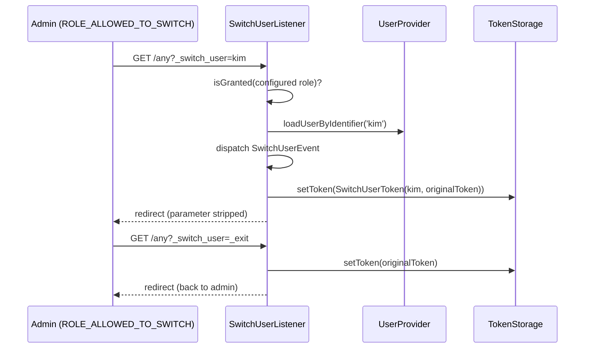

# User Impersonation (switch_user)

!!! tip "In a nutshell"
    `switch_user` on a firewall lets a privileged user (default role
    `ROLE_ALLOWED_TO_SWITCH`) become another user via `?_switch_user=identifier`
    and return with `?_switch_user=_exit`. While switched, the original token is
    kept inside a `SwitchUserToken`. Exam hook: check impersonation with the
    **`IS_IMPERSONATOR`** attribute — the old `ROLE_PREVIOUS_ADMIN` style is legacy.

!!! example "Real-world analogy"
    A support supervisor with a master badge can temporarily "clock in" as any
    employee to see the building exactly as that employee does. The guard keeps
    the supervisor's own badge at the desk (the original token) and hands it back
    when the supervisor signs the exit register (`_exit`). Every swap is written
    in the guard's logbook — and only badge holders with the master clearance may
    do it at all.

!!! abstract "Learning objectives"
    By the end of this chapter you can:

    - [ ] Enable `switch_user` on a firewall and customize its `role`/`parameter`.
    - [ ] Switch with `?_switch_user=identifier` and exit with `?_switch_user=_exit`.
    - [ ] Use `IS_IMPERSONATOR` to detect (and restrict) impersonation.
    - [ ] Explain how `SwitchUserListener` swaps the token and stores the original one.
    - [ ] Hook `SwitchUserEvent` for auditing or custom target-user resolution.

    **Syllabus:** `Security → Impersonation` ·
    **Level:** Expert ·

    **Est. time:** 20 min ·
    **Prerequisites:** [Firewalls](firewalls.md) · [Roles](roles.md)
    **Examen Symfony 8 :** OUI
---

## Pour les nuls

### L'idée en une phrase
`switch_user` permet à un administrateur de "devenir" temporairement un autre utilisateur pour voir l'application exactement comme lui — sans connaître son mot de passe.

### Imagine dans la vraie vie
Un superviseur du support avec un badge maître peut temporairement "pointer" en tant que n'importe quel employé pour voir le bâtiment exactement comme cet employé le voit. Le garde garde le propre badge du superviseur au comptoir (le token original) et le lui rend quand il signe le registre de sortie.

### Dans Symfony
Un support client peut se connecter en tant qu'un client qui signale un bug (`?_switch_user=client@exemple.com`) pour reproduire exactement ce qu'il voit — sans jamais avoir eu accès à son mot de passe.

### Exemple simple
```
https://monapp.com/admin?_switch_user=jean@exemple.com   # devenir Jean
https://monapp.com/admin?_switch_user=_exit               # revenir à soi-même
```

### Comment le mémoriser 🧠
Vérifie l'impersonation avec l'attribut **`IS_IMPERSONATOR`** — l'ancien style `ROLE_PREVIOUS_ADMIN` est obsolète, ne l'utilise plus.

---

## Theory

**Impersonation** lets an authenticated, privileged user act as another user
without knowing that user's password — invaluable for support ("show me exactly
what this customer sees") and debugging permission issues.

It is opt-in **per firewall**:

```yaml
security:
    firewalls:
        main:
            # ...
            switch_user: true
```

With the defaults, any user granted `ROLE_ALLOWED_TO_SWITCH` can append
`?_switch_user=<user-identifier>` to a URL to become that user, and
`?_switch_user=_exit` to become themselves again. Both the required role and
the query parameter name are configurable:

```yaml
switch_user: { role: ROLE_ALLOWED_TO_SWITCH, parameter: _switch_user }
```

While impersonating, the security system replaces the current token with a
`SwitchUserToken` that **wraps the original token**. That is what makes three
things possible:

1. Exiting restores the exact original authentication.
2. `is_granted('IS_IMPERSONATOR')` answers "is the current user switched?".
3. Code can inspect *who* is really behind the session (audit logging).

`IS_IMPERSONATOR` is the modern attribute; the historic `ROLE_PREVIOUS_ADMIN`
role-style check is legacy and must not appear in new Symfony 8 code.

```php
// Modern check — true only while the active token is a SwitchUserToken:
if ($this->isGranted('IS_IMPERSONATOR')) {
    // show the "exit impersonation" banner
}

// The SwitchUserToken wraps the admin's original authentication:
if ($token instanceof SwitchUserToken) {
    $admin = $token->getOriginalToken()->getUserIdentifier(); // audit trail
}

// Legacy spelling — do NOT use in Symfony 8:
// $this->isGranted('ROLE_PREVIOUS_ADMIN');
```

## Deep Dive — how it works internally

The feature is implemented by
`Symfony\Component\Security\Http\Firewall\SwitchUserListener`, registered on
the firewall when `switch_user` is enabled. On every request it looks for the
configured parameter:

1. **Switch:** it verifies the *current* token is granted the configured role
   (default `ROLE_ALLOWED_TO_SWITCH`), loads the target user from the user
   provider by identifier, dispatches a `SwitchUserEvent`, then stores a
   `Symfony\Component\Security\Core\Authentication\Token\SwitchUserToken` in
   the token storage. The new token carries the target user **plus** the
   original token (`getOriginalToken()`).
2. **Exit:** for `_exit`, it takes the original token back out of the
   `SwitchUserToken`, dispatches `SwitchUserEvent` again (with the original
   user as target) and restores it.
3. In both cases it redirects to the same URI **with the parameter removed**,
   so the switch is not replayed on refresh.



!!! question "Predict first"
    While impersonating, what does `is_granted('ROLE_ALLOWED_TO_SWITCH')`
    return — the *admin's* answer or the *target user's* answer?

??? note "Reveal"
    The **target user's** answer (usually `false`). The active token is the
    `SwitchUserToken` built for the target user, so all role checks use the
    target's roles. Only `IS_IMPERSONATOR` (and `getOriginalToken()`) reveal
    the admin behind the curtain — that is precisely the point of
    impersonation: you see the app *as* the other user.

!!! note "Source reference"
    `Symfony\Component\Security\Http\Firewall\SwitchUserListener` —
    [symfony/symfony `8.0`](https://github.com/symfony/symfony/blob/8.0/src/Symfony/Component/Security/Http/Firewall/SwitchUserListener.php)
    — and
    [`SwitchUserToken`](https://github.com/symfony/symfony/blob/8.0/src/Symfony/Component/Security/Core/Authentication/Token/SwitchUserToken.php).

### `SwitchUserEvent` — audit and custom targeting

`Symfony\Component\Security\Http\Event\SwitchUserEvent` is dispatched on every
switch **and** on every exit. Typical uses:

- **Audit logging:** record who switched to whom, when (a must in regulated apps).
- **Custom user identifier:** by default the parameter value is passed to the
  user provider as the identifier. To let admins switch by something else
  (e.g. e-mail while identifiers are UUIDs), a listener can look the user up
  itself and replace the target user on the event — see the
  [official guide](https://symfony.com/doc/8.0/security/impersonating_user.html)
  for the supported pattern in your exact version.
- **Extra restrictions:** throw an exception from the listener to veto a switch
  (e.g. forbid impersonating other admins).

## Configuration & code

=== "YAML"

    ```yaml
    # config/packages/security.yaml
    security:
        firewalls:
            main:
                # ...
                switch_user:
                    role: ROLE_ALLOWED_TO_SWITCH   # default
                    parameter: _switch_user        # default

        role_hierarchy:
            ROLE_SUPER_ADMIN: [ROLE_ADMIN, ROLE_ALLOWED_TO_SWITCH]

        access_control:
            # defence in depth: require the role on URLs that carry the parameter
            - { path: ^/admin, roles: ROLE_ADMIN }
    ```

=== "PHP (audit listener)"

    ```php
    <?php
    declare(strict_types=1);

    namespace App\EventListener;

    use Psr\Log\LoggerInterface;
    use Symfony\Component\EventDispatcher\Attribute\AsEventListener;
    use Symfony\Component\Security\Http\Event\SwitchUserEvent;

    #[AsEventListener]
    final class SwitchUserAuditListener
    {
        public function __construct(private readonly LoggerInterface $logger)
        {
        }

        public function __invoke(SwitchUserEvent $event): void
        {
            $this->logger->notice('User switch', [
                'impersonator' => $event->getToken()?->getUserIdentifier(),
                'target' => $event->getTargetUser()->getUserIdentifier(),
            ]);
        }
    }
    ```

=== "Twig / checks"

    ```twig
    
        <a href="{{ path(app.current_route, app.current_route_parameters|merge({'_switch_user': '_exit'})) }}">
            Exit impersonation
        </a>
    
    ```

    ```php
    <?php
    declare(strict_types=1);

    use Symfony\Component\Security\Core\Authentication\Token\SwitchUserToken;
    use Symfony\Component\Security\Core\Authentication\Token\TokenInterface;

    function impersonatorIdentifier(TokenInterface $token): ?string
    {
        // Who is really behind the session?
        return $token instanceof SwitchUserToken
            ? $token->getOriginalToken()->getUserIdentifier()
            : null;
    }
    ```

Usage from the browser:

```text
https://example.com/somewhere?_switch_user=kim      # become "kim"
https://example.com/somewhere?_switch_user=_exit    # back to yourself
```

## Best practices & anti-patterns

| ✅ Do | ❌ Avoid |
|---|---|
| Grant `ROLE_ALLOWED_TO_SWITCH` to few, audited accounts | Adding it to `ROLE_USER` "for convenience" |
| Log every `SwitchUserEvent` (switch *and* exit) | Silent, untraceable impersonation |
| Check `is_granted('IS_IMPERSONATOR')` for the exit banner | Testing the legacy `ROLE_PREVIOUS_ADMIN` string |
| Veto sensitive targets in a `SwitchUserEvent` listener | Letting support impersonate super-admins |
| Keep the default parameter unless it collides | Leaking the parameter name in shared URLs/logs |

## When (not) to use it / alternatives

Use it for **support and debugging**: reproducing a user-specific bug or
walking a customer through their own screen. Do **not** use it as an API
authentication mechanism or to "act on behalf of" users in background jobs —
that is what explicit domain-level delegation or
[programmatic login](programmatic-login.md) (in tests) are for. If all you need
is to *view* data of another user, a read-only admin screen is safer than a
full session swap.

!!! danger "Certification traps"
    - The modern check is the **`IS_IMPERSONATOR`** attribute; `ROLE_PREVIOUS_ADMIN`
      is the legacy spelling — wrong answer in Symfony 8.
    - Exit uses the **same parameter** with the special value `_exit`
      (`?_switch_user=_exit`), not a dedicated route.
    - While switched, `getRoles()`/`isGranted()` reflect the **target** user;
      the admin's identity survives only inside `SwitchUserToken::getOriginalToken()`.
    - `switch_user` is configured **per firewall**, and the required role
      defaults to `ROLE_ALLOWED_TO_SWITCH` (customizable via `role`).
    - `SwitchUserEvent` fires on **both** switch and exit.

!!! warning "Common mistakes"
    - Forgetting the user provider must be able to load the target by the value
      you pass — the parameter value is a **user identifier**, not an ID or e-mail
      unless your provider says so.
    - Nesting switches: you cannot impersonate while already impersonating —
      exit first.

## Exercises

1. **(Advanced)** Enable `switch_user` on the `main` firewall so only
   `ROLE_SUPPORT` may switch, using a parameter named `_become`, and add a Twig
   banner with an exit link shown only while impersonating.
2. **(Expert)** Write an event listener that (a) logs every switch with the
   impersonator and target identifiers and (b) throws to forbid impersonating
   any user who has `ROLE_ADMIN`.

??? success "Solutions"

    **1.** `switch_user: { role: ROLE_SUPPORT, parameter: _become }` on the
    firewall; banner guarded by `is_granted('IS_IMPERSONATOR')` with a link to
    the current URL plus `?_become=_exit`.

    **2.** Listen on `SwitchUserEvent` (e.g. `#[AsEventListener]`); log
    `$event->getToken()?->getUserIdentifier()` →
    `$event->getTargetUser()->getUserIdentifier()`; if
    `in_array('ROLE_ADMIN', $event->getTargetUser()->getRoles(), true)` throw an
    `AccessDeniedException`. Remember the event also fires on exit — skip the
    veto when the target equals the original token's user.

## Certification questions

*Question d'entraînement inspirée du syllabus — jamais une question officielle de l'examen.*

??? question "Q1. How does a privileged user stop impersonating?"
    - [ ] A. `?_switch_user=exit`
    - [x] B. `?_switch_user=_exit` ✅
    - [ ] C. `?_exit_user=1`
    - [ ] D. Logging out and back in is the only way

    **Why:** The same configured parameter with the special `_exit` value
    restores the original token.
    **Ref:** [Impersonating a user](https://symfony.com/doc/8.0/security/impersonating_user.html).

??? question "Q2. Which attribute detects that the current user is impersonating someone?"
    - [ ] A. `ROLE_PREVIOUS_ADMIN`
    - [ ] B. `IS_AUTHENTICATED_FULLY`
    - [x] C. `IS_IMPERSONATOR` ✅
    - [ ] D. `ROLE_ALLOWED_TO_SWITCH`

    **Why:** `IS_IMPERSONATOR` is granted only when the active token is a
    `SwitchUserToken`; `ROLE_PREVIOUS_ADMIN` is the legacy spelling.
    **Ref:** [Impersonating a user](https://symfony.com/doc/8.0/security/impersonating_user.html).

??? question "Q3. Where does Symfony keep the admin's authentication during a switch?"
    - [ ] A. In a dedicated session key `_security_previous`
    - [ ] B. In a cookie signed with the app secret
    - [x] C. Inside the `SwitchUserToken`, via `getOriginalToken()` ✅
    - [ ] D. It is discarded; exit re-authenticates the admin

    **Why:** `SwitchUserListener` wraps the original token into the new
    `SwitchUserToken`; exiting simply unwraps it.
    **Ref:** [SwitchUserToken](https://github.com/symfony/symfony/blob/8.0/src/Symfony/Component/Security/Core/Authentication/Token/SwitchUserToken.php).

??? question "Q4. Which role is required by default to switch users?"
    - [ ] A. `ROLE_ADMIN`
    - [ ] B. `ROLE_SUPER_ADMIN`
    - [x] C. `ROLE_ALLOWED_TO_SWITCH` ✅
    - [ ] D. Any authenticated user may switch

    **Why:** `switch_user: true` defaults to requiring
    `ROLE_ALLOWED_TO_SWITCH`; override it with the `role` option.
    **Ref:** [Impersonating a user](https://symfony.com/doc/8.0/security/impersonating_user.html).

## Key takeaways

- `switch_user` is per-firewall; defaults: role `ROLE_ALLOWED_TO_SWITCH`,
  parameter `_switch_user`, exit value `_exit`.
- The active token becomes a `SwitchUserToken` carrying the target user **and**
  the original token.
- Detect impersonation with `IS_IMPERSONATOR` (not the legacy
  `ROLE_PREVIOUS_ADMIN`).
- `SwitchUserEvent` fires on switch *and* exit — the hook for auditing, vetoing
  and custom target resolution.
- All authorization while switched uses the **target** user's roles.

## Last-minute revision

!!! tip "Cheat sheet"
    - Enable: `switch_user: true` (or `{ role: ..., parameter: ... }`).
    - Switch: `?_switch_user=identifier` · Exit: `?_switch_user=_exit`.
    - Check: `is_granted('IS_IMPERSONATOR')`.
    - Internals: `SwitchUserListener` → `SwitchUserToken(originalToken)`.
    - Event: `SwitchUserEvent` (audit / restrict / custom lookup).

## Connections

- **Depends on:** [Firewalls](firewalls.md) — `switch_user` is a firewall
  listener, active only where configured.
- **Depends on:** [User Providers](providers.md) — the target user is loaded by
  identifier through the firewall's provider.
- **Reused in:** [Role Hierarchy](role-hierarchy.md) — `ROLE_ALLOWED_TO_SWITCH`
  is typically granted via the hierarchy.
- **Confused with:** [Programmatic Login](programmatic-login.md) — `login()`
  replaces the token *without* keeping the original one; impersonation is
  reversible by design.

## Official References
- [Symfony docs — Impersonating a user](https://symfony.com/doc/8.0/security/impersonating_user.html)
- [Symfony source — SwitchUserListener](https://github.com/symfony/symfony/blob/8.0/src/Symfony/Component/Security/Http/Firewall/SwitchUserListener.php)
- [Symfony source — SwitchUserEvent](https://github.com/symfony/symfony/blob/8.0/src/Symfony/Component/Security/Http/Event/SwitchUserEvent.php)

## Video references

!!! tip "Watch & learn"
    These are official, continuously-updated video channels — search them for
    "Symfony security" to reinforce this chapter. We link stable channels rather than
    individual videos so the references never rot.

    - [SymfonyCasts screencasts](https://symfonycasts.com/tracks/symfony) — scripted, code-along tutorials.
    - [Symfony official YouTube](https://www.youtube.com/@SymfonyOfficial) — SymfonyCon conference talks & keynotes.
    - [Official docs for this topic](https://symfony.com/doc/8.0/security/impersonating_user.html) — some Symfony doc pages embed a screencast.

## Confidence check

I'm ready when I can:

- [ ] explain **why** impersonation beats sharing passwords for support work
- [ ] enable and customize `switch_user` on a firewall in Symfony 8
- [ ] debug a "provider cannot load user" failure when switching
- [ ] spot the `ROLE_PREVIOUS_ADMIN` vs `IS_IMPERSONATOR` trap
- [ ] explain how `SwitchUserListener` swaps and restores tokens internally

---

<small>Related: [Firewalls](firewalls.md) · [Roles](roles.md) ·
[User Providers](providers.md)</small>
