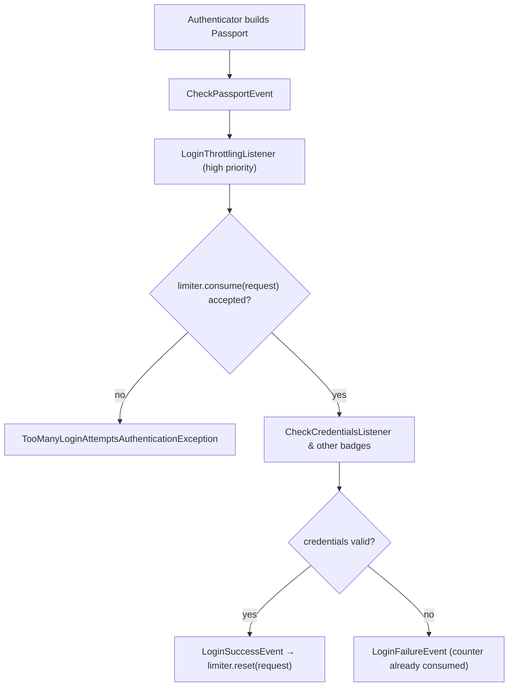

# Login Throttling & Rate Limiting

!!! tip "In a nutshell"
    `login_throttling` sur un firewall bloque les tentatives de connexion par
    force brute : `{ max_attempts: 5, interval: '15 minutes' }`. Il requiert
    **symfony/rate-limiter** et se branche sur le `CheckPassportEvent`. Piège
    d'examen : le limiter par défaut compte par **username+IP** *et* maintient
    une limite plus large par **IP** de **5× max_attempts** pour stopper le
    « username-spraying ».

!!! example "Real-world analogy"
    La porte du coffre d'une banque : après cinq mauvais codes PIN pour *un*
    compte, le clavier verrouille l'accès de ce compte pendant un moment
    (username+IP). Mais la porte surveille aussi la *personne* qui se tient
    devant — quelqu'un qui essaie de nombreux numéros de compte est gelé
    entièrement après 25 tentatives (la limite plus large par IP), même si
    aucun compte n'a atteint sa propre limite.

!!! abstract "Learning objectives"
    À la fin de ce chapitre, vous saurez :

    - [ ] Activer `login_throttling` avec `max_attempts` et `interval`.
    - [ ] Expliquer les deux limites par défaut : username+IP et 5× par IP.
    - [ ] Brancher un service de limiter personnalisé implémentant `RequestRateLimiterInterface`.
    - [ ] Décrire comment le listener se branche sur `CheckPassportEvent` et se réinitialise en cas de succès.
    - [ ] Relier la fonctionnalité aux policies du RateLimiter (fixed/sliding window, token bucket).

    **Syllabus:** `Security → Login Throttling` ·
    **Level:** Expert ·
    **Est. time:** 20 min ·
    **Prerequisites:** [Authentication](authentication.md) · [Firewalls](firewalls.md)

---

## Theory

La protection contre la force brute est intégrée au système d'authenticators
sous la forme d'une option de firewall :

```yaml
security:
    firewalls:
        main:
            # ...
            login_throttling:
                max_attempts: 5          # default
                interval: '15 minutes'   # default: '1 minute'
```

Elle requiert le **composant RateLimiter** (`composer require symfony/rate-limiter`),
qui stocke lui-même ses compteurs dans un backend de cache/stockage.

Le **limiter par défaut** applique deux limites à la fois :

| Limite | Clé | Seuil |
|---|---|---|
| Ciblée | username **+** IP | `max_attempts` échecs par `interval` |
| Large | IP seule | `5 × max_attempts` échecs par `interval` |

La seconde limite, plus large, existe parce qu'un attaquant pourrait sinon
faire tourner les usernames pour maintenir chaque compteur par username sous
le seuil. Le multiplicateur de 5 garde les bureaux normaux derrière une même
IP NAT utilisables tout en plafonnant les attaques par pulvérisation.

Lorsqu'une limite est dépassée, l'authentification échoue avec une erreur du
type « too many failed login attempts » **avant** toute vérification
d'identifiants. Une connexion **réussie** réinitialise le compteur ciblé, si
bien qu'un utilisateur légitime qui finit par retrouver son mot de passe n'est
pas verrouillé à la tentative suivante.

## Deep Dive — how it works internally

La fonctionnalité est un event listener, pas un authenticator :
`Symfony\Component\Security\Http\EventListener\LoginThrottlingListener`
s'enregistre sur **`CheckPassportEvent`** avec une priorité très élevée — il
s'exécute avant la vérification des identifiants, donc les requêtes limitées
n'atteignent même jamais le password hasher (ce qui atténue aussi les attaques
par timing/énumération et économise du CPU).

1. Sur `CheckPassportEvent`, il demande au limiter de `consume(request)`.
2. Si la limite est dépassée, il lève une
   `TooManyLoginAttemptsAuthenticationException`, ce qui interrompt
   l'authentification.
3. Sur `LoginSuccessEvent`, il appelle `reset(request)` afin que les compteurs
   de cet utilisateur repartent de zéro.

Le limiter qu'il consulte implémente
`Symfony\Component\HttpFoundation\RateLimiter\RequestRateLimiterInterface` —
une interface qui associe une `Request` à un ou plusieurs rate limiters.
L'implémentation par défaut est
`Symfony\Component\Security\Http\RateLimiter\DefaultLoginRateLimiter`, qui
compose les deux limites décrites ci-dessus à partir du composant RateLimiter.



!!! question "Predict first"
    Avec `max_attempts: 5`, un attaquant lance 4 tentatives échouées contre
    chacun de 10 usernames *différents* depuis une seule IP. Est-il limité ?

??? note "Reveal"
    **Oui.** Aucun compteur username+IP n'atteint 5, mais le compteur large
    par IP a absorbé 40 échecs — bien au-delà de son seuil de `5 × 5 = 25`,
    donc l'IP est limitée. Cette conception à double compteur est exactement
    ce que l'examen aime sonder : la limite par username seule serait
    trivialement contournable.

!!! note "Source reference"
    `Symfony\Component\Security\Http\EventListener\LoginThrottlingListener` —
    [symfony/symfony `8.0`](https://github.com/symfony/symfony/blob/8.0/src/Symfony/Component/Security/Http/EventListener/LoginThrottlingListener.php)
    — et
    [`DefaultLoginRateLimiter`](https://github.com/symfony/symfony/blob/8.0/src/Symfony/Component/Security/Http/RateLimiter/DefaultLoginRateLimiter.php).

### Relationship to RateLimiter policies

Le composant RateLimiter propose plusieurs **policies** que vous rencontrez
lorsque vous définissez vos propres limiters sous `framework.rate_limiter` :

| Policy | Comportement |
|---|---|
| `fixed_window` | Compte les hits par intervalle fixe ; réinitialisation à la frontière de la fenêtre |
| `sliding_window` | Pondère la fenêtre précédente pour lisser les rafales de frontière |
| `token_bucket` | Taux de recharge continu + capacité de rafale |
| `no_limit` | Illimité (utile dans les tests) |

La simple paire `max_attempts`/`interval` de `login_throttling` est
délibérément un comptage de type fenêtre (« N échecs par intervalle »). Si
vous avez besoin d'une autre policy (p. ex. token bucket) ou de clés
différentes (clé d'API, tenant…), définissez votre propre limiter avec
`framework.rate_limiter` et branchez-le via l'option `limiter` ci-dessous.

## Configuration & code

=== "YAML"

    ```yaml
    # config/packages/security.yaml
    security:
        firewalls:
            main:
                # ...
                login_throttling:
                    max_attempts: 3
                    interval: '15 minutes'
                    # OR delegate everything to your own service:
                    # limiter: app.login_rate_limiter
    ```

    ```yaml
    # config/packages/rate_limiter.yaml — a limiter for the custom service
    framework:
        rate_limiter:
            username_ip_login:
                policy: token_bucket
                limit: 5
                rate: { interval: '5 minutes' }
    ```

=== "PHP (custom limiter)"

    ```php
    <?php
    declare(strict_types=1);

    namespace App\Security;

    use Symfony\Component\HttpFoundation\RateLimiter\AbstractRequestRateLimiter;
    use Symfony\Component\HttpFoundation\Request;
    use Symfony\Component\RateLimiter\RateLimiterFactoryInterface;

    final class UsernameIpLoginRateLimiter extends AbstractRequestRateLimiter
    {
        public function __construct(
            private readonly RateLimiterFactoryInterface $usernameIpLoginLimiter,
        ) {
        }

        protected function getLimiters(Request $request): array
        {
            $username = (string) $request->request->get('_username', '');

            return [
                $this->usernameIpLoginLimiter->create($username.'-'.$request->getClientIp()),
            ];
        }
    }
    ```

    ```yaml
    # register + wire it (services.yaml uses autowiring for the factory)
    security:
        firewalls:
            main:
                login_throttling:
                    limiter: App\Security\UsernameIpLoginRateLimiter
    ```

Le service personnalisé doit implémenter
`Symfony\Component\HttpFoundation\RateLimiter\RequestRateLimiterInterface` ;
étendre `AbstractRequestRateLimiter` est la voie la plus simple — vous ne
retournez que le ou les limiters qui s'appliquent à une request, et il les
consomme/réinitialise pour vous.

## Best practices & anti-patterns

| ✅ Do | ❌ Avoid |
|---|---|
| Garder à l'esprit l'effet de la limite large par IP en dimensionnant `max_attempts` | Ne régler que pour les retentatives d'un seul utilisateur |
| Utiliser un stockage partagé (p. ex. un cache pool) derrière plusieurs serveurs d'application | Des compteurs par serveur qu'un attaquant peut fragmenter |
| Combiner avec un hachage robuste et des journaux d'audit (défense en profondeur) | Considérer le throttling comme *le* remède à la force brute |
| Un limiter personnalisé pour les proxies/clés d'API | Faire confiance à `getClientIp()` sans trusted proxies configurés |

## When (not) to use it / alternatives

Activez-le sur **chaque firewall de connexion interactive** — le coût est
négligeable. Il ne protège que *les tentatives d'authentification sur ce
firewall* ; pour limiter des endpoints d'API classiques, utilisez directement
le composant RateLimiter (p. ex. dans un listener ou via
`RateLimiterFactory`). Les CAPTCHA ou les délais incrémentaux sont des
compléments, pas des remplacements. Sur des firewalls stateless à base de
tokens (sans endpoint de connexion), il n'a rien à limiter.

!!! danger "Certification traps"
    - `login_throttling` **requiert symfony/rate-limiter** — sans le paquet, la
      configuration échoue, elle ne se dégrade pas silencieusement.
    - Le comportement par défaut est **deux** limites : username+IP à
      `max_attempts`, plus l'IP seule à **5× max_attempts** — retenez le
      multiplicateur.
    - Il se branche sur **`CheckPassportEvent`** (avant la vérification des
      identifiants), pas sur `LoginFailureEvent`.
    - Une connexion **réussie** réinitialise le compteur ; les échecs, non.
    - L'option `limiter` attend un service implémentant
      `RequestRateLimiterInterface`, pas un nom de `framework.rate_limiter`.

!!! warning "Common mistakes"
    - Oublier les trusted proxies : derrière un load balancer, chaque requête
      semble provenir d'une seule IP, donc la limite large par IP bloque *tous*
      les utilisateurs.
    - Définir un `interval` énorme (p. ex. `'1 day'`) et verrouiller des
      utilisateurs légitimes qui se trompent de mot de passe quelques fois.

## Exercises

1. **(Advanced)** Configurez le firewall `main` pour qu'une paire username+IP
   dispose de 3 tentatives par 15 minutes, et expliquez combien de tentatives
   une même IP obtient au total, tous usernames confondus.
2. **(Expert)** Implémentez un request rate limiter qui utilise comme clé le
   header `X-Api-Key` au lieu de username+IP et branchez-le dans
   `login_throttling`.

??? success "Solutions"

    **1.** `login_throttling: { max_attempts: 3, interval: '15 minutes' }`.
    Le limiter par défaut applique aussi `5 × 3 = 15` échecs par IP par
    15 minutes, tous usernames confondus.

    **2.** Étendez `AbstractRequestRateLimiter`, injectez une
    `RateLimiterFactoryInterface` configurée sous `framework.rate_limiter`,
    retournez `[$factory->create($request->headers->get('X-Api-Key') ?? 'anon')]`
    depuis `getLimiters()`, puis définissez
    `login_throttling: { limiter: App\Security\ApiKeyLoginRateLimiter }`.

## Certification questions

??? question "Q1. What does the default login throttling limiter count?"
    - [ ] A. Failures per username only
    - [ ] B. Failures per IP only
    - [x] C. Failures per username+IP, plus a 5× wider limit per IP ✅
    - [ ] D. Failures per session ID

    **Why:** Les deux compteurs stoppent à la fois la force brute sur un seul
    compte et le « username spraying » depuis une même IP.
    **Ref:** [Login throttling](https://symfony.com/doc/current/security.html#limiting-login-attempts).

??? question "Q2. Which event does the throttling listener use to block an attempt?"
    - [ ] A. `LoginFailureEvent`
    - [ ] B. `KernelEvents::REQUEST`
    - [x] C. `CheckPassportEvent` ✅
    - [ ] D. `AuthenticationTokenCreatedEvent`

    **Why:** `LoginThrottlingListener` consomme le limiter sur
    `CheckPassportEvent`, avant la vérification des identifiants, et le
    réinitialise sur `LoginSuccessEvent`.
    **Ref:** [LoginThrottlingListener](https://github.com/symfony/symfony/blob/8.0/src/Symfony/Component/Security/Http/EventListener/LoginThrottlingListener.php).

??? question "Q3. `login_throttling` is enabled but symfony/rate-limiter is not installed. What happens?"
    - [ ] A. Throttling is silently disabled
    - [ ] B. A default in-memory limiter is used
    - [x] C. The configuration fails — the component is required ✅
    - [ ] D. Only the per-IP limit works

    **Why:** La fonctionnalité repose sur le composant RateLimiter ; sans lui,
    l'option de firewall ne peut pas être configurée.
    **Ref:** [Login throttling](https://symfony.com/doc/current/security.html#limiting-login-attempts).

??? question "Q4. What must a custom `limiter` service implement?"
    - [ ] A. `LimiterInterface` from the RateLimiter component
    - [x] B. `RequestRateLimiterInterface` (HttpFoundation) ✅
    - [ ] C. `AuthenticatorInterface`
    - [ ] D. `RateLimiterFactoryInterface`

    **Why:** Le firewall a besoin d'un limiter qui comprend les *requests* ;
    `AbstractRequestRateLimiter` est la classe de base pratique.
    **Ref:** [Login throttling](https://symfony.com/doc/current/security.html#limiting-login-attempts).

## Key takeaways

- `login_throttling: { max_attempts, interval }` sur le firewall ; requiert
  **symfony/rate-limiter**.
- Valeurs par défaut : `max_attempts: 5`, intervalle `'1 minute'` ; les
  compteurs sont username+IP **et** IP seule à 5×.
- Implémenté par `LoginThrottlingListener` sur `CheckPassportEvent` ; le
  succès réinitialise le compteur.
- Comportement personnalisé = un service `RequestRateLimiterInterface` via
  l'option `limiter` (étendre `AbstractRequestRateLimiter`).
- Les policies du RateLimiter (fixed/sliding window, token bucket) alimentent
  tout limiter personnalisé défini sous `framework.rate_limiter`.

## Last-minute revision

!!! tip "Cheat sheet"
    - Config : `login_throttling: { max_attempts: N, interval: '15 minutes' }`.
    - Doubles limites par défaut : user+IP = N · IP seule = 5N.
    - Point d'accroche : `CheckPassportEvent` (bloque **avant** la
      vérification des identifiants).
    - Personnalisé : `limiter:` → service `RequestRateLimiterInterface`.
    - Requiert : `composer require symfony/rate-limiter`.

## Connections

- **Depends on:** [Authentication](authentication.md) — le listener se branche
  sur l'étape `CheckPassportEvent` du pipeline des authenticators.
- **Depends on:** [Firewalls](firewalls.md) — le throttling est configuré par
  firewall, à côté des authenticators qu'il protège.
- **Reused in:** [Authenticators, Passports & Badges](authenticators.md) —
  tout authenticator qui dispatche `CheckPassportEvent` est limité
  gratuitement.
- **Confused with:** [Password Hashers](password-hashers.md) — le hachage
  ralentit chaque essai ; le throttling limite *combien* d'essais s'exécutent
  tout court.

## Official References
- [Symfony docs — Limiting login attempts](https://symfony.com/doc/current/security.html#limiting-login-attempts)
- [Symfony docs — Rate Limiter component](https://symfony.com/doc/current/rate_limiter.html)
- [Symfony source — LoginThrottlingListener](https://github.com/symfony/symfony/blob/8.0/src/Symfony/Component/Security/Http/EventListener/LoginThrottlingListener.php)

## Video references

!!! tip "Watch & learn"
    Voici des chaînes vidéo officielles, mises à jour en continu — cherchez-y
    « Symfony security » pour consolider ce chapitre. Nous lions des chaînes
    stables plutôt que des vidéos individuelles afin que les références ne
    périment jamais.

    - [SymfonyCasts screencasts](https://symfonycasts.com/tracks/symfony) — tutoriels scénarisés à suivre en codant.
    - [Symfony official YouTube](https://www.youtube.com/@SymfonyOfficial) — conférences et keynotes de SymfonyCon.
    - [Official docs for this topic](https://symfony.com/doc/current/security.html#limiting-login-attempts) — certaines pages de la doc Symfony intègrent un screencast.

## Confidence check

Je suis prêt quand je peux :

- [ ] expliquer **pourquoi** deux compteurs (user+IP et IP×5) valent mieux
  qu'une seule limite par utilisateur
- [ ] activer et régler `login_throttling` sur un firewall Symfony 8
- [ ] déboguer un incident « tout le bureau est verrouillé » (trusted proxies /
  IP partagée)
- [ ] repérer le piège : le listener s'exécute sur `CheckPassportEvent`, pas à
  l'échec
- [ ] expliquer les rouages internes : consume à la vérification, reset sur
  `LoginSuccessEvent`

---

<small>Related: [Authentication](authentication.md) · [Firewalls](firewalls.md) ·
[Authenticators, Passports & Badges](authenticators.md)</small>
