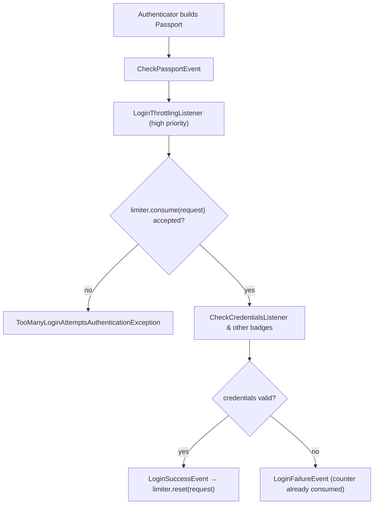

# Login Throttling & Rate Limiting

!!! tip "In a nutshell"
    `login_throttling` on a firewall blocks brute-force logins:
    `{ max_attempts: 5, interval: '15 minutes' }`. It requires
    **symfony/rate-limiter** and hooks the `CheckPassportEvent`. Exam hook: the
    default limiter counts per **username+IP** *and* keeps a wider per-**IP**
    limit of **5× max_attempts** to stop username-spraying.

!!! example "Real-world analogy"
    A bank's vault door: after five wrong PIN entries for *one* account the
    keypad locks that account's access for a while (username+IP). But the door
    also watches the *person* standing there — someone cycling through many
    account numbers gets frozen out entirely after 25 tries (the wider per-IP
    limit), even though no single account hit its own limit.

!!! abstract "Learning objectives"
    By the end of this chapter you can:

    - [ ] Enable `login_throttling` with `max_attempts` and `interval`.
    - [ ] Explain the dual default limits: username+IP and 5× per IP.
    - [ ] Plug a custom limiter service implementing `RequestRateLimiterInterface`.
    - [ ] Describe how the listener hooks `CheckPassportEvent` and resets on success.
    - [ ] Relate the feature to RateLimiter policies (fixed/sliding window, token bucket).

    **Syllabus:** `Security → Login Throttling` ·
    **Level:** Expert ·
    **Est. time:** 20 min ·

    **Prerequisites:** [Authentication](authentication.md) · [Firewalls](firewalls.md)
    **Examen Symfony 8 :** OUI
---

## Pour les nuls

### L'idée en une phrase
`login_throttling` bloque automatiquement les tentatives de connexion en force brute — après un nombre d'essais ratés, le compte est temporairement gelé.

### Imagine dans la vraie vie
La porte du coffre d'une banque : après cinq codes PIN erronés pour *un* compte, le clavier bloque l'accès à ce compte pendant un moment. Mais la porte surveille aussi la *personne* : quelqu'un qui essaie plein de numéros de compte différents est totalement bloqué après 25 essais, même si aucun compte individuel n'a atteint sa propre limite.

### Dans Symfony
Sans cette protection, un attaquant pourrait essayer des milliers de mots de passe par seconde contre un seul compte — `login_throttling` ralentit ça automatiquement, sans code supplémentaire à écrire.

### Exemple simple
```yaml
main:
    login_throttling: { max_attempts: 5, interval: '15 minutes' }
```

### Comment le mémoriser 🧠
Deux limites cumulées : par **username+IP** (spécifique) ET une limite plus large par **IP seule, à 5× max_attempts** — pour arrêter aussi un attaquant qui change de nom d'utilisateur à chaque essai.

---

## Theory

Brute-force protection is built into the authenticator system as a firewall
option:

```yaml
security:
    firewalls:
        main:
            # ...
            login_throttling:
                max_attempts: 5          # default
                interval: '15 minutes'   # default: '1 minute'
```

It requires the **RateLimiter component** (`composer require symfony/rate-limiter`),
which itself stores counters in a cache/storage backend.

The **default limiter** enforces two limits at once:

| Limit | Key | Threshold |
|---|---|---|
| Targeted | username **+** IP | `max_attempts` failures per `interval` |
| Wide | IP alone | `5 × max_attempts` failures per `interval` |

```php
// DefaultLoginRateLimiter (simplified): one request feeds two counters
protected function getLimiters(Request $request): array
{
    $username = $request->attributes->get(SecurityRequestAttributes::LAST_USERNAME, '');

    return [
        $this->globalFactory->create($request->getClientIp()),               // IP alone: 5 x max_attempts
        $this->localFactory->create($username.'-'.$request->getClientIp()),  // username+IP: max_attempts
    ];
}
```

The second, wider limit exists because an attacker could otherwise rotate
usernames to keep every per-username counter below the threshold. Multiplying
by 5 keeps normal offices behind one NAT IP usable while still capping sprays.

When a limit is exceeded, authentication fails with a
"too many failed login attempts" style error **before** any credential is
checked. A **successful** login resets the targeted counter, so a legitimate
user who finally remembers the password is not locked out on the next attempt.

## Deep Dive — how it works internally

The feature is an event listener, not an authenticator:
`Symfony\Component\Security\Http\EventListener\LoginThrottlingListener`
registers on **`CheckPassportEvent`** with a very high priority — it runs
before credential verification, so throttled requests never even hit the
password hasher (which also blunts timing/enumeration attacks and saves CPU).

```php
// LoginThrottlingListener (simplified) — registered on CheckPassportEvent
public function checkPassport(CheckPassportEvent $event): void
{
    $limit = $this->limiter->consume($this->requestStack->getMainRequest());

    if (!$limit->isAccepted()) {
        // rejected before any credential is verified
        throw new TooManyLoginAttemptsAuthenticationException();
    }
}
```

1. On `CheckPassportEvent`, it asks the limiter to `consume(request)`.
2. If the limit is exceeded, it throws a
   `TooManyLoginAttemptsAuthenticationException`, aborting authentication.
3. On `LoginSuccessEvent`, it calls `reset(request)` so the counters for that
   user start fresh.

The limiter it consults implements
`Symfony\Component\HttpFoundation\RateLimiter\RequestRateLimiterInterface` —
an interface that maps a `Request` to one or more rate limiters. The default
implementation is
`Symfony\Component\Security\Http\RateLimiter\DefaultLoginRateLimiter`, which
composes the two limits described above from the RateLimiter component.



!!! question "Predict first"
    With `max_attempts: 5`, an attacker fires 4 failed attempts each against 10
    *different* usernames from one IP. Are they throttled?

??? note "Reveal"
    **Yes.** No single username+IP counter reaches 5, but the wide per-IP
    counter has absorbed 40 failures — well past its `5 × 5 = 25` threshold, so
    the IP is throttled. This dual-counter design is exactly what the exam
    likes to probe: the per-username limit alone would be trivially bypassed.

!!! note "Source reference"
    `Symfony\Component\Security\Http\EventListener\LoginThrottlingListener` —
    [symfony/symfony `8.0`](https://github.com/symfony/symfony/blob/8.0/src/Symfony/Component/Security/Http/EventListener/LoginThrottlingListener.php)
    — and
    [`DefaultLoginRateLimiter`](https://github.com/symfony/symfony/blob/8.0/src/Symfony/Component/Security/Http/RateLimiter/DefaultLoginRateLimiter.php).

### Relationship to RateLimiter policies

The RateLimiter component offers several **policies** you meet when defining
your own limiters under `framework.rate_limiter`:

| Policy | Behaviour |
|---|---|
| `fixed_window` | Counts hits per fixed interval; resets at the window edge |
| `sliding_window` | Weighs the previous window to smooth the boundary burst |
| `token_bucket` | Continuous refill rate + burst capacity |
| `no_limit` | Unlimited (useful in tests) |

```yaml
# config/packages/rate_limiter.yaml — one limiter per policy
framework:
    rate_limiter:
        api_fixed:   { policy: fixed_window,   limit: 100, interval: '1 hour' }
        api_sliding: { policy: sliding_window, limit: 100, interval: '1 hour' }
        api_bucket:  { policy: token_bucket,   limit: 500, rate: { interval: '1 minute', amount: 10 } }
        test_only:   { policy: no_limit }
```

`login_throttling`'s simple `max_attempts`/`interval` pair is deliberately
window-style counting ("N failures per interval"). If you need another policy
(e.g. token bucket) or different keys (API key, tenant…), define your own
limiter with `framework.rate_limiter` and plug it in via the `limiter` option
below.

## Configuration & code

=== "YAML"

    ```yaml
    # config/packages/security.yaml
    security:
        firewalls:
            main:
                # ...
                login_throttling:
                    max_attempts: 3
                    interval: '15 minutes'
                    # OR delegate everything to your own service:
                    # limiter: app.login_rate_limiter
    ```

    ```yaml
    # config/packages/rate_limiter.yaml — a limiter for the custom service
    framework:
        rate_limiter:
            username_ip_login:
                policy: token_bucket
                limit: 5
                rate: { interval: '5 minutes' }
    ```

=== "PHP (custom limiter)"

    ```php
    <?php
    declare(strict_types=1);

    namespace App\Security;

    use Symfony\Component\HttpFoundation\RateLimiter\AbstractRequestRateLimiter;
    use Symfony\Component\HttpFoundation\Request;
    use Symfony\Component\RateLimiter\RateLimiterFactoryInterface;

    final class UsernameIpLoginRateLimiter extends AbstractRequestRateLimiter
    {
        public function __construct(
            private readonly RateLimiterFactoryInterface $usernameIpLoginLimiter,
        ) {
        }

        protected function getLimiters(Request $request): array
        {
            $username = (string) $request->request->get('_username', '');

            return [
                $this->usernameIpLoginLimiter->create($username.'-'.$request->getClientIp()),
            ];
        }
    }
    ```

    ```yaml
    # register + wire it (services.yaml uses autowiring for the factory)
    security:
        firewalls:
            main:
                login_throttling:
                    limiter: App\Security\UsernameIpLoginRateLimiter
    ```

The custom service must implement
`Symfony\Component\HttpFoundation\RateLimiter\RequestRateLimiterInterface`;
extending `AbstractRequestRateLimiter` is the easy path — you only return the
limiter(s) that apply to a request, and it consumes/resets them for you.

## Best practices & anti-patterns

| ✅ Do | ❌ Avoid |
|---|---|
| Keep the wider per-IP effect in mind when sizing `max_attempts` | Tuning only for single-user retries |
| Use a shared storage (e.g. cache pool) behind multiple app servers | Per-server counters an attacker can shard |
| Combine with strong hashing and audit logs (defence in depth) | Treating throttling as *the* brute-force fix |
| Custom limiter for proxies/API-key keys | Trusting `getClientIp()` without trusted proxies configured |

## When (not) to use it / alternatives

Enable it on **every interactive login firewall** — the cost is negligible.
It only guards *authentication attempts on that firewall*; for throttling
plain API endpoints use the RateLimiter component directly (e.g. in a listener
or via `RateLimiterFactory`). CAPTCHA or incremental delays are complements,
not replacements. On stateless token-based firewalls (no login endpoint) it
has nothing to throttle.

!!! danger "Certification traps"
    - `login_throttling` **requires symfony/rate-limiter** — without the package
      the config fails, it does not degrade silently.
    - Default behaviour is **two** limits: username+IP at `max_attempts`, plus IP
      alone at **5× max_attempts** — remember the multiplier.
    - It hooks **`CheckPassportEvent`** (before credentials are verified), not
      `LoginFailureEvent`.
    - A **successful** login resets the counter; failures do not.
    - The `limiter` option expects a service implementing
      `RequestRateLimiterInterface`, not a `framework.rate_limiter` name.

!!! warning "Common mistakes"
    - Forgetting trusted proxies: behind a load balancer every request appears to
      come from one IP, so the wide per-IP limit throttles *all* users.
    - Setting a huge `interval` (e.g. `'1 day'`) and locking out legitimate users
      who mistype a password a few times.

## Exercises

1. **(Advanced)** Configure the `main` firewall so a username+IP pair gets 3
   attempts per 15 minutes, and explain how many attempts a single IP gets in
   total across usernames.
2. **(Expert)** Implement a request rate limiter that keys on the `X-Api-Key`
   header instead of username+IP and plug it into `login_throttling`.

??? success "Solutions"

    **1.** `login_throttling: { max_attempts: 3, interval: '15 minutes' }`.
    The default limiter also enforces `5 × 3 = 15` failures per IP per 15
    minutes across all usernames.

    **2.** Extend `AbstractRequestRateLimiter`, inject a
    `RateLimiterFactoryInterface` configured under `framework.rate_limiter`,
    return `[$factory->create($request->headers->get('X-Api-Key') ?? 'anon')]`
    from `getLimiters()`, then set
    `login_throttling: { limiter: App\Security\ApiKeyLoginRateLimiter }`.

## Certification questions

*Question d'entraînement inspirée du syllabus — jamais une question officielle de l'examen.*

??? question "Q1. What does the default login throttling limiter count?"
    - [ ] A. Failures per username only
    - [ ] B. Failures per IP only
    - [x] C. Failures per username+IP, plus a 5× wider limit per IP ✅
    - [ ] D. Failures per session ID

    **Why:** The dual counters stop both password brute-force on one account
    and username spraying from one IP.
    **Ref:** [Login throttling](https://symfony.com/doc/8.0/security.html#limiting-login-attempts).

??? question "Q2. Which event does the throttling listener use to block an attempt?"
    - [ ] A. `LoginFailureEvent`
    - [ ] B. `KernelEvents::REQUEST`
    - [x] C. `CheckPassportEvent` ✅
    - [ ] D. `AuthenticationTokenCreatedEvent`

    **Why:** `LoginThrottlingListener` consumes the limiter on
    `CheckPassportEvent`, before credentials are verified, and resets it on
    `LoginSuccessEvent`.
    **Ref:** [LoginThrottlingListener](https://github.com/symfony/symfony/blob/8.0/src/Symfony/Component/Security/Http/EventListener/LoginThrottlingListener.php).

??? question "Q3. `login_throttling` is enabled but symfony/rate-limiter is not installed. What happens?"
    - [ ] A. Throttling is silently disabled
    - [ ] B. A default in-memory limiter is used
    - [x] C. The configuration fails — the component is required ✅
    - [ ] D. Only the per-IP limit works

    **Why:** The feature is built on the RateLimiter component; without it the
    firewall option cannot be configured.
    **Ref:** [Login throttling](https://symfony.com/doc/8.0/security.html#limiting-login-attempts).

??? question "Q4. What must a custom `limiter` service implement?"
    - [ ] A. `LimiterInterface` from the RateLimiter component
    - [x] B. `RequestRateLimiterInterface` (HttpFoundation) ✅
    - [ ] C. `AuthenticatorInterface`
    - [ ] D. `RateLimiterFactoryInterface`

    **Why:** The firewall needs a limiter that understands *requests*;
    `AbstractRequestRateLimiter` is the convenient base class.
    **Ref:** [Login throttling](https://symfony.com/doc/8.0/security.html#limiting-login-attempts).

## Key takeaways

- `login_throttling: { max_attempts, interval }` on the firewall; requires
  **symfony/rate-limiter**.
- Defaults: `max_attempts: 5`, interval `'1 minute'`; counters are
  username+IP **and** IP alone at 5×.
- Implemented by `LoginThrottlingListener` on `CheckPassportEvent`; success
  resets the counter.
- Custom behaviour = a `RequestRateLimiterInterface` service via the `limiter`
  option (extend `AbstractRequestRateLimiter`).
- RateLimiter policies (fixed/sliding window, token bucket) power any custom
  limiter you define under `framework.rate_limiter`.

## Last-minute revision

!!! tip "Cheat sheet"
    - Config: `login_throttling: { max_attempts: N, interval: '15 minutes' }`.
    - Dual default limits: user+IP = N · IP alone = 5N.
    - Hook: `CheckPassportEvent` (blocks **before** credential checks).
    - Custom: `limiter:` → `RequestRateLimiterInterface` service.
    - Needs: `composer require symfony/rate-limiter`.

## Connections

- **Depends on:** [Authentication](authentication.md) — the listener plugs into
  the `CheckPassportEvent` stage of the authenticator pipeline.
- **Depends on:** [Firewalls](firewalls.md) — throttling is configured per
  firewall, next to the authenticators it protects.
- **Reused in:** [Authenticators, Passports & Badges](authenticators.md) — any
  authenticator that dispatches `CheckPassportEvent` is throttled for free.
- **Confused with:** [Password Hashers](password-hashers.md) — hashing slows
  each guess; throttling limits *how many* guesses run at all.

## Official References
- [Symfony docs — Limiting login attempts](https://symfony.com/doc/8.0/security.html#limiting-login-attempts)
- [Symfony docs — Rate Limiter component](https://symfony.com/doc/8.0/rate_limiter.html)
- [Symfony source — LoginThrottlingListener](https://github.com/symfony/symfony/blob/8.0/src/Symfony/Component/Security/Http/EventListener/LoginThrottlingListener.php)

## Video references

!!! tip "Watch & learn"
    These are official, continuously-updated video channels — search them for
    "Symfony security" to reinforce this chapter. We link stable channels rather than
    individual videos so the references never rot.

    - [SymfonyCasts screencasts](https://symfonycasts.com/tracks/symfony) — scripted, code-along tutorials.
    - [Symfony official YouTube](https://www.youtube.com/@SymfonyOfficial) — SymfonyCon conference talks & keynotes.
    - [Official docs for this topic](https://symfony.com/doc/8.0/security.html#limiting-login-attempts) — some Symfony doc pages embed a screencast.

## Confidence check

I'm ready when I can:

- [ ] explain **why** two counters (user+IP and IP×5) beat a single per-user limit
- [ ] enable and tune `login_throttling` on a Symfony 8 firewall
- [ ] debug a "whole office locked out" incident (trusted proxies / shared IP)
- [ ] spot the trap that the listener runs on `CheckPassportEvent`, not on failure
- [ ] explain internals: consume on check, reset on `LoginSuccessEvent`

---

<small>Related: [Authentication](authentication.md) · [Firewalls](firewalls.md) ·
[Authenticators, Passports & Badges](authenticators.md)</small>
