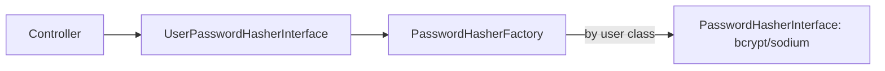

# Password Hashers

!!! tip "In a nutshell"
    Les mots de passe sont stockés sous forme de hachages lents, salés et à sens
    unique ; vous configurez les hashers par classe d'utilisateur et ne les
    vérifiez jamais à la main.
    Piège d'examen : utilisez `auto` (actuellement bcrypt) par défaut, et le
    rehash transparent nécessite **à la fois** `migrate_from` *et* un provider
    `PasswordUpgraderInterface`.

!!! example "Real-world analogy"
    Un password hasher est un destructeur de documents à sens unique. Vous ne
    conservez jamais le papier original — seulement son motif déchiqueté unique.
    Quand quelqu'un annonce un mot de passe, vous déchiquetez sa tentative de la
    même manière et comparez les motifs (`verify()`). Un meilleur destructeur
    arrive ? `needsRehash()` re-déchiquette le papier à sa prochaine connexion.

!!! abstract "Learning objectives"
    À la fin de ce chapitre, vous saurez :

    - [ ] Configurer les hashers `auto`/`bcrypt`/`sodium` et expliquer les valeurs par défaut.
    - [ ] Implémenter le rehash transparent via `migrate_from` + `needsRehash()`.
    - [ ] Utiliser correctement `PasswordHasherFactory`/`UserPasswordHasherInterface`.

    **Syllabus:** `Security → Password hashers` ·
    **Level:** Expert ·
    **Est. time:** 30 min ·
    **Prerequisites:** [Users](users.md) · [Configuration](configuration.md)

---

## Theory

Les mots de passe ne sont jamais stockés en clair — ils sont **hachés** avec une
fonction lente, salée et à sens unique. Le composant PasswordHasher de Symfony
enveloppe le `password_hash()` de PHP et libsodium derrière
`Symfony\Component\PasswordHasher\PasswordHasherInterface`
(`hash()`, `verify()`, `needsRehash()`).

```php
// PasswordHasherInterface — wraps password_hash() / libsodium
$hash = $hasher->hash('S3cr3t!');    // hash(): slow, salted, one-way
$hasher->verify($hash, 'S3cr3t!');   // verify(): true on match
$hasher->needsRehash($hash);         // needsRehash(): true after an algo/cost bump
```

| Algorithm | Backed by | Note |
|---|---|---|
| `auto` | le meilleur disponible | **Par défaut et recommandé** ; actuellement bcrypt |
| `bcrypt` | `password_hash(PASSWORD_BCRYPT)` | `cost` 4–31 ; entrée limitée à 72 octets |
| `sodium` | libsodium Argon2id | gourmand en mémoire ; `memory_cost`/`time_cost` |
| `pbkdf2` | `hash_pbkdf2` | interopérabilité legacy |
| `plaintext` | aucun | **tests uniquement — jamais en production** |

!!! question "Predict first"
    Vous définissez `migrate_from: ['bcrypt']` mais votre provider n'implémente
    pas `PasswordUpgraderInterface`. Les hachages legacy sont-ils mis à niveau à
    la connexion ?

??? note "Reveal"
    Non. Le nouveau hachage est bien *calculé* (car `needsRehash()` vaut `true`)
    mais il n'y a nulle part où le persister — le rehash transparent nécessite
    **à la fois** `migrate_from` *et* un provider `PasswordUpgraderInterface`
    que le `PasswordMigratingListener` appelle.

## Deep Dive — how it works internally

### Factory and per-class hashers

La map `password_hashers` de `security.yaml` est compilée en une
`Symfony\Component\PasswordHasher\Hasher\PasswordHasherFactory`. Indexée par
**classe/interface d'utilisateur**, elle renvoie le bon
`PasswordHasherInterface` pour un utilisateur donné. Les controllers utilisent
l'API de plus haut niveau
`Symfony\Component\PasswordHasher\Hasher\UserPasswordHasherInterface`
(`hashPassword(user, plain)`, `isPasswordValid(user, plain)`,
`needsRehash(user)`), qui demande à la factory le hasher de l'utilisateur.



!!! note "Source reference"
    `Symfony\Component\PasswordHasher\Hasher\PasswordHasherFactory` et
    `UserPasswordHasher` —
    [symfony/symfony `8.0`](https://github.com/symfony/symfony/blob/8.0/src/Symfony/Component/PasswordHasher/Hasher/PasswordHasherFactory.php).

### Verification during login

Vous ne vérifiez **jamais** les mots de passe à la main. L'authenticator ajoute
un badge `PasswordCredentials` (le mot de passe en clair) ; sur
`CheckPassportEvent`, le `CheckCredentialsListener` appelle le
`verify($hash, $plain)` du hasher. Voir
[Authenticators, Passports & Badges](authenticators.md).

```php
// Authenticator: hand over the plaintext via a badge — never verify it yourself
return new Passport(
    new UserBadge($email),
    new PasswordCredentials($plaintextPassword)
);
// Then, on CheckPassportEvent, CheckCredentialsListener runs:
// $hasher->verify($user->getPassword(), $plaintextPassword)
```

### Migration & rehash (`needsRehash`)

Les algorithmes et les coûts s'améliorent avec le temps. `migrate_from` vous
permet d'accepter les anciens hachages tout en les mettant à niveau à la
prochaine connexion réussie :

1. Configurez le nouvel algorithme avec `migrate_from: [old_algo]`.
2. À la connexion, si `PasswordHasherInterface::needsRehash()` renvoie `true`,
   le `PasswordMigratingListener` (déclenché par le **`PasswordUpgradeBadge`**)
   rehache le mot de passe en clair et appelle
   `PasswordUpgraderInterface::upgradePassword()` sur le provider pour le
   persister.

C'est transparent pour l'utilisateur — aucune réinitialisation de mot de passe
nécessaire.

### Null behavior

`PasswordAuthenticatedUserInterface::getPassword()` est typé **`?string`**, donc
un utilisateur peut légitimement avoir **`null`** comme hachage stocké (comptes
sans mot de passe / SSO / token uniquement). Le `CheckCredentialsListener` s'en
protège : un hachage `null` signifie « aucun mot de passe enregistré », donc la
vérification **échoue proprement** au lieu d'appeler `verify()` contre rien, et
`needsRehash()` court-circuite quand il n'y a pas de hachage à inspecter.

Ne passez jamais un mot de passe en clair `null` (ou vide) à `hashPassword()` en
espérant un compte « vierge » — hachez un vrai secret, ou laissez le champ à
`null` et laissez la connexion échouer. Traitez `getPassword()` comme `?string`
à chaque point d'appel.

!!! note "Null in real life"
    Un hachage `null` est une serrure pour laquelle aucune clé n'a encore été
    taillée : vous ne pouvez pas tester une clé dessus, donc cette porte ne
    s'ouvrira tout simplement pas par clé.

## Configuration & code

=== "YAML"

    ```yaml
    # config/packages/security.yaml
    security:
        password_hashers:
            # Recommended: let Symfony pick + auto-rehash on cost bumps.
            Symfony\Component\Security\Core\User\PasswordAuthenticatedUserInterface: 'auto'

            # Explicit example with migration from a legacy algo.
            App\Security\AppUser:
                algorithm: sodium
                migrate_from: ['bcrypt']
    ```

=== "PHP Attributes"

    ```php
    <?php
    declare(strict_types=1);

    namespace App\Controller;

    use App\Security\AppUser;
    use Symfony\Bundle\FrameworkBundle\Controller\AbstractController;
    use Symfony\Component\HttpFoundation\Response;
    use Symfony\Component\PasswordHasher\Hasher\UserPasswordHasherInterface;
    use Symfony\Component\Routing\Attribute\Route;

    final class RegistrationController extends AbstractController
    {
        #[Route('/register', name: 'register', methods: ['POST'])]
        public function register(UserPasswordHasherInterface $hasher): Response
        {
            $user = new AppUser('jane@example.com', '');
            $hashed = $hasher->hashPassword($user, 'plaintext-from-form');
            // persist $hashed via your store (Doctrine is out of scope here)

            return new Response('created', Response::HTTP_CREATED);
        }
    }
    ```

=== "Console"

    ```console
    $ php bin/console security:hash-password
     Type in your password to be hashed: ******
     $2y$13$Q0m...   # bcrypt hash for security.yaml / fixtures
    ```

## Best practices & anti-patterns

| ✅ Do | ❌ Avoid |
|---|---|
| Utiliser `auto` en production | Figer un cost en dur sans `migrate_from` |
| `migrate_from` pour mettre à niveau les hachages legacy | Forcer des réinitialisations massives de mots de passe |
| `plaintext` seulement dans la config de l'env de test | `plaintext` où que ce soit près de la production |
| Laisser le `CheckCredentialsListener` vérifier | Appeler `password_verify()` manuellement |

## When (not) to use it / alternatives

Hachez toujours. Utilisez `auto` sauf si une règle de conformité impose un
algorithme précis ; utilisez `sodium` (Argon2id) quand vous voulez un hachage
gourmand en mémoire. `plaintext` existe pour garder les fixtures de test
rapides — ne le livrez jamais. Pour les tokens/clés d'API, hachez-les aussi,
mais la vérification vit généralement dans un `token_handler`, pas dans le
password hasher.

!!! danger "Certification traps"
    - `auto` est l'algorithme **par défaut et recommandé** ; il correspond
      actuellement à bcrypt mais peut changer — c'est justement le but.
    - Le rehash nécessite **à la fois** `migrate_from` *et* un provider
      implémentant `PasswordUpgraderInterface` ; le `PasswordUpgradeBadge` le
      déclenche.
    - `plaintext` est **réservé aux tests** ; l'examen le signale comme un
      anti-pattern en production.
    - bcrypt tronque l'entrée à **72 octets** — les très longues phrases de
      passe perdent de l'entropie (pas sodium).

!!! warning "Common mistakes"
    - Vérifier les mots de passe manuellement dans l'authenticator au lieu
      d'ajouter un badge `PasswordCredentials`.
    - S'attendre à ce que le rehash fonctionne sans provider
      `PasswordUpgraderInterface` — le nouveau hachage est calculé mais jamais
      persisté.

## Exercises

1. **(Advanced)** Configurez `sodium` pour `AppUser` tout en acceptant encore
   les hachages `bcrypt` existants.
2. **(Expert)** Décrivez la chaîne exacte qui rehache un mot de passe legacy à
   la connexion.

??? success "Solutions"

    **1.** Voir le bloc `App\Security\AppUser` :
    `algorithm: sodium`, `migrate_from: ['bcrypt']`.

    **2.** L'authenticator ajoute `PasswordCredentials` +
    `PasswordUpgradeBadge` → le `CheckCredentialsListener` vérifie contre
    l'ancien hachage bcrypt → l'algo configuré étant sodium, `needsRehash()`
    vaut `true` → le `PasswordMigratingListener` rehache le mot de passe en
    clair avec sodium et appelle le `upgradePassword()` du provider pour le
    persister.

## Certification questions

??? question "Q1. Which algorithm is the recommended default?"
    - [x] A. `auto` ✅
    - [ ] B. `plaintext`
    - [ ] C. `md5`
    - [ ] D. `pbkdf2`

    **Why:** `auto` sélectionne le meilleur algorithme disponible et s'adapte
    dans le temps.
    **Ref:** [Passwords](https://symfony.com/doc/current/security/passwords.html).

??? question "Q2. Transparent rehash on login requires…"
    - [ ] A. Only `migrate_from`
    - [ ] B. Only a `PasswordUpgraderInterface` provider
    - [x] C. Both `migrate_from` and a `PasswordUpgraderInterface` provider ✅
    - [ ] D. Calling `password_hash()` yourself

    **Why:** `migrate_from` détecte l'ancien hachage ; l'upgrader persiste le
    nouveau via le flux du `PasswordUpgradeBadge`.
    **Ref:** [Password migration](https://symfony.com/doc/current/security/passwords.html#password-migration).

??? question "Q3. Where is a login password actually verified?"
    - [ ] A. In `getPassword()`
    - [ ] B. In the user provider
    - [x] C. In `CheckCredentialsListener` on `CheckPassportEvent` ✅
    - [ ] D. In the controller

    **Why:** Le badge `PasswordCredentials` est contrôlé par le listener via le
    `verify()` du hasher.
    **Ref:** [Custom authenticator](https://symfony.com/doc/current/security/custom_authenticator.html).

## Key takeaways

- `auto` (recommandé), `bcrypt`, `sodium` ; `plaintext` pour les tests
  uniquement.
- La `PasswordHasherFactory` choisit le hasher par classe d'utilisateur ;
  `UserPasswordHasherInterface` est l'API côté application.
- Rehash = `migrate_from` + `PasswordUpgraderInterface` + `PasswordUpgradeBadge`.
- Ne vérifiez jamais les mots de passe manuellement — utilisez le badge
  `PasswordCredentials`.

## Last-minute revision

!!! tip "Cheat sheet"
    - `password_hashers: PasswordAuthenticatedUserInterface: 'auto'`.
    - `hashPassword()` / `isPasswordValid()` / `needsRehash()`.
    - Rehash déclenché par `PasswordUpgradeBadge` → `PasswordMigratingListener`.
    - bcrypt : limite de 72 octets ; sodium : Argon2id, gourmand en mémoire.

## Connections

- **Depends on:** [Users](users.md) — les hashers sont indexés par la classe
  d'utilisateur et son `getPassword(): ?string`.
- **Reused in:** [Authenticators](authenticators.md) — le badge
  `PasswordCredentials` est vérifié avec le hasher configuré.
- **Reused in:** [Providers](providers.md) — un provider
  `PasswordUpgraderInterface` persiste les mots de passe rehachés.
- **Confused with:** [Configuration](configuration.md) — `password_hashers` est
  indexé par classe d'utilisateur, pas par nom de provider ni de firewall.

## Official References
- [Symfony docs — Passwords](https://symfony.com/doc/current/security/passwords.html)
- [Symfony source — PasswordHasherFactory](https://github.com/symfony/symfony/blob/8.0/src/Symfony/Component/PasswordHasher/Hasher/PasswordHasherFactory.php)
- [Symfony source — UserPasswordHasher](https://github.com/symfony/symfony/blob/8.0/src/Symfony/Component/PasswordHasher/Hasher/UserPasswordHasher.php)

## Video references

!!! tip "Watch & learn"
    Voici des chaînes vidéo officielles, mises à jour en continu — cherchez-y
    « Symfony security » pour consolider ce chapitre. Nous lions des chaînes
    stables plutôt que des vidéos individuelles pour que les références ne
    périment jamais.

    - [SymfonyCasts screencasts](https://symfonycasts.com/tracks/symfony) — tutoriels scénarisés à suivre en codant.
    - [Symfony official YouTube](https://www.youtube.com/@SymfonyOfficial) — conférences et keynotes SymfonyCon.
    - [Official docs for this topic](https://symfony.com/doc/current/security/passwords.html) — certaines pages de la doc Symfony intègrent un screencast.

## Confidence check

Je suis prêt quand je peux :

- [ ] expliquer **pourquoi** les mots de passe sont des hachages lents, salés, à sens unique
- [ ] configurer `auto`/`sodium` avec `migrate_from` en Symfony 8
- [ ] déboguer un rehash calculé mais jamais persisté (upgrader manquant)
- [ ] repérer que `plaintext` est un anti-pattern en production et la limite de 72 octets de bcrypt
- [ ] tracer la vérification jusqu'au `CheckCredentialsListener` sur `CheckPassportEvent`

---

<small>Related: [Users](users.md) · [Providers](providers.md) ·
[Authenticators, Passports & Badges](authenticators.md) · [Configuration](configuration.md)</small>
