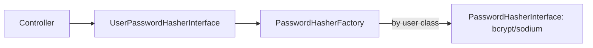

# Password Hashers

!!! abstract "Learning objectives"
    By the end of this chapter you can:

    - [ ] Configure `auto`/`bcrypt`/`sodium` hashers and explain the defaults.
    - [ ] Implement transparent rehash via `migrate_from` + `needsRehash()`.
    - [ ] Use `PasswordHasherFactory`/`UserPasswordHasherInterface` correctly.

    **Syllabus:** `Security → Password hashers` ·
    **Level:** Expert ·
    **Est. time:** 30 min ·
    **Prerequisites:** [Users](users.md) · [Configuration](configuration.md)

---

## Theory

Passwords are never stored in plaintext — they are **hashed** with a slow,
salted, one-way function. Symfony's PasswordHasher component wraps PHP's
`password_hash()` and libsodium behind
`Symfony\Component\PasswordHasher\PasswordHasherInterface`
(`hash()`, `verify()`, `needsRehash()`).

| Algorithm | Backed by | Note |
|---|---|---|
| `auto` | best available | **Default & recommended**; currently bcrypt |
| `bcrypt` | `password_hash(PASSWORD_BCRYPT)` | `cost` 4–31; 72-byte input limit |
| `sodium` | libsodium Argon2id | memory-hard; `memory_cost`/`time_cost` |
| `pbkdf2` | `hash_pbkdf2` | legacy interop |
| `plaintext` | none | **tests only — never production** |

## Deep Dive — how it works internally

### Factory and per-class hashers

`security.yaml`'s `password_hashers` map compiles into a
`Symfony\Component\PasswordHasher\Hasher\PasswordHasherFactory`. Keyed by
**user class/interface**, it returns the right `PasswordHasherInterface` for a
given user. Controllers use the higher-level
`Symfony\Component\PasswordHasher\Hasher\UserPasswordHasherInterface`
(`hashPassword(user, plain)`, `isPasswordValid(user, plain)`,
`needsRehash(user)`), which asks the factory for the user's hasher.



!!! note "Source reference"
    `Symfony\Component\PasswordHasher\Hasher\PasswordHasherFactory` and
    `UserPasswordHasher` —
    [symfony/symfony `8.0`](https://github.com/symfony/symfony/blob/8.0/src/Symfony/Component/PasswordHasher/Hasher/PasswordHasherFactory.php).

### Verification during login

You do **not** verify passwords by hand. The authenticator adds a
`PasswordCredentials` badge (the plaintext); on `CheckPassportEvent` the
`CheckCredentialsListener` calls the hasher's `verify($hash, $plain)`. See
[Authenticators, Passports & Badges](authenticators.md).

### Migration & rehash (`needsRehash`)

Algorithms and costs improve over time. `migrate_from` lets you accept old
hashes while upgrading them on the next successful login:

1. Configure the new algorithm with `migrate_from: [old_algo]`.
2. On login, if `PasswordHasherInterface::needsRehash()` returns `true`, the
   `PasswordMigratingListener` (triggered by the **`PasswordUpgradeBadge`**)
   rehashes the plaintext and calls
   `PasswordUpgraderInterface::upgradePassword()` on the provider to persist it.

This is transparent to the user — no password reset needed.

## Configuration & code

=== "YAML"

    ```yaml
    # config/packages/security.yaml
    security:
        password_hashers:
            # Recommended: let Symfony pick + auto-rehash on cost bumps.
            Symfony\Component\Security\Core\User\PasswordAuthenticatedUserInterface: 'auto'

            # Explicit example with migration from a legacy algo.
            App\Security\AppUser:
                algorithm: sodium
                migrate_from: ['bcrypt']
    ```

=== "PHP Attributes"

    ```php
    <?php
    declare(strict_types=1);

    namespace App\Controller;

    use App\Security\AppUser;
    use Symfony\Bundle\FrameworkBundle\Controller\AbstractController;
    use Symfony\Component\HttpFoundation\Response;
    use Symfony\Component\PasswordHasher\Hasher\UserPasswordHasherInterface;
    use Symfony\Component\Routing\Attribute\Route;

    final class RegistrationController extends AbstractController
    {
        #[Route('/register', name: 'register', methods: ['POST'])]
        public function register(UserPasswordHasherInterface $hasher): Response
        {
            $user = new AppUser('jane@example.com', '');
            $hashed = $hasher->hashPassword($user, 'plaintext-from-form');
            // persist $hashed via your store (Doctrine is out of scope here)

            return new Response('created', Response::HTTP_CREATED);
        }
    }
    ```

=== "Console"

    ```console
    $ php bin/console security:hash-password
     Type in your password to be hashed: ******
     $2y$13$Q0m...   # bcrypt hash for security.yaml / fixtures
    ```

## Best practices & anti-patterns

| ✅ Do | ❌ Avoid |
|---|---|
| Use `auto` in production | Hard-coding a fixed cost with no `migrate_from` |
| `migrate_from` to upgrade legacy hashes | Forcing mass password resets |
| `plaintext` only in test env config | `plaintext` anywhere near production |
| Let `CheckCredentialsListener` verify | Calling `password_verify()` manually |

## When (not) to use it / alternatives

Always hash. Use `auto` unless a compliance rule mandates a specific algorithm;
use `sodium` (Argon2id) when you want memory-hard hashing. `plaintext` exists to
keep test fixtures fast — never ship it. For tokens/API keys, hash them too, but
verification usually lives in a `token_handler`, not the password hasher.

!!! danger "Certification traps"
    - `auto` is the **default and recommended** algorithm; it currently maps to
      bcrypt but may change — that is the point.
    - Rehash needs **both** `migrate_from` *and* a provider implementing
      `PasswordUpgraderInterface`; the `PasswordUpgradeBadge` triggers it.
    - `plaintext` is **test-only**; the exam flags it as a production anti-pattern.
    - bcrypt truncates input at **72 bytes** — very long passphrases lose entropy
      (sodium does not).

!!! warning "Common mistakes"
    - Verifying passwords manually in the authenticator instead of adding a
      `PasswordCredentials` badge.
    - Expecting rehash to work without a `PasswordUpgraderInterface` provider —
      the new hash is computed but never persisted.

## Exercises

1. **(Advanced)** Configure `sodium` for `AppUser` while still accepting existing
   `bcrypt` hashes.
2. **(Expert)** Describe the exact chain that rehashes a legacy password on login.

??? success "Solutions"

    **1.** See the `App\Security\AppUser` block:
    `algorithm: sodium`, `migrate_from: ['bcrypt']`.

    **2.** Authenticator adds `PasswordCredentials` + `PasswordUpgradeBadge` →
    `CheckCredentialsListener` verifies against the old bcrypt hash → since the
    configured algo is sodium, `needsRehash()` is `true` →
    `PasswordMigratingListener` rehashes the plaintext with sodium and calls the
    provider's `upgradePassword()` to persist it.

## Certification questions

??? question "Q1. Which algorithm is the recommended default?"
    - [x] A. `auto` ✅
    - [ ] B. `plaintext`
    - [ ] C. `md5`
    - [ ] D. `pbkdf2`

    **Why:** `auto` selects the best available algorithm and adapts over time.
    **Ref:** [Passwords](https://symfony.com/doc/current/security/passwords.html).

??? question "Q2. Transparent rehash on login requires…"
    - [ ] A. Only `migrate_from`
    - [ ] B. Only a `PasswordUpgraderInterface` provider
    - [x] C. Both `migrate_from` and a `PasswordUpgraderInterface` provider ✅
    - [ ] D. Calling `password_hash()` yourself

    **Why:** `migrate_from` detects the old hash; the upgrader persists the new
    one via the `PasswordUpgradeBadge` flow.
    **Ref:** [Password migration](https://symfony.com/doc/current/security/passwords.html#password-migration).

??? question "Q3. Where is a login password actually verified?"
    - [ ] A. In `getPassword()`
    - [ ] B. In the user provider
    - [x] C. In `CheckCredentialsListener` on `CheckPassportEvent` ✅
    - [ ] D. In the controller

    **Why:** The `PasswordCredentials` badge is checked by the listener using the
    hasher's `verify()`.
    **Ref:** [Custom authenticator](https://symfony.com/doc/current/security/custom_authenticator.html).

## Key takeaways

- `auto` (recommended), `bcrypt`, `sodium`; `plaintext` for tests only.
- `PasswordHasherFactory` picks the hasher per user class;
  `UserPasswordHasherInterface` is the app-facing API.
- Rehash = `migrate_from` + `PasswordUpgraderInterface` + `PasswordUpgradeBadge`.
- Never verify passwords manually — use the `PasswordCredentials` badge.

## Last-minute revision

!!! tip "Cheat sheet"
    - `password_hashers: PasswordAuthenticatedUserInterface: 'auto'`.
    - `hashPassword()` / `isPasswordValid()` / `needsRehash()`.
    - Rehash triggered by `PasswordUpgradeBadge` → `PasswordMigratingListener`.
    - bcrypt: 72-byte limit; sodium: Argon2id, memory-hard.

## References

- [Symfony docs — Passwords](https://symfony.com/doc/current/security/passwords.html)
- [Symfony source — PasswordHasherFactory](https://github.com/symfony/symfony/blob/8.0/src/Symfony/Component/PasswordHasher/Hasher/PasswordHasherFactory.php)
- [Symfony source — UserPasswordHasher](https://github.com/symfony/symfony/blob/8.0/src/Symfony/Component/PasswordHasher/Hasher/UserPasswordHasher.php)

---

<small>Related: [Users](users.md) · [Providers](providers.md) ·
[Authenticators, Passports & Badges](authenticators.md) · [Configuration](configuration.md)</small>
</content>
