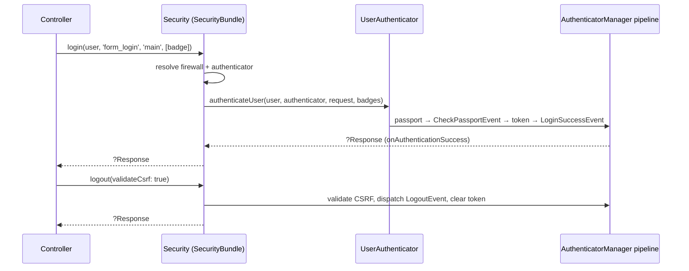

# Login & logout programmatiques

!!! tip "In a nutshell"
    Le service `Symfony\Bundle\SecurityBundle\Security` peut authentifier un
    utilisateur depuis le code : `login($user, $authenticatorName,
    $firewallName, $badges)` et terminer la session avec
    `logout($validateCsrf = true)`. Piège d'examen : `login()` exécute le
    **même pipeline d'authenticators et les mêmes events** qu'un login
    interactif — ce n'est pas un raccourci de token.

!!! example "Real-world analogy"
    La réception d'un hôtel peut enregistrer un client sans que celui-ci
    remplisse lui-même le formulaire — après une réservation de mariage
    (l'inscription), le réceptionniste passe le terminal maître et remet une
    carte-clé. La carte passe quand même par la *même* machine d'encodage et
    les mêmes entrées de registre qu'un enregistrement classique (mêmes events,
    même système de badges) ; et le départ exige normalement la signature du
    client (CSRF), sauf si la réception y renonce explicitement.

!!! abstract "Learning objectives"
    À la fin de ce chapitre, vous saurez :

    - [ ] Connecter un utilisateur depuis un controller avec `Security::login()`.
    - [ ] Savoir quand les noms de l'authenticator et du firewall doivent être passés explicitement.
    - [ ] Attacher des badges (par exemple remember-me) à un login programmatique.
    - [ ] Déclencher le logout dans le code et contrôler la validation CSRF.
    - [ ] Opposer `login()` à `loginUser()` dans les tests fonctionnels.

    **Syllabus:** `Security → Programmatic Login` ·
    **Level:** Expert ·
    **Est. time:** 20 min ·
    **Prerequisites:** [Authenticators](authenticators.md) · [Authentication](authentication.md)

---

## Theory

Le cas d'usage classique : après une **inscription** réussie, l'utilisateur
doit être connecté immédiatement au lieu d'être renvoyé vers le formulaire de
login. Le service `Symfony\Bundle\SecurityBundle\Security` expose :

```php
public function login(UserInterface $user, ?string $authenticatorName = null, ?string $firewallName = null, array $badges = []): ?Response;
public function logout(bool $validateCsrf = true): ?Response;
```

- **`$user`** — n'importe quelle instance de `UserInterface` (généralement
  fraîchement persistée).
- **`$authenticatorName`** — l'authenticator du firewall qui « effectue » le
  login. Les authenticators intégrés sont référencés par leur clé de config
  (`'form_login'`, `'json_login'`, `'remember_me'`, …) ; les personnalisés par
  leur id de service ou leur classe. **Obligatoire dès que le firewall a plus
  d'un authenticator** — sinon Symfony ne peut pas savoir quel traitement de
  succès exécuter.
- **`$firewallName`** — nécessaire quand le firewall visé n'est pas celui qui
  correspond à la request courante (par exemple se connecter à `main` depuis
  une page couverte par un autre firewall).
- **`$badges`** — des badges de passport supplémentaires, par exemple un
  `RememberMeBadge` pour que le cookie remember-me soit écrit exactement comme
  lors d'un login interactif.

```php
// All four parameters made explicit
$security->login(
    $user,                    // any UserInterface instance
    'form_login',             // built-in authenticator → config key ('json_login', 'remember_me', ...)
    'main',                   // target firewall (needed when not the current one)
    [new RememberMeBadge()],  // extra badges: write the remember-me cookie too
);
```

Point crucial : `login()` **dispatche les mêmes events d'authentification**
qu'un login interactif (les listeners de `CheckPassportEvent` résolvent les
badges, `LoginSuccessEvent` se déclenche, remember-me et les autres listeners
réagissent). Vos journaux d'audit, remises à zéro de throttling et handlers de
succès se comportent à l'identique.

```php
// Reacts to Security::login() exactly like to an interactive login
#[AsEventListener]
final class LoginAuditListener
{
    public function __invoke(LoginSuccessEvent $event): void
    {
        // runs after CheckPassportEvent listeners resolved the badges
    }
}
```

`logout()` invalide la session/le token courant et dispatche le `LogoutEvent`
afin que tous les listeners de logout configurés (nettoyage des cookies,
effacement du token CSRF…) s'exécutent. Par défaut, il **valide le token CSRF
de logout** présent dans la request ; passez `false` pour sauter la validation
quand l'appel ne provient pas du formulaire/lien de logout.

```php
// logout() dispatches LogoutEvent; CSRF is validated by default
$security->logout();                     // expects the logout CSRF token in the request
$security->logout(validateCsrf: false);  // programmatic flow → pass false to skip
```

## Deep Dive — how it works internally

`Security::login()` est un fin orchestrateur au-dessus de la même mécanique
que celle du firewall :

1. Résoudre la **configuration du firewall** (le `$firewallName` explicite ou
   le firewall correspondant à la request courante).
2. Choisir l'**authenticator** — le seul enregistré, ou celui nommé via
   `$authenticatorName`.
3. Déléguer au service user authenticator
   (`Symfony\Component\Security\Http\Authentication\UserAuthenticatorInterface::authenticateUser()`),
   qui construit un `SelfValidatingPassport` pour l'utilisateur (plus vos
   `$badges`) et le pousse dans le pipeline de l'`AuthenticatorManager` :
   résolution des badges sur `CheckPassportEvent`, création du token,
   `AuthenticationTokenCreatedEvent`, stockage du token, `LoginSuccessEvent`.
4. La réponse de `onAuthenticationSuccess()` de l'authenticator — s'il y en a
   une — vous est retournée (d'où le type de retour `?Response`) : vous pouvez
   la retourner ou l'ignorer et fabriquer votre propre redirection.



!!! question "Predict first"
    Votre firewall `main` définit à la fois `form_login` et un
    `ApiKeyAuthenticator` personnalisé. Vous appelez `$security->login($user);`
    sans autre argument. Que se passe-t-il ?

??? note "Reveal"
    Cela **échoue** : avec plusieurs authenticators sur le firewall, Symfony ne
    peut pas deviner lequel doit piloter le login ; vous devez donc passer le
    nom de l'authenticator explicitement — `$security->login($user,
    'form_login');` (les intégrés par clé de config, les authenticators
    personnalisés par leur id de service). Seul un firewall avec exactement un
    authenticator vous permet d'omettre l'argument.

!!! note "Source reference"
    `Symfony\Bundle\SecurityBundle\Security` (l'implémentation de
    `login()`/`logout()`) —
    [symfony/symfony `8.0`](https://github.com/symfony/symfony/blob/8.0/src/Symfony/Bundle/SecurityBundle/Security.php).

### `login()` vs `loginUser()` in tests

N'utilisez **pas** `Security::login()` pour authentifier le client dans les
tests fonctionnels — `KernelBrowser::loginUser()` existe pour cela et fabrique
directement la session/le token pour le *client de test* (voir
[Testing → Client configuration](../testing/client-configuration.md)).
Inversement, `loginUser()` est un outillage réservé aux tests ; les flux de
production (inscription → auto-login, liens de vérification…) relèvent de
`Security::login()`.

```php
// Functional test: fabricate the client session — no real pipeline
$client = static::createClient();
$client->loginUser($testUser);   // KernelBrowser::loginUser(), tests only

// Production code: the real pipeline, events and badges included
$security->login($user);         // Security::login()
```

## Configuration & code

=== "PHP (after registration)"

    ```php
    <?php
    declare(strict_types=1);

    namespace App\Controller;

    use App\Entity\User;
    use Symfony\Bundle\FrameworkBundle\Controller\AbstractController;
    use Symfony\Bundle\SecurityBundle\Security;
    use Symfony\Component\HttpFoundation\Response;
    use Symfony\Component\Routing\Attribute\Route;
    use Symfony\Component\Security\Http\Authenticator\Passport\Badge\RememberMeBadge;

    final class RegistrationController extends AbstractController
    {
        #[Route('/register', name: 'app_register')]
        public function register(Security $security): Response
        {
            $user = new User();
            // ... handle the form, hash the password, persist the user ...

            // firewall 'main' has several authenticators → name one;
            // add badges to mimic "remember me" checkbox behaviour
            $response = $security->login($user, 'form_login', 'main', [new RememberMeBadge()]);

            return $response ?? $this->redirectToRoute('app_home');
        }
    }
    ```

=== "PHP (programmatic logout)"

    ```php
    <?php
    declare(strict_types=1);

    namespace App\Controller;

    use Symfony\Bundle\FrameworkBundle\Controller\AbstractController;
    use Symfony\Bundle\SecurityBundle\Security;
    use Symfony\Component\HttpFoundation\Response;
    use Symfony\Component\Routing\Attribute\Route;

    final class AccountController extends AbstractController
    {
        #[Route('/account/close', name: 'app_account_close')]
        public function close(Security $security): Response
        {
            // ... anonymize / deactivate the account ...

            // not coming from the logout form → skip CSRF validation
            $response = $security->logout(validateCsrf: false);

            return $response ?? $this->redirectToRoute('app_goodbye');
        }
    }
    ```

=== "YAML (context)"

    ```yaml
    # config/packages/security.yaml — names used above
    security:
        firewalls:
            main:
                lazy: true
                form_login:
                    login_path: app_login
                    check_path: app_login
                remember_me:
                    secret: '%kernel.secret%'
                logout:
                    path: app_logout
    ```

## Best practices & anti-patterns

| ✅ À faire | ❌ À éviter |
|---|---|
| Utiliser `Security::login()` pour les flux inscription-puis-login | Fabriquer des tokens à la main dans le `TokenStorage` |
| Nommer l'authenticator quand le firewall en a plusieurs | Compter sur « ça marchait avec un seul authenticator » |
| Passer `RememberMeBadge` si le flux promet la persistance | Poser les cookies remember-me manuellement |
| Utiliser `loginUser()` dans les tests WebTestCase | Piloter le vrai formulaire de login dans chaque test |
| Retourner/inspecter le `?Response` de `login()`/`logout()` | Supposer qu'ils retournent toujours null |

## When (not) to use it / alternatives

Recourez à `login()` quand un **événement métier de confiance** authentifie
l'utilisateur : inscription achevée, vérification d'e-mail, liens d'invitation
à usage unique. Ne l'utilisez pas pour contourner les vérifications de
credentials sur des entrées fournies par l'utilisateur — c'est le rôle des
authenticators — et ne l'utilisez pas dans les tests (utilisez `loginUser()`).
Pour « agir en tant qu'un autre utilisateur avec un chemin de retour »,
utilisez plutôt l'[impersonation](impersonation.md) : `login()` *remplace* le
token sans aucun souvenir du précédent.

!!! danger "Certification traps"
    - `login()` vit sur **`Symfony\Bundle\SecurityBundle\Security`** (le
      service du bundle), et il dispatche les **mêmes events** qu'une
      authentification interactive — `LoginSuccessEvent` inclus.
    - Avec **plusieurs authenticators** sur le firewall, `$authenticatorName`
      est obligatoire ; les intégrés sont nommés par clé de config
      (`'form_login'`…).
    - `logout()` **valide le token CSRF de logout par défaut** — passez
      `logout(false)` pour les flux qui ne proviennent pas du formulaire de
      logout.
    - Les deux méthodes retournent `?Response` (la réponse de l'authenticator
      ou des listeners de logout), que vous pouvez retourner directement.
    - Dans les tests fonctionnels, l'outil est `KernelBrowser::loginUser()`,
      pas `Security::login()`.

!!! warning "Common mistakes"
    - Appeler `login()` puis rediriger l'utilisateur *sans* vérifier au
      préalable la réponse retournée — les handlers de succès peuvent déjà en
      avoir construit une.
    - Attendre un cookie remember-me sans passer `new RememberMeBadge()` (et
      sans avoir `remember_me` configuré sur le firewall).

## Exercises

1. **(Advanced)** Après un lien de vérification d'e-mail réussi, connectez
   l'utilisateur sur le firewall `main` (qui a `form_login` + `access_token`)
   avec le support remember-me, et honorez toute réponse produite par
   l'authenticator.
2. **(Expert)** Implémentez « fermer mon compte » : anonymisez l'utilisateur,
   puis déconnectez-le programmatiquement sans token CSRF, en redirigeant vers
   une page d'adieu.

??? success "Solutions"

    **1.** `$response = $security->login($user, 'form_login', 'main', [new RememberMeBadge()]);
    return $response ?? $this->redirectToRoute('dashboard');` — le nom de
    l'authenticator est requis car le firewall a deux authenticators.

    **2.** Mettez à jour/anonymisez l'entité, flushez, puis
    `$response = $security->logout(validateCsrf: false); return $response ?? $this->redirectToRoute('app_goodbye');`
    — sauter la validation n'est sûr *que* parce que l'action elle-même est
    protégée contre le CSRF (formulaire) et ne provient pas de la route de
    logout.

## Certification questions

??? question "Q1. Which service logs a user in programmatically in Symfony 8?"
    - [ ] A. `TokenStorageInterface::setToken()` is the supported API
    - [x] B. `Symfony\Bundle\SecurityBundle\Security::login()` ✅
    - [ ] C. `AuthenticationUtils::login()`
    - [ ] D. `UserProviderInterface::refreshUser()`

    **Why:** Le service `Security` du SecurityBundle enveloppe le pipeline
    d'authenticators ; poser des tokens manuellement court-circuite badges,
    events et listeners.
    **Ref:** [Login programmatically](https://symfony.com/doc/8.0/security.html#login-programmatically).

??? question "Q2. When must you pass an authenticator name to `login()`?"
    - [ ] A. Always — it has no default
    - [ ] B. Only for custom authenticators
    - [x] C. When the target firewall has more than one authenticator ✅
    - [ ] D. Never — Symfony always picks form_login

    **Why:** Avec un seul authenticator, il n'y a pas d'ambiguïté ; avec
    plusieurs, Symfony refuse de deviner. Les intégrés sont référencés par leur
    clé de config.
    **Ref:** [Login programmatically](https://symfony.com/doc/8.0/security.html#login-programmatically).

??? question "Q3. What does `Security::logout()` do about CSRF by default?"
    - [x] A. It validates the logout CSRF token; pass `false` to skip ✅
    - [ ] B. Nothing — logout never involves CSRF
    - [ ] C. It regenerates the token and continues
    - [ ] D. It throws unless the firewall is stateless

    **Why:** `logout(bool $validateCsrf = true)` — les appels programmatiques
    hors du formulaire de logout doivent s'y soustraire explicitement.
    **Ref:** [Logout programmatically](https://symfony.com/doc/8.0/security.html#logging-out).

??? question "Q4. Which statement about `login()` and events is correct?"
    - [ ] A. It stores a token silently, skipping all events
    - [ ] B. It only fires `LogoutEvent`
    - [x] C. It runs the normal pipeline — badge checks and `LoginSuccessEvent` included ✅
    - [ ] D. Events fire only if a Response is returned

    **Why:** `login()` délègue à la même machinerie d'authenticator qu'un
    login interactif, donc les listeners (remember-me, remise à zéro du
    throttling, audit) s'exécutent tous.
    **Ref:** [Login programmatically](https://symfony.com/doc/8.0/security.html#login-programmatically).

## Key takeaways

- `Security::login($user, ?$authenticatorName, ?$firewallName, $badges)` —
  authentification programmatique via le vrai pipeline.
- Nom de l'authenticator requis avec plusieurs authenticators ; nom du
  firewall quand on vise un autre firewall que le courant.
- Les badges (par exemple `RememberMeBadge`) donnent au login le même
  comportement que son jumeau interactif ; les mêmes events sont dispatchés.
- `logout($validateCsrf = true)` dispatche le `LogoutEvent` ; ne désactivez la
  vérification CSRF que pour les flux hors formulaire.
- Les tests utilisent `KernelBrowser::loginUser()` — outil différent, couche
  différente.

## Last-minute revision

!!! tip "Cheat sheet"
    - Service : `Symfony\Bundle\SecurityBundle\Security`.
    - `login(user, 'form_login', 'main', [new RememberMeBadge()])` → `?Response`.
    - Plusieurs authenticators ⇒ en nommer un ; les intégrés par clé de config.
    - `logout(false)` ⇒ sauter la validation CSRF.
    - Mêmes events qu'un login interactif · tests ⇒ `loginUser()`.

## Connections

- **Depends on:** [Authenticators, Passports & Badges](authenticators.md) —
  `login()` réutilise un authenticator et accepte des badges supplémentaires.
- **Depends on:** [Authentication](authentication.md) — le même pipeline
  `CheckPassportEvent` → `LoginSuccessEvent` s'exécute en dessous.
- **Reused in:** [Login Throttling](login-throttling.md) — un login
  programmatique réussi remet à zéro les compteurs de throttling comme
  n'importe quel autre.
- **Confused with:** [User Impersonation](impersonation.md) — l'impersonation
  enveloppe et préserve le token d'origine ; `login()` le remplace, tout
  simplement.

## Official References
- [Symfony docs — Login programmatically](https://symfony.com/doc/8.0/security.html#login-programmatically)
- [Symfony docs — Logging out](https://symfony.com/doc/8.0/security.html#logging-out)
- [Symfony source — Security service](https://github.com/symfony/symfony/blob/8.0/src/Symfony/Bundle/SecurityBundle/Security.php)

## Video references

!!! tip "Watch & learn"
    Voici des chaînes vidéo officielles, mises à jour en continu — cherchez-y
    « Symfony security » pour consolider ce chapitre. Nous lions des chaînes
    stables plutôt que des vidéos individuelles afin que les références ne se
    périment jamais.

    - [SymfonyCasts screencasts](https://symfonycasts.com/tracks/symfony) — tutoriels scénarisés à suivre en codant.
    - [Symfony official YouTube](https://www.youtube.com/@SymfonyOfficial) — conférences et keynotes SymfonyCon.
    - [Official docs for this topic](https://symfony.com/doc/8.0/security.html#login-programmatically) — certaines pages de la doc Symfony intègrent un screencast.

## Confidence check

Je suis prêt quand je peux :

- [ ] expliquer **pourquoi** `login()` vaut mieux qu'écrire des tokens dans le `TokenStorage`
- [ ] connecter un utilisateur après l'inscription en Symfony 8, badges compris
- [ ] déboguer les erreurs « no authenticator found / ambiguous authenticator »
- [ ] repérer le piège `login()` vs `loginUser()` (tests)
- [ ] expliquer les internes : passport → events → token storage → `?Response`

---

<small>Related: [Authenticators, Passports & Badges](authenticators.md) ·
[Authentication](authentication.md) · [User Impersonation](impersonation.md)</small>
