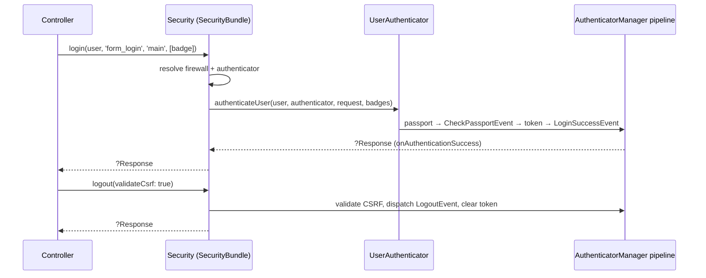

# Programmatic Login & Logout

!!! tip "In a nutshell"
    The `Symfony\Bundle\SecurityBundle\Security` service can authenticate a
    user from code: `login($user, $authenticatorName, $firewallName, $badges)`
    and end the session with `logout($validateCsrf = true)`. Exam hook:
    `login()` runs the **same authenticator pipeline and events** as an
    interactive login — it is not a token shortcut.

!!! example "Real-world analogy"
    A hotel front desk can check a guest in without the guest filling the form
    themselves — after a wedding booking (registration), the receptionist swipes
    the master terminal and hands over a key card. The card still goes through
    the *same* encoding machine and registry entries as a walk-in check-in
    (same events, same badge system); and checkout normally requires the guest's
    signature (CSRF) unless the desk explicitly waives it.

!!! abstract "Learning objectives"
    By the end of this chapter you can:

    - [ ] Log a user in from a controller with `Security::login()`.
    - [ ] Know when the authenticator and firewall names must be passed explicitly.
    - [ ] Attach badges (e.g. remember-me) to a programmatic login.
    - [ ] Trigger logout in code and control CSRF validation.
    - [ ] Contrast `login()` with `loginUser()` in functional tests.

    **Syllabus:** `Security → Programmatic Login` ·
    **Level:** Expert ·
    **Est. time:** 20 min ·
    **Prerequisites:** [Authenticators](authenticators.md) · [Authentication](authentication.md)

---

## Theory

The classic use case: after a successful **registration**, the user should be
logged in immediately instead of being bounced to the login form. The
`Symfony\Bundle\SecurityBundle\Security` service exposes:

```php
public function login(UserInterface $user, ?string $authenticatorName = null, ?string $firewallName = null, array $badges = []): ?Response;
public function logout(bool $validateCsrf = true): ?Response;
```

- **`$user`** — any `UserInterface` instance (usually just persisted).
- **`$authenticatorName`** — which authenticator of the firewall "performs" the
  login. Built-ins are referenced by their config key (`'form_login'`,
  `'json_login'`, `'remember_me'`, …); custom ones by their service id/class.
  **Required whenever the firewall has more than one authenticator** —
  otherwise Symfony cannot know which success handling to run.
- **`$firewallName`** — needed when the target firewall is not the one
  matching the current request (e.g. logging into `main` from a page under
  another firewall).
- **`$badges`** — extra passport badges, e.g. a `RememberMeBadge` so the
  remember-me cookie is written exactly as in an interactive login.

```php
// All four parameters made explicit
$security->login(
    $user,                    // any UserInterface instance
    'form_login',             // built-in authenticator → config key ('json_login', 'remember_me', ...)
    'main',                   // target firewall (needed when not the current one)
    [new RememberMeBadge()],  // extra badges: write the remember-me cookie too
);
```

Crucially, `login()` **dispatches the same authentication events** as an
interactive login (`CheckPassportEvent` listeners resolve badges,
`LoginSuccessEvent` fires, remember-me and other listeners react). Your audit
logs, throttling resets and success handlers behave identically.

```php
// Reacts to Security::login() exactly like to an interactive login
#[AsEventListener]
final class LoginAuditListener
{
    public function __invoke(LoginSuccessEvent $event): void
    {
        // runs after CheckPassportEvent listeners resolved the badges
    }
}
```

`logout()` invalidates the current session/token and dispatches the
`LogoutEvent` so all configured logout listeners (cookie clearing, CSRF token
clearing…) run. By default it **validates the logout CSRF token** from the
request; pass `false` to skip validation when the call does not originate from
the logout form/link.

```php
// logout() dispatches LogoutEvent; CSRF is validated by default
$security->logout();                     // expects the logout CSRF token in the request
$security->logout(validateCsrf: false);  // programmatic flow → pass false to skip
```

## Deep Dive — how it works internally

`Security::login()` is a thin orchestrator over the same machinery the
firewall uses:

1. Resolve the **firewall config** (explicit `$firewallName` or the firewall
   matching the current request).
2. Pick the **authenticator** — the only one registered, or the one named via
   `$authenticatorName`.
3. Delegate to the user authenticator service
   (`Symfony\Component\Security\Http\Authentication\UserAuthenticatorInterface::authenticateUser()`),
   which builds a `SelfValidatingPassport` for the user (plus your `$badges`)
   and pushes it through the `AuthenticatorManager` pipeline: badge
   resolution on `CheckPassportEvent`, token creation,
   `AuthenticationTokenCreatedEvent`, token storage, `LoginSuccessEvent`.
4. The authenticator's `onAuthenticationSuccess()` response — if any — is
   returned to you (hence the `?Response` return type): you may return it or
   ignore it and craft your own redirect.



!!! question "Predict first"
    Your `main` firewall defines both `form_login` and a custom
    `ApiKeyAuthenticator`. You call `$security->login($user);` with no further
    arguments. What happens?

??? note "Reveal"
    It **fails**: with several authenticators on the firewall, Symfony cannot
    guess which one should drive the login, so you must pass the authenticator
    name explicitly — `$security->login($user, 'form_login');` (built-ins by
    config key, custom authenticators by their service id). Only a firewall
    with exactly one authenticator lets you omit the argument.

!!! note "Source reference"
    `Symfony\Bundle\SecurityBundle\Security` (the `login()`/`logout()`
    implementation) —
    [symfony/symfony `8.0`](https://github.com/symfony/symfony/blob/8.0/src/Symfony/Bundle/SecurityBundle/Security.php).

### `login()` vs `loginUser()` in tests

Do **not** use `Security::login()` to authenticate the client in functional
tests — `KernelBrowser::loginUser()` exists for that and fabricates the
session/token for the *test client* directly (see
[Testing → Client configuration](../testing/client-configuration.md)).
Conversely, `loginUser()` is test-only tooling; production flows (register →
auto-login, verification links…) belong to `Security::login()`.

## Configuration & code

=== "PHP (after registration)"

    ```php
    <?php
    declare(strict_types=1);

    namespace App\Controller;

    use App\Entity\User;
    use Symfony\Bundle\FrameworkBundle\Controller\AbstractController;
    use Symfony\Bundle\SecurityBundle\Security;
    use Symfony\Component\HttpFoundation\Response;
    use Symfony\Component\Routing\Attribute\Route;
    use Symfony\Component\Security\Http\Authenticator\Passport\Badge\RememberMeBadge;

    final class RegistrationController extends AbstractController
    {
        #[Route('/register', name: 'app_register')]
        public function register(Security $security): Response
        {
            $user = new User();
            // ... handle the form, hash the password, persist the user ...

            // firewall 'main' has several authenticators → name one;
            // add badges to mimic "remember me" checkbox behaviour
            $response = $security->login($user, 'form_login', 'main', [new RememberMeBadge()]);

            return $response ?? $this->redirectToRoute('app_home');
        }
    }
    ```

=== "PHP (programmatic logout)"

    ```php
    <?php
    declare(strict_types=1);

    namespace App\Controller;

    use Symfony\Bundle\FrameworkBundle\Controller\AbstractController;
    use Symfony\Bundle\SecurityBundle\Security;
    use Symfony\Component\HttpFoundation\Response;
    use Symfony\Component\Routing\Attribute\Route;

    final class AccountController extends AbstractController
    {
        #[Route('/account/close', name: 'app_account_close')]
        public function close(Security $security): Response
        {
            // ... anonymize / deactivate the account ...

            // not coming from the logout form → skip CSRF validation
            $response = $security->logout(validateCsrf: false);

            return $response ?? $this->redirectToRoute('app_goodbye');
        }
    }
    ```

=== "YAML (context)"

    ```yaml
    # config/packages/security.yaml — names used above
    security:
        firewalls:
            main:
                lazy: true
                form_login:
                    login_path: app_login
                    check_path: app_login
                remember_me:
                    secret: '%kernel.secret%'
                logout:
                    path: app_logout
    ```

## Best practices & anti-patterns

| ✅ Do | ❌ Avoid |
|---|---|
| Use `Security::login()` for register-then-login flows | Hand-crafting tokens into `TokenStorage` |
| Name the authenticator when the firewall has several | Relying on "it worked with one authenticator" |
| Pass `RememberMeBadge` if the flow promises persistence | Setting remember-me cookies manually |
| Use `loginUser()` in WebTestCase tests | Driving the real login form in every test |
| Return/inspect the `?Response` from `login()`/`logout()` | Assuming they always return null |

## When (not) to use it / alternatives

Reach for `login()` when a **trusted business event** authenticates the user:
completed registration, e-mail verification, one-time invitation links. Do not
use it to bypass credential checks on user-supplied input — that is what
authenticators are for — and do not use it in tests (use `loginUser()`).
For "act as another user with a way back", use
[impersonation](impersonation.md) instead: `login()` *replaces* the token with
no memory of the previous one.

!!! danger "Certification traps"
    - `login()` lives on **`Symfony\Bundle\SecurityBundle\Security`** (the
      bundle's service), and it dispatches the **same events** as interactive
      authentication — including `LoginSuccessEvent`.
    - With **multiple authenticators** on the firewall, `$authenticatorName` is
      mandatory; built-ins are named by config key (`'form_login'`…).
    - `logout()` **validates the logout CSRF token by default** — pass
      `logout(false)` for flows that do not come from the logout form.
    - Both methods return `?Response` (the authenticator's / logout listeners'
      response), which you may return directly.
    - In functional tests the tool is `KernelBrowser::loginUser()`, not
      `Security::login()`.

!!! warning "Common mistakes"
    - Calling `login()` and then also redirecting the user *before* checking the
      returned response — success handlers may already have built one.
    - Expecting a remember-me cookie without passing `new RememberMeBadge()`
      (and having `remember_me` configured on the firewall).

## Exercises

1. **(Advanced)** After a successful e-mail verification link, log the user in
   on the `main` firewall (which has `form_login` + `access_token`) with
   remember-me support, and honour any response the authenticator produces.
2. **(Expert)** Implement "close my account": anonymize the user, then log them
   out programmatically without a CSRF token, redirecting to a farewell page.

??? success "Solutions"

    **1.** `$response = $security->login($user, 'form_login', 'main', [new RememberMeBadge()]);
    return $response ?? $this->redirectToRoute('dashboard');` — the
    authenticator name is required because the firewall has two authenticators.

    **2.** Update/anonymize the entity, flush, then
    `$response = $security->logout(validateCsrf: false); return $response ?? $this->redirectToRoute('app_goodbye');`
    — skipping validation is safe *only* because the action itself is
    CSRF-protected (form) and does not originate from the logout route.

## Certification questions

??? question "Q1. Which service logs a user in programmatically in Symfony 8?"
    - [ ] A. `TokenStorageInterface::setToken()` is the supported API
    - [x] B. `Symfony\Bundle\SecurityBundle\Security::login()` ✅
    - [ ] C. `AuthenticationUtils::login()`
    - [ ] D. `UserProviderInterface::refreshUser()`

    **Why:** The SecurityBundle `Security` service wraps the authenticator
    pipeline; setting tokens manually skips badges, events and listeners.
    **Ref:** [Login programmatically](https://symfony.com/doc/current/security.html#login-programmatically).

??? question "Q2. When must you pass an authenticator name to `login()`?"
    - [ ] A. Always — it has no default
    - [ ] B. Only for custom authenticators
    - [x] C. When the target firewall has more than one authenticator ✅
    - [ ] D. Never — Symfony always picks form_login

    **Why:** With a single authenticator it is unambiguous; with several,
    Symfony refuses to guess. Built-ins are referenced by their config key.
    **Ref:** [Login programmatically](https://symfony.com/doc/current/security.html#login-programmatically).

??? question "Q3. What does `Security::logout()` do about CSRF by default?"
    - [x] A. It validates the logout CSRF token; pass `false` to skip ✅
    - [ ] B. Nothing — logout never involves CSRF
    - [ ] C. It regenerates the token and continues
    - [ ] D. It throws unless the firewall is stateless

    **Why:** `logout(bool $validateCsrf = true)` — programmatic calls outside
    the logout form must opt out explicitly.
    **Ref:** [Logout programmatically](https://symfony.com/doc/current/security.html#logging-out).

??? question "Q4. Which statement about `login()` and events is correct?"
    - [ ] A. It stores a token silently, skipping all events
    - [ ] B. It only fires `LogoutEvent`
    - [x] C. It runs the normal pipeline — badge checks and `LoginSuccessEvent` included ✅
    - [ ] D. Events fire only if a Response is returned

    **Why:** `login()` delegates to the same authenticator machinery as an
    interactive login, so listeners (remember-me, throttling reset, audit)
    all run.
    **Ref:** [Login programmatically](https://symfony.com/doc/current/security.html#login-programmatically).

## Key takeaways

- `Security::login($user, ?$authenticatorName, ?$firewallName, $badges)` —
  programmatic authentication through the real pipeline.
- Authenticator name required with multiple authenticators; firewall name when
  targeting a firewall other than the current one.
- Badges (e.g. `RememberMeBadge`) make the login behave like its interactive
  twin; the same events are dispatched.
- `logout($validateCsrf = true)` dispatches `LogoutEvent`; disable CSRF checks
  only for non-form flows.
- Tests use `KernelBrowser::loginUser()` instead — different tool, different
  layer.

## Last-minute revision

!!! tip "Cheat sheet"
    - Service: `Symfony\Bundle\SecurityBundle\Security`.
    - `login(user, 'form_login', 'main', [new RememberMeBadge()])` → `?Response`.
    - Multiple authenticators ⇒ name one; built-ins by config key.
    - `logout(false)` ⇒ skip CSRF validation.
    - Same events as interactive login · tests ⇒ `loginUser()`.

## Connections

- **Depends on:** [Authenticators, Passports & Badges](authenticators.md) —
  `login()` reuses an authenticator and accepts extra badges.
- **Depends on:** [Authentication](authentication.md) — the same
  `CheckPassportEvent` → `LoginSuccessEvent` pipeline runs underneath.
- **Reused in:** [Login Throttling](login-throttling.md) — a programmatic login
  success resets the throttle counters like any other.
- **Confused with:** [User Impersonation](impersonation.md) — impersonation
  wraps and preserves the original token; `login()` simply replaces it.

## Official References
- [Symfony docs — Login programmatically](https://symfony.com/doc/current/security.html#login-programmatically)
- [Symfony docs — Logging out](https://symfony.com/doc/current/security.html#logging-out)
- [Symfony source — Security service](https://github.com/symfony/symfony/blob/8.0/src/Symfony/Bundle/SecurityBundle/Security.php)

## Video references

!!! tip "Watch & learn"
    These are official, continuously-updated video channels — search them for
    "Symfony security" to reinforce this chapter. We link stable channels rather than
    individual videos so the references never rot.

    - [SymfonyCasts screencasts](https://symfonycasts.com/tracks/symfony) — scripted, code-along tutorials.
    - [Symfony official YouTube](https://www.youtube.com/@SymfonyOfficial) — SymfonyCon conference talks & keynotes.
    - [Official docs for this topic](https://symfony.com/doc/current/security.html#login-programmatically) — some Symfony doc pages embed a screencast.

## Confidence check

I'm ready when I can:

- [ ] explain **why** `login()` beats writing tokens into `TokenStorage`
- [ ] log a user in after registration in Symfony 8, badges included
- [ ] debug "no authenticator found / ambiguous authenticator" errors
- [ ] spot the `login()` vs `loginUser()` (tests) trap
- [ ] explain internals: passport → events → token storage → `?Response`

---

<small>Related: [Authenticators, Passports & Badges](authenticators.md) ·
[Authentication](authentication.md) · [User Impersonation](impersonation.md)</small>
