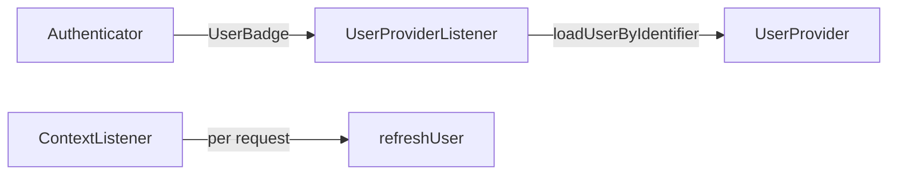

# User Providers

!!! tip "In a nutshell"
    Un user provider **charge** les users par identifiant et les **rafraîchit** à
    chaque request stateful ; il ne les authentifie jamais.
    Piège d'examen : le chargeur est `loadUserByIdentifier()` (l'ancienne
    `loadUserByUsername()` a disparu), et `refreshUser()` s'exécute à *chaque*
    request stateful.

!!! example "Real-world analogy"
    Un user provider est le bureau des archives. Donnez-lui un identifiant
    (« employé n° 4471 ») et il sort le dossier correspondant
    (`loadUserByIdentifier()`) ; il re-vérifie aussi ce dossier à chaque visite
    (`refreshUser()`), pour qu'un badge révoqué soit détecté. Il ne fait que
    *retrouver* les personnes — il ne vérifie jamais que vous êtes vraiment elles.

!!! abstract "Learning objectives"
    À la fin de ce chapitre, vous saurez :

    - [ ] Expliquer ce que fait une `UserProviderInterface` et quand elle est appelée.
    - [ ] Configurer le provider memory et écrire un provider personnalisé.
    - [ ] Raisonner sur `refreshUser()` et le provider chain.

    **Syllabus:** `Security → User providers` ·
    **Level:** Expert ·
    **Est. time:** 30 min ·
    **Prerequisites:** [Users](users.md) · [Configuration](configuration.md)

---

## Theory

Un **user provider** charge les users depuis un stockage. Ce n'est *pas* la
manière dont on s'authentifie — c'est le travail de l'authenticator. Le provider
répond à deux questions :

1. **« Charge le user avec cet identifiant »** — utilisé par les authenticators
   (via le `UserBadge`) pour transformer `admin@example.com` en `UserInterface`.
2. **« Rafraîchis ce user »** — à chaque request stateful, recharger le user
   stocké dans la session pour que ses roles/données soient à jour.

Le contrat est
`Symfony\Component\Security\Core\User\UserProviderInterface` :

```php
loadUserByIdentifier(string $identifier): UserInterface;
refreshUser(UserInterface $user): UserInterface;
supportsClass(string $class): bool;
```

!!! question "Predict first"
    Un compte utilisateur est supprimé côté serveur pendant que ce user a une
    session active. Que se passe-t-il à sa prochaine request stateful ?

??? note "Reveal"
    `refreshUser()` ne peut plus le charger, donc il lance une exception
    (`UserNotFoundException`) ; le `ContextListener` abandonne le token et vide le
    stockage — une déconnexion de fait. C'est pourquoi `refreshUser()` s'exécute à
    *chaque* request stateful, pas seulement au login.

## Deep Dive — how it works internally

### Who calls the provider



- Pendant le login, le `UserProviderListener`
  (`Symfony\Component\Security\Http\EventListener\UserProviderListener`) lit le
  provider du firewall et l'attache au `UserBadge` si le badge n'avait pas de
  chargeur de user ; le `CheckCredentialsListener` résout ensuite le user.
- Sur les requests **stateful** suivantes, le `ContextListener` appelle
  `refreshUser()` afin de resynchroniser la copie en session. Si `refreshUser()`
  lance une `UnsupportedUserException` ou retourne un user que le checker
  rejette, le token est abandonné (déconnexion de fait).

```php
// Login: UserProviderListener attaches the firewall's provider to a bare badge,
// then CheckCredentialsListener resolves the user from it
new UserBadge($identifier); // no loader → provider's loadUserByIdentifier() is used

// Every stateful request: ContextListener re-syncs the session user
$fresh = $provider->refreshUser($sessionUser); // may throw UnsupportedUserException
```

!!! note "Source reference"
    `Symfony\Component\Security\Core\User\InMemoryUserProvider` et
    `ChainUserProvider` —
    [symfony/symfony `8.0`](https://github.com/symfony/symfony/blob/8.0/src/Symfony/Component/Security/Core/User/InMemoryUserProvider.php).

### Built-in providers

| Provider | Clé de config | Usage |
|---|---|---|
| In-memory | `memory` | Fixtures, tests, petites applis |
| Entity | `entity` | Doctrine — **hors périmètre** ici |
| Chain | `chain` | Essayer plusieurs providers dans l'ordre |
| Custom | id de service | N'importe quel stockage (LDAP, API, fichier) |

```yaml
# config/packages/security.yaml — one provider per config key
security:
    providers:
        backup_users: { memory: { users: { admin: { password: '...', roles: [ROLE_ADMIN] } } } }
        main_users:   { entity: { class: App\Entity\User, property: email } }
        api_users:    { id: App\Security\ApiUserProvider }        # custom service id
        all_users:    { chain: { providers: [main_users, backup_users] } }
```

Le provider `entity` de Doctrine est **hors périmètre** à ce stade ; sachez
seulement qu'il existe et charge les users depuis un repository/une propriété.

### Password upgrading

Si un provider implémente aussi
`Symfony\Component\Security\Core\User\PasswordUpgraderInterface`
(`upgradePassword(PasswordAuthenticatedUserInterface $user, string $newHashedPassword)`),
le `PasswordMigratingListener` peut re-hacher un mot de passe de manière
transparente lors d'un login réussi (voir [Password Hashers](password-hashers.md)).

```php
final class ApiUserProvider implements UserProviderInterface, PasswordUpgraderInterface
{
    // Called by PasswordMigratingListener after a successful login with a legacy hash
    public function upgradePassword(PasswordAuthenticatedUserInterface $user, string $newHashedPassword): void
    {
        $this->client->storePasswordHash($user->getUserIdentifier(), $newHashedPassword);
    }

    // ... loadUserByIdentifier(), refreshUser(), supportsClass()
}
```

### Null behavior

`loadUserByIdentifier()` retourne une `UserInterface` — son type de retour n'est
**pas nullable**. Quand aucun user ne correspond, vous **lancez
`UserNotFoundException`** ; vous ne faites jamais `return null`. Retourner `null`
casserait le contrat (une `TypeError`) et masquerait un « user inexistant »
derrière un type cassé.

```php
$data = $this->client->findByEmail($id)
    ?? throw new UserNotFoundException();   // never: return null
```

Par sécurité, `UserNotFoundException` est interceptée et normalisée en une
`BadCredentialsException` générique, de sorte qu'un attaquant ne puisse pas
distinguer « mauvais mot de passe » de « user inconnu ». Dans `refreshUser()`, un
user désormais introuvable (compte supprimé en cours de session) doit aussi
lancer une exception — le `ContextListener` abandonne alors le token, ce qui
déconnecte de fait le user.

!!! note "Null in real life"
    Demander au bureau des archives un dossier qui n'existe pas : l'employé
    répond « personne de ce nom » (une exception), il ne vous tend pas une
    chemise vide (`null`).

## Configuration & code

=== "PHP Attributes"

    ```php
    <?php
    declare(strict_types=1);

    namespace App\Security;

    use App\Model\ApiUser;
    use Symfony\Component\Security\Core\Exception\UnsupportedUserException;
    use Symfony\Component\Security\Core\Exception\UserNotFoundException;
    use Symfony\Component\Security\Core\User\UserInterface;
    use Symfony\Component\Security\Core\User\UserProviderInterface;

    /** @implements UserProviderInterface<ApiUser> */
    final class ApiUserProvider implements UserProviderInterface
    {
        public function __construct(private readonly ApiClient $client) {}

        public function loadUserByIdentifier(string $identifier): UserInterface
        {
            $data = $this->client->findByEmail($identifier)
                ?? throw new UserNotFoundException();

            return new ApiUser($data['email'], $data['roles']);
        }

        public function refreshUser(UserInterface $user): UserInterface
        {
            if (!$user instanceof ApiUser) {
                throw new UnsupportedUserException();
            }

            // Reload so roles/state are fresh on each stateful request.
            return $this->loadUserByIdentifier($user->getUserIdentifier());
        }

        public function supportsClass(string $class): bool
        {
            return ApiUser::class === $class || is_subclass_of($class, ApiUser::class);
        }
    }
    ```

=== "YAML"

    ```yaml
    # config/packages/security.yaml
    security:
        providers:
            in_memory:
                memory:
                    users:
                        admin@example.com: { password: '$2y$13$...', roles: ['ROLE_ADMIN'] }
            api_users:
                id: App\Security\ApiUserProvider   # custom provider (autoconfigured)
            all_users:
                chain:
                    providers: ['in_memory', 'api_users']
    ```

## Best practices & anti-patterns

| ✅ Do | ❌ Avoid |
|---|---|
| Lancer `UserNotFoundException` en cas d'absence | Retourner `null` depuis le chargeur |
| Recharger des données fraîches dans `refreshUser()` | Retourner `$user` inchangé aveuglément |
| Implémenter `PasswordUpgraderInterface` | Un re-hachage manuel dans l'authenticator |
| `supportsClass()` : classe exacte + sous-classes | Accepter des classes sans rapport |

## When (not) to use it / alternatives

Le provider memory pour les fixtures/tests ; une `UserProviderInterface`
personnalisée pour tout stockage non-Doctrine ; un chain quand les users peuvent
venir de plusieurs sources. Pour une API **stateless** où le token *est*
l'identité (p. ex. un JWT auto-validant), vous pouvez sauter entièrement le
rafraîchissement avec un `SelfValidatingPassport`.

!!! danger "Certification traps"
    - `loadUserByIdentifier()` (et non `loadUserByUsername()` — cette méthode
      héritée a disparu) est le chargeur en Symfony 8.
    - `refreshUser()` s'exécute à **chaque request stateful**, pas seulement au
      login ; une implémentation lente coûte à chaque hit.
    - Le provider **ne vérifie pas les mots de passe** — la vérification des
      credentials est l'affaire d'un badge sur le `CheckPassportEvent`.
    - Un firewall avec `stateless: true` n'appelle jamais `refreshUser()`.

!!! warning "Common mistakes"
    - Retourner le même objet depuis `refreshUser()`, si bien que les changements
      de roles ne prennent jamais effet avant une reconnexion.
    - Oublier `UnsupportedUserException` dans `refreshUser()`/`supportsClass()`
      quand on utilise un provider chain.

## Exercises

1. **(Advanced)** Configurez un provider chain qui essaie un provider in-memory
   puis un provider personnalisé.
2. **(Expert)** Expliquez ce qui se passe si `refreshUser()` lance
   `UserNotFoundException` en cours de session.

??? success "Solutions"

    **1.** Voir le bloc `all_users: chain:` ci-dessus — les providers sont essayés
    dans l'ordre et le premier qui supporte le user l'emporte.

    **2.** Le `ContextListener` considère que le user n'est plus chargeable,
    abandonne le token et l'efface du stockage — le user est de fait déconnecté
    sur cette request (utile quand un compte est supprimé côté serveur).

## Certification questions

??? question "Q1. Which method loads a user by identifier in Symfony 8?"
    - [ ] A. `loadUserByUsername()`
    - [x] B. `loadUserByIdentifier()` ✅
    - [ ] C. `findUser()`
    - [ ] D. `getUser()`

    **Why:** `loadUserByUsername()` a été supprimée ; le chargeur est
    `loadUserByIdentifier()`.
    **Ref:** [User providers](https://symfony.com/doc/current/security/user_providers.html).

??? question "Q2. When is `refreshUser()` called?"
    - [ ] A. Only during login
    - [x] B. On every stateful request to re-sync the session user ✅
    - [ ] C. Never for custom providers
    - [ ] D. Only on logout

    **Why:** Le `ContextListener` rafraîchit le user stocké à chaque request dans
    un firewall stateful.
    **Ref:** [ContextListener](https://github.com/symfony/symfony/blob/8.0/src/Symfony/Component/Security/Http/Firewall/ContextListener.php).

??? question "Q3. Does a user provider verify the password?"
    - [ ] A. Yes, in `loadUserByIdentifier()`
    - [x] B. No — credentials are checked on `CheckPassportEvent` ✅
    - [ ] C. Yes, in `refreshUser()`
    - [ ] D. Only for the memory provider

    **Why:** Les providers ne font que charger/rafraîchir les users ; le
    `CheckCredentialsListener` vérifie les `PasswordCredentials`.
    **Ref:** [Custom authenticator](https://symfony.com/doc/current/security/custom_authenticator.html).

## Key takeaways

- Un provider **charge et rafraîchit** les users ; il ne les authentifie jamais.
- `loadUserByIdentifier()`, `refreshUser()`, `supportsClass()` forment le contrat.
- `refreshUser()` s'exécute à chaque request stateful ; gardez-le rapide et à jour.
- Les providers memory/chain/custom couvrent les besoins non-Doctrine (entity est
  hors périmètre).

## Last-minute revision

!!! tip "Cheat sheet"
    - Contrat : `loadUserByIdentifier` / `refreshUser` / `supportsClass`.
    - Ajoutez `PasswordUpgraderInterface` pour un re-hachage transparent.
    - `memory` pour les tests ; `chain` essaie les providers dans l'ordre.
    - Firewall stateless ⇒ pas de `refreshUser()`.

## Connections

- **Dépend de :** [Users](users.md) — le provider charge et rafraîchit des
  instances de `UserInterface`.
- **Dépend de :** [Configuration](configuration.md) — les providers sont déclarés
  sous la clé `providers`.
- **Réutilisé dans :** [Authenticators](authenticators.md) — le
  `UserProviderListener` résout le `UserBadge` via le provider du firewall.
- **À ne pas confondre avec :** [Authentication](authentication.md) — le provider
  ne fait que *charger* les users ; il ne vérifie jamais les credentials.

## Official References
- [Symfony docs — User providers](https://symfony.com/doc/current/security/user_providers.html)
- [Symfony source — InMemoryUserProvider](https://github.com/symfony/symfony/blob/8.0/src/Symfony/Component/Security/Core/User/InMemoryUserProvider.php)
- [Symfony source — ChainUserProvider](https://github.com/symfony/symfony/blob/8.0/src/Symfony/Component/Security/Core/User/ChainUserProvider.php)

## Video references

!!! tip "Watch & learn"
    Voici des chaînes vidéo officielles, mises à jour en continu — cherchez-y
    "Symfony security" pour consolider ce chapitre. Nous lions des chaînes stables
    plutôt que des vidéos individuelles pour que les références ne périment jamais.

    - [SymfonyCasts screencasts](https://symfonycasts.com/tracks/symfony) — tutoriels scénarisés à suivre en codant.
    - [Symfony official YouTube](https://www.youtube.com/@SymfonyOfficial) — conférences et keynotes SymfonyCon.
    - [Official docs for this topic](https://symfony.com/doc/current/security/user_providers.html) — certaines pages de la doc Symfony intègrent un screencast.

## Confidence check

Je suis prêt quand je peux :

- [ ] expliquer **pourquoi** un provider charge/rafraîchit mais n'authentifie jamais
- [ ] configurer memory/chain et écrire une `UserProviderInterface` personnalisée
- [ ] déboguer des changements de roles qui ne prennent jamais effet avant reconnexion
- [ ] repérer que `loadUserByIdentifier()` lance une exception (ne retourne jamais `null`)
- [ ] expliquer quand `refreshUser()` s'exécute et comment un user manquant est déconnecté

---

<small>Related: [Users](users.md) · [Password Hashers](password-hashers.md) ·
[Configuration](configuration.md) · [Authenticators, Passports & Badges](authenticators.md)</small>
