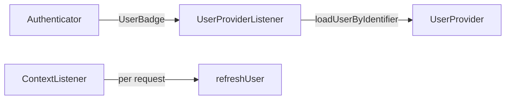

# User Providers

!!! tip "In a nutshell"
    A user provider **loads** users by identifier and **refreshes** them on each
    stateful request; it never authenticates them.
    Exam hook: the loader is `loadUserByIdentifier()` (legacy
    `loadUserByUsername()` is gone), and `refreshUser()` runs on *every* stateful
    request.

!!! abstract "Learning objectives"
    By the end of this chapter you can:

    - [ ] Explain what a `UserProviderInterface` does and when it is called.
    - [ ] Configure the memory provider and write a custom provider.
    - [ ] Reason about `refreshUser()` and the chain provider.

    **Syllabus:** `Security → User providers` ·
    **Level:** Expert ·
    **Est. time:** 30 min ·
    **Prerequisites:** [Users](users.md) · [Configuration](configuration.md)

---

## Theory

A **user provider** loads users from a store. It is *not* how you authenticate —
that is the authenticator's job. The provider answers two questions:

1. **"Load the user with this identifier"** — used by authenticators (via the
   `UserBadge`) to turn `admin@example.com` into a `UserInterface`.
2. **"Refresh this user"** — on every stateful request, reload the user stored
   in the session so its roles/data are current.

The contract is
`Symfony\Component\Security\Core\User\UserProviderInterface`:

```php
loadUserByIdentifier(string $identifier): UserInterface;
refreshUser(UserInterface $user): UserInterface;
supportsClass(string $class): bool;
```

## Deep Dive — how it works internally

### Who calls the provider



- During login, the `UserProviderListener`
  (`Symfony\Component\Security\Http\EventListener\UserProviderListener`) reads the
  firewall's provider and attaches it to the `UserBadge` if the badge had no
  user loader; `CheckCredentialsListener` then resolves the user.
- On subsequent **stateful** requests, the `ContextListener` calls
  `refreshUser()` so the session copy is re-synced. If `refreshUser()` throws
  `UnsupportedUserException` or returns a user the checker rejects, the token is
  discarded (effective logout).

!!! note "Source reference"
    `Symfony\Component\Security\Core\User\InMemoryUserProvider` and
    `ChainUserProvider` —
    [symfony/symfony `8.0`](https://github.com/symfony/symfony/blob/8.0/src/Symfony/Component/Security/Core/User/InMemoryUserProvider.php).

### Built-in providers

| Provider | Config key | Use |
|---|---|---|
| In-memory | `memory` | Fixtures, tests, tiny apps |
| Entity | `entity` | Doctrine — **out of scope** here |
| Chain | `chain` | Try several providers in order |
| Custom | service id | Any store (LDAP, API, file) |

Doctrine's `entity` provider is **out of scope** for this stage; know only that
it exists and loads users from a repository/property.

### Password upgrading

If a provider also implements
`Symfony\Component\Security\Core\User\PasswordUpgraderInterface`
(`upgradePassword(PasswordAuthenticatedUserInterface $user, string $newHashedPassword)`),
the `PasswordMigratingListener` can transparently rehash a password on
successful login (see [Password Hashers](password-hashers.md)).

## Configuration & code

=== "PHP Attributes"

    ```php
    <?php
    declare(strict_types=1);

    namespace App\Security;

    use App\Model\ApiUser;
    use Symfony\Component\Security\Core\Exception\UnsupportedUserException;
    use Symfony\Component\Security\Core\Exception\UserNotFoundException;
    use Symfony\Component\Security\Core\User\UserInterface;
    use Symfony\Component\Security\Core\User\UserProviderInterface;

    /** @implements UserProviderInterface<ApiUser> */
    final class ApiUserProvider implements UserProviderInterface
    {
        public function __construct(private readonly ApiClient $client) {}

        public function loadUserByIdentifier(string $identifier): UserInterface
        {
            $data = $this->client->findByEmail($identifier)
                ?? throw new UserNotFoundException();

            return new ApiUser($data['email'], $data['roles']);
        }

        public function refreshUser(UserInterface $user): UserInterface
        {
            if (!$user instanceof ApiUser) {
                throw new UnsupportedUserException();
            }

            // Reload so roles/state are fresh on each stateful request.
            return $this->loadUserByIdentifier($user->getUserIdentifier());
        }

        public function supportsClass(string $class): bool
        {
            return ApiUser::class === $class || is_subclass_of($class, ApiUser::class);
        }
    }
    ```

=== "YAML"

    ```yaml
    # config/packages/security.yaml
    security:
        providers:
            in_memory:
                memory:
                    users:
                        admin@example.com: { password: '$2y$13$...', roles: ['ROLE_ADMIN'] }
            api_users:
                id: App\Security\ApiUserProvider   # custom provider (autoconfigured)
            all_users:
                chain:
                    providers: ['in_memory', 'api_users']
    ```

## Best practices & anti-patterns

| ✅ Do | ❌ Avoid |
|---|---|
| Throw `UserNotFoundException` when absent | Returning `null` from the loader |
| Reload fresh data in `refreshUser()` | Returning `$user` unchanged blindly |
| Implement `PasswordUpgraderInterface` | Manual rehash inside the authenticator |
| `supportsClass()` exact + subclasses | Matching unrelated classes |

## When (not) to use it / alternatives

Memory provider for fixtures/tests; a custom `UserProviderInterface` for any
non-Doctrine store; a chain when users can come from several places. For a
**stateless** API where the token *is* the identity (e.g. self-validating JWT),
you may skip refresh entirely with a `SelfValidatingPassport`.

!!! danger "Certification traps"
    - `loadUserByIdentifier()` (not `loadUserByUsername()` — that legacy method
      is gone) is the loader in Symfony 8.
    - `refreshUser()` runs on **every stateful request**, not just login; a slow
      implementation costs every hit.
    - The provider **does not verify passwords** — credential checking is a badge
      concern on `CheckPassportEvent`.
    - A firewall with `stateless: true` never calls `refreshUser()`.

!!! warning "Common mistakes"
    - Returning the same object from `refreshUser()` so role changes never take
      effect until re-login.
    - Forgetting `UnsupportedUserException` in `refreshUser()`/`supportsClass()`
      when using a chain provider.

## Exercises

1. **(Advanced)** Configure a chain provider that tries an in-memory provider
   then a custom one.
2. **(Expert)** Explain what happens if `refreshUser()` throws
   `UserNotFoundException` mid-session.

??? success "Solutions"

    **1.** See the `all_users: chain:` block above — providers are tried in order
    and the first that supports the user wins.

    **2.** The `ContextListener` treats the user as no longer loadable, discards
    the token and clears it from storage — the user is effectively logged out on
    that request (useful when an account is deleted server-side).

## Certification questions

??? question "Q1. Which method loads a user by identifier in Symfony 8?"
    - [ ] A. `loadUserByUsername()`
    - [x] B. `loadUserByIdentifier()` ✅
    - [ ] C. `findUser()`
    - [ ] D. `getUser()`

    **Why:** `loadUserByUsername()` was removed; the loader is
    `loadUserByIdentifier()`.
    **Ref:** [User providers](https://symfony.com/doc/current/security/user_providers.html).

??? question "Q2. When is `refreshUser()` called?"
    - [ ] A. Only during login
    - [x] B. On every stateful request to re-sync the session user ✅
    - [ ] C. Never for custom providers
    - [ ] D. Only on logout

    **Why:** The `ContextListener` refreshes the stored user each request in a
    stateful firewall.
    **Ref:** [ContextListener](https://github.com/symfony/symfony/blob/8.0/src/Symfony/Component/Security/Http/Firewall/ContextListener.php).

??? question "Q3. Does a user provider verify the password?"
    - [ ] A. Yes, in `loadUserByIdentifier()`
    - [x] B. No — credentials are checked on `CheckPassportEvent` ✅
    - [ ] C. Yes, in `refreshUser()`
    - [ ] D. Only for the memory provider

    **Why:** Providers only load/refresh users; `CheckCredentialsListener`
    verifies `PasswordCredentials`.
    **Ref:** [Custom authenticator](https://symfony.com/doc/current/security/custom_authenticator.html).

## Key takeaways

- A provider **loads and refreshes** users; it never authenticates them.
- `loadUserByIdentifier()`, `refreshUser()`, `supportsClass()` are the contract.
- `refreshUser()` runs every stateful request; keep it cheap and current.
- Memory/chain/custom providers cover non-Doctrine needs (entity is out of scope).

## Last-minute revision

!!! tip "Cheat sheet"
    - Contract: `loadUserByIdentifier` / `refreshUser` / `supportsClass`.
    - Add `PasswordUpgraderInterface` for transparent rehash.
    - `memory` for tests; `chain` tries providers in order.
    - Stateless firewall ⇒ no `refreshUser()`.

## Official References
- [Symfony docs — User providers](https://symfony.com/doc/current/security/user_providers.html)
- [Symfony source — InMemoryUserProvider](https://github.com/symfony/symfony/blob/8.0/src/Symfony/Component/Security/Core/User/InMemoryUserProvider.php)
- [Symfony source — ChainUserProvider](https://github.com/symfony/symfony/blob/8.0/src/Symfony/Component/Security/Core/User/ChainUserProvider.php)

---

<small>Related: [Users](users.md) · [Password Hashers](password-hashers.md) ·
[Configuration](configuration.md) · [Authenticators, Passports & Badges](authenticators.md)</small>
</content>
