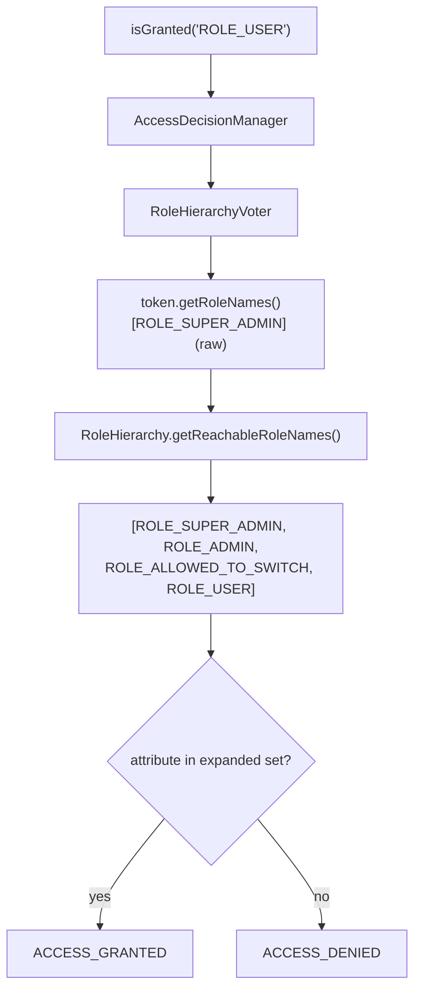

# Role Hierarchy

!!! tip "In a nutshell"
    `security.role_hierarchy` associe des rôles aux rôles qu'ils *impliquent*
    (`ROLE_ADMIN: ROLE_USER`), résolus **transitivement** au moment de
    l'autorisation. Piège d'examen : `isGranted()` et `access_control`
    résolvent la hiérarchie, mais **`$user->getRoles()` ne l'étend jamais** —
    elle ne retourne que les rôles stockés.

!!! example "Real-world analogy"
    Les grades militaires : l'insigne d'un colonel dit « colonel » — rien
    d'autre. Mais chaque poste de contrôle (le contrôle d'accès) connaît la
    chaîne de commandement : colonel implique commandant implique capitaine,
    donc le colonel franchit toute porte qu'un capitaine peut ouvrir. Lisez
    l'insigne lui-même (`getRoles()`) et vous ne verrez jamais que
    « colonel » ; l'*implication* vit dans le règlement du poste de contrôle,
    pas sur l'insigne.

!!! abstract "Learning objectives"
    À la fin de ce chapitre, vous saurez :

    - [ ] Configurer `security.role_hierarchy`, y compris les cartes multi-parents.
    - [ ] Expliquer la résolution transitive (A → B → C signifie que A atteint C).
    - [ ] Indiquer précisément où la hiérarchie s'applique (et où elle ne s'applique pas).
    - [ ] Utiliser `RoleHierarchyInterface::getReachableRoleNames()` dans des services.
    - [ ] Décrire le remplacement `RoleVoter` / `RoleHierarchyVoter`.

    **Syllabus:** `Security → Role Hierarchy` ·
    **Level:** Expert ·
    **Est. time:** 20 min ·
    **Prerequisites:** [Roles](roles.md) · [Authorization](authorization.md)

---

## Pour les nuls

### L'idée en une phrase
La hiérarchie des rôles fait qu'un rôle "supérieur" hérite automatiquement des droits d'un rôle "inférieur" — sans jamais avoir à les lister tous explicitement.

### Imagine dans la vraie vie
Les grades militaires : le badge d'un colonel dit "colonel" — rien d'autre. Mais chaque poste de contrôle connaît la chaîne de commandement : colonel implique commandant implique capitaine, donc le colonel passe toute porte qu'un capitaine peut ouvrir.

### Dans Symfony
Un utilisateur avec seulement `ROLE_ADMIN` stocké sur son token passe automatiquement un `#[IsGranted('ROLE_USER')]` grâce à la hiérarchie — sans que `ROLE_USER` n'ait jamais été explicitement attribué.

### Exemple simple
```yaml
role_hierarchy: { ROLE_ADMIN: [ROLE_USER, ROLE_EDITOR] } # un rôle peut impliquer plusieurs
```

### Comment le mémoriser 🧠
`$user->getRoles()` **n'étend jamais** la hiérarchie — elle renvoie seulement les rôles réellement stockés. Seuls `isGranted()` et `access_control` résolvent la hiérarchie complète.

---


## Theory

Plutôt que d'attribuer à chaque administrateur `ROLE_USER` *et* `ROLE_ADMIN`
en base de données, déclarez qu'un rôle en **implique** d'autres :

```yaml
security:
    role_hierarchy:
        ROLE_ADMIN: ROLE_USER
        ROLE_SUPER_ADMIN: [ROLE_ADMIN, ROLE_ALLOWED_TO_SWITCH]
```

La résolution est **transitive** : `ROLE_SUPER_ADMIN` atteint `ROLE_ADMIN`,
qui atteint `ROLE_USER`, donc un super-admin passe `isGranted('ROLE_USER')`
tout en ne stockant qu'un seul rôle.

```php
// Stored on the user: one single role
$user->getRoles();                              // ['ROLE_SUPER_ADMIN'] — raw

// Authorization time: ROLE_SUPER_ADMIN → ROLE_ADMIN → ROLE_USER (transitive)
$authorizationChecker->isGranted('ROLE_ADMIN'); // true
$authorizationChecker->isGranted('ROLE_USER');  // true — reached through ROLE_ADMIN
```

**Où la hiérarchie s'applique — et où elle ne s'applique pas :**

| Contrôle | Hiérarchie appliquée ? |
|---|---|
| `isGranted('ROLE_X')` / `#[IsGranted]` / Twig `is_granted()` | ✅ oui |
| `access_control: { roles: ROLE_X }` | ✅ oui |
| L'exigence de rôle de `switch_user` | ✅ oui (c'est un appel `isGranted()`) |
| `$user->getRoles()` / `$token->getRoleNames()` | ❌ **non** — rôles stockés bruts |
| `in_array('ROLE_USER', $user->getRoles())` | ❌ **non** — le bug classique |

Cette dernière ligne est *le* piège d'examen. La hiérarchie est un concept du
**moment de l'autorisation** : elle vit dans la couche des voters, pas dans
l'objet utilisateur ni dans le token.

## Deep Dive — how it works internally

Lorsque `role_hierarchy` est configuré, SecurityBundle remplace le simple
`RoleVoter` par un
`Symfony\Component\Security\Core\Authorization\Voter\RoleHierarchyVoter` —
une sous-classe de `RoleVoter` dont l'extraction des rôles fait passer les
noms de rôles du token par
`Symfony\Component\Security\Core\Role\RoleHierarchy` :

1. `isGranted('ROLE_USER')` atteint l'`AccessDecisionManager`.
2. Le `RoleHierarchyVoter` prend `$token->getRoleNames()` (brut, p. ex.
   `[ROLE_SUPER_ADMIN]`).
3. Il appelle `RoleHierarchy::getReachableRoleNames()`, qui parcourt la carte
   configurée transitivement, produisant
   `[ROLE_SUPER_ADMIN, ROLE_ADMIN, ROLE_ALLOWED_TO_SWITCH, ROLE_USER]`.
4. L'attribut est comparé à cet ensemble *étendu* → `ACCESS_GRANTED`.



!!! question "Predict first"
    Avec `ROLE_ADMIN: ROLE_USER` configuré et un utilisateur stocké avec
    `[ROLE_ADMIN]` : que retournent (a) `isGranted('ROLE_USER')` et (b)
    `in_array('ROLE_USER', $user->getRoles(), true)` ?

??? note "Reveal"
    (a) **true** — le `RoleHierarchyVoter` étend `ROLE_ADMIN` pour inclure
    `ROLE_USER`. (b) **false** — `getRoles()` retourne exactement ce qui est
    stocké : `['ROLE_ADMIN']`. Tout code qui compare des rôles bruts
    contourne la hiérarchie ; injectez `RoleHierarchyInterface` et étendez
    d'abord si vous devez travailler avec des tableaux de rôles.

!!! note "Source reference"
    `Symfony\Component\Security\Core\Role\RoleHierarchy` —
    [symfony/symfony `8.0`](https://github.com/symfony/symfony/blob/8.0/src/Symfony/Component/Security/Core/Role/RoleHierarchy.php)
    — et
    [`RoleHierarchyVoter`](https://github.com/symfony/symfony/blob/8.0/src/Symfony/Component/Security/Core/Authorization/Voter/RoleHierarchyVoter.php).

### Expanding roles yourself

En dehors d'`isGranted()` — p. ex. pour construire une interface d'admin qui
liste les permissions *effectives* d'un utilisateur — autowirez
`Symfony\Component\Security\Core\Role\RoleHierarchyInterface` et appelez
`getReachableRoleNames(array $roles): array`. C'est le même service que celui
utilisé par le voter, donc les résultats correspondent toujours au
comportement d'autorisation.

```php
public function __construct(
    private readonly RoleHierarchyInterface $roleHierarchy, // autowired
) {}

/** @return list<string> */
public function effectiveRoles(UserInterface $user): array
{
    // Same expansion isGranted() relies on internally
    return $this->roleHierarchy->getReachableRoleNames($user->getRoles());
    // ['ROLE_SUPER_ADMIN'] → ['ROLE_SUPER_ADMIN', 'ROLE_ADMIN', ...]
}
```

### Interaction with access_control and voters

Les règles `access_control` avec `roles:` sont appliquées via le même
`AccessDecisionManager`, donc la hiérarchie s'y applique aussi. Les voters
personnalisés, en revanche, reçoivent le token brut — si un voter
personnalisé inspecte lui-même les rôles, il doit injecter
`RoleHierarchyInterface`, sans quoi il ignorera silencieusement la
hiérarchie.

```php
// access_control's "roles:" entries go through the AccessDecisionManager,
// so the hierarchy applies there. A custom voter sees RAW roles instead:
final class ReportVoter extends Voter
{
    public function __construct(private readonly RoleHierarchyInterface $roleHierarchy) {}

    // supports() omitted for brevity
    protected function voteOnAttribute(string $attribute, mixed $subject, TokenInterface $token): bool
    {
        // Expand manually — otherwise roles granted via the hierarchy are missed
        $roles = $this->roleHierarchy->getReachableRoleNames($token->getRoleNames());

        return \in_array('ROLE_EMPLOYEE', $roles, true);
    }
}
```

## Configuration & code

=== "YAML"

    ```yaml
    # config/packages/security.yaml
    security:
        role_hierarchy:
            ROLE_ADMIN: ROLE_USER
            ROLE_SUPER_ADMIN: [ROLE_ADMIN, ROLE_ALLOWED_TO_SWITCH]

        access_control:
            - { path: ^/admin, roles: ROLE_ADMIN }   # super-admins pass too
    ```

=== "PHP"

    ```php
    <?php
    // config/packages/security.php
    declare(strict_types=1);

    use Symfony\Config\SecurityConfig;

    return static function (SecurityConfig $security): void {
        $security->roleHierarchy('ROLE_ADMIN', ['ROLE_USER']);
        $security->roleHierarchy('ROLE_SUPER_ADMIN', ['ROLE_ADMIN', 'ROLE_ALLOWED_TO_SWITCH']);
    };
    ```

=== "PHP (expanding in a service)"

    ```php
    <?php
    declare(strict_types=1);

    namespace App\Security;

    use Symfony\Component\Security\Core\Role\RoleHierarchyInterface;
    use Symfony\Component\Security\Core\User\UserInterface;

    final class EffectiveRoles
    {
        public function __construct(
            private readonly RoleHierarchyInterface $roleHierarchy,
        ) {
        }

        /** @return list<string> every role the user effectively has */
        public function forUser(UserInterface $user): array
        {
            // getRoles() is raw; expand it the same way the voter does
            return $this->roleHierarchy->getReachableRoleNames($user->getRoles());
        }
    }
    ```

## Best practices & anti-patterns

| ✅ Do | ❌ Avoid |
|---|---|
| Stocker un seul rôle « métier » par utilisateur ; dériver le reste | Persister `ROLE_USER` sur chaque ligne d'admin |
| Vérifier les permissions avec `isGranted()` | `in_array(...)` sur `$user->getRoles()` |
| Injecter `RoleHierarchyInterface` quand la liste étendue est nécessaire | Ré-implémenter la carte en PHP |
| Garder la hiérarchie peu profonde et lisible | Des chaînes profondes que personne ne peut suivre |

## When (not) to use it / alternatives

Utilisez-la chaque fois que les rôles forment une relation « inclut » — elle
garde la base de données minimale et le modèle mental dans un seul bloc de
configuration. Ne l'étirez **pas** en système de permissions : les règles
fines, par objet, relèvent des [voters](voters.md). Si deux rôles se
*recouvrent* simplement sans que l'un implique l'autre, modélisez la capacité
partagée comme un troisième rôle que les deux impliquent, plutôt que de
forcer un lien parent/enfant artificiel.

!!! danger "Certification traps"
    - **`$user->getRoles()` n'applique PAS la hiérarchie** — seuls les
      contrôles d'accès (`isGranted()`, `access_control`, `#[IsGranted]`) le
      font.
    - La résolution est **transitive** : `A: B` + `B: C` signifie que A
      atteint C.
    - Le service d'expansion est
      `RoleHierarchyInterface::getReachableRoleNames()` (notez le pluriel
      *Names* — il prend et retourne des tableaux de chaînes).
    - Avec une hiérarchie configurée, le voter de rôles intégré est le
      **`RoleHierarchyVoter`** (une sous-classe de `RoleVoter`), pas un
      mécanisme séparé.
    - La hiérarchie est globale (`security.role_hierarchy`), **pas** par
      firewall.

!!! warning "Common mistakes"
    - Écrire `in_array('ROLE_USER', $user->getRoles(), true)` dans le code
      métier et se demander pourquoi les admins sont rejetés.
    - S'attendre à ce qu'un voter personnalisé voie les rôles étendus — il
      doit injecter lui-même `RoleHierarchyInterface`.

## Exercises

1. **(Advanced)** Configurez une hiérarchie où `ROLE_SUPER_ADMIN` peut faire
   tout ce que `ROLE_ADMIN` peut faire, peut usurper l'identité des
   utilisateurs, et où `ROLE_ADMIN` implique `ROLE_USER`. Listez ensuite les
   rôles atteignables d'un utilisateur stocké avec `[ROLE_SUPER_ADMIN]`.
2. **(Expert)** Un voter personnalisé refuse les managers parce qu'il
   vérifie `$token->getRoleNames()` à la recherche de `ROLE_EMPLOYEE`, que
   les managers ne possèdent que via la hiérarchie. Corrigez-le.

??? success "Solutions"

    **1.** `ROLE_ADMIN: ROLE_USER` et
    `ROLE_SUPER_ADMIN: [ROLE_ADMIN, ROLE_ALLOWED_TO_SWITCH]`. Ensemble
    atteignable : `ROLE_SUPER_ADMIN`, `ROLE_ADMIN`,
    `ROLE_ALLOWED_TO_SWITCH`, `ROLE_USER`.

    **2.** Injectez `RoleHierarchyInterface` dans le voter et testez
    `in_array('ROLE_EMPLOYEE', $this->roleHierarchy->getReachableRoleNames($token->getRoleNames()), true)`
    — ou plus simple, déléguez à l'`AccessDecisionManagerInterface` /
    `AuthorizationCheckerInterface` injecté avec
    `isGranted('ROLE_EMPLOYEE')`.

## Certification questions

??? question "Q1. `ROLE_ADMIN: ROLE_USER` is configured; the user entity stores `[ROLE_ADMIN]`. What does `$user->getRoles()` return?"
    - [ ] A. `['ROLE_ADMIN', 'ROLE_USER']`
    - [x] B. `['ROLE_ADMIN']` — the hierarchy is never applied there ✅
    - [ ] C. `['ROLE_USER']`
    - [ ] D. Depends on the firewall

    **Why:** La hiérarchie n'est résolue que pendant les contrôles d'accès
    par le `RoleHierarchyVoter` ; `getRoles()` est votre propre donnée brute.
    **Ref:** [Hierarchical roles](https://symfony.com/doc/8.0/security.html#hierarchical-roles).

??? question "Q2. Which service expands a set of roles the way access checks do?"
    - [ ] A. `TokenStorageInterface`
    - [ ] B. `AuthenticationUtils`
    - [x] C. `RoleHierarchyInterface::getReachableRoleNames()` ✅
    - [ ] D. `UserProviderInterface::refreshUser()`

    **Why:** `RoleHierarchy` parcourt la carte configurée transitivement ; le
    `RoleHierarchyVoter` utilise exactement le même service.
    **Ref:** [RoleHierarchy](https://github.com/symfony/symfony/blob/8.0/src/Symfony/Component/Security/Core/Role/RoleHierarchy.php).

??? question "Q3. With `ROLE_A: ROLE_B` and `ROLE_B: ROLE_C`, does a user holding only ROLE_A pass `isGranted('ROLE_C')`?"
    - [x] A. Yes — resolution is transitive ✅
    - [ ] B. No — only direct children are reachable
    - [ ] C. Only if `ROLE_A: [ROLE_B, ROLE_C]` is written explicitly
    - [ ] D. Only inside access_control, not isGranted()

    **Why:** `getReachableRoleNames()` suit la carte récursivement, et
    `isGranted()` comme `access_control` l'utilisent via le voter.
    **Ref:** [Hierarchical roles](https://symfony.com/doc/8.0/security.html#hierarchical-roles).

??? question "Q4. Which voter enforces roles when a hierarchy is configured?"
    - [ ] A. `AuthenticatedVoter`
    - [ ] B. `ExpressionVoter`
    - [x] C. `RoleHierarchyVoter` (replacing the plain `RoleVoter`) ✅
    - [ ] D. A compiled hierarchy inside the token

    **Why:** SecurityBundle câble le `RoleHierarchyVoter`, une sous-classe de
    `RoleVoter` qui étend les rôles du token avant la comparaison ; rien
    n'est ajouté au token lui-même.
    **Ref:** [RoleHierarchyVoter](https://github.com/symfony/symfony/blob/8.0/src/Symfony/Component/Security/Core/Authorization/Voter/RoleHierarchyVoter.php).

## Key takeaways

- `security.role_hierarchy` déclare des implications de rôles, résolues
  transitivement.
- La hiérarchie s'applique dans `isGranted()`, `#[IsGranted]`, Twig et
  `access_control` — jamais dans `$user->getRoles()`/`$token->getRoleNames()`.
- `RoleHierarchyInterface::getReachableRoleNames()` est l'API d'expansion
  pour vos propres services et voters.
- Sous le capot : le `RoleHierarchyVoter` (sous-classe de `RoleVoter`) étend
  les rôles avant de comparer l'attribut.
- Stockez des rôles minimaux ; dérivez le reste — la carte est de la
  configuration, pas des données.

## Last-minute revision

!!! tip "Cheat sheet"
    - Config : `security.role_hierarchy: { ROLE_ADMIN: ROLE_USER, ... }`.
    - Transitif : A→B→C ⇒ A atteint C.
    - `isGranted()` étend · `getRoles()` **non**.
    - Expansion manuelle : `RoleHierarchyInterface->getReachableRoleNames()`.
    - Remplacement de voter : `RoleVoter` → `RoleHierarchyVoter`.

## Connections

- **Depends on:** [Roles](roles.md) — les chaînes brutes que la hiérarchie
  étend.
- **Reused in:** [Access Control Rules](access-control.md) — les entrées
  `roles:` sont comparées à l'ensemble étendu.
- **Reused in:** [User Impersonation](impersonation.md) —
  `ROLE_ALLOWED_TO_SWITCH` est généralement accordé via la hiérarchie.
- **Confused with:** [Voters](voters.md) — la hiérarchie est une implication
  de rôles à gros grain ; les voters sont des décisions par objet (et voient
  le token brut).

## Official References
- [Symfony docs — Hierarchical roles](https://symfony.com/doc/8.0/security.html#hierarchical-roles)
- [Symfony source — RoleHierarchy](https://github.com/symfony/symfony/blob/8.0/src/Symfony/Component/Security/Core/Role/RoleHierarchy.php)
- [Symfony source — RoleHierarchyVoter](https://github.com/symfony/symfony/blob/8.0/src/Symfony/Component/Security/Core/Authorization/Voter/RoleHierarchyVoter.php)

## Video references

!!! tip "Watch & learn"
    Voici des chaînes vidéo officielles, mises à jour en continu — cherchez-y
    « Symfony security » pour consolider ce chapitre. Nous lions des chaînes
    stables plutôt que des vidéos individuelles afin que les références ne
    périment jamais.

    - [SymfonyCasts screencasts](https://symfonycasts.com/tracks/symfony) — tutoriels scénarisés à suivre en codant.
    - [Symfony official YouTube](https://www.youtube.com/@SymfonyOfficial) — conférences et keynotes de SymfonyCon.
    - [Official docs for this topic](https://symfony.com/doc/8.0/security.html#hierarchical-roles) — certaines pages de la doc Symfony intègrent un screencast.

## Confidence check

Je suis prêt quand je peux :

- [ ] expliquer **pourquoi** les hiérarchies gardent les rôles stockés
  minimaux
- [ ] configurer une hiérarchie multi-parents et transitive dans Symfony 8
- [ ] déboguer « l'admin n'a pas ROLE_USER » causé par des vérifications
  brutes de `getRoles()`
- [ ] repérer instantanément le piège `isGranted()` vs `getRoles()`
- [ ] expliquer les rouages internes : `RoleHierarchyVoter` +
  `getReachableRoleNames()`

---

<small>Related: [Roles](roles.md) · [Authorization](authorization.md) ·
[Voters](voters.md)</small>
