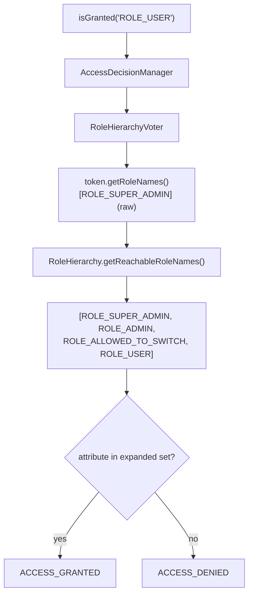

# Role Hierarchy

!!! tip "In a nutshell"
    `security.role_hierarchy` maps roles to the roles they *imply*
    (`ROLE_ADMIN: ROLE_USER`), resolved **transitively** at authorization time.
    Exam hook: `isGranted()` and `access_control` resolve the hierarchy, but
    **`$user->getRoles()` never expands it** — it returns only the stored roles.

!!! example "Real-world analogy"
    Military ranks: a colonel's badge says "colonel" — nothing else. But every
    checkpoint (the access check) knows the chain of command: colonel implies
    major implies captain, so the colonel passes any door a captain may open.
    Read the badge itself (`getRoles()`) and you will only ever see "colonel";
    the *implication* lives in the checkpoint's rulebook, not on the badge.

!!! abstract "Learning objectives"
    By the end of this chapter you can:

    - [ ] Configure `security.role_hierarchy` including multi-parent maps.
    - [ ] Explain transitive resolution (A → B → C means A reaches C).
    - [ ] State exactly where the hierarchy is (and is not) applied.
    - [ ] Use `RoleHierarchyInterface::getReachableRoleNames()` in services.
    - [ ] Describe the `RoleVoter` / `RoleHierarchyVoter` swap.

    **Syllabus:** `Security → Role Hierarchy` ·
    **Level:** Expert ·
    **Est. time:** 20 min ·
    **Prerequisites:** [Roles](roles.md) · [Authorization](authorization.md)

---

## Theory

Instead of granting every admin `ROLE_USER` *and* `ROLE_ADMIN` in the database,
declare that one role **implies** others:

```yaml
security:
    role_hierarchy:
        ROLE_ADMIN: ROLE_USER
        ROLE_SUPER_ADMIN: [ROLE_ADMIN, ROLE_ALLOWED_TO_SWITCH]
```

Resolution is **transitive**: `ROLE_SUPER_ADMIN` reaches `ROLE_ADMIN`, which
reaches `ROLE_USER`, so a super-admin passes `isGranted('ROLE_USER')` while
storing a single role.

```php
// Stored on the user: one single role
$user->getRoles();                              // ['ROLE_SUPER_ADMIN'] — raw

// Authorization time: ROLE_SUPER_ADMIN → ROLE_ADMIN → ROLE_USER (transitive)
$authorizationChecker->isGranted('ROLE_ADMIN'); // true
$authorizationChecker->isGranted('ROLE_USER');  // true — reached through ROLE_ADMIN
```

**Where the hierarchy applies — and where it does not:**

| Check | Hierarchy applied? |
|---|---|
| `isGranted('ROLE_X')` / `#[IsGranted]` / Twig `is_granted()` | ✅ yes |
| `access_control: { roles: ROLE_X }` | ✅ yes |
| `switch_user`'s role requirement | ✅ yes (it is an `isGranted()` call) |
| `$user->getRoles()` / `$token->getRoleNames()` | ❌ **no** — raw stored roles |
| `in_array('ROLE_USER', $user->getRoles())` | ❌ **no** — the classic bug |

That last row is *the* exam trap. The hierarchy is an **authorization-time**
concept: it lives in the voter layer, not in the user object or the token.

## Deep Dive — how it works internally

When `role_hierarchy` is configured, SecurityBundle replaces the plain
`RoleVoter` with a
`Symfony\Component\Security\Core\Authorization\Voter\RoleHierarchyVoter` — a
subclass of `RoleVoter` whose role extraction runs the token's role names
through `Symfony\Component\Security\Core\Role\RoleHierarchy`:

1. `isGranted('ROLE_USER')` reaches the `AccessDecisionManager`.
2. The `RoleHierarchyVoter` takes `$token->getRoleNames()` (raw, e.g.
   `[ROLE_SUPER_ADMIN]`).
3. It calls `RoleHierarchy::getReachableRoleNames()` which walks the configured
   map transitively, producing
   `[ROLE_SUPER_ADMIN, ROLE_ADMIN, ROLE_ALLOWED_TO_SWITCH, ROLE_USER]`.
4. The attribute is matched against that *expanded* set → `ACCESS_GRANTED`.



!!! question "Predict first"
    With `ROLE_ADMIN: ROLE_USER` configured and a user stored with
    `[ROLE_ADMIN]`: what do (a) `isGranted('ROLE_USER')` and (b)
    `in_array('ROLE_USER', $user->getRoles(), true)` return?

??? note "Reveal"
    (a) **true** — the `RoleHierarchyVoter` expands `ROLE_ADMIN` to include
    `ROLE_USER`. (b) **false** — `getRoles()` returns exactly what is stored:
    `['ROLE_ADMIN']`. Any code comparing raw roles bypasses the hierarchy;
    inject `RoleHierarchyInterface` and expand first if you must work with
    role arrays.

!!! note "Source reference"
    `Symfony\Component\Security\Core\Role\RoleHierarchy` —
    [symfony/symfony `8.0`](https://github.com/symfony/symfony/blob/8.0/src/Symfony/Component/Security/Core/Role/RoleHierarchy.php)
    — and
    [`RoleHierarchyVoter`](https://github.com/symfony/symfony/blob/8.0/src/Symfony/Component/Security/Core/Authorization/Voter/RoleHierarchyVoter.php).

### Expanding roles yourself

Outside `isGranted()` — e.g. building an admin UI that lists a user's
*effective* permissions — autowire
`Symfony\Component\Security\Core\Role\RoleHierarchyInterface` and call
`getReachableRoleNames(array $roles): array`. This is the same service the
voter uses, so results always match authorization behaviour.

```php
public function __construct(
    private readonly RoleHierarchyInterface $roleHierarchy, // autowired
) {}

/** @return list<string> */
public function effectiveRoles(UserInterface $user): array
{
    // Same expansion isGranted() relies on internally
    return $this->roleHierarchy->getReachableRoleNames($user->getRoles());
    // ['ROLE_SUPER_ADMIN'] → ['ROLE_SUPER_ADMIN', 'ROLE_ADMIN', ...]
}
```

### Interaction with access_control and voters

`access_control` rules with `roles:` are enforced through the same
`AccessDecisionManager`, so the hierarchy applies there too. Custom voters,
however, receive the raw token — if a custom voter inspects roles itself, it
must inject `RoleHierarchyInterface` or it will silently ignore the hierarchy.

```php
// access_control's "roles:" entries go through the AccessDecisionManager,
// so the hierarchy applies there. A custom voter sees RAW roles instead:
final class ReportVoter extends Voter
{
    public function __construct(private readonly RoleHierarchyInterface $roleHierarchy) {}

    // supports() omitted for brevity
    protected function voteOnAttribute(string $attribute, mixed $subject, TokenInterface $token): bool
    {
        // Expand manually — otherwise roles granted via the hierarchy are missed
        $roles = $this->roleHierarchy->getReachableRoleNames($token->getRoleNames());

        return \in_array('ROLE_EMPLOYEE', $roles, true);
    }
}
```

## Configuration & code

=== "YAML"

    ```yaml
    # config/packages/security.yaml
    security:
        role_hierarchy:
            ROLE_ADMIN: ROLE_USER
            ROLE_SUPER_ADMIN: [ROLE_ADMIN, ROLE_ALLOWED_TO_SWITCH]

        access_control:
            - { path: ^/admin, roles: ROLE_ADMIN }   # super-admins pass too
    ```

=== "PHP"

    ```php
    <?php
    // config/packages/security.php
    declare(strict_types=1);

    use Symfony\Config\SecurityConfig;

    return static function (SecurityConfig $security): void {
        $security->roleHierarchy('ROLE_ADMIN', ['ROLE_USER']);
        $security->roleHierarchy('ROLE_SUPER_ADMIN', ['ROLE_ADMIN', 'ROLE_ALLOWED_TO_SWITCH']);
    };
    ```

=== "PHP (expanding in a service)"

    ```php
    <?php
    declare(strict_types=1);

    namespace App\Security;

    use Symfony\Component\Security\Core\Role\RoleHierarchyInterface;
    use Symfony\Component\Security\Core\User\UserInterface;

    final class EffectiveRoles
    {
        public function __construct(
            private readonly RoleHierarchyInterface $roleHierarchy,
        ) {
        }

        /** @return list<string> every role the user effectively has */
        public function forUser(UserInterface $user): array
        {
            // getRoles() is raw; expand it the same way the voter does
            return $this->roleHierarchy->getReachableRoleNames($user->getRoles());
        }
    }
    ```

## Best practices & anti-patterns

| ✅ Do | ❌ Avoid |
|---|---|
| Store one "job" role per user; derive the rest | Persisting `ROLE_USER` on every admin row |
| Check permissions with `isGranted()` | `in_array(...)` on `$user->getRoles()` |
| Inject `RoleHierarchyInterface` when you need the expanded list | Re-implementing the map in PHP |
| Keep the hierarchy shallow and readable | Deep chains nobody can reason about |

## When (not) to use it / alternatives

Use it whenever roles form an "includes" relationship — it keeps the database
minimal and the mental model in one config block. Do **not** stretch it into a
permission system: fine-grained, per-object rules belong to
[voters](voters.md). If two roles merely *overlap* without one implying the
other, model the shared ability as a third role both imply, rather than
forcing an artificial parent/child link.

!!! danger "Certification traps"
    - **`$user->getRoles()` does NOT apply the hierarchy** — only access checks
      (`isGranted()`, `access_control`, `#[IsGranted]`) do.
    - Resolution is **transitive**: `A: B` + `B: C` means A reaches C.
    - The expansion service is `RoleHierarchyInterface::getReachableRoleNames()`
      (note the plural *Names* — it takes and returns string arrays).
    - With a hierarchy configured, the built-in role voter is the
      **`RoleHierarchyVoter`** (a `RoleVoter` subclass), not a separate mechanism.
    - The hierarchy is global (`security.role_hierarchy`), **not** per firewall.

!!! warning "Common mistakes"
    - Writing `in_array('ROLE_USER', $user->getRoles(), true)` in business code
      and wondering why admins are rejected.
    - Expecting a custom voter to see expanded roles — it must inject
      `RoleHierarchyInterface` itself.

## Exercises

1. **(Advanced)** Configure a hierarchy where `ROLE_SUPER_ADMIN` can do
   everything `ROLE_ADMIN` can, may impersonate users, and `ROLE_ADMIN` implies
   `ROLE_USER`. Then list the reachable roles of a user stored with
   `[ROLE_SUPER_ADMIN]`.
2. **(Expert)** A custom voter denies managers because it checks
   `$token->getRoleNames()` for `ROLE_EMPLOYEE`, which managers only have via
   the hierarchy. Fix it.

??? success "Solutions"

    **1.** `ROLE_ADMIN: ROLE_USER` and
    `ROLE_SUPER_ADMIN: [ROLE_ADMIN, ROLE_ALLOWED_TO_SWITCH]`. Reachable set:
    `ROLE_SUPER_ADMIN`, `ROLE_ADMIN`, `ROLE_ALLOWED_TO_SWITCH`, `ROLE_USER`.

    **2.** Inject `RoleHierarchyInterface` into the voter and test
    `in_array('ROLE_EMPLOYEE', $this->roleHierarchy->getReachableRoleNames($token->getRoleNames()), true)`
    — or simpler, delegate to the injected `AccessDecisionManagerInterface` /
    `AuthorizationCheckerInterface` with `isGranted('ROLE_EMPLOYEE')`.

## Certification questions

??? question "Q1. `ROLE_ADMIN: ROLE_USER` is configured; the user entity stores `[ROLE_ADMIN]`. What does `$user->getRoles()` return?"
    - [ ] A. `['ROLE_ADMIN', 'ROLE_USER']`
    - [x] B. `['ROLE_ADMIN']` — the hierarchy is never applied there ✅
    - [ ] C. `['ROLE_USER']`
    - [ ] D. Depends on the firewall

    **Why:** The hierarchy is resolved only during access checks by the
    `RoleHierarchyVoter`; `getRoles()` is your own raw data.
    **Ref:** [Hierarchical roles](https://symfony.com/doc/8.0/security.html#hierarchical-roles).

??? question "Q2. Which service expands a set of roles the way access checks do?"
    - [ ] A. `TokenStorageInterface`
    - [ ] B. `AuthenticationUtils`
    - [x] C. `RoleHierarchyInterface::getReachableRoleNames()` ✅
    - [ ] D. `UserProviderInterface::refreshUser()`

    **Why:** `RoleHierarchy` walks the configured map transitively; the
    `RoleHierarchyVoter` uses the very same service.
    **Ref:** [RoleHierarchy](https://github.com/symfony/symfony/blob/8.0/src/Symfony/Component/Security/Core/Role/RoleHierarchy.php).

??? question "Q3. With `ROLE_A: ROLE_B` and `ROLE_B: ROLE_C`, does a user holding only ROLE_A pass `isGranted('ROLE_C')`?"
    - [x] A. Yes — resolution is transitive ✅
    - [ ] B. No — only direct children are reachable
    - [ ] C. Only if `ROLE_A: [ROLE_B, ROLE_C]` is written explicitly
    - [ ] D. Only inside access_control, not isGranted()

    **Why:** `getReachableRoleNames()` follows the map recursively, and both
    `isGranted()` and `access_control` use it via the voter.
    **Ref:** [Hierarchical roles](https://symfony.com/doc/8.0/security.html#hierarchical-roles).

??? question "Q4. Which voter enforces roles when a hierarchy is configured?"
    - [ ] A. `AuthenticatedVoter`
    - [ ] B. `ExpressionVoter`
    - [x] C. `RoleHierarchyVoter` (replacing the plain `RoleVoter`) ✅
    - [ ] D. A compiled hierarchy inside the token

    **Why:** SecurityBundle wires `RoleHierarchyVoter`, a `RoleVoter` subclass
    that expands the token's roles before matching; nothing is added to the
    token itself.
    **Ref:** [RoleHierarchyVoter](https://github.com/symfony/symfony/blob/8.0/src/Symfony/Component/Security/Core/Authorization/Voter/RoleHierarchyVoter.php).

## Key takeaways

- `security.role_hierarchy` declares role implications, resolved transitively.
- The hierarchy applies in `isGranted()`, `#[IsGranted]`, Twig and
  `access_control` — never in `$user->getRoles()`/`$token->getRoleNames()`.
- `RoleHierarchyInterface::getReachableRoleNames()` is the expansion API for
  your own services and voters.
- Under the hood: `RoleHierarchyVoter` (subclass of `RoleVoter`) expands roles
  before matching the attribute.
- Store minimal roles; derive the rest — the map is config, not data.

## Last-minute revision

!!! tip "Cheat sheet"
    - Config: `security.role_hierarchy: { ROLE_ADMIN: ROLE_USER, ... }`.
    - Transitive: A→B→C ⇒ A reaches C.
    - `isGranted()` expands · `getRoles()` does **not**.
    - Manual expansion: `RoleHierarchyInterface->getReachableRoleNames()`.
    - Voter swap: `RoleVoter` → `RoleHierarchyVoter`.

## Connections

- **Depends on:** [Roles](roles.md) — the raw strings the hierarchy expands.
- **Reused in:** [Access Control Rules](access-control.md) — `roles:` entries
  are matched against the expanded set.
- **Reused in:** [User Impersonation](impersonation.md) —
  `ROLE_ALLOWED_TO_SWITCH` is usually granted through the hierarchy.
- **Confused with:** [Voters](voters.md) — the hierarchy is coarse role
  implication; voters are per-object decisions (and see the raw token).

## Official References
- [Symfony docs — Hierarchical roles](https://symfony.com/doc/8.0/security.html#hierarchical-roles)
- [Symfony source — RoleHierarchy](https://github.com/symfony/symfony/blob/8.0/src/Symfony/Component/Security/Core/Role/RoleHierarchy.php)
- [Symfony source — RoleHierarchyVoter](https://github.com/symfony/symfony/blob/8.0/src/Symfony/Component/Security/Core/Authorization/Voter/RoleHierarchyVoter.php)

## Video references

!!! tip "Watch & learn"
    These are official, continuously-updated video channels — search them for
    "Symfony security" to reinforce this chapter. We link stable channels rather than
    individual videos so the references never rot.

    - [SymfonyCasts screencasts](https://symfonycasts.com/tracks/symfony) — scripted, code-along tutorials.
    - [Symfony official YouTube](https://www.youtube.com/@SymfonyOfficial) — SymfonyCon conference talks & keynotes.
    - [Official docs for this topic](https://symfony.com/doc/8.0/security.html#hierarchical-roles) — some Symfony doc pages embed a screencast.

## Confidence check

I'm ready when I can:

- [ ] explain **why** hierarchies keep stored roles minimal
- [ ] configure a multi-parent, transitive hierarchy in Symfony 8
- [ ] debug "admin lacks ROLE_USER" caused by raw `getRoles()` checks
- [ ] spot the `isGranted()` vs `getRoles()` trap instantly
- [ ] explain internals: `RoleHierarchyVoter` + `getReachableRoleNames()`

---

<small>Related: [Roles](roles.md) · [Authorization](authorization.md) ·
[Voters](voters.md)</small>
