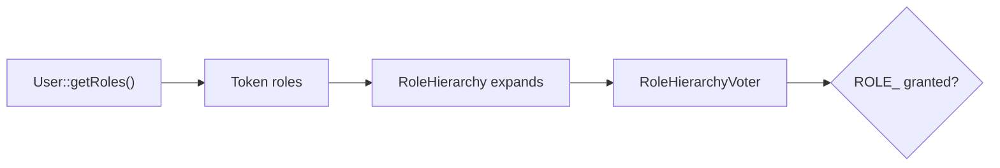

# Roles

!!! tip "In a nutshell"
    Un role est une chaîne préfixée par `ROLE_`, portée par le token et étendue par
    `role_hierarchy` avant le vote.
    Piège d'examen : `IS_AUTHENTICATED_*` et `PUBLIC_ACCESS` ne sont **pas** des roles
    (ils sont gérés par l'`AuthenticatedVoter`), et `IS_AUTHENTICATED_ANONYMOUSLY` a été
    remplacé par `PUBLIC_ACCESS`.

!!! example "Real-world analogy"
    Les roles sont des niveaux d'habilitation imprimés sur votre badge. L'habilitation
    « Admin » implique l'habilitation « User », de la même façon que le badge d'un manager
    ouvre aussi toutes les portes du personnel — cet héritage, c'est la **role hierarchy**.
    `IS_AUTHENTICATED_FULLY` n'est pas un niveau ; c'est *la fraîcheur* de votre dernier
    badgeage.

!!! abstract "Learning objectives"
    À la fin de ce chapitre, vous saurez :

    - [ ] Appliquer la convention `ROLE_` et configurer `role_hierarchy`.
    - [ ] Utiliser les attributs spéciaux `IS_AUTHENTICATED_*` et `PUBLIC_ACCESS`.
    - [ ] Expliquer comment les roles arrivent sur le token et sont étendus avant le vote.

    **Syllabus:** `Security → Roles` ·
    **Level:** Advanced → Expert ·
    **Est. time:** 25 min ·
    **Prerequisites:** [Authorization](authorization.md) · [Users](users.md)

---

## Theory

Un **role** est une simple chaîne de caractères portée par l'utilisateur et le token.
Par convention, elle **doit commencer par `ROLE_`** — le `RoleVoter` ne vote que sur
les attributs qui portent ce préfixe. Tout le reste (`EDIT`, `IS_AUTHENTICATED_FULLY`)
est géré par d'autres voters.

```php
// RoleVoter only votes on attributes starting with the ROLE_ prefix
$authChecker->isGranted('ROLE_ADMIN');             // RoleVoter decides
$authChecker->isGranted('EDIT', $post);            // RoleVoter abstains → custom voter
$authChecker->isGranted('IS_AUTHENTICATED_FULLY'); // AuthenticatedVoter decides
```

Les roles proviennent de `UserInterface::getRoles()`. Bonne pratique : incluez toujours
`ROLE_USER` pour tout utilisateur authentifié, et laissez la **hiérarchie** ajouter le
reste.

```php
// UserInterface::getRoles() — always guarantee ROLE_USER for logged-in users
public function getRoles(): array
{
    return array_unique([...$this->roles, 'ROLE_USER']); // hierarchy adds the rest
}
```

!!! question "Predict first"
    Un utilisateur possède `ROLE_USER` et la hiérarchie indique `ROLE_ADMIN: [ROLE_USER]`.
    `is_granted('ROLE_ADMIN')` est-il vrai pour lui ?

??? note "Reveal"
    Non. La hiérarchie s'applique **vers le bas** : posséder `ROLE_ADMIN` permet
    d'atteindre `ROLE_USER`, pas l'inverse. L'ensemble atteignable d'un utilisateur
    `ROLE_USER` se limite à `{ROLE_USER}`, donc la vérification admin renvoie `false`.

## Deep Dive — how it works internally

### From user to token to voter



1. `getRoles()` renvoie les roles bruts.
2. Ils sont stockés sur le `TokenInterface`.
3. Lors de l'autorisation d'un attribut `ROLE_*`, le `RoleHierarchyVoter`
   (`Symfony\Component\Security\Core\Authorization\Voter\RoleHierarchyVoter`)
   étend d'abord les roles du token via la `RoleHierarchy`
   (`getReachableRoleNames()`), puis vérifie l'appartenance.

Ainsi, si `ROLE_ADMIN: [ROLE_USER]` et que l'utilisateur possède `ROLE_ADMIN`,
l'ensemble atteignable est `{ROLE_ADMIN, ROLE_USER}` — `is_granted('ROLE_USER')`
vaut `true`.

!!! note "Source reference"
    `Symfony\Component\Security\Core\Role\RoleHierarchy::getReachableRoleNames()`
    — [symfony/symfony `8.0`](https://github.com/symfony/symfony/blob/8.0/src/Symfony/Component/Security/Core/Role/RoleHierarchy.php).

### The `IS_AUTHENTICATED_*` special attributes

Ce ne sont **pas des roles** — ils sont gérés par l'`AuthenticatedVoter`
(`Symfony\Component\Security\Core\Authorization\Voter\AuthenticatedVoter`) en
fonction de *la manière* dont le token a été obtenu, pas de `getRoles()` :

| Attribute | Accordé quand |
|---|---|
| `PUBLIC_ACCESS` | Toujours (même anonyme) — exclut un chemin de l'authentification |
| `IS_AUTHENTICATED_FULLY` | Authentifié **dans cette session** (pas via remember-me) |
| `IS_AUTHENTICATED_REMEMBERED` | Pleinement **ou** via un cookie remember-me |
| `IS_AUTHENTICATED` | Authentifié par n'importe quel moyen (remember-me compris) |
| `IS_REMEMBERED` | Uniquement via remember-me |
| `IS_IMPERSONATOR` | Le token est un `SwitchUserToken` (impersonation en cours) |

`IS_AUTHENTICATED_REMEMBERED` est **plus large** que `IS_AUTHENTICATED_FULLY` :
les utilisateurs pleinement authentifiés satisfont les deux, les utilisateurs
remember-me ne satisfont que le premier. Utilisez `_REMEMBERED` pour « connecté,
peu importe comment », et `_FULLY` pour les actions sensibles (changement de mot
de passe, paiement) qui ne doivent pas accepter un cookie remember-me.

```yaml
security:
    access_control:
        # _FULLY: sensitive action — a remember-me cookie is not enough
        - { path: ^/account/password, roles: IS_AUTHENTICATED_FULLY }
        # _REMEMBERED: "logged in at all" (fresh login OR remember-me)
        - { path: ^/account, roles: IS_AUTHENTICATED_REMEMBERED }
```

!!! info "No more `IS_AUTHENTICATED_ANONYMOUSLY`"
    Symfony 8 n'a **plus de tokens anonymes**. L'ancien
    `IS_AUTHENTICATED_ANONYMOUSLY` est remplacé par **`PUBLIC_ACCESS`** pour
    « tout le monde, y compris les non-connectés ».

### Where roles are configured, not the hierarchy

`role_hierarchy` se trouve dans `security.yaml` et est compilé dans le service
`security.role_hierarchy`. C'est une correspondance statique — elle ne peut pas
dépendre de l'instance de l'utilisateur. La logique par objet relève des
[voters](voters.md), pas des roles.

## Configuration & code

=== "YAML"

    ```yaml
    # config/packages/security.yaml
    security:
        role_hierarchy:
            ROLE_ADMIN:       [ROLE_USER]
            ROLE_SUPER_ADMIN: [ROLE_ADMIN, ROLE_ALLOWED_TO_SWITCH]

        access_control:
            - { path: ^/login,   roles: PUBLIC_ACCESS }
            - { path: ^/account, roles: IS_AUTHENTICATED_FULLY }
            - { path: ^/admin,   roles: ROLE_ADMIN }
    ```

=== "PHP Attributes"

    ```php
    <?php
    declare(strict_types=1);

    namespace App\Controller;

    use Symfony\Bundle\FrameworkBundle\Controller\AbstractController;
    use Symfony\Component\HttpFoundation\Response;
    use Symfony\Component\Routing\Attribute\Route;
    use Symfony\Component\Security\Http\Attribute\IsGranted;

    final class SecurityController extends AbstractController
    {
        #[Route('/password/change', name: 'password_change')]
        #[IsGranted('IS_AUTHENTICATED_FULLY')]   // reject remember-me sessions
        public function changePassword(): Response
        {
            return $this->render('security/change_password.html.twig');
        }
    }
    ```

=== "Twig"

    ```twig
    
        Hello {{ app.user.userIdentifier }}
    
        <a href="{{ path('app_login') }}">Sign in</a>
    
    ```

## Best practices & anti-patterns

| ✅ Do | ❌ Avoid |
|---|---|
| Préfixer les roles par `ROLE_` | Voter sur `ADMIN` (sans préfixe → le RoleVoter l'ignore) |
| Modéliser l'héritage dans `role_hierarchy` | Dupliquer les roles chez chaque utilisateur |
| `_FULLY` pour les actions sensibles | Accepter le remember-me pour les paiements |
| `PUBLIC_ACCESS` pour les chemins ouverts | Utiliser un `ANONYMOUSLY` supprimé |

## When (not) to use it / alternatives

Les roles expriment des **capacités grossières** ; la hiérarchie exprime
l'**héritage**. Quand une décision dépend de l'objet ciblé ou de l'état à
l'exécution, utilisez plutôt un attribut de [voter](voters.md) — les roles ne
voient pas de sujet.

!!! danger "Certification traps"
    - `IS_AUTHENTICATED_REMEMBERED` est aussi satisfait par les utilisateurs
      **pleinement authentifiés** ; `IS_AUTHENTICATED_FULLY` est le plus strict.
    - `IS_AUTHENTICATED_*` et `PUBLIC_ACCESS` ne sont **pas des roles** — c'est
      l'`AuthenticatedVoter` qui les gère, pas le `RoleVoter`.
    - **`IS_AUTHENTICATED_ANONYMOUSLY` n'existe plus** en Symfony 8 ; utilisez
      `PUBLIC_ACCESS`.
    - Un role sans le préfixe `ROLE_` est **silencieusement ignoré** par le
      `RoleVoter`.

!!! warning "Common mistakes"
    - S'attendre à ce que `role_hierarchy` accorde `ROLE_ADMIN` parce qu'un
      utilisateur possède `ROLE_USER` — la hiérarchie s'applique vers le bas, pas
      vers le haut.
    - Ajouter des roles au token à la main au lieu de passer par `getRoles()` +
      la hiérarchie.

## Exercises

1. **(Advanced)** Construisez une hiérarchie où `ROLE_SUPER_ADMIN` implique à la
   fois `ROLE_ADMIN` et `ROLE_USER`.
2. **(Expert)** Choisissez l'attribut correct pour protéger une action « changer
   d'email » contre les sessions remember-me, et justifiez votre choix.

??? success "Solutions"

    **1.**
    ```yaml
    role_hierarchy:
        ROLE_ADMIN:       [ROLE_USER]
        ROLE_SUPER_ADMIN: [ROLE_ADMIN]   # transitively reaches ROLE_USER
    ```

    **2.** `IS_AUTHENTICATED_FULLY`. Un cookie remember-me peut être volé ; les
    changements d'identité sensibles doivent exiger une authentification complète
    et récente, ce que `_FULLY` garantit et que `_REMEMBERED` ne garantit pas.

## Certification questions

??? question "Q1. Which attribute is broader?"
    - [x] A. `IS_AUTHENTICATED_REMEMBERED` (includes fully-authenticated) ✅
    - [ ] B. `IS_AUTHENTICATED_FULLY`
    - [ ] C. They are equal
    - [ ] D. Neither implies the other

    **Why:** Les utilisateurs pleinement authentifiés satisfont aussi
    `_REMEMBERED` ; l'inverse n'est pas vrai.
    **Ref:** [Special attributes](https://symfony.com/doc/current/security.html#security-authorization-access-decision).

??? question "Q2. In Symfony 8, 'allow everyone including anonymous' uses…"
    - [ ] A. `IS_AUTHENTICATED_ANONYMOUSLY`
    - [x] B. `PUBLIC_ACCESS` ✅
    - [ ] C. `ROLE_ANONYMOUS`
    - [ ] D. `IS_ANONYMOUS`

    **Why:** Les tokens anonymes ont disparu ; `PUBLIC_ACCESS` exclut un chemin
    de l'authentification.
    **Ref:** [Access control](https://symfony.com/doc/current/security.html).

??? question "Q3. A role `EDITOR` (no prefix) is checked with `is_granted('EDITOR')`. Result via RoleVoter?"
    - [ ] A. Granted if the user has it
    - [x] B. Ignored — `RoleVoter` only handles `ROLE_`-prefixed attributes ✅
    - [ ] C. Always denied
    - [ ] D. Throws

    **Why:** Le `RoleVoter` ne prend en charge que `ROLE_*` ; les chaînes sans
    préfixe donnent lieu à une abstention (un voter personnalisé peut néanmoins
    les gérer).
    **Ref:** [Roles](https://symfony.com/doc/current/security.html#roles).

## Key takeaways

- Les roles sont des chaînes préfixées par `ROLE_` issues de `getRoles()`, étendues par la hiérarchie.
- Le `RoleHierarchyVoter` étend les roles atteignables avant de vérifier l'appartenance.
- `IS_AUTHENTICATED_*`/`PUBLIC_ACCESS` sont des attributs de l'`AuthenticatedVoter`, pas des roles.
- `_REMEMBERED` ⊇ `_FULLY` ; plus de `ANONYMOUSLY` en Symfony 8.

## Last-minute revision

!!! tip "Cheat sheet"
    - Préfixe `ROLE_` obligatoire pour le `RoleVoter`.
    - La hiérarchie va vers le bas : `ROLE_ADMIN: [ROLE_USER]`.
    - `PUBLIC_ACCESS` = tout le monde ; `IS_AUTHENTICATED_FULLY` = strict ; `_REMEMBERED` = plus souple.
    - `IS_IMPERSONATOR` sur un `SwitchUserToken`.

## Connections

- **Depends on:** [Users](users.md) — les roles proviennent de
  `UserInterface::getRoles()`.
- **Reused in:** [Authorization](authorization.md) — le `RoleHierarchyVoter` vote sur
  les attributs `ROLE_*`.
- **Reused in:** [Access Control Rules](access-control.md) — `roles:` dans une règle
  est une vérification de role.
- **Confused with:** [Voters](voters.md) — les roles n'ont pas de sujet ; les règles
  par objet nécessitent un voter.

## Official References
- [Symfony docs — Roles](https://symfony.com/doc/current/security.html#roles)
- [Symfony docs — Role hierarchy](https://symfony.com/doc/current/security.html#hierarchical-roles)
- [Symfony source — RoleHierarchy](https://github.com/symfony/symfony/blob/8.0/src/Symfony/Component/Security/Core/Role/RoleHierarchy.php)

## Video references

!!! tip "Watch & learn"
    Voici des chaînes vidéo officielles et mises à jour en continu — cherchez-y
    « Symfony security » pour consolider ce chapitre. Nous lions des chaînes stables
    plutôt que des vidéos individuelles pour que les références ne périment jamais.

    - [SymfonyCasts screencasts](https://symfonycasts.com/tracks/symfony) — tutoriels scénarisés à suivre en codant.
    - [Symfony official YouTube](https://www.youtube.com/@SymfonyOfficial) — conférences et keynotes des SymfonyCon.
    - [Official docs for this topic](https://symfony.com/doc/current/security.html#security-authorization-access-decision) — certaines pages de la doc Symfony intègrent un screencast.

## Confidence check

Je suis prêt quand je peux :

- [ ] expliquer **pourquoi** les roles ont besoin du préfixe `ROLE_` pour le `RoleVoter`
- [ ] configurer `role_hierarchy` et choisir entre `_FULLY` et `_REMEMBERED`
- [ ] déboguer une hiérarchie qu'on attend dans le mauvais sens
- [ ] repérer que `IS_AUTHENTICATED_*`/`PUBLIC_ACCESS` ne sont pas des roles
- [ ] expliquer comment le `RoleHierarchyVoter` étend les roles atteignables en interne

---

<small>Related: [Authorization](authorization.md) · [Voters & Voting Strategies](voters.md) ·
[Access Control Rules](access-control.md) · [Users](users.md)</small>
