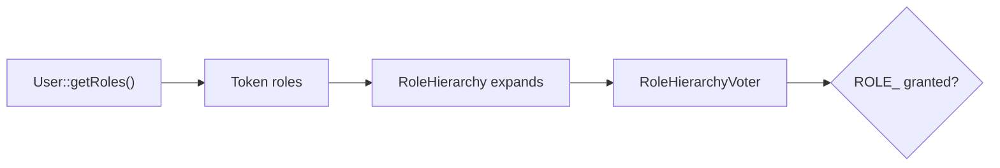

# Roles

!!! tip "In a nutshell"
    A role is a `ROLE_`-prefixed string carried on the token and expanded by
    `role_hierarchy` before voting.
    Exam hook: `IS_AUTHENTICATED_*` and `PUBLIC_ACCESS` are **not** roles (handled
    by `AuthenticatedVoter`), and `IS_AUTHENTICATED_ANONYMOUSLY` was replaced by
    `PUBLIC_ACCESS`.

!!! example "Real-world analogy"
    Roles are clearance tiers printed on your badge. "Admin" clearance implies
    "User" clearance the way a manager's keycard also opens every staff door —
    that inheritance is the **role hierarchy**. `IS_AUTHENTICATED_FULLY` is not a
    tier; it is *how recently* you badged in.

!!! abstract "Learning objectives"
    By the end of this chapter you can:

    - [ ] Apply the `ROLE_` convention and configure `role_hierarchy`.
    - [ ] Use the `IS_AUTHENTICATED_*` special attributes and `PUBLIC_ACCESS`.
    - [ ] Explain how roles reach the token and get expanded before voting.

    **Syllabus:** `Security → Roles` ·
    **Level:** Advanced → Expert ·
    **Est. time:** 25 min ·
    **Prerequisites:** [Authorization](authorization.md) · [Users](users.md)

---

## Theory

A **role** is a plain string carried by the user and the token. By convention it
**must start with `ROLE_`** — the `RoleVoter` only votes on attributes with that
prefix. Anything else (`EDIT`, `IS_AUTHENTICATED_FULLY`) is handled by other
voters.

Roles come from `UserInterface::getRoles()`. Best practice: always include
`ROLE_USER` for any authenticated user, and let the **hierarchy** add the rest.

## Deep Dive — how it works internally

### From user to token to voter



1. `getRoles()` returns the raw roles.
2. They are stored on the `TokenInterface`.
3. When authorizing a `ROLE_*` attribute, the `RoleHierarchyVoter`
   (`Symfony\Component\Security\Core\Authorization\Voter\RoleHierarchyVoter`)
   first expands the token's roles through the `RoleHierarchy`
   (`getReachableRoleNames()`), then checks membership.

So if `ROLE_ADMIN: [ROLE_USER]` and the user has `ROLE_ADMIN`, the reachable set
is `{ROLE_ADMIN, ROLE_USER}` — `is_granted('ROLE_USER')` is `true`.

!!! note "Source reference"
    `Symfony\Component\Security\Core\Role\RoleHierarchy::getReachableRoleNames()`
    — [symfony/symfony `8.0`](https://github.com/symfony/symfony/blob/8.0/src/Symfony/Component/Security/Core/Role/RoleHierarchy.php).

### The `IS_AUTHENTICATED_*` special attributes

These are **not roles** — they are handled by the `AuthenticatedVoter`
(`Symfony\Component\Security\Core\Authorization\Voter\AuthenticatedVoter`) based
on *how* the token was obtained, not on `getRoles()`:

| Attribute | Granted when |
|---|---|
| `PUBLIC_ACCESS` | Always (even anonymous) — opts a path out of auth |
| `IS_AUTHENTICATED_FULLY` | Authenticated **this session** (not remember-me) |
| `IS_AUTHENTICATED_REMEMBERED` | Fully **or** via remember-me cookie |
| `IS_AUTHENTICATED` | Authenticated by any means (incl. remember-me) |
| `IS_REMEMBERED` | Only via remember-me |
| `IS_IMPERSONATOR` | The token is a `SwitchUserToken` (impersonating) |

`IS_AUTHENTICATED_REMEMBERED` is **broader** than `IS_AUTHENTICATED_FULLY`:
fully-authenticated users satisfy both, remember-me users satisfy only the
former. Use `_REMEMBERED` for "logged in at all", `_FULLY` for sensitive actions
(change password, payment) that must not accept a remember-me cookie.

!!! info "No more `IS_AUTHENTICATED_ANONYMOUSLY`"
    Symfony 8 has **no anonymous tokens**. The old
    `IS_AUTHENTICATED_ANONYMOUSLY` is replaced by **`PUBLIC_ACCESS`** for
    "everyone, including not-logged-in".

### Where roles are configured, not the hierarchy

`role_hierarchy` lives in `security.yaml` and compiles into the
`security.role_hierarchy` service. It is a static map — it cannot depend on the
user instance. Per-object logic belongs in [voters](voters.md), not roles.

## Configuration & code

=== "YAML"

    ```yaml
    # config/packages/security.yaml
    security:
        role_hierarchy:
            ROLE_ADMIN:       [ROLE_USER]
            ROLE_SUPER_ADMIN: [ROLE_ADMIN, ROLE_ALLOWED_TO_SWITCH]

        access_control:
            - { path: ^/login,   roles: PUBLIC_ACCESS }
            - { path: ^/account, roles: IS_AUTHENTICATED_FULLY }
            - { path: ^/admin,   roles: ROLE_ADMIN }
    ```

=== "PHP Attributes"

    ```php
    <?php
    declare(strict_types=1);

    namespace App\Controller;

    use Symfony\Bundle\FrameworkBundle\Controller\AbstractController;
    use Symfony\Component\HttpFoundation\Response;
    use Symfony\Component\Routing\Attribute\Route;
    use Symfony\Component\Security\Http\Attribute\IsGranted;

    final class SecurityController extends AbstractController
    {
        #[Route('/password/change', name: 'password_change')]
        #[IsGranted('IS_AUTHENTICATED_FULLY')]   // reject remember-me sessions
        public function changePassword(): Response
        {
            return $this->render('security/change_password.html.twig');
        }
    }
    ```

=== "Twig"

    ```twig
    
        Hello {{ app.user.userIdentifier }}
    
        <a href="{{ path('app_login') }}">Sign in</a>
    
    ```

## Best practices & anti-patterns

| ✅ Do | ❌ Avoid |
|---|---|
| Prefix roles with `ROLE_` | Voting on `ADMIN` (no prefix → RoleVoter ignores) |
| Model inheritance in `role_hierarchy` | Duplicating roles in every user |
| `_FULLY` for sensitive actions | Accepting remember-me for payments |
| `PUBLIC_ACCESS` for open paths | Reaching for a removed `ANONYMOUSLY` |

## When (not) to use it / alternatives

Roles express **coarse capabilities**; the hierarchy expresses **inheritance**.
When a decision depends on the target object or runtime state, use a
[voter](voters.md) attribute instead — roles cannot see a subject.

!!! danger "Certification traps"
    - `IS_AUTHENTICATED_REMEMBERED` is satisfied by **fully-authenticated** users
      too; `IS_AUTHENTICATED_FULLY` is the stricter one.
    - `IS_AUTHENTICATED_*` and `PUBLIC_ACCESS` are **not roles** — the
      `AuthenticatedVoter` handles them, not `RoleVoter`.
    - **`IS_AUTHENTICATED_ANONYMOUSLY` no longer exists** in Symfony 8; use
      `PUBLIC_ACCESS`.
    - A role without the `ROLE_` prefix is **silently ignored** by `RoleVoter`.

!!! warning "Common mistakes"
    - Expecting `role_hierarchy` to grant `ROLE_ADMIN` because a user has
      `ROLE_USER` — hierarchy flows downward, not upward.
    - Adding roles to the token by hand instead of via `getRoles()` + hierarchy.

## Exercises

1. **(Advanced)** Build a hierarchy where `ROLE_SUPER_ADMIN` implies both
   `ROLE_ADMIN` and `ROLE_USER`.
2. **(Expert)** Choose the correct attribute to protect a "change email"
   action against remember-me sessions, and justify it.

??? success "Solutions"

    **1.**
    ```yaml
    role_hierarchy:
        ROLE_ADMIN:       [ROLE_USER]
        ROLE_SUPER_ADMIN: [ROLE_ADMIN]   # transitively reaches ROLE_USER
    ```

    **2.** `IS_AUTHENTICATED_FULLY`. A remember-me cookie can be stolen; sensitive
    identity changes must require a fresh, full authentication, which `_FULLY`
    guarantees and `_REMEMBERED` does not.

## Certification questions

??? question "Q1. Which attribute is broader?"
    - [x] A. `IS_AUTHENTICATED_REMEMBERED` (includes fully-authenticated) ✅
    - [ ] B. `IS_AUTHENTICATED_FULLY`
    - [ ] C. They are equal
    - [ ] D. Neither implies the other

    **Why:** Fully-authenticated users also satisfy `_REMEMBERED`; the reverse is
    not true.
    **Ref:** [Special attributes](https://symfony.com/doc/current/security.html#security-authorization-access-decision).

??? question "Q2. In Symfony 8, 'allow everyone including anonymous' uses…"
    - [ ] A. `IS_AUTHENTICATED_ANONYMOUSLY`
    - [x] B. `PUBLIC_ACCESS` ✅
    - [ ] C. `ROLE_ANONYMOUS`
    - [ ] D. `IS_ANONYMOUS`

    **Why:** Anonymous tokens are gone; `PUBLIC_ACCESS` opts a path out of auth.
    **Ref:** [Access control](https://symfony.com/doc/current/security.html).

??? question "Q3. A role `EDITOR` (no prefix) is checked with `is_granted('EDITOR')`. Result via RoleVoter?"
    - [ ] A. Granted if the user has it
    - [x] B. Ignored — `RoleVoter` only handles `ROLE_`-prefixed attributes ✅
    - [ ] C. Always denied
    - [ ] D. Throws

    **Why:** `RoleVoter` supports only `ROLE_*`; unprefixed strings abstain there
    (a custom voter could still handle them).
    **Ref:** [Roles](https://symfony.com/doc/current/security.html#roles).

## Key takeaways

- Roles are `ROLE_`-prefixed strings from `getRoles()`, expanded by the hierarchy.
- `RoleHierarchyVoter` expands reachable roles before checking membership.
- `IS_AUTHENTICATED_*`/`PUBLIC_ACCESS` are `AuthenticatedVoter` attributes, not roles.
- `_REMEMBERED` ⊇ `_FULLY`; no more `ANONYMOUSLY` in Symfony 8.

## Last-minute revision

!!! tip "Cheat sheet"
    - `ROLE_` prefix required for `RoleVoter`.
    - Hierarchy is downward: `ROLE_ADMIN: [ROLE_USER]`.
    - `PUBLIC_ACCESS` = everyone; `IS_AUTHENTICATED_FULLY` = strict; `_REMEMBERED` = looser.
    - `IS_IMPERSONATOR` on a `SwitchUserToken`.

## Official References
- [Symfony docs — Roles](https://symfony.com/doc/current/security.html#roles)
- [Symfony docs — Role hierarchy](https://symfony.com/doc/current/security.html#hierarchical-roles)
- [Symfony source — RoleHierarchy](https://github.com/symfony/symfony/blob/8.0/src/Symfony/Component/Security/Core/Role/RoleHierarchy.php)

---

<small>Related: [Authorization](authorization.md) · [Voters & Voting Strategies](voters.md) ·
[Access Control Rules](access-control.md) · [Users](users.md)</small>
