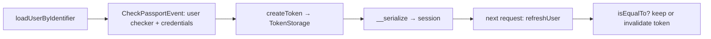

# Users

!!! tip "In a nutshell"
    Un user est tout objet implémentant `UserInterface`, qui en Symfony 8 ne compte
    que **deux** méthodes : `getRoles()` et `getUserIdentifier()`.
    Piège d'examen : `eraseCredentials()` a été **supprimée** en 8.0 — retirez les
    secrets dans `__serialize()` à la place.

!!! example "Real-world analogy"
    Un user est la fiche d'identité au dossier : un nom qui ne change jamais
    (`getUserIdentifier()`) et une liste d'habilitations (`getRoles()`). Elle dit
    *qui vous êtes et à quoi vous pouvez accéder* — pas *comment* vous l'avez
    prouvé à l'entrée. Les notes sensibles (le mot de passe) sont détruites avant
    l'archivage du dossier (`__serialize()`).

!!! abstract "Learning objectives"
    À la fin de ce chapitre, vous saurez :

    - [ ] Implémenter `UserInterface` et `PasswordAuthenticatedUserInterface`.
    - [ ] Expliquer `getUserIdentifier()` et la suppression d'`eraseCredentials()` en 8.0.
    - [ ] Utiliser `EquatableInterface` et décrire le cycle de vie du user.

    **Syllabus:** `Security → Users` ·
    **Level:** Expert ·
    **Est. time:** 30 min ·
    **Prerequisites:** [Providers](providers.md) · [Password Hashers](password-hashers.md)

---

## Theory

Un **user** est tout objet implémentant
`Symfony\Component\Security\Core\User\UserInterface`. Cette interface est
volontairement minimale — elle porte l'**identité** et les **roles**, rien sur
la *manière* dont vous vous êtes authentifié.

En **Symfony 8**, l'interface ne déclare que deux méthodes :

```php
public function getRoles(): array;          // e.g. ['ROLE_USER']
public function getUserIdentifier(): string; // the login identifier
```

`getUserIdentifier()` (ajoutée en 5.3, obligatoire depuis 6.0) a remplacé
l'ancienne `getUsername()`. Les capacités supplémentaires sont optionnelles, via
des interfaces additionnelles.

| Interface | Ajoute |
|---|---|
| `PasswordAuthenticatedUserInterface` | `getPassword(): ?string` |
| `EquatableInterface` | `isEqualTo(UserInterface): bool` |
| `LegacyPasswordAuthenticatedUserInterface` | `getSalt()` (plaintext/legacy uniquement) |

!!! question "Predict first"
    Vous conservez une méthode `public function eraseCredentials(): void {}` sur
    votre user Symfony 8 pour effacer le mot de passe après le login. Est-elle
    exécutée ?

??? note "Reveal"
    Non. `eraseCredentials()` a été **supprimée** de `UserInterface` en 8.0 — rien
    ne l'appelle. Retirez le mot de passe dans `__serialize()` à la place : c'est
    ce qui s'exécute réellement quand le user est stocké dans la session.

## Deep Dive — how it works internally

### `getUserIdentifier()`

C'est la chaîne à partir de laquelle le `UserBadge` est construit et ce que la
session stocke pour recharger le user via `refreshUser()`. Elle doit être
**stable et unique** (email, nom d'utilisateur, UUID). Elle alimente les logs,
l'impersonation et le profiler.

### `eraseCredentials()` is gone in 8.0

Historiquement, `UserInterface::eraseCredentials()` (et
`TokenInterface::eraseCredentials()`) effaçait le mot de passe en clair après le
login pour qu'il n'atteigne jamais la session. **Les deux ont été supprimées en
Symfony 8.0.** Le remplacement moderne consiste à retirer les données sensibles
dans **`__serialize()`**, qui est ce qui s'exécute réellement quand le token/user
est stocké dans la session :

```php
public function __serialize(): array
{
    $data = (array) $this;
    // Drop the hashed/plaintext password from the serialized form.
    unset($data["\0".self::class."\0password"]);

    return $data;
}
```

!!! note "Source reference"
    `Symfony\Component\Security\Core\User\UserInterface` (deux méthodes seulement en 8.0)
    — [symfony/symfony `8.0`](https://github.com/symfony/symfony/blob/8.0/src/Symfony/Component/Security/Core/User/UserInterface.php).

### The user lifecycle



1. **Chargement** — le [provider](providers.md) retourne le user pendant
   l'authentification.
2. **Vérification** — `UserCheckerInterface::checkPreAuth()`/`checkPostAuth()`
   s'exécutent sur le `CheckPassportEvent` (p. ex. rejeter les comptes
   désactivés/verrouillés).
3. **Stockage** — après `createToken()`, `__serialize()` décide de ce qui entre
   dans la session.
4. **Rafraîchissement** — la prochaine request stateful recharge le user ; si la
   classe implémente `EquatableInterface`, `isEqualTo()` compare le user de la
   session avec le user fraîchement chargé. Retourner `false` **invalide le
   token** (déconnecte le user) — utile quand les roles ou le mot de passe ont
   changé.

### User checkers

`Symfony\Component\Security\Core\User\UserCheckerInterface` contrôle le login :
lancez une `AccountStatusException` (p. ex. `DisabledException`,
`AccountExpiredException`) pour bloquer un user pourtant chargé avec succès. Se
configure par firewall avec `user_checker:`.

### Null behavior

Deux valeurs nullables existent côté user. `getPassword()` de
`PasswordAuthenticatedUserInterface` retourne **`?string`** : un user authentifié
sans mot de passe local (OAuth, LDAP, un user d'API par token uniquement) a
légitimement **`null`** ici, et le `CheckCredentialsListener` traite un hash
`null` comme non vérifiable — le login par mot de passe pour un tel user ne peut
tout simplement pas réussir, ce qui est le comportement correct.

Par ailleurs, `Security::getUser()` (et `app.user` en Twig) vaut **`null`** dès
que personne n'est connecté. Lisez-le de manière défensive :

```twig
{{ app.user?.userIdentifier ?? 'guest' }}
```

Ne déclarez pas un `getPassword(): string` non nullable sur un user susceptible
de ne pas avoir de mot de passe — vous aurez une `TypeError` dès qu'il sera
vérifié ou sérialisé.

!!! note "Null in real life"
    Un mot de passe `null`, c'est un badge visiteur sans clavier PIN : impossible
    de « vérifier le PIN », donc l'entrée par PIN n'est tout simplement pas une
    option pour lui.

## Configuration & code

=== "PHP Attributes"

    ```php
    <?php
    declare(strict_types=1);

    namespace App\Security;

    use Symfony\Component\Security\Core\User\PasswordAuthenticatedUserInterface;
    use Symfony\Component\Security\Core\User\UserInterface;

    final class AppUser implements UserInterface, PasswordAuthenticatedUserInterface
    {
        /** @param list<string> $roles */
        public function __construct(
            private readonly string $email,
            private string $password,        // hashed
            private array $roles = ['ROLE_USER'],
        ) {}

        public function getUserIdentifier(): string
        {
            return $this->email;
        }

        /** @return list<string> */
        public function getRoles(): array
        {
            return array_unique([...$this->roles, 'ROLE_USER']);
        }

        public function getPassword(): ?string
        {
            return $this->password;
        }

        // Symfony 8: no eraseCredentials(); strip secrets in __serialize().
        public function __serialize(): array
        {
            $data = (array) $this;
            unset($data["\0".self::class."\0password"]);

            return $data;
        }
    }
    ```

=== "Console"

    ```console
    $ php bin/console security:hash-password
    $ php bin/console debug:container --tag=security.user_checker
    ```

## Best practices & anti-patterns

| ✅ Do | ❌ Avoid |
|---|---|
| Retourner un `getUserIdentifier()` stable et unique | Utiliser un champ mutable (p. ex. le nom d'affichage) |
| Retirer les secrets dans `__serialize()` | Compter sur `eraseCredentials()`, supprimée |
| Toujours inclure `ROLE_USER` dans `getRoles()` | Des roles vides pour les users connectés |
| Utiliser un user checker pour le statut du compte | Des `if ($user->disabled)` ad hoc dans les controllers |

## When (not) to use it / alternatives

Tout système authentifié a besoin d'une `UserInterface`. N'implémentez
`PasswordAuthenticatedUserInterface` que pour les logins par mot de passe ; un
user d'API par token uniquement peut s'en passer. Implémentez
`EquatableInterface` quand vous voulez qu'un changement de roles ou de mot de
passe invalide immédiatement les sessions existantes.

!!! danger "Certification traps"
    - **`UserInterface` n'a que deux méthodes en Symfony 8** : `getRoles()` et
      `getUserIdentifier()`. `eraseCredentials()` et `getUsername()` ont disparu.
    - Retirez les credentials via **`__serialize()`**, pas via une méthode de
      sécurité.
    - `getPassword()` vient de **`PasswordAuthenticatedUserInterface`**, pas de
      `UserInterface`.
    - `isEqualTo()` retournant `false` lors du rafraîchissement **invalide le
      token** (déconnexion silencieuse) — une façon subtile de terminer une
      session.

!!! warning "Common mistakes"
    - Déclarer encore `public function eraseCredentials(): void {}` en pensant
      qu'elle est appelée — elle ne fait pas partie du contrat 8.0.
    - Utiliser un identifiant non unique, ce qui casse `refreshUser()` à la
      request suivante.

## Exercises

1. **(Advanced)** Implémentez un user à mot de passe minimal qui ne laisse
   jamais fuiter son hash dans la session.
2. **(Expert)** Utilisez `EquatableInterface` pour qu'un changement de role
   force une reconnexion.

??? success "Solutions"

    **1.** Voir `AppUser` ci-dessus — la surcharge de `__serialize()` retire
    `password` de la charge utile sérialisée stockée dans la session.

    **2.**
    ```php
    public function isEqualTo(UserInterface $user): bool
    {
        return $user instanceof self
            && $this->email === $user->getUserIdentifier()
            && $this->getRoles() === $user->getRoles(); // roles changed ⇒ false ⇒ logout
    }
    ```

## Certification questions

??? question "Q1. Which methods does `UserInterface` declare in Symfony 8?"
    - [ ] A. `getUsername()` and `getRoles()`
    - [x] B. `getRoles()` and `getUserIdentifier()` ✅
    - [ ] C. `getRoles()`, `getUserIdentifier()`, `eraseCredentials()`
    - [ ] D. `getId()` and `getPassword()`

    **Why:** La version 8.0 a réduit l'interface à deux méthodes ;
    `eraseCredentials()` et `getUsername()` ont été supprimées.
    **Ref:** [UserInterface](https://github.com/symfony/symfony/blob/8.0/src/Symfony/Component/Security/Core/User/UserInterface.php).

??? question "Q2. How do you keep the password out of the session in 8.0?"
    - [ ] A. `eraseCredentials()`
    - [x] B. Override `__serialize()` and unset the field ✅
    - [ ] C. Mark it `#[Ignore]`
    - [ ] D. It is automatic

    **Why:** `eraseCredentials()` a été supprimée ; la sérialisation est
    désormais le point d'ancrage.
    **Ref:** [UPGRADE-8.0](https://github.com/symfony/symfony/blob/8.0/UPGRADE-8.0.md).

??? question "Q3. `isEqualTo()` returns `false` when the user is refreshed. Effect?"
    - [ ] A. Nothing
    - [x] B. The token is invalidated — the user is logged out ✅
    - [ ] C. The password is rehashed
    - [ ] D. A 500 error

    **Why:** Un test d'égalité négatif au rafraîchissement indique au framework
    que l'identité stockée est périmée, ce qui abandonne le token.
    **Ref:** [EquatableInterface](https://github.com/symfony/symfony/blob/8.0/src/Symfony/Component/Security/Core/User/EquatableInterface.php).

## Key takeaways

- `UserInterface` en 8.0 = `getRoles()` + `getUserIdentifier()` uniquement.
- `getUserIdentifier()` doit être stable et unique ; il pilote `refreshUser()`.
- `eraseCredentials()` supprimée — retirez les secrets dans `__serialize()`.
- `EquatableInterface::isEqualTo()` peut forcer une reconnexion en cas de
  changement d'identité.

## Last-minute revision

!!! tip "Cheat sheet"
    - Deux méthodes : `getRoles()`, `getUserIdentifier()`.
    - Mot de passe ⇒ `PasswordAuthenticatedUserInterface::getPassword()`.
    - Pas d'`eraseCredentials()` en 8.0 → utilisez `__serialize()`.
    - `isEqualTo() === false` au rafraîchissement ⇒ déconnexion.

## Connections

- **Dépend de :** [Providers](providers.md) — un provider charge et rafraîchit
  la `UserInterface`.
- **Réutilisé dans :** [Roles](roles.md) — `getRoles()` alimente le token et la
  hiérarchie.
- **Réutilisé dans :** [Password Hashers](password-hashers.md) — les users à
  mot de passe exposent `getPassword(): ?string`.
- **À ne pas confondre avec :** [Authentication](authentication.md) — le user,
  c'est *qui vous êtes*, pas *comment* vous l'avez prouvé.

## Official References
- [Symfony docs — The User](https://symfony.com/doc/current/security.html#the-user)
- [Symfony source — UserInterface](https://github.com/symfony/symfony/blob/8.0/src/Symfony/Component/Security/Core/User/UserInterface.php)
- [Symfony UPGRADE-8.0 (Security)](https://github.com/symfony/symfony/blob/8.0/UPGRADE-8.0.md)

## Video references

!!! tip "Watch & learn"
    Voici des chaînes vidéo officielles, mises à jour en continu — cherchez-y
    "Symfony security" pour consolider ce chapitre. Nous lions des chaînes stables
    plutôt que des vidéos individuelles pour que les références ne périment jamais.

    - [SymfonyCasts screencasts](https://symfonycasts.com/tracks/symfony) — tutoriels scénarisés à suivre en codant.
    - [Symfony official YouTube](https://www.youtube.com/@SymfonyOfficial) — conférences et keynotes SymfonyCon.
    - [Official docs for this topic](https://symfony.com/doc/current/security.html#the-user) — certaines pages de la doc Symfony intègrent un screencast.

## Confidence check

Je suis prêt quand je peux :

- [ ] expliquer **pourquoi** `UserInterface` est minimale (identité + roles uniquement)
- [ ] implémenter `UserInterface` + `PasswordAuthenticatedUserInterface` en 8.0
- [ ] déboguer un mot de passe périmé qui fuit dans la session (`__serialize()` manquant)
- [ ] repérer que `eraseCredentials()`/`getUsername()` ont disparu en 8.0
- [ ] expliquer comment `isEqualTo()` au rafraîchissement peut forcer une déconnexion

---

<small>Related: [Providers](providers.md) · [Password Hashers](password-hashers.md) ·
[Roles](roles.md) · [Authentication](authentication.md)</small>
