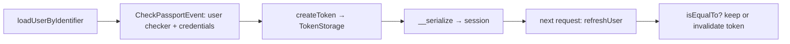

# Users

!!! tip "In a nutshell"
    A user is any object implementing `UserInterface`, which in Symfony 8 has just
    **two** methods: `getRoles()` and `getUserIdentifier()`.
    Exam hook: `eraseCredentials()` was **removed** in 8.0 — strip secrets in
    `__serialize()` instead.

!!! example "Real-world analogy"
    A user is the identity record on file: a name that never changes
    (`getUserIdentifier()`) and a list of clearances (`getRoles()`). It says *who
    you are and what you may reach* — not *how* you proved it at the gate.
    Sensitive notes (the password) are shredded before the file is stored
    (`__serialize()`).

!!! abstract "Learning objectives"
    By the end of this chapter you can:

    - [ ] Implement `UserInterface` and `PasswordAuthenticatedUserInterface`.
    - [ ] Explain `getUserIdentifier()` and the removal of `eraseCredentials()` in 8.0.
    - [ ] Use `EquatableInterface` and describe the user lifecycle.

    **Syllabus:** `Security → Users` ·
    **Level:** Expert ·
    **Est. time:** 30 min ·
    **Prerequisites:** [Providers](providers.md) · [Password Hashers](password-hashers.md)

    **Examen Symfony 8 :** OUI

---

## Pour les nuls

### L'idée en une phrase
Un utilisateur est n'importe quel objet qui implémente `UserInterface` — en Symfony 8, seulement deux méthodes : `getRoles()` et `getUserIdentifier()`.

### Imagine dans la vraie vie
Un utilisateur est la fiche d'identité au dossier : un nom qui ne change jamais (`getUserIdentifier()`) et une liste d'habilitations (`getRoles()`). Ça dit *qui* tu es et *ce que* tu peux atteindre — pas *comment* tu l'as prouvé au portail.

### Dans Symfony
Toute classe métier — pas seulement une entité Doctrine — peut implémenter `UserInterface` : un "utilisateur API" chargé depuis un service externe fonctionne exactement pareil qu'un utilisateur en base.

### Exemple simple
```php
class Utilisateur implements UserInterface {
    public function getRoles(): array { return ['ROLE_USER']; }
    public function getUserIdentifier(): string { return $this->email; }
}
```

### Comment le mémoriser 🧠
`eraseCredentials()` a été **supprimée** en 8.0 — pour retirer un secret avant sérialisation, utilise `__serialize()` à la place.

## Theory

A **user** is any object implementing
`Symfony\Component\Security\Core\User\UserInterface`. It is intentionally minimal
— it carries **identity** and **roles**, nothing about *how* you authenticated.

In **Symfony 8** the interface declares only two methods:

```php
public function getRoles(): array;          // e.g. ['ROLE_USER']
public function getUserIdentifier(): string; // the login identifier
```

`getUserIdentifier()` (added in 5.3, mandatory since 6.0) replaced the old
`getUsername()`. Additional capabilities are opt-in via extra interfaces.

```php
// Symfony 8: getUserIdentifier() is the contract — getUsername() no longer exists
public function getUserIdentifier(): string
{
    return $this->email; // any stable, unique identifier
}
```

| Interface | Adds |
|---|---|
| `PasswordAuthenticatedUserInterface` | `getPassword(): ?string` |
| `EquatableInterface` | `isEqualTo(UserInterface): bool` |
| `LegacyPasswordAuthenticatedUserInterface` | `getSalt()` (plaintext/legacy only) |

!!! question "Predict first"
    You keep a `public function eraseCredentials(): void {}` on your Symfony 8
    user to blank the password after login. Does it run?

??? note "Reveal"
    No. `eraseCredentials()` was **removed** from `UserInterface` in 8.0 — nothing
    calls it. Strip the password in `__serialize()` instead, which is what actually
    runs when the user is stored in the session.

## Deep Dive — how it works internally

### `getUserIdentifier()`

This is the string the `UserBadge` is built from and what the session stores to
reload the user via `refreshUser()`. It must be **stable and unique** (email,
username, UUID). It feeds logging, impersonation and the profiler.

```php
// Authentication: the UserBadge wraps the identifier the provider will load
$badge = new UserBadge('jane@example.com');

// Next stateful request: the provider reloads the user from the session copy,
// matching it by getUserIdentifier()
$fresh = $userProvider->refreshUser($sessionUser);
```

### `eraseCredentials()` is gone in 8.0

Historically `UserInterface::eraseCredentials()` (and
`TokenInterface::eraseCredentials()`) blanked the plaintext password after login
so it never reached the session. **Both were removed in Symfony 8.0.** The
modern replacement is to strip sensitive data in **`__serialize()`**, which is
what actually runs when the token/user is stored in the session:

```php
public function __serialize(): array
{
    $data = (array) $this;
    // Drop the hashed/plaintext password from the serialized form.
    unset($data["\0".self::class."\0password"]);

    return $data;
}
```

!!! note "Source reference"
    `Symfony\Component\Security\Core\User\UserInterface` (two methods only in 8.0)
    — [symfony/symfony `8.0`](https://github.com/symfony/symfony/blob/8.0/src/Symfony/Component/Security/Core/User/UserInterface.php).

### The user lifecycle



1. **Load** — the [provider](providers.md) returns the user during authentication.
2. **Check** — `UserCheckerInterface::checkPreAuth()`/`checkPostAuth()` run on
   `CheckPassportEvent` (e.g. reject disabled/locked accounts).
3. **Store** — after `createToken()`, `__serialize()` decides what enters the
   session.
4. **Refresh** — next stateful request reloads the user; if the class implements
   `EquatableInterface`, `isEqualTo()` compares the session user with the fresh
   one. Returning `false` **invalidates the token** (logs the user out) — useful
   when roles or the password changed.

### User checkers

`Symfony\Component\Security\Core\User\UserCheckerInterface` gates login: throw an
`AccountStatusException` (e.g. `DisabledException`, `AccountExpiredException`) to
block a load-valid user. Configure per firewall with `user_checker:`.

```php
// Implements UserCheckerInterface; enable per firewall with "user_checker:"
final class AppUserChecker implements UserCheckerInterface
{
    public function checkPreAuth(UserInterface $user): void
    {
        // Any AccountStatusException subclass blocks the login
        if ($user instanceof AppUser && $user->isDisabled()) {
            throw new DisabledException();
        }
        if ($user instanceof AppUser && $user->isExpired()) {
            throw new AccountExpiredException();
        }
    }

    // checkPostAuth() also required by the interface (often a no-op)
}
```

### Null behavior

Two nullables live on the user side. `getPassword()` from
`PasswordAuthenticatedUserInterface` returns **`?string`**: a user authenticated
without a local password (OAuth, LDAP, a token-only API user) legitimately has
**`null`** here, and the `CheckCredentialsListener` treats a `null` hash as
non-verifiable — password login for such a user simply cannot succeed, which is
correct.

Separately, `Security::getUser()` (and Twig's `app.user`) is **`null`** whenever
no one is logged in. Read it defensively:

```twig
{{ app.user?.userIdentifier ?? 'guest' }}
```

Do not declare a non-nullable `getPassword(): string` on a user that may have no
password — you will hit a `TypeError` the moment it is verified or serialised.

!!! note "Null in real life"
    A `null` password is a visitor badge with no PIN pad: you cannot "check the
    PIN", so PIN-based entry is simply not an option for them.

## Configuration & code

=== "PHP Attributes"

    ```php
    <?php
    declare(strict_types=1);

    namespace App\Security;

    use Symfony\Component\Security\Core\User\PasswordAuthenticatedUserInterface;
    use Symfony\Component\Security\Core\User\UserInterface;

    final class AppUser implements UserInterface, PasswordAuthenticatedUserInterface
    {
        /** @param list<string> $roles */
        public function __construct(
            private readonly string $email,
            private string $password,        // hashed
            private array $roles = ['ROLE_USER'],
        ) {}

        public function getUserIdentifier(): string
        {
            return $this->email;
        }

        /** @return list<string> */
        public function getRoles(): array
        {
            return array_unique([...$this->roles, 'ROLE_USER']);
        }

        public function getPassword(): ?string
        {
            return $this->password;
        }

        // Symfony 8: no eraseCredentials(); strip secrets in __serialize().
        public function __serialize(): array
        {
            $data = (array) $this;
            unset($data["\0".self::class."\0password"]);

            return $data;
        }
    }
    ```

=== "Console"

    ```console
    $ php bin/console security:hash-password
    $ php bin/console debug:container --tag=security.user_checker
    ```

## Best practices & anti-patterns

| ✅ Do | ❌ Avoid |
|---|---|
| Return a stable, unique `getUserIdentifier()` | Using a mutable field (e.g. display name) |
| Strip secrets in `__serialize()` | Relying on the removed `eraseCredentials()` |
| Always include `ROLE_USER` in `getRoles()` | Empty roles for logged-in users |
| Use a user checker for account status | Ad-hoc `if ($user->disabled)` in controllers |

## When (not) to use it / alternatives

Every authenticated system needs a `UserInterface`. Implement
`PasswordAuthenticatedUserInterface` only for password logins; a token-only API
user may skip it. Implement `EquatableInterface` when you need role/password
changes to invalidate existing sessions immediately.

!!! danger "Certification traps"
    - **`UserInterface` has only two methods in Symfony 8**: `getRoles()` and
      `getUserIdentifier()`. `eraseCredentials()` and `getUsername()` are gone.
    - Strip credentials via **`__serialize()`**, not a security method.
    - `getPassword()` comes from **`PasswordAuthenticatedUserInterface`**, not
      `UserInterface`.
    - `isEqualTo()` returning `false` on refresh **invalidates the token**
      (silent logout) — a subtle way sessions end.

!!! warning "Common mistakes"
    - Still declaring `public function eraseCredentials(): void {}` and thinking
      it is called — it is not part of the 8.0 contract.
    - Using a non-unique identifier, breaking `refreshUser()` on the next request.

## Exercises

1. **(Advanced)** Implement a minimal password user that never leaks its hash
   into the session.
2. **(Expert)** Use `EquatableInterface` so that a role change forces re-login.

??? success "Solutions"

    **1.** See `AppUser` above — the `__serialize()` override removes `password`
    from the serialized payload stored in the session.

    **2.**
    ```php
    public function isEqualTo(UserInterface $user): bool
    {
        return $user instanceof self
            && $this->email === $user->getUserIdentifier()
            && $this->getRoles() === $user->getRoles(); // roles changed ⇒ false ⇒ logout
    }
    ```

## Certification questions

*Question d'entraînement inspirée du syllabus — jamais une question officielle de l'examen.*

??? question "Q1. Which methods does `UserInterface` declare in Symfony 8?"
    - [ ] A. `getUsername()` and `getRoles()`
    - [x] B. `getRoles()` and `getUserIdentifier()` ✅
    - [ ] C. `getRoles()`, `getUserIdentifier()`, `eraseCredentials()`
    - [ ] D. `getId()` and `getPassword()`

    **Why:** 8.0 trimmed the interface to two methods; `eraseCredentials()` and
    `getUsername()` were removed.
    **Ref:** [UserInterface](https://github.com/symfony/symfony/blob/8.0/src/Symfony/Component/Security/Core/User/UserInterface.php).

??? question "Q2. How do you keep the password out of the session in 8.0?"
    - [ ] A. `eraseCredentials()`
    - [x] B. Override `__serialize()` and unset the field ✅
    - [ ] C. Mark it `#[Ignore]`
    - [ ] D. It is automatic

    **Why:** `eraseCredentials()` was removed; serialization is now the hook.
    **Ref:** [UPGRADE-8.0](https://github.com/symfony/symfony/blob/8.0/UPGRADE-8.0.md).

??? question "Q3. `isEqualTo()` returns `false` when the user is refreshed. Effect?"
    - [ ] A. Nothing
    - [x] B. The token is invalidated — the user is logged out ✅
    - [ ] C. The password is rehashed
    - [ ] D. A 500 error

    **Why:** A negative equality check on refresh tells the framework the stored
    identity is stale, dropping the token.
    **Ref:** [EquatableInterface](https://github.com/symfony/symfony/blob/8.0/src/Symfony/Component/Security/Core/User/EquatableInterface.php).

## Key takeaways

- `UserInterface` in 8.0 = `getRoles()` + `getUserIdentifier()` only.
- `getUserIdentifier()` must be stable and unique; it drives `refreshUser()`.
- `eraseCredentials()` removed — strip secrets in `__serialize()`.
- `EquatableInterface::isEqualTo()` can force re-login on identity change.

## Last-minute revision

!!! tip "Cheat sheet"
    - Two methods: `getRoles()`, `getUserIdentifier()`.
    - Password ⇒ `PasswordAuthenticatedUserInterface::getPassword()`.
    - No `eraseCredentials()` in 8.0 → use `__serialize()`.
    - `isEqualTo() === false` on refresh ⇒ logout.

## Connections

- **Depends on:** [Providers](providers.md) — a provider loads and refreshes the
  `UserInterface`.
- **Reused in:** [Roles](roles.md) — `getRoles()` feeds the token and hierarchy.
- **Reused in:** [Password Hashers](password-hashers.md) — password users expose
  `getPassword(): ?string`.
- **Confused with:** [Authentication](authentication.md) — the user is *who you
  are*, not *how* you proved it.

## Official References
- [Symfony docs — The User](https://symfony.com/doc/8.0/security.html#the-user)
- [Symfony source — UserInterface](https://github.com/symfony/symfony/blob/8.0/src/Symfony/Component/Security/Core/User/UserInterface.php)
- [Symfony UPGRADE-8.0 (Security)](https://github.com/symfony/symfony/blob/8.0/UPGRADE-8.0.md)

## Video references

!!! tip "Watch & learn"
    These are official, continuously-updated video channels — search them for
    "Symfony security" to reinforce this chapter. We link stable channels rather than
    individual videos so the references never rot.

    - [SymfonyCasts screencasts](https://symfonycasts.com/tracks/symfony) — scripted, code-along tutorials.
    - [Symfony official YouTube](https://www.youtube.com/@SymfonyOfficial) — SymfonyCon conference talks & keynotes.
    - [Official docs for this topic](https://symfony.com/doc/8.0/security.html#the-user) — some Symfony doc pages embed a screencast.

## Confidence check

I'm ready when I can:

- [ ] explain **why** `UserInterface` is minimal (identity + roles only)
- [ ] implement `UserInterface` + `PasswordAuthenticatedUserInterface` in 8.0
- [ ] debug a stale password leaking into the session (missing `__serialize()`)
- [ ] spot that `eraseCredentials()`/`getUsername()` are gone in 8.0
- [ ] explain how `isEqualTo()` on refresh can force a logout

---

<small>Related: [Providers](providers.md) · [Password Hashers](password-hashers.md) ·
[Roles](roles.md) · [Authentication](authentication.md)</small>
