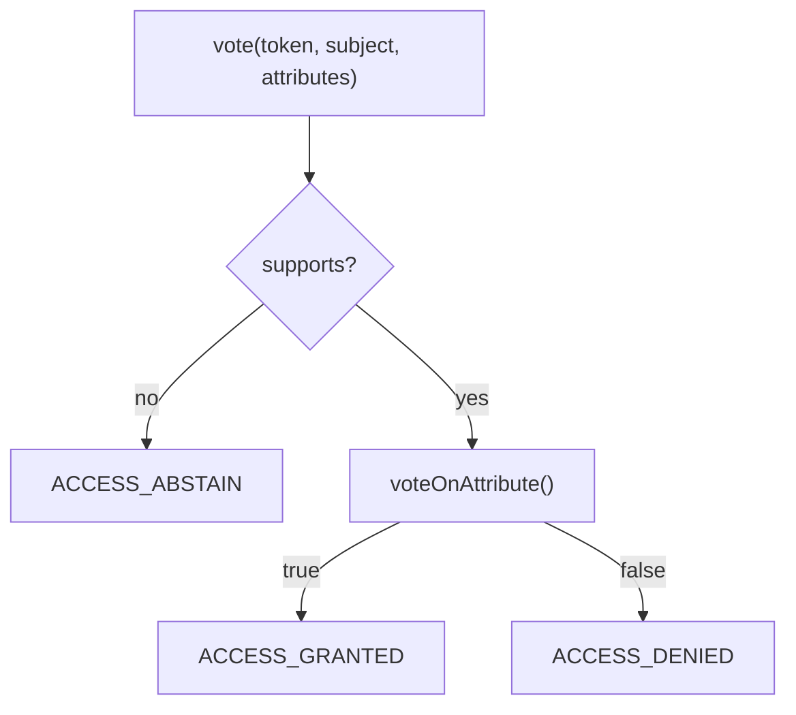
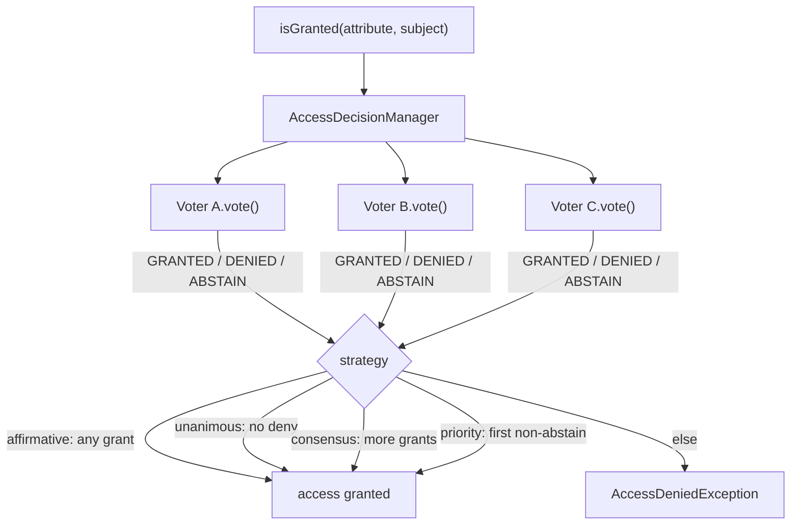

# Voters & Voting Strategies

!!! tip "In a nutshell"
    Un voter répond GRANTED / DENIED / ABSTAIN pour un attribut sur un subject
    optionnel — le moyen d'exprimer les règles par objet que les rôles ne
    peuvent pas couvrir.
    Point d'examen : la stratégie par défaut est **affirmative** (un seul grant
    suffit), et **abstain ≠ deny**.

!!! example "Real-world analogy"
    Un voter est un juge au sein d'un jury. À la question « cette personne
    peut-elle faire X sur Y ? », chaque juge lève un carton **grant** ou
    **deny**, ou s'abstient avec **abstain** (« pas ma spécialité »). Une
    **stratégie** dépouille les cartons — affirmative exige un oui, unanimous
    exige zéro non — pour rendre le verdict final.

!!! abstract "Learning objectives"
    À la fin de ce chapitre, vous saurez :

    - [ ] Écrire un `Voter` avec `supports()` et `voteOnAttribute()`.
    - [ ] Expliquer `ACCESS_GRANTED`/`DENIED`/`ABSTAIN` et leur signification.
    - [ ] Choisir entre les stratégies affirmative/consensus/unanimous/priority.

    **Syllabus:** `Security → Voters` ·
    **Level:** Expert ·
    **Est. time:** 35 min ·
    **Prerequisites:** [Authorization](authorization.md) · [Roles](roles.md)

---

## Theory

Un **voter** décide si un token peut exercer un **attribut** sur un **subject**
optionnel. L'`AccessDecisionManager` interroge chaque voter et combine leurs
votes avec une **stratégie**. Les voters sont le point d'extension de
l'authorization **par objet** — ce que les rôles et `access_control` ne peuvent
pas exprimer.

```php
// Controller: attribute 'EDIT' + subject $post → the AccessDecisionManager
// polls every voter and combines their votes with the configured strategy
$this->denyAccessUnlessGranted('EDIT', $post);

// access_control can only match the URL — it never sees the Post object:
//     - { path: ^/posts, roles: ROLE_USER }
```

Chaque voter retourne l'un de trois votes :

| Vote | Constante | Signification |
|---|---|---|
| Grant | `ACCESS_GRANTED` (1) | Je dis oui |
| Deny | `ACCESS_DENIED` (-1) | Je dis non |
| Abstain | `ACCESS_ABSTAIN` (0) | Cela ne me concerne pas |

!!! question "Predict first"
    Avec la stratégie **unanimous**, le voter A accorde et le voter B
    *s'abstient*. L'accès est-il accordé ?

??? note "Reveal"
    Oui. Unanimous accorde quand **aucun voter ne refuse** et qu'au moins un
    accorde ; une abstention est neutre. Le piège consiste à retourner `false`
    (« pas mon domaine ») au lieu de s'abstenir — c'est un **deny** qui
    bloquerait l'accès ici.

## Deep Dive — how it works internally

### The `Voter` base class

Les voters personnalisés étendent
`Symfony\Component\Security\Core\Authorization\Voter\Voter`, qui implémente
`VoterInterface::vote()` et délègue à deux méthodes que vous écrivez :

```php
protected function supports(string $attribute, mixed $subject): bool;
protected function voteOnAttribute(string $attribute, mixed $subject, TokenInterface $token): bool;
```

Si `supports()` retourne `false`, la classe de base vote **ABSTAIN** — elle
n'appelle pas `voteOnAttribute()`. Ce n'est que lorsque l'attribut est supporté
que `voteOnAttribute()` tranche : `true` (GRANTED) ou `false` (DENIED). C'est
pourquoi un voter sans rapport ne refuse jamais l'accès par accident.



!!! note "Source reference"
    `Symfony\Component\Security\Core\Authorization\Voter\Voter` et
    `AccessDecisionManager` —
    [symfony/symfony `8.0`](https://github.com/symfony/symfony/blob/8.0/src/Symfony/Component/Security/Core/Authorization/Voter/Voter.php).

### Voting strategies

L'`AccessDecisionManager` combine les votes selon une stratégie
(`Symfony\Component\Security\Core\Authorization\Strategy\*`) :

| Stratégie | Accorde quand |
|---|---|
| **affirmative** (défaut) | **Au moins un** voter accorde |
| **consensus** | Plus de grants que de denies (égalité → `allowIfEqualGrantedDenied`) |
| **unanimous** | **Aucun** voter ne refuse (grants ≥ 1, ou tous abstenus selon la config) |
| **priority** | Le **premier** voter non abstenu décide |

```php
use Symfony\Component\Security\Core\Authorization\AccessDecisionManager;
use Symfony\Component\Security\Core\Authorization\Strategy\UnanimousStrategy;

// Standalone: the manager reduces all collected votes with a strategy object
$adm = new AccessDecisionManager($voters, new UnanimousStrategy());
$granted = $adm->decide($token, ['EDIT'], $post); // true only if no voter denied
```

`allow_if_all_abstain` (défaut `false`) contrôle ce qui se passe quand **tous**
les voters s'abstiennent — par défaut, l'accès est **refusé**.

Le manager interroge **chaque** voter, puis la stratégie réduit leurs votes à
une décision unique :



### Configuring the strategy

```yaml
security:
    access_decision_manager:
        strategy: unanimous
        allow_if_all_abstain: false
```

- **affirmative** est permissive — un bon défaut pour des permissions de type OU.
- **unanimous** est stricte — à utiliser quand *tout* deny doit bloquer
  (défense en profondeur).
- **priority** permet à un voter de haute priorité de court-circuiter (p. ex. un
  voter global « banned » qui refuse avant les voters de fonctionnalités).

### Abstain is not deny

Un voter qui s'abstient n'a **aucun effet** sur le résultat. Les développeurs
débutants retournent souvent `false` (« pas mon domaine »), ce qui est en
réalité un **DENY** et peut bloquer l'accès sous `unanimous`. Retournez toujours
`ACCESS_ABSTAIN` / laissez `supports()` filtrer.

### Null behavior

Dans `voteOnAttribute()`, `$token->getUser()` retourne **`null`** pour une
request non authentifiée (le `NullToken` ne porte aucun user). Comme un voter a
généralement besoin d'un vrai utilisateur pour raisonner sur la propriété, la
première ligne est presque toujours une garde :

```php
$user = $token->getUser();
if (!$user instanceof AppUser) {
    return false;              // no (valid) user → deny this attribute
}
```

Le contrôle `instanceof` fait double emploi : il rejette `null` **et** tout
utilisateur de la mauvaise classe, et il affine le type pour que le reste de la
méthode soit null-safe. Retourner `false` ici est correct, car `supports()` a
déjà décidé que cet attribut *est* le nôtre — s'abstenir serait une erreur
(voir « Abstain is not deny » ci-dessus).

!!! note "Null in real life"
    Un juge à qui l'on demande de statuer sur un requérant anonyme sans papiers
    d'identité : il n'y a personne à juger, donc le vote est un « non » ferme.

!!! info "Expert note"
    La méthode de base `Voter::vote()` retourne `ACCESS_ABSTAIN` pour *chaque*
    attribut non supporté, si bien qu'une flotte de voters spécialisés est peu
    coûteuse : seuls ceux dont `supports()` correspond exécutent
    `voteOnAttribute()`. C'est pourquoi « un voter par préoccupation » passe à
    l'échelle — les voters non concernés s'abstiennent silencieusement au lieu
    d'interférer.

??? example "Debugging story"
    **Symptôme :** après l'ajout d'un nouveau voter « account suspended », une
    page `/dashboard` sans rapport s'est mise à renvoyer 403.
    **Diagnostic :** le nouveau voter retournait `false` depuis
    `voteOnAttribute()` pour des attributs qui ne le concernaient pas, au lieu
    de les filtrer dans `supports()` ; sous `unanimous`, cet `ACCESS_DENIED`
    bloquait tout. **Correctif :** resserrer `supports()` sur l'attribut de
    suspension pour que le voter *s'abstienne* ailleurs. **À éviter :** ne
    retournez jamais `false` pour dire « pas mon domaine » — filtrez dans
    `supports()` et laissez la classe de base s'abstenir.

??? abstract "Source-code tour"
    - `Symfony\Component\Security\Core\Authorization\Voter\Voter` — la classe de
      base qui mappe `supports()`/`voteOnAttribute()` sur les trois constantes de
      vote.
    - `...\Voter\VoterInterface` — le contrat brut (`vote()` → GRANTED/DENIED/ABSTAIN).
    - `...\Authorization\AccessDecisionManager` — interroge chaque service
      `security.voter` et délègue à une stratégie.
    - `...\Authorization\Strategy\{Affirmative,Consensus,Unanimous,Priority}Strategy`
      — réduisent les votes collectés à une décision unique.
    - `...\Voter\RoleHierarchyVoter` et `AuthenticatedVoter` — les voters intégrés
      qui s'exécutent aux côtés des vôtres.

## Configuration & code

=== "PHP Attributes"

    ```php
    <?php
    declare(strict_types=1);

    namespace App\Security\Voter;

    use App\Entity\Post;
    use App\Security\AppUser;
    use Symfony\Component\Security\Core\Authentication\Token\TokenInterface;
    use Symfony\Component\Security\Core\Authorization\Voter\Voter;

    /** @extends Voter<string, Post> */
    final class PostVoter extends Voter
    {
        public const string EDIT = 'EDIT';
        public const string VIEW = 'VIEW';

        protected function supports(string $attribute, mixed $subject): bool
        {
            return \in_array($attribute, [self::EDIT, self::VIEW], true)
                && $subject instanceof Post;
        }

        protected function voteOnAttribute(string $attribute, mixed $subject, TokenInterface $token): bool
        {
            $user = $token->getUser();
            if (!$user instanceof AppUser) {
                return false;                     // not logged in → deny
            }

            /** @var Post $subject */
            return match ($attribute) {
                self::VIEW => $subject->isPublished() || $subject->isAuthor($user),
                self::EDIT => $subject->isAuthor($user),
                default    => false,
            };
        }
    }
    ```

=== "YAML"

    ```yaml
    # config/packages/security.yaml
    security:
        access_decision_manager:
            strategy: affirmative      # default; unanimous | consensus | priority
            allow_if_all_abstain: false
    ```

=== "Usage"

    ```php
    <?php
    // In a controller:
    $this->denyAccessUnlessGranted(\App\Security\Voter\PostVoter::EDIT, $post);
    ```

Les voters sont **autoconfigurés** — implémenter `VoterInterface` (ou étendre
`Voter`) tague automatiquement le service `security.voter`.

## Best practices & anti-patterns

| ✅ Do | ❌ Avoid |
|---|---|
| S'abstenir pour les attributs sans rapport | Retourner DENY pour « pas mon domaine » |
| Un voter par subject/préoccupation | Un voter monolithique pour tout |
| Utiliser des constantes pour les attributs | Des chaînes magiques dispersées partout |
| Choisir une stratégie délibérément | Supposer qu'affirmative convient toujours |

## When (not) to use it / alternatives

Utilisez un voter dès que la décision dépend du **subject** ou de l'état
d'exécution. Pour les simples contrôles de rôles, `RoleVoter`/`role_hierarchy`
s'en chargent déjà — aucun voter personnalisé n'est nécessaire. Pour les règles
par espace d'URL, utilisez [`access_control`](access-control.md).

!!! danger "Certification traps"
    - Votes : `ACCESS_GRANTED = 1`, `ACCESS_ABSTAIN = 0`, `ACCESS_DENIED = -1`.
    - **Abstain ≠ deny.** Avec `unanimous`, un deny accidentel bloque l'accès.
    - La stratégie par défaut est **affirmative** (un seul grant suffit).
    - Si **tous s'abstiennent**, l'accès est **refusé**, sauf si
      `allow_if_all_abstain: true`.
    - `Voter::supports()` retournant `false` produit **ABSTAIN**, pas un deny.

!!! warning "Common mistakes"
    - Retourner `false` depuis `voteOnAttribute()` pour des attributs que le
      voter ne devrait pas gérer (filtrez-les dans `supports()` à la place).
    - Oublier qu'un voter est un service — il doit être autoconfiguré ou tagué
      `security.voter`.

## Exercises

1. **(Advanced)** Écrivez un voter accordant `EDIT` sur un `Post` uniquement à
   son auteur.
2. **(Expert)** Sous `unanimous`, un voter « banned user » refuse tandis qu'un
   voter de fonctionnalité accorde. Quel est le résultat et pourquoi ?

??? success "Solutions"

    **1.** Voir `PostVoter` — `supports()` filtre `EDIT`/`Post`,
    `voteOnAttribute()` retourne `$subject->isAuthor($user)`.

    **2.** L'accès est **refusé**. `unanimous` n'accorde que si *aucun* voter ne
    refuse ; l'`ACCESS_DENIED` du voter banned-user bloque, quel que soit le
    grant du voter de fonctionnalité. (Sous `affirmative`, le grant l'aurait
    emporté — d'où l'importance du choix de la stratégie.)

## Certification questions

??? question "Q1. Default `AccessDecisionManager` strategy?"
    - [x] A. affirmative ✅
    - [ ] B. unanimous
    - [ ] C. consensus
    - [ ] D. priority

    **Why:** Affirmative est la stratégie par défaut — un seul voter qui accorde
    suffit.
    **Ref:** [Access decision strategy](https://symfony.com/doc/current/security/voters.html#changing-the-access-decision-strategy).

??? question "Q2. `Voter::supports()` returns `false`. The vote is…"
    - [ ] A. `ACCESS_DENIED`
    - [x] B. `ACCESS_ABSTAIN` ✅
    - [ ] C. `ACCESS_GRANTED`
    - [ ] D. An exception

    **Why:** La classe de base `Voter` s'abstient pour les attributs/subjects
    non supportés.
    **Ref:** [Voter](https://github.com/symfony/symfony/blob/8.0/src/Symfony/Component/Security/Core/Authorization/Voter/Voter.php).

??? question "Q3. All voters abstain and `allow_if_all_abstain` is default. Result?"
    - [ ] A. Access granted
    - [x] B. Access denied ✅
    - [ ] C. Depends on roles
    - [ ] D. Exception

    **Why:** Sans grant explicite et avec le `false` par défaut, l'abstention
    générale signifie un refus.
    **Ref:** [Access decision](https://symfony.com/doc/current/security/voters.html).

??? question "Q4. Which values do the vote constants hold?"
    - [x] A. GRANTED 1, ABSTAIN 0, DENIED -1 ✅
    - [ ] B. GRANTED 0, DENIED 1
    - [ ] C. GRANTED true, DENIED false
    - [ ] D. All are 0

    **Why:** Ces constantes entières alimentent l'arithmétique des stratégies.
    **Ref:** [VoterInterface](https://github.com/symfony/symfony/blob/8.0/src/Symfony/Component/Security/Core/Authorization/Voter/VoterInterface.php).

## Key takeaways

- Un voter vote GRANTED/DENIED/ABSTAIN sur un attribut + un subject optionnel.
- Étendez `Voter` ; `supports()` filtre, `voteOnAttribute()` décide.
- Stratégies : affirmative (défaut), consensus, unanimous, priority.
- Abstain ≠ deny ; l'abstention générale refuse, sauf si
  `allow_if_all_abstain: true`.

## Last-minute revision

!!! tip "Cheat sheet"
    - Constantes : GRANTED 1 / ABSTAIN 0 / DENIED -1.
    - `supports()` false ⇒ abstain.
    - Config de la stratégie : `security.access_decision_manager.strategy`.
    - Voters autoconfigurés via le tag `security.voter`.

## Connections

- **Depends on:** [Authorization](authorization.md) — `isGranted()` →
  l'`AccessDecisionManager` est ce qui invoque votre voter.
- **Depends on:** [Service tags](../dependency-injection/tags.md) — les voters
  sont autoconfigurés avec le tag `security.voter`.
- **Reused in:** [Access Control Rules](access-control.md) — `access_control`
  passe par les mêmes voters via l'`ExpressionVoter`/`RoleVoter`.
- **Confused with:** [Roles](roles.md) — les rôles sont grossiers, sans
  subject ; les voters sont la couche par objet.

## Official References
- [Symfony docs — Voters](https://symfony.com/doc/current/security/voters.html)
- [Symfony source — Voter](https://github.com/symfony/symfony/blob/8.0/src/Symfony/Component/Security/Core/Authorization/Voter/Voter.php)
- [Symfony source — AccessDecisionManager](https://github.com/symfony/symfony/blob/8.0/src/Symfony/Component/Security/Core/Authorization/AccessDecisionManager.php)

## Video references

!!! tip "Watch & learn"
    Voici des chaînes vidéo officielles, mises à jour en continu — cherchez-y
    "Symfony security" pour consolider ce chapitre. Nous lions des chaînes
    stables plutôt que des vidéos individuelles afin que les références ne
    périment jamais.

    - [SymfonyCasts screencasts](https://symfonycasts.com/tracks/symfony) — des tutoriels scénarisés à suivre en codant.
    - [Symfony official YouTube](https://www.youtube.com/@SymfonyOfficial) — conférences et keynotes SymfonyCon.
    - [Official docs for this topic](https://symfony.com/doc/current/security/voters.html#changing-the-access-decision-strategy) — certaines pages de la doc Symfony intègrent un screencast.

## Confidence check

Je suis prêt quand je peux :

- [ ] expliquer **pourquoi** les voters existent là où les rôles et
  `access_control` n'atteignent pas
- [ ] écrire un `Voter` avec `supports()` + `voteOnAttribute()` dans Symfony 8
- [ ] déboguer un deny accidentel causé par un `false` retourné au lieu d'une
  abstention
- [ ] repérer la mauvaise stratégie dans une question piège (affirmative vs
  unanimous)
- [ ] expliquer comment l'`AccessDecisionManager` réduit les votes en interne

---

<small>Related: [Authorization](authorization.md) · [Roles](roles.md) ·
[Access Control Rules](access-control.md) · [Configuration](configuration.md)</small>
