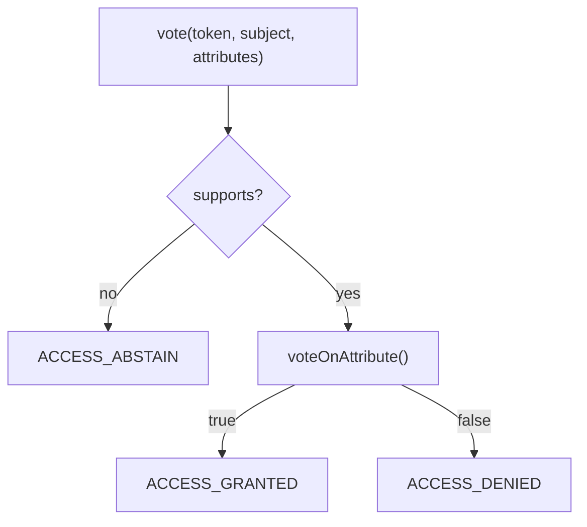
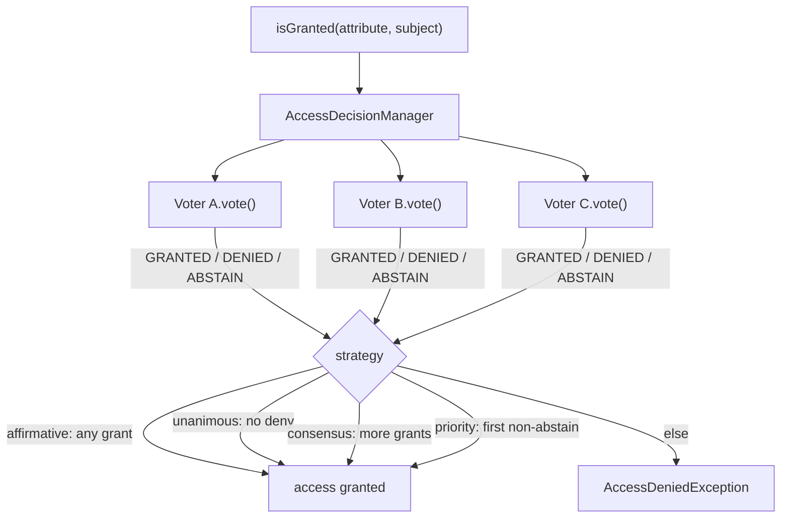

# Voters & Voting Strategies

!!! tip "In a nutshell"
    A voter answers GRANTED / DENIED / ABSTAIN for an attribute on an optional
    subject — the way to express the per-object rules roles cannot.
    Exam hook: the default strategy is **affirmative** (one grant is enough), and
    **abstain ≠ deny**.

!!! example "Real-world analogy"
    A voter is one judge on a panel. Asked "can this person do X to Y?", each
    judge raises a card for **grant** or **deny**, or sits out with **abstain**
    ("not my speciality"). A **strategy** tallies the cards — affirmative needs
    one yes, unanimous needs zero no's — into the final verdict.

!!! abstract "Learning objectives"
    By the end of this chapter you can:

    - [ ] Write a `Voter` with `supports()` and `voteOnAttribute()`.
    - [ ] Explain `ACCESS_GRANTED`/`DENIED`/`ABSTAIN` and their meaning.
    - [ ] Choose between affirmative/consensus/unanimous/priority strategies.

    **Syllabus:** `Security → Voters` ·
    **Level:** Expert ·
    **Est. time:** 35 min ·
    **Prerequisites:** [Authorization](authorization.md) · [Roles](roles.md)

---

## Theory

A **voter** decides whether a token may perform an **attribute** on an optional
**subject**. The `AccessDecisionManager` polls every voter and combines their
votes with a **strategy**. Voters are the extension point for **per-object**
authorization — the thing roles and `access_control` cannot express.

Each voter returns one of three votes:

| Vote | Constant | Meaning |
|---|---|---|
| Grant | `ACCESS_GRANTED` (1) | I say yes |
| Deny | `ACCESS_DENIED` (-1) | I say no |
| Abstain | `ACCESS_ABSTAIN` (0) | Not my concern |

## Deep Dive — how it works internally

### The `Voter` base class

Custom voters extend
`Symfony\Component\Security\Core\Authorization\Voter\Voter`, which implements
`VoterInterface::vote()` and delegates to two methods you write:

```php
protected function supports(string $attribute, mixed $subject): bool;
protected function voteOnAttribute(string $attribute, mixed $subject, TokenInterface $token): bool;
```

If `supports()` returns `false`, the base class votes **ABSTAIN** — it does not
call `voteOnAttribute()`. Only when supported does `voteOnAttribute()` decide
`true` (GRANTED) or `false` (DENIED). This is why an unrelated voter never
accidentally denies.



!!! note "Source reference"
    `Symfony\Component\Security\Core\Authorization\Voter\Voter` and
    `AccessDecisionManager` —
    [symfony/symfony `8.0`](https://github.com/symfony/symfony/blob/8.0/src/Symfony/Component/Security/Core/Authorization/Voter/Voter.php).

### Voting strategies

The `AccessDecisionManager` combines votes using a strategy
(`Symfony\Component\Security\Core\Authorization\Strategy\*`):

| Strategy | Grants when |
|---|---|
| **affirmative** (default) | **At least one** voter grants |
| **consensus** | More grant than deny (ties → `allowIfEqualGrantedDenied`) |
| **unanimous** | **No** voter denies (grants ≥ 1, or all abstain per config) |
| **priority** | The **first** non-abstaining voter decides |

`allow_if_all_abstain` (default `false`) controls what happens when **every**
voter abstains — by default access is **denied**.

The manager polls **every** voter, then the strategy reduces their votes to a
single decision:



### Configuring the strategy

```yaml
security:
    access_decision_manager:
        strategy: unanimous
        allow_if_all_abstain: false
```

- **affirmative** is permissive — good default for OR-style permissions.
- **unanimous** is strict — use when *any* deny must block (defence in depth).
- **priority** lets a high-priority voter short-circuit (e.g. a global "banned"
  voter denying before feature voters).

### Abstain is not deny

A voter that abstains has **no effect** on the outcome. New developers often
return `false` ("not mine") which is actually a **DENY** and can block access
under `unanimous`. Always return `ACCESS_ABSTAIN`/let `supports()` filter.

### Null behavior

Inside `voteOnAttribute()`, `$token->getUser()` returns **`null`** for an
unauthenticated request (the `NullToken` carries no user). Since a voter usually
needs a real user to reason about ownership, the first line is almost always a
guard:

```php
$user = $token->getUser();
if (!$user instanceof AppUser) {
    return false;              // no (valid) user → deny this attribute
}
```

The `instanceof` check does double duty: it rejects `null` **and** any user of
the wrong class, and it narrows the type so the rest of the method is null-safe.
Returning `false` here is correct because `supports()` already decided this
attribute *is* ours — abstaining would be wrong (see "Abstain is not deny" above).

!!! note "Null in real life"
    A judge asked to rule on an anonymous petitioner with no identity papers:
    there is nobody to judge, so the vote is a straight "no".

## Configuration & code

=== "PHP Attributes"

    ```php
    <?php
    declare(strict_types=1);

    namespace App\Security\Voter;

    use App\Entity\Post;
    use App\Security\AppUser;
    use Symfony\Component\Security\Core\Authentication\Token\TokenInterface;
    use Symfony\Component\Security\Core\Authorization\Voter\Voter;

    /** @extends Voter<string, Post> */
    final class PostVoter extends Voter
    {
        public const string EDIT = 'EDIT';
        public const string VIEW = 'VIEW';

        protected function supports(string $attribute, mixed $subject): bool
        {
            return \in_array($attribute, [self::EDIT, self::VIEW], true)
                && $subject instanceof Post;
        }

        protected function voteOnAttribute(string $attribute, mixed $subject, TokenInterface $token): bool
        {
            $user = $token->getUser();
            if (!$user instanceof AppUser) {
                return false;                     // not logged in → deny
            }

            /** @var Post $subject */
            return match ($attribute) {
                self::VIEW => $subject->isPublished() || $subject->isAuthor($user),
                self::EDIT => $subject->isAuthor($user),
                default    => false,
            };
        }
    }
    ```

=== "YAML"

    ```yaml
    # config/packages/security.yaml
    security:
        access_decision_manager:
            strategy: affirmative      # default; unanimous | consensus | priority
            allow_if_all_abstain: false
    ```

=== "Usage"

    ```php
    <?php
    // In a controller:
    $this->denyAccessUnlessGranted(\App\Security\Voter\PostVoter::EDIT, $post);
    ```

Voters are **autoconfigured** — implementing `VoterInterface` (or extending
`Voter`) tags the service `security.voter` automatically.

## Best practices & anti-patterns

| ✅ Do | ❌ Avoid |
|---|---|
| Abstain for unrelated attributes | Returning DENY for "not mine" |
| One voter per subject/concern | A monolithic voter for everything |
| Use constants for attributes | Magic strings scattered around |
| Pick a strategy deliberately | Assuming affirmative always fits |

## When (not) to use it / alternatives

Use a voter whenever the decision needs the **subject** or runtime state.
For pure role checks, `RoleVoter`/`role_hierarchy` already handle it — no custom
voter needed. For URL-space rules, use [`access_control`](access-control.md).

!!! danger "Certification traps"
    - Votes: `ACCESS_GRANTED = 1`, `ACCESS_ABSTAIN = 0`, `ACCESS_DENIED = -1`.
    - **Abstain ≠ deny.** With `unanimous`, one accidental deny blocks access.
    - The default strategy is **affirmative** (one grant is enough).
    - With **all abstaining**, access is **denied** unless
      `allow_if_all_abstain: true`.
    - `Voter::supports()` returning `false` yields **ABSTAIN**, not deny.

!!! warning "Common mistakes"
    - Returning `false` from `voteOnAttribute()` for attributes the voter should
      not handle (filter them in `supports()` instead).
    - Forgetting a voter is a service — it must be autoconfigured or tagged
      `security.voter`.

## Exercises

1. **(Advanced)** Write a voter granting `EDIT` on a `Post` only to its author.
2. **(Expert)** Under `unanimous`, a "banned user" voter denies while a feature
   voter grants. What is the outcome and why?

??? success "Solutions"

    **1.** See `PostVoter` — `supports()` filters `EDIT`/`Post`,
    `voteOnAttribute()` returns `$subject->isAuthor($user)`.

    **2.** Access is **denied**. `unanimous` grants only if *no* voter denies;
    the banned-user voter's `ACCESS_DENIED` blocks regardless of the feature
    voter's grant. (Under `affirmative`, the grant would win — hence choosing the
    strategy matters.)

## Certification questions

??? question "Q1. Default `AccessDecisionManager` strategy?"
    - [x] A. affirmative ✅
    - [ ] B. unanimous
    - [ ] C. consensus
    - [ ] D. priority

    **Why:** Affirmative is the default — one granting voter is enough.
    **Ref:** [Access decision strategy](https://symfony.com/doc/current/security/voters.html#changing-the-access-decision-strategy).

??? question "Q2. `Voter::supports()` returns `false`. The vote is…"
    - [ ] A. `ACCESS_DENIED`
    - [x] B. `ACCESS_ABSTAIN` ✅
    - [ ] C. `ACCESS_GRANTED`
    - [ ] D. An exception

    **Why:** The base `Voter` abstains for unsupported attributes/subjects.
    **Ref:** [Voter](https://github.com/symfony/symfony/blob/8.0/src/Symfony/Component/Security/Core/Authorization/Voter/Voter.php).

??? question "Q3. All voters abstain and `allow_if_all_abstain` is default. Result?"
    - [ ] A. Access granted
    - [x] B. Access denied ✅
    - [ ] C. Depends on roles
    - [ ] D. Exception

    **Why:** With no explicit grant and the default `false`, all-abstain means
    deny.
    **Ref:** [Access decision](https://symfony.com/doc/current/security/voters.html).

??? question "Q4. Which values do the vote constants hold?"
    - [x] A. GRANTED 1, ABSTAIN 0, DENIED -1 ✅
    - [ ] B. GRANTED 0, DENIED 1
    - [ ] C. GRANTED true, DENIED false
    - [ ] D. All are 0

    **Why:** These integer constants drive the strategy arithmetic.
    **Ref:** [VoterInterface](https://github.com/symfony/symfony/blob/8.0/src/Symfony/Component/Security/Core/Authorization/Voter/VoterInterface.php).

## Key takeaways

- A voter votes GRANTED/DENIED/ABSTAIN on an attribute + optional subject.
- Extend `Voter`; `supports()` filters, `voteOnAttribute()` decides.
- Strategies: affirmative (default), consensus, unanimous, priority.
- Abstain ≠ deny; all-abstain denies unless `allow_if_all_abstain: true`.

## Last-minute revision

!!! tip "Cheat sheet"
    - Constants: GRANTED 1 / ABSTAIN 0 / DENIED -1.
    - `supports()` false ⇒ abstain.
    - Strategy config: `security.access_decision_manager.strategy`.
    - Voters autoconfigured via `security.voter` tag.

## Official References
- [Symfony docs — Voters](https://symfony.com/doc/current/security/voters.html)
- [Symfony source — Voter](https://github.com/symfony/symfony/blob/8.0/src/Symfony/Component/Security/Core/Authorization/Voter/Voter.php)
- [Symfony source — AccessDecisionManager](https://github.com/symfony/symfony/blob/8.0/src/Symfony/Component/Security/Core/Authorization/AccessDecisionManager.php)

---

<small>Related: [Authorization](authorization.md) · [Roles](roles.md) ·
[Access Control Rules](access-control.md) · [Configuration](configuration.md)</small>
</content>
