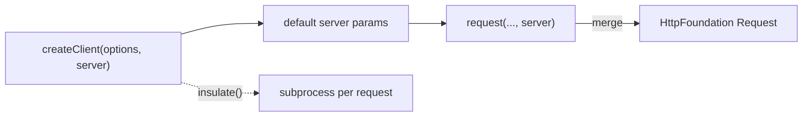

# Client Configuration

!!! tip "In a nutshell"
    `createClient($options, $server)` prérègle l'environnement du kernel plus
    des **paramètres serveur** par défaut (headers, HTTPS, Basic auth) appliqués
    à chaque request. Point d'examen : les headers de request deviennent des
    paramètres serveur préfixés `HTTP_`, et `$server` est le **second**
    argument — pas une liste de chaînes de headers.

!!! example "Real-world analogy"
    Pensez au briefing d'un coursier avant une tournée de livraisons.
    `createClient()` est l'endroit où vous remettez les consignes permanentes
    dont chaque colis hérite : toujours prendre l'autoroute à péage (`HTTPS`),
    toujours se présenter à ce dépôt (`HTTP_HOST`), toujours montrer ce badge
    (`PHP_AUTH_USER`/`PHP_AUTH_PW`). Ce sont les *paramètres serveur* — les
    conditions du trajet — passés en second argument, pas l'étiquette d'adresse
    du colis. Une livraison isolée peut quand même déroger au briefing permanent
    (le `$server` par request), et choisir `insulate()` revient à envoyer chaque
    colis dans sa propre camionnette séparée pour qu'aucun trajet ne contamine
    le suivant — au prix de ne plus être à bord pour observer.

!!! abstract "Learning objectives"
    À la fin de ce chapitre, vous saurez :

    - [ ] Passer des options de kernel (environment/debug) et des paramètres serveur par défaut à `createClient()`
    - [ ] Définir des headers de request et une authentification HTTP Basic via les paramètres serveur
    - [ ] Authentifier un utilisateur avec `loginUser()`
    - [ ] Exécuter des requests isolées dans un processus séparé avec `insulate()`

    **Syllabus:** `Automated Tests → Client configuration` ·
    **Level:** Expert ·
    **Est. time:** 25 min ·
    **Prerequisites:** [The Client](client.md), [Functional Tests](functional-tests.md)

---

## Theory

`static::createClient(array $options = [], array $server = [])` prend deux
tableaux :

- **`$options`** — options de démarrage du kernel : `environment` (défaut
  `test`) et `debug`.
- **`$server`** — **paramètres serveur** par défaut (le sac PHP `$_SERVER`)
  appliqués à chaque request : headers HTTP (`HTTP_*`), `HTTPS`, hôte et
  identifiants d'authentification HTTP.

```php
// $options (1st arg): kernel boot options — environment + debug
// $server (2nd arg): default server parameters (the $_SERVER bag)
$client = static::createClient(
    ['environment' => 'test', 'debug' => false],
    [
        'HTTPS' => true,                  // simulate HTTPS
        'HTTP_HOST' => 'api.example.com', // HTTP_* request header
        'PHP_AUTH_USER' => 'admin',       // HTTP auth credentials
        'PHP_AUTH_PW' => 'secret',
    ],
);
```

Les paramètres serveur modélisent ce qu'un serveur web définirait ; c'est donc
ainsi que vous simulez des headers, HTTPS, un hôte personnalisé ou du Basic
auth sans toucher au controller.

!!! question "Predict first"
    Vous passez `['Accept' => 'application/json']` en second argument de
    `createClient()` et le controller ne voit jamais le header. Pourquoi ?

??? note "Reveal"
    Les paramètres serveur suivent le nommage CGI : un header de request doit
    être `HTTP_ACCEPT`, pas `Accept`. Le second argument est le sac `$_SERVER` —
    `HTTP_*` pour les headers, sans préfixe pour `HTTPS` / `PHP_AUTH_USER` /
    `PHP_AUTH_PW`.

## Deep Dive — how it works internally

Les paramètres serveur suivent les conventions CGI : les headers de request
deviennent `HTTP_<UPPER_SNAKE>` (`HTTP_ACCEPT`, `HTTP_X_REQUESTED_WITH`),
tandis que `CONTENT_TYPE`, `HTTPS`, `PHP_AUTH_USER` et `PHP_AUTH_PW` n'ont pas
de préfixe. `AbstractBrowser` fusionne les défauts par client de
`createClient()` avec le tableau `$server` par request passé à `request()`,
puis `HttpFoundation\Request::create()` les transforme en headers/attributs de
request.

```php
// createClient() sets per-client defaults (CGI naming)
$client = static::createClient([], [
    'HTTP_ACCEPT' => 'application/json',         // header => HTTP_<UPPER_SNAKE>
    'HTTP_X_REQUESTED_WITH' => 'XMLHttpRequest', // header => HTTP_<UPPER_SNAKE>
    'CONTENT_TYPE' => 'application/json',        // no prefix
    'HTTPS' => true,                             // no prefix
    'PHP_AUTH_USER' => 'admin',                  // no prefix
    'PHP_AUTH_PW' => 'secret',                   // no prefix
]);

// AbstractBrowser merges these defaults with the per-request $server array;
// HttpFoundation\Request::create() then builds the final request from them
$client->request('GET', '/api', [], [], ['HTTP_ACCEPT' => 'text/html']);
```

`$client->setServerParameter($key, $value)` définit un défaut pour les requests
**suivantes** ; le sixième argument de `request()` surcharge pour **une seule**
request.

```php
// setServerParameter(): default for all SUBSEQUENT requests
$client->setServerParameter('HTTP_ACCEPT_LANGUAGE', 'fr');

// the per-request $server argument of request() overrides for ONE request
$client->request('GET', '/page', [], [], ['HTTP_ACCEPT_LANGUAGE' => 'de']);
```

### Insulated requests

Normalement, chaque request s'exécute dans le **même** processus PHP que le
test — rapide, et vous pouvez inspecter le profiler et le container.
`$client->insulate()` exécute chaque request dans un **sous-processus frais**
(sérialisation en entrée, sérialisation en sortie). Cela garantit un état global
propre par request, mais vous **perdez** l'accès in-process aux objets container
et profiler. Ne l'utilisez que pour traquer les fuites d'état.



!!! note "Source reference"
    `AbstractBrowser::request()` fusionne les paramètres serveur par défaut et
    par request ; `insulate()` bascule l'exécution en sous-processus
    ([symfony/symfony `8.0`](https://github.com/symfony/symfony/blob/8.0/src/Symfony/Component/BrowserKit/AbstractBrowser.php)).

## Configuration & code

=== "Options + server defaults"

    ```php
    <?php
    declare(strict_types=1);

    namespace App\Tests\Controller;

    use Symfony\Bundle\FrameworkBundle\Test\WebTestCase;

    final class ApiClientTest extends WebTestCase
    {
        public function testJsonOverHttps(): void
        {
            $client = static::createClient(
                ['environment' => 'test', 'debug' => false],
                [
                    'HTTPS' => true,
                    'HTTP_HOST' => 'api.example.com',
                    'HTTP_ACCEPT' => 'application/json',
                ],
            );

            $client->request('GET', '/api/status');
            self::assertResponseIsSuccessful();
        }
    }
    ```

=== "Headers & HTTP Basic auth"

    ```php
    <?php
    declare(strict_types=1);

    namespace App\Tests\Controller;

    use Symfony\Bundle\FrameworkBundle\Test\WebTestCase;

    final class AuthHeaderTest extends WebTestCase
    {
        public function testBasicAuth(): void
        {
            $client = static::createClient();

            // Per-request server params (5th arg of request()).
            $client->request('GET', '/admin', [], [], [
                'PHP_AUTH_USER' => 'admin',
                'PHP_AUTH_PW' => 'secret',
                'HTTP_X_REQUESTED_WITH' => 'XMLHttpRequest',
            ]);

            self::assertResponseIsSuccessful();
        }
    }
    ```

=== "loginUser()"

    ```php
    <?php
    declare(strict_types=1);

    namespace App\Tests\Controller;

    use App\Repository\UserRepository;
    use Symfony\Bundle\FrameworkBundle\Test\WebTestCase;

    final class DashboardTest extends WebTestCase
    {
        public function testLoggedInAccess(): void
        {
            $client = static::createClient();
            $user = self::getContainer()->get(UserRepository::class)
                ->findOneByEmail('ada@example.com');

            $client->loginUser($user);          // sets the security token
            $client->request('GET', '/dashboard');

            self::assertResponseIsSuccessful();
        }
    }
    ```

=== "Insulated"

    ```php
    <?php
    declare(strict_types=1);

    namespace App\Tests\Controller;

    use Symfony\Bundle\FrameworkBundle\Test\WebTestCase;

    final class InsulatedTest extends WebTestCase
    {
        public function testFreshProcess(): void
        {
            $client = static::createClient();
            $client->insulate();                // each request in its own PHP process
            $client->request('GET', '/');

            self::assertResponseIsSuccessful(); // NB: no in-process profiler access now
        }
    }
    ```

## Best practices & anti-patterns

| ✅ Do | ❌ Avoid |
|---|---|
| `loginUser()` pour les parcours authentifiés | Simuler des forms de login complets à chaque test |
| Nommage `HTTP_*` pour les paramètres de headers | Passer des chaînes de headers brutes |
| `$server` par request pour les headers ponctuels | Reconstruire le client pour changer un seul header |
| Utiliser `insulate()` avec parcimonie | Isoler quand vous avez besoin du profiler/container |

## When (not) to use it / alternatives

Utilisez les défauts `$server` pour les préoccupations transverses (HTTPS,
hôte, Accept). Utilisez `loginUser()` pour sauter le form de login et tester
directement le comportement *autorisé*. Utilisez `insulate()` uniquement pour
traquer les fuites d'état — il désactive l'accès in-process au
[profiler](profiler.md) et au [container](framework-objects.md) sur lequel la
plupart des tests reposent.

!!! danger "Certification traps"
    - Les headers de request deviennent des paramètres serveur **préfixés
      `HTTP_`** (`HTTP_ACCEPT`) ; `CONTENT_TYPE`, `HTTPS`,
      `PHP_AUTH_USER`/`PHP_AUTH_PW` sont sans préfixe.
    - `createClient()` prend `($options, $server)` — les paramètres serveur sont
      le **second** argument, pas des headers.
    - `loginUser()` pose le token **sans** le form de login ; il nécessite une
      vraie instance de `UserInterface`.
    - `insulate()` renonce à l'accès in-process au profiler/container.

!!! warning "Common mistakes"
    - Passer les headers au mauvais argument de `request()` — les paramètres
      serveur sont le **5e** argument, après `parameters` et `files`.
    - Attendre de `loginUser()` qu'il fonctionne sans firewall configuré.

## Exercises

1. **(Basic)** Créez un client qui envoie chaque request en JSON via HTTPS vers
   l'hôte `api.local`, puis demandez `/api/ping`.
2. **(Intermediate)** Connectez un utilisateur récupéré et vérifiez que
   `/profile` affiche son email dans un `h1`.

??? success "Solutions"

    **1.**

    ```php
    <?php
    declare(strict_types=1);

    namespace App\Tests\Controller;

    use Symfony\Bundle\FrameworkBundle\Test\WebTestCase;

    final class PingTest extends WebTestCase
    {
        public function testPing(): void
        {
            $client = static::createClient([], [
                'HTTPS' => true,
                'HTTP_HOST' => 'api.local',
                'HTTP_ACCEPT' => 'application/json',
            ]);
            $client->request('GET', '/api/ping');

            self::assertResponseIsSuccessful();
        }
    }
    ```

    **2.**

    ```php
    <?php
    declare(strict_types=1);

    namespace App\Tests\Controller;

    use App\Repository\UserRepository;
    use Symfony\Bundle\FrameworkBundle\Test\WebTestCase;

    final class ProfileTest extends WebTestCase
    {
        public function testProfile(): void
        {
            $client = static::createClient();
            $user = self::getContainer()->get(UserRepository::class)
                ->findOneByEmail('ada@example.com');

            $client->loginUser($user);
            $client->request('GET', '/profile');

            self::assertResponseIsSuccessful();
            self::assertSelectorTextContains('h1', 'ada@example.com');
        }
    }
    ```

## Certification questions

??? question "Q1. `createClient()`'s second argument is…"
    - [x] A. An array of default server parameters ✅
    - [ ] B. An array of request headers as strings
    - [ ] C. The environment name
    - [ ] D. A list of routes

    **Why:** `createClient(array $options, array $server)` — les paramètres
    serveur modélisent `$_SERVER`.
    **Ref:** [Testing](https://symfony.com/doc/current/testing.html#configuring-the-test-client).

??? question "Q2. To send an `Accept: application/json` header you set…"
    - [x] A. `HTTP_ACCEPT => 'application/json'` ✅
    - [ ] B. `ACCEPT => 'application/json'`
    - [ ] C. `HEADER_ACCEPT => 'application/json'`
    - [ ] D. `CONTENT_TYPE => 'application/json'`

    **Why:** les headers de request utilisent le préfixe `HTTP_` dans les
    paramètres serveur.
    **Ref:** [Testing](https://symfony.com/doc/current/testing.html#configuring-the-test-client).

??? question "Q3. `$client->loginUser($user)` does what?"
    - [x] A. Authenticates the session with `$user`, skipping the login form ✅
    - [ ] B. Submits the login form
    - [ ] C. Creates the user in the database
    - [ ] D. Returns a JWT

    **Why:** il injecte un token de sécurité pour le `UserInterface` donné.
    **Ref:** [Testing — login](https://symfony.com/doc/current/testing.html#logging-in-users-authentication).

??? question "Q4. `$client->insulate()` means each request…"
    - [x] A. Runs in a separate PHP subprocess (no in-process profiler) ✅
    - [ ] B. Follows redirects automatically
    - [ ] C. Reuses the same kernel forever
    - [ ] D. Is cached

    **Why:** l'isolation nettoie l'état global au prix de la perte de l'accès
    in-process.
    **Ref:** [BrowserKit](https://symfony.com/doc/current/components/browser_kit.html).

## Key takeaways

- `createClient($options, $server)` : options de kernel + paramètres serveur par
  défaut.
- Headers = `HTTP_*` ; `HTTPS`, `PHP_AUTH_USER`, `PHP_AUTH_PW` sont sans
  préfixe.
- `loginUser($user)` authentifie sans le form de login.
- `insulate()` = sous-processus par request ; vous perdez l'accès au
  profiler/container.

## Last-minute revision

!!! tip "Cheat sheet"
    - `createClient(['environment'=>'test','debug'=>false], ['HTTPS'=>true])`.
    - Paramètres serveur par request : 5e argument de `request($m,$u,$p,$files,$server)`.
    - `setServerParameter($k,$v)` pour les requests suivantes.
    - Auth : `loginUser($user)` ou `PHP_AUTH_USER`/`PHP_AUTH_PW`.
    - `insulate(true)` / `insulate(false)`.

## Connections

- **Depends on:** [The Client](client.md) — la configuration règle le client sur lequel ce chapitre s'appuie.
- **Reused in:** [Security](../security/index.md) — `loginUser()` pose le token auquel un firewall fait ensuite confiance.
- **Confused with:** [The Client](client.md) — le comportement (redirections, cookies) vit là-bas ; les options de démarrage et paramètres serveur vivent ici.

## Official References
- [Official Symfony docs — Configuring the test client](https://symfony.com/doc/current/testing.html#configuring-the-test-client)
- [Official Symfony docs — Logging in users](https://symfony.com/doc/current/testing.html#logging-in-users-authentication)
- [Symfony source — AbstractBrowser](https://github.com/symfony/symfony/blob/8.0/src/Symfony/Component/BrowserKit/AbstractBrowser.php)

## Video references

!!! tip "Watch & learn"
    Voici des chaînes vidéo officielles, mises à jour en continu — cherchez-y
    "Symfony testing" pour consolider ce chapitre. Nous lions des chaînes
    stables plutôt que des vidéos individuelles afin que les références ne
    périment jamais.

    - [SymfonyCasts screencasts](https://symfonycasts.com/tracks/symfony) — tutoriels scénarisés à suivre en codant.
    - [Symfony official YouTube](https://www.youtube.com/@SymfonyOfficial) — conférences et keynotes SymfonyCon.
    - [Official docs for this topic](https://symfony.com/doc/current/testing.html#configuring-the-test-client) — certaines pages de la doc Symfony intègrent un screencast.

## Confidence check

Je suis prêt quand je peux :

- [ ] expliquer **pourquoi** les paramètres serveur modélisent `$_SERVER`, pas des chaînes de headers brutes
- [ ] définir headers, HTTPS et HTTP Basic auth via `createClient()` dans Symfony 8
- [ ] déboguer un header qui n'atteint jamais le controller (mauvais argument ou `HTTP_` manquant)
- [ ] repérer le piège : `$server` est le *second* argument de `createClient()` et le *5e* de `request()`
- [ ] expliquer ce que `insulate()` abandonne (accès in-process au profiler/container)

---

<small>Related: [The Client](client.md) · [Framework Objects](framework-objects.md) · [Security](../security/index.md)</small>
