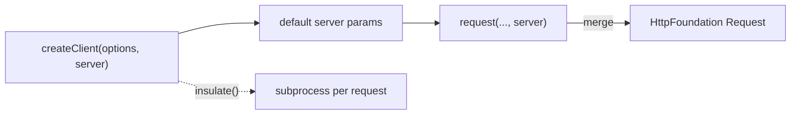

# Client Configuration

!!! tip "In a nutshell"
    `createClient($options, $server)` presets the kernel environment plus default
    **server parameters** (headers, HTTPS, Basic auth) applied to every request.
    Exam hook: request headers become `HTTP_`-prefixed server params, and `$server`
    is the **second** argument — not a list of header strings.

!!! example "Real-world analogy"
    Think of briefing a courier before a run of deliveries. `createClient()` is where you
    hand over the standing instructions every parcel inherits: always take the toll road
    (`HTTPS`), always report to this depot (`HTTP_HOST`), always flash this ID badge
    (`PHP_AUTH_USER`/`PHP_AUTH_PW`). Those are the *server parameters* — the conditions of
    the trip — passed as the second argument, not the parcel's own address label. A single
    delivery can still override the standing brief (the per-request `$server`), and choosing
    `insulate()` is like sending each parcel in its own separate van so nothing from one trip
    can contaminate the next — at the cost of your no longer riding along to watch.

!!! abstract "Learning objectives"
    By the end of this chapter you can:

    - [ ] Pass kernel options (environment/debug) and default server parameters to `createClient()`
    - [ ] Set request headers and HTTP Basic auth via server parameters
    - [ ] Authenticate a user with `loginUser()`
    - [ ] Run insulated requests in a separate process with `insulate()`

    **Syllabus:** `Automated Tests → Client configuration` ·
    **Level:** Expert ·

    **Est. time:** 25 min ·
    **Prerequisites:** [The Client](client.md), [Functional Tests](functional-tests.md)
    **Examen Symfony 8 :** OUI
---

## Pour les nuls

### L'idée en une phrase
`createClient($options, $server)` fixe une bonne fois pour toutes des paramètres qui s'appliqueront ensuite à **chaque** requête du test — pas besoin de les répéter à chaque appel.

### Imagine dans la vraie vie
Briefer un coursier avant une tournée de livraisons. `createClient()` est le moment où tu donnes les instructions permanentes que chaque colis hérite : toujours prendre l'autoroute (`HTTPS`), toujours se présenter à ce dépôt (`HTTP_HOST`).

### Dans Symfony
Simuler que chaque requête du test vient d'un client HTTPS avec un header d'authentification précis évite de répéter ce header dans chaque appel `$client->request()` du test.

### Exemple simple
```php
$client = static::createClient([], ['HTTP_AUTHORIZATION' => 'Bearer '.$token]);
```

### Comment le mémoriser 🧠
`$server` est le **deuxième** argument de `createClient()` — pas une liste de chaînes de header ; les headers de requête deviennent des paramètres serveur préfixés `HTTP_`.

---

## Theory

`static::createClient(array $options = [], array $server = [])` takes two arrays:

- **`$options`** — kernel boot options: `environment` (default `test`) and `debug`.
- **`$server`** — default **server parameters** (the PHP `$_SERVER` bag) applied to
  every request: HTTP headers (`HTTP_*`), `HTTPS`, host, and HTTP auth credentials.

```php
// $options (1st arg): kernel boot options — environment + debug
// $server (2nd arg): default server parameters (the $_SERVER bag)
$client = static::createClient(
    ['environment' => 'test', 'debug' => false],
    [
        'HTTPS' => true,                  // simulate HTTPS
        'HTTP_HOST' => 'api.example.com', // HTTP_* request header
        'PHP_AUTH_USER' => 'admin',       // HTTP auth credentials
        'PHP_AUTH_PW' => 'secret',
    ],
);
```

Server parameters model what a web server would set, so this is how you simulate
headers, HTTPS, a custom host, or Basic auth without touching the controller.

!!! question "Predict first"
    You pass `['Accept' => 'application/json']` as the second argument of
    `createClient()` and the controller never sees the header. Why?

??? note "Reveal"
    Server parameters follow CGI naming: a request header must be `HTTP_ACCEPT`,
    not `Accept`. The second argument is the `$_SERVER` bag — `HTTP_*` for headers,
    unprefixed for `HTTPS` / `PHP_AUTH_USER` / `PHP_AUTH_PW`.

## Deep Dive — how it works internally

Server parameters follow CGI conventions: request headers become
`HTTP_<UPPER_SNAKE>` (`HTTP_ACCEPT`, `HTTP_X_REQUESTED_WITH`), while
`CONTENT_TYPE`, `HTTPS`, `PHP_AUTH_USER`, and `PHP_AUTH_PW` have no prefix.
`AbstractBrowser` merges the per-client defaults from `createClient()` with the
per-request `$server` array passed to `request()`, then
`HttpFoundation\Request::create()` turns them into request headers/attributes.

```php
// createClient() sets per-client defaults (CGI naming)
$client = static::createClient([], [
    'HTTP_ACCEPT' => 'application/json',         // header => HTTP_<UPPER_SNAKE>
    'HTTP_X_REQUESTED_WITH' => 'XMLHttpRequest', // header => HTTP_<UPPER_SNAKE>
    'CONTENT_TYPE' => 'application/json',        // no prefix
    'HTTPS' => true,                             // no prefix
    'PHP_AUTH_USER' => 'admin',                  // no prefix
    'PHP_AUTH_PW' => 'secret',                   // no prefix
]);

// AbstractBrowser merges these defaults with the per-request $server array;
// HttpFoundation\Request::create() then builds the final request from them
$client->request('GET', '/api', [], [], ['HTTP_ACCEPT' => 'text/html']);
```

`$client->setServerParameter($key, $value)` sets a default for **subsequent**
requests; the sixth argument of `request()` overrides for **one** request.

```php
// setServerParameter(): default for all SUBSEQUENT requests
$client->setServerParameter('HTTP_ACCEPT_LANGUAGE', 'fr');

// the per-request $server argument of request() overrides for ONE request
$client->request('GET', '/page', [], [], ['HTTP_ACCEPT_LANGUAGE' => 'de']);
```

### Insulated requests

Normally each request runs in the **same** PHP process as the test — fast, and you
can inspect the profiler and container. `$client->insulate()` runs each request in
a **fresh subprocess** (serialized in, serialized out). This guarantees clean
global state per request but you **lose** in-process access to the container and
profiler objects. Use it only to catch state leakage.



!!! note "Source reference"
    `AbstractBrowser::request()` merges default and per-request server params;
    `insulate()` toggles subprocess execution
    ([symfony/symfony `8.0`](https://github.com/symfony/symfony/blob/8.0/src/Symfony/Component/BrowserKit/AbstractBrowser.php)).

## Configuration & code

=== "Options + server defaults"

    ```php
    <?php
    declare(strict_types=1);

    namespace App\Tests\Controller;

    use Symfony\Bundle\FrameworkBundle\Test\WebTestCase;

    final class ApiClientTest extends WebTestCase
    {
        public function testJsonOverHttps(): void
        {
            $client = static::createClient(
                ['environment' => 'test', 'debug' => false],
                [
                    'HTTPS' => true,
                    'HTTP_HOST' => 'api.example.com',
                    'HTTP_ACCEPT' => 'application/json',
                ],
            );

            $client->request('GET', '/api/status');
            self::assertResponseIsSuccessful();
        }
    }
    ```

=== "Headers & HTTP Basic auth"

    ```php
    <?php
    declare(strict_types=1);

    namespace App\Tests\Controller;

    use Symfony\Bundle\FrameworkBundle\Test\WebTestCase;

    final class AuthHeaderTest extends WebTestCase
    {
        public function testBasicAuth(): void
        {
            $client = static::createClient();

            // Per-request server params (5th arg of request()).
            $client->request('GET', '/admin', [], [], [
                'PHP_AUTH_USER' => 'admin',
                'PHP_AUTH_PW' => 'secret',
                'HTTP_X_REQUESTED_WITH' => 'XMLHttpRequest',
            ]);

            self::assertResponseIsSuccessful();
        }
    }
    ```

=== "loginUser()"

    ```php
    <?php
    declare(strict_types=1);

    namespace App\Tests\Controller;

    use App\Repository\UserRepository;
    use Symfony\Bundle\FrameworkBundle\Test\WebTestCase;

    final class DashboardTest extends WebTestCase
    {
        public function testLoggedInAccess(): void
        {
            $client = static::createClient();
            $user = self::getContainer()->get(UserRepository::class)
                ->findOneByEmail('ada@example.com');

            $client->loginUser($user);          // sets the security token
            $client->request('GET', '/dashboard');

            self::assertResponseIsSuccessful();
        }
    }
    ```

=== "Insulated"

    ```php
    <?php
    declare(strict_types=1);

    namespace App\Tests\Controller;

    use Symfony\Bundle\FrameworkBundle\Test\WebTestCase;

    final class InsulatedTest extends WebTestCase
    {
        public function testFreshProcess(): void
        {
            $client = static::createClient();
            $client->insulate();                // each request in its own PHP process
            $client->request('GET', '/');

            self::assertResponseIsSuccessful(); // NB: no in-process profiler access now
        }
    }
    ```

## Best practices & anti-patterns

| ✅ Do | ❌ Avoid |
|---|---|
| `loginUser()` for authenticated flows | Simulating full login forms every test |
| `HTTP_*` naming for header params | Passing raw header strings |
| Per-request `$server` for one-off headers | Rebuilding the client to change one header |
| Use `insulate()` sparingly | Insulating when you need profiler/container |

## When (not) to use it / alternatives

Use `$server` defaults for cross-cutting concerns (HTTPS, host, Accept). Use
`loginUser()` to skip the login form and test *authorized* behaviour directly. Use
`insulate()` only to hunt state leakage — it disables the in-process access to the
[profiler](profiler.md) and [container](framework-objects.md) that most tests rely
on.

!!! danger "Certification traps"
    - Request headers become **`HTTP_`-prefixed** server params
      (`HTTP_ACCEPT`); `CONTENT_TYPE`, `HTTPS`, `PHP_AUTH_USER`/`PHP_AUTH_PW` are
      unprefixed.
    - `createClient()` takes `($options, $server)` — server params are the
      **second** argument, not headers.
    - `loginUser()` sets the token **without** the login form; it needs a real
      `UserInterface` instance.
    - `insulate()` forfeits in-process profiler/container access.

!!! warning "Common mistakes"
    - Passing headers to the wrong argument position of `request()` — server params
      are the **5th** argument, after `parameters` and `files`.
    - Expecting `loginUser()` to work without a configured firewall.

## Exercises

1. **(Basic)** Create a client that sends every request as JSON over HTTPS to host
   `api.local`, then request `/api/ping`.
2. **(Intermediate)** Log in a fetched user and assert `/profile` shows their
   email in an `h1`.

??? success "Solutions"

    **1.**

    ```php
    <?php
    declare(strict_types=1);

    namespace App\Tests\Controller;

    use Symfony\Bundle\FrameworkBundle\Test\WebTestCase;

    final class PingTest extends WebTestCase
    {
        public function testPing(): void
        {
            $client = static::createClient([], [
                'HTTPS' => true,
                'HTTP_HOST' => 'api.local',
                'HTTP_ACCEPT' => 'application/json',
            ]);
            $client->request('GET', '/api/ping');

            self::assertResponseIsSuccessful();
        }
    }
    ```

    **2.**

    ```php
    <?php
    declare(strict_types=1);

    namespace App\Tests\Controller;

    use App\Repository\UserRepository;
    use Symfony\Bundle\FrameworkBundle\Test\WebTestCase;

    final class ProfileTest extends WebTestCase
    {
        public function testProfile(): void
        {
            $client = static::createClient();
            $user = self::getContainer()->get(UserRepository::class)
                ->findOneByEmail('ada@example.com');

            $client->loginUser($user);
            $client->request('GET', '/profile');

            self::assertResponseIsSuccessful();
            self::assertSelectorTextContains('h1', 'ada@example.com');
        }
    }
    ```

## Certification questions

*Question d'entraînement inspirée du syllabus — jamais une question officielle de l'examen.*

??? question "Q1. `createClient()`'s second argument is…"
    - [x] A. An array of default server parameters ✅
    - [ ] B. An array of request headers as strings
    - [ ] C. The environment name
    - [ ] D. A list of routes

    **Why:** `createClient(array $options, array $server)` — server params model
    `$_SERVER`. **Ref:** [Testing](https://symfony.com/doc/8.0/testing.html#configuring-the-test-client).

??? question "Q2. To send an `Accept: application/json` header you set…"
    - [x] A. `HTTP_ACCEPT => 'application/json'` ✅
    - [ ] B. `ACCEPT => 'application/json'`
    - [ ] C. `HEADER_ACCEPT => 'application/json'`
    - [ ] D. `CONTENT_TYPE => 'application/json'`

    **Why:** request headers use the `HTTP_` prefix in server params.
    **Ref:** [Testing](https://symfony.com/doc/8.0/testing.html#configuring-the-test-client).

??? question "Q3. `$client->loginUser($user)` does what?"
    - [x] A. Authenticates the session with `$user`, skipping the login form ✅
    - [ ] B. Submits the login form
    - [ ] C. Creates the user in the database
    - [ ] D. Returns a JWT

    **Why:** it injects a security token for the given `UserInterface`.
    **Ref:** [Testing — login](https://symfony.com/doc/8.0/testing.html#logging-in-users-authentication).

??? question "Q4. `$client->insulate()` means each request…"
    - [x] A. Runs in a separate PHP subprocess (no in-process profiler) ✅
    - [ ] B. Follows redirects automatically
    - [ ] C. Reuses the same kernel forever
    - [ ] D. Is cached

    **Why:** insulation isolates global state at the cost of losing in-process
    access. **Ref:** [BrowserKit](https://symfony.com/doc/8.0/components/browser_kit.html).

## Key takeaways

- `createClient($options, $server)`: kernel options + default server parameters.
- Headers = `HTTP_*`; `HTTPS`, `PHP_AUTH_USER`, `PHP_AUTH_PW` are unprefixed.
- `loginUser($user)` authenticates without the login form.
- `insulate()` = subprocess per request; you lose profiler/container access.

## Last-minute revision

!!! tip "Cheat sheet"
    - `createClient(['environment'=>'test','debug'=>false], ['HTTPS'=>true])`.
    - Per-request server params: 5th arg of `request($m,$u,$p,$files,$server)`.
    - `setServerParameter($k,$v)` for subsequent requests.
    - Auth: `loginUser($user)` or `PHP_AUTH_USER`/`PHP_AUTH_PW`.
    - `insulate(true)` / `insulate(false)`.

## Connections

- **Depends on:** [The Client](client.md) — configuration tunes the client this builds on.
- **Reused in:** [Security](../security/index.md) — `loginUser()` sets the token a firewall then trusts.
- **Confused with:** [The Client](client.md) — behaviour (redirects, cookies) lives there; boot options and server params live here.

## Official References
- [Official Symfony docs — Configuring the test client](https://symfony.com/doc/8.0/testing.html#configuring-the-test-client)
- [Official Symfony docs — Logging in users](https://symfony.com/doc/8.0/testing.html#logging-in-users-authentication)
- [Symfony source — AbstractBrowser](https://github.com/symfony/symfony/blob/8.0/src/Symfony/Component/BrowserKit/AbstractBrowser.php)

## Video references

!!! tip "Watch & learn"
    These are official, continuously-updated video channels — search them for
    "Symfony testing" to reinforce this chapter. We link stable channels rather than
    individual videos so the references never rot.

    - [SymfonyCasts screencasts](https://symfonycasts.com/tracks/symfony) — scripted, code-along tutorials.
    - [Symfony official YouTube](https://www.youtube.com/@SymfonyOfficial) — SymfonyCon conference talks & keynotes.
    - [Official docs for this topic](https://symfony.com/doc/8.0/testing.html#configuring-the-test-client) — some Symfony doc pages embed a screencast.

## Confidence check

I'm ready when I can:

- [ ] explain **why** server params model `$_SERVER`, not raw header strings
- [ ] set headers, HTTPS, and HTTP Basic auth via `createClient()` in Symfony 8
- [ ] debug a header that never reaches the controller (wrong arg or missing `HTTP_`)
- [ ] spot the trap that `$server` is the *second* arg of `createClient()` and the *5th* of `request()`
- [ ] explain what `insulate()` gives up (in-process profiler/container access)

---

<small>Related: [The Client](client.md) · [Framework Objects](framework-objects.md) · [Security](../security/index.md)</small>
