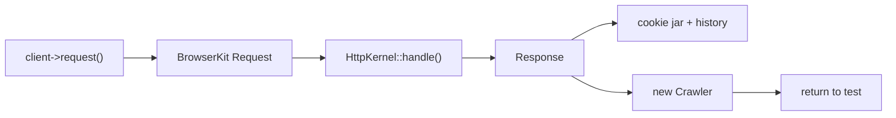

# The Test Client

!!! tip "In a nutshell"
    Le client de test est un `KernelBrowser` qui parle au kernel in-process
    comme un navigateur headless, en conservant un cookie jar et un historique.
    Chaque appel de navigation retourne un `Crawler`, pas une `Response`. Point
    d'examen : les redirections ne sont **pas** suivies automatiquement — vous
    appelez `followRedirect()`.

!!! example "Real-world analogy"
    Imaginez un robot installé dans un simulateur de conduite plutôt que dans
    une vraie voiture sur une vraie route. Il actionne les pédales et le volant
    (envoie des requests au kernel in-process, sans réseau réel), et il
    maintient votre session — en mémorisant vos tickets de parking (le cookie
    jar) et l'itinéraire parcouru (l'historique). Mais quand un panneau indique
    « déviation par ici » (une redirection 302), le robot s'arrête pile devant
    le panneau et attend, pour que vous puissiez lire où il pointe, plutôt que
    de l'emprunter automatiquement. Vous devez dire « vas-y »
    (`followRedirect()`) — ou le régler d'avance pour toujours obéir aux
    panneaux de déviation (`followRedirects()`).

!!! abstract "Learning objectives"
    À la fin de ce chapitre, vous saurez :

    - [ ] Envoyer des requests avec `request()` et inspecter le `Crawler` retourné
    - [ ] Soumettre des forms et cliquer des liens avec `submitForm()` / `clickLink()`
    - [ ] Contrôler les redirections avec `followRedirects()` et `followRedirect()`
    - [ ] Conserver l'état du container entre les requests avec `disableReboot()` et utiliser cookies/historique

    **Syllabus:** `Automated Tests → The Client` ·
    **Level:** Advanced → Expert ·
    **Est. time:** 30 min ·
    **Prerequisites:** [Functional Tests](functional-tests.md)

---

## Theory

Le client retourné par `static::createClient()` est un
`Symfony\Bundle\FrameworkBundle\KernelBrowser`, une sous-classe de
`Symfony\Component\BrowserKit\AbstractBrowser`. Il se comporte comme un
**navigateur headless** qui parle au kernel *in-process* (pas de réseau réel) :
il conserve un **cookie jar** et un **historique**, suit ou retient les
redirections, et retourne un [`Crawler`](crawler.md) sur le DOM de la response
pour chaque appel de navigation.

```php
// static::createClient() returns a KernelBrowser (extends AbstractBrowser)
$client = static::createClient();

// every navigation call returns a Crawler over the response DOM
$crawler = $client->request('GET', '/');

// headless-browser state kept between requests
$client->getCookieJar(); // cookie jar
$client->getHistory();   // browsing history
```

!!! question "Predict first"
    Un controller retourne un 302. Vous appelez immédiatement
    `assertSelectorTextContains('h1', 'Dashboard')` et cela échoue. Pourquoi ?

??? note "Reveal"
    Le client ne suit **pas** les redirections par défaut : le DOM courant est
    donc la page 302 (quasi vide), pas la cible. Appelez d'abord
    `$client->followRedirect()`, ou `followRedirects()` avant la request pour
    suivre automatiquement.

## Deep Dive — how it works internally

`AbstractBrowser::request()` construit une
`Symfony\Component\BrowserKit\Request`, la convertit en request `HttpFoundation`
via le `doRequest()` du `KernelBrowser`, et la passe à `HttpKernel::handle()`.
La `Response` résultante est stockée, enveloppée dans une response BrowserKit,
et un nouveau `Crawler` est créé à partir de son HTML. Le navigateur enregistre
la paire request/response dans son **historique** et fusionne tout `Set-Cookie`
dans son **cookie jar**, si bien que les requests suivantes sont
authentifiées/avec état, exactement comme une session de navigateur.

```php
// AbstractBrowser::request() -> BrowserKit Request -> KernelBrowser::doRequest()
// -> HttpKernel::handle() -> Response
$crawler = $client->request('GET', '/login'); // fresh Crawler from the HTML

// the stored Response is available on the client
$response = $client->getResponse();

// history + cookie jar updated (Set-Cookie merged) => next request is stateful
$client->request('GET', '/account'); // session cookie sent automatically
```

Par défaut, le `KernelBrowser` **redémarre le kernel** après chaque request afin
que chaque request parte d'un container propre. `disableReboot()` désactive ce
comportement : le container (et les services que vous avez remplacés) survit
d'une request à l'autre au sein du test — essentiel quand vous installez un mock
avant une request et voulez qu'il persiste.

```php
$client = static::createClient();
$client->disableReboot(); // KernelBrowser keeps the same container

// a service replaced before the request now survives it
static::getContainer()->set('app.mailer', $mailerMock);

$client->request('POST', '/order'); // mock still in place
$client->request('GET', '/orders'); // same container, same mock
```



!!! note "Source reference"
    `Symfony\Component\BrowserKit\AbstractBrowser` détient l'historique et le
    cookie jar ; `KernelBrowser` implémente `doRequest()` et `disableReboot()`
    ([symfony/symfony `8.0`](https://github.com/symfony/symfony/blob/8.0/src/Symfony/Component/BrowserKit/AbstractBrowser.php)).

### Redirects

Par défaut, le client **s'arrête sur une redirection** (3xx) et ne la suit
pas — vous pouvez donc vérifier le `Location`. Appelez
`$client->followRedirect()` pour suivre la dernière redirection une fois, ou
`$client->followRedirects()` (avant la request) pour suivre automatiquement
toutes les redirections pour le reste du test. `followRedirects(false)` rétablit
le comportement manuel.

```php
$client->request('POST', '/subscribe');   // controller returns a 302

self::assertResponseRedirects('/thanks'); // assert the Location first
$client->followRedirect();                // follow the last redirect, once

$client->followRedirects();               // auto-follow all redirects from now on
$client->followRedirects(false);          // restore manual behaviour
```

## Configuration & code

=== "Navigation"

    ```php
    <?php
    declare(strict_types=1);

    namespace App\Tests\Controller;

    use Symfony\Bundle\FrameworkBundle\Test\WebTestCase;

    final class NavigationTest extends WebTestCase
    {
        public function testClickThrough(): void
        {
            $client = static::createClient();
            $crawler = $client->request('GET', '/');

            // Follow a link by its visible text.
            $client->clickLink('Read more');
            self::assertResponseIsSuccessful();

            // Or grab the Link object first, then click it.
            $link = $crawler->selectLink('Contact')->link();
            $client->click($link);
        }
    }
    ```

=== "Submitting forms"

    ```php
    <?php
    declare(strict_types=1);

    namespace App\Tests\Controller;

    use Symfony\Bundle\FrameworkBundle\Test\WebTestCase;

    final class LoginFormTest extends WebTestCase
    {
        public function testSubmit(): void
        {
            $client = static::createClient();
            $client->request('GET', '/login');

            // submitForm(button, fieldValues, method)
            $client->submitForm('Sign in', [
                'email' => 'ada@example.com',
                'password' => 's3cret',
            ]);

            self::assertResponseRedirects('/dashboard');
        }
    }
    ```

=== "Redirects & reboot"

    ```php
    <?php
    declare(strict_types=1);

    namespace App\Tests\Controller;

    use Symfony\Bundle\FrameworkBundle\Test\WebTestCase;

    final class RedirectTest extends WebTestCase
    {
        public function testFollow(): void
        {
            $client = static::createClient();
            $client->disableReboot();          // keep container state across requests
            $client->request('POST', '/subscribe');

            self::assertResponseRedirects();    // not yet followed
            $client->followRedirect();          // follow once
            self::assertResponseIsSuccessful();

            $client->followRedirects();         // auto-follow from now on
        }
    }
    ```

## Best practices & anti-patterns

| ✅ Do | ❌ Avoid |
|---|---|
| Vérifier le `Location` avant `followRedirect()` | Suivre aveuglément en automatique et perdre l'assertion du 302 |
| `submitForm()` pour les envois de form simples | Fabriquer à la main des corps POST que vous pourriez soumettre |
| `disableReboot()` quand vous remplacez des services avant la request | S'attendre à ce qu'un mock survive au redémarrage par défaut |
| Réutiliser le cookie jar du client pour les flux de login | Se ré-authentifier à chaque request |

## When (not) to use it / alternatives

Le client est le cheval de trait des tests fonctionnels. Pour le travail fin sur
le DOM, utilisez le [Crawler](crawler.md) qu'il retourne ; pour vérifier le
résultat, utilisez les [helpers d'introspection](introspection.md). Si vous avez
besoin de l'objet form sortant pour ajuster des champs individuels, obtenez-le
depuis le Crawler (`->form()`) plutôt que via `submitForm()`.

!!! danger "Certification traps"
    - Le client est un `KernelBrowser` étendant `AbstractBrowser` — **pas** un
      vrai client HTTP ; les requests atteignent le kernel in-process.
    - Par défaut, il **ne suit pas les redirections** ; vous devez appeler
      `followRedirect()` / `followRedirects()`.
    - `disableReboot()` est ce qui garde un **remplacement de service** vivant
      entre les requests — sinon le redémarrage le jette.
    - `request()` retourne un **`Crawler`**, pas une `Response` ; obtenez la
      response via `$client->getResponse()`.

!!! warning "Common mistakes"
    - Appeler `followRedirect()` alors que la dernière response n'était **pas**
      une redirection — cela lève une `LogicException`.
    - Confondre `followRedirect()` (suivre la *dernière*, une fois) avec
      `followRedirects()` (bascule du suivi automatique).

## Exercises

1. **(Basic)** Demandez `/`, cliquez le lien "Login", et vérifiez que la page de
   login se rend correctement.
2. **(Intermediate)** Envoyez en POST un form d'abonnement qui redirige vers
   `/thanks` ; vérifiez la cible de la redirection, puis suivez-la et vérifiez
   le titre de remerciement.

??? success "Solutions"

    **1.**

    ```php
    <?php
    declare(strict_types=1);

    namespace App\Tests\Controller;

    use Symfony\Bundle\FrameworkBundle\Test\WebTestCase;

    final class LoginLinkTest extends WebTestCase
    {
        public function testGoToLogin(): void
        {
            $client = static::createClient();
            $client->request('GET', '/');
            $client->clickLink('Login');

            self::assertResponseIsSuccessful();
            self::assertSelectorExists('form[name="login"]');
        }
    }
    ```

    **2.**

    ```php
    <?php
    declare(strict_types=1);

    namespace App\Tests\Controller;

    use Symfony\Bundle\FrameworkBundle\Test\WebTestCase;

    final class SubscribeTest extends WebTestCase
    {
        public function testSubscribeRedirect(): void
        {
            $client = static::createClient();
            $client->request('GET', '/subscribe');
            $client->submitForm('Subscribe', ['email' => 'a@b.com']);

            self::assertResponseRedirects('/thanks');
            $client->followRedirect();
            self::assertSelectorTextContains('h1', 'Thank you');
        }
    }
    ```

## Certification questions

??? question "Q1. What does `$client->request('GET', '/')` return?"
    - [x] A. A `Symfony\Component\DomCrawler\Crawler` ✅
    - [ ] B. A `Response`
    - [ ] C. A `Request`
    - [ ] D. `void`

    **Why:** les méthodes de navigation retournent un `Crawler` ; la response se
    récupère avec `getResponse()`.
    **Ref:** [Testing](https://symfony.com/doc/current/testing.html#making-requests).

??? question "Q2. By default, after a controller returns a 302, the client…"
    - [x] A. Stops on the redirect so you can assert `Location` ✅
    - [ ] B. Follows it automatically
    - [ ] C. Throws an exception
    - [ ] D. Retries the request

    **Why:** le suivi automatique est désactivé par défaut ; utilisez
    `followRedirect()` / `followRedirects()`.
    **Ref:** [Testing](https://symfony.com/doc/current/testing.html#redirecting).

??? question "Q3. Which call keeps a service replaced with `getContainer()->set()` alive across requests?"
    - [x] A. `$client->disableReboot()` ✅
    - [ ] B. `$client->followRedirects()`
    - [ ] C. `$client->insulate()`
    - [ ] D. `$client->restart()`

    **Why:** sans désactiver le redémarrage, le kernel repart après chaque
    request et jette le remplacement.
    **Ref:** [Testing](https://symfony.com/doc/current/testing.html).

??? question "Q4. `submitForm()` signature is…"
    - [x] A. `submitForm(string $button, array $fieldValues = [], string $method = 'POST')` ✅
    - [ ] B. `submitForm(array $fieldValues, string $button)`
    - [ ] C. `submitForm(Form $form)`
    - [ ] D. `submitForm(string $uri, array $data)`

    **Why:** vous identifiez le bouton de soumission par son texte/nom, puis
    passez les valeurs des champs.
    **Ref:** [Testing](https://symfony.com/doc/current/testing.html#submitting-forms).

## Key takeaways

- Le client est un `KernelBrowser` (étend `AbstractBrowser`) qui atteint le
  kernel in-process, avec cookie jar + historique.
- Les méthodes de navigation retournent un `Crawler` ; la response vient de
  `getResponse()`.
- Les redirections ne sont **pas** suivies par défaut : `followRedirect()`
  (une fois) vs `followRedirects()` (bascule).
- `disableReboot()` préserve l'état du container / les mocks entre les requests.

## Last-minute revision

!!! tip "Cheat sheet"
    - `request($method, $uri, $params, $files, $server, $content)` → Crawler.
    - `submitForm($button, $values, $method)`, `clickLink($text)`, `click($link)`.
    - `followRedirect()` = une fois ; `followRedirects(true|false)` = bascule.
    - `disableReboot()`, `getCookieJar()`, `getHistory()`, `back()`, `restart()`.

## Connections

- **Depends on:** [Functional Tests](functional-tests.md) — `createClient()` démarre le kernel que ce client pilote.
- **Reused in:** [The Crawler](crawler.md) — chaque appel de navigation retourne un `Crawler` sur le DOM de la response.
- **Confused with:** [Client Configuration](client-configuration.md) — ce chapitre traite du comportement ; l'autre des options de démarrage et des paramètres serveur.

## Official References
- [Official Symfony docs — Making requests](https://symfony.com/doc/current/testing.html#making-requests)
- [Symfony source — AbstractBrowser](https://github.com/symfony/symfony/blob/8.0/src/Symfony/Component/BrowserKit/AbstractBrowser.php)
- [Symfony source — KernelBrowser](https://github.com/symfony/symfony/blob/8.0/src/Symfony/Bundle/FrameworkBundle/KernelBrowser.php)

## Video references

!!! tip "Watch & learn"
    Voici des chaînes vidéo officielles, mises à jour en continu — cherchez-y
    "Symfony testing" pour consolider ce chapitre. Nous lions des chaînes
    stables plutôt que des vidéos individuelles afin que les références ne
    périment jamais.

    - [SymfonyCasts screencasts](https://symfonycasts.com/tracks/symfony) — tutoriels scénarisés à suivre en codant.
    - [Symfony official YouTube](https://www.youtube.com/@SymfonyOfficial) — conférences et keynotes SymfonyCon.
    - [Official docs for this topic](https://symfony.com/doc/current/testing.html#making-requests) — certaines pages de la doc Symfony intègrent un screencast.

## Confidence check

Je suis prêt quand je peux :

- [ ] expliquer **pourquoi** le `KernelBrowser` in-process n'est pas un vrai client HTTP
- [ ] envoyer des requests, soumettre des forms et cliquer des liens dans Symfony 8
- [ ] déboguer une `LogicException` due à `followRedirect()` sur une response non redirigée
- [ ] repérer le piège : `request()` retourne un `Crawler`, pas une `Response`
- [ ] expliquer comment `disableReboot()` préserve l'état du container entre les requests

---

<small>Related: [The Crawler](crawler.md) · [Client Configuration](client-configuration.md) · [Introspection](introspection.md)</small>
