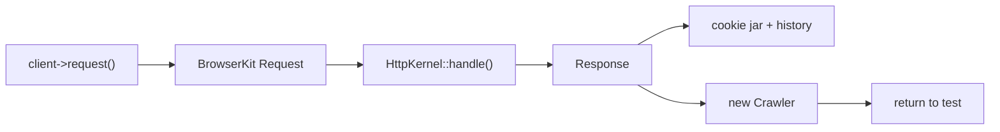

# The Test Client

!!! tip "In a nutshell"
    The test client is a `KernelBrowser` that talks to the kernel in-process like a
    headless browser, keeping a cookie jar and history. Every navigation call
    returns a `Crawler`, not a `Response`. Exam hook: redirects are **not** followed
    automatically — you call `followRedirect()`.

!!! example "Real-world analogy"
    Picture a robot sitting at a driving simulator instead of a real car on a real road. It
    works the pedals and steering (sends requests to the kernel in-process, no actual
    network), and it keeps your session going — remembering your parking stubs (the cookie
    jar) and the route you have driven (the history). But when a road sign says "detour this
    way" (a 302 redirect), the robot stops right at the sign and waits, so you can read where
    it points, rather than automatically taking it. You must say "go" (`followRedirect()`) —
    or set it to always obey detour signs up front (`followRedirects()`).

!!! abstract "Learning objectives"
    By the end of this chapter you can:

    - [ ] Send requests with `request()` and inspect the returned `Crawler`
    - [ ] Submit forms and click links with `submitForm()` / `clickLink()`
    - [ ] Control redirects with `followRedirects()` and `followRedirect()`
    - [ ] Keep container state across requests with `disableReboot()` and use cookies/history

    **Syllabus:** `Automated Tests → The Client` ·
    **Level:** Advanced → Expert ·
    **Est. time:** 30 min ·
    **Prerequisites:** [Functional Tests](functional-tests.md)

---

## Theory

The client returned by `static::createClient()` is a
`Symfony\Bundle\FrameworkBundle\KernelBrowser`, a subclass of
`Symfony\Component\BrowserKit\AbstractBrowser`. It behaves like a **headless
browser** that talks to the kernel *in-process* (no real network): it keeps a
**cookie jar** and a **history**, follows or holds redirects, and returns a
[`Crawler`](crawler.md) over the response DOM for every navigation call.

```php
// static::createClient() returns a KernelBrowser (extends AbstractBrowser)
$client = static::createClient();

// every navigation call returns a Crawler over the response DOM
$crawler = $client->request('GET', '/');

// headless-browser state kept between requests
$client->getCookieJar(); // cookie jar
$client->getHistory();   // browsing history
```

!!! question "Predict first"
    A controller returns a 302. You immediately call
    `assertSelectorTextContains('h1', 'Dashboard')` and it fails. Why?

??? note "Reveal"
    The client does **not** follow redirects by default, so the current DOM is the
    (near-empty) 302 page, not the target. Call `$client->followRedirect()` first,
    or `followRedirects()` before the request to auto-follow.

## Deep Dive — how it works internally

`AbstractBrowser::request()` builds a `Symfony\Component\BrowserKit\Request`,
converts it to an `HttpFoundation` request via the `KernelBrowser`'s
`doRequest()`, and passes it to `HttpKernel::handle()`. The resulting `Response`
is stored, wrapped in a BrowserKit response, and a fresh `Crawler` is created from
its HTML. The browser records the request/response pair in its **history** and
merges any `Set-Cookie` into its **cookie jar**, so subsequent requests are
authenticated/stateful just like a browser session.

```php
// AbstractBrowser::request() -> BrowserKit Request -> KernelBrowser::doRequest()
// -> HttpKernel::handle() -> Response
$crawler = $client->request('GET', '/login'); // fresh Crawler from the HTML

// the stored Response is available on the client
$response = $client->getResponse();

// history + cookie jar updated (Set-Cookie merged) => next request is stateful
$client->request('GET', '/account'); // session cookie sent automatically
```

By default the `KernelBrowser` **reboots the kernel** after each request so every
request starts from a clean container. `disableReboot()` turns that off: the
container (and any services you replaced) survives across requests within the
test — essential when you set up a mock before a request and want it to persist.

```php
$client = static::createClient();
$client->disableReboot(); // KernelBrowser keeps the same container

// a service replaced before the request now survives it
static::getContainer()->set('app.mailer', $mailerMock);

$client->request('POST', '/order'); // mock still in place
$client->request('GET', '/orders'); // same container, same mock
```



!!! note "Source reference"
    `Symfony\Component\BrowserKit\AbstractBrowser` holds the history/cookie jar;
    `KernelBrowser` implements `doRequest()` and `disableReboot()`
    ([symfony/symfony `8.0`](https://github.com/symfony/symfony/blob/8.0/src/Symfony/Component/BrowserKit/AbstractBrowser.php)).

### Redirects

By default the client **stops on a redirect** (3xx) and does not follow it — so
you can assert the `Location`. Call `$client->followRedirect()` to follow the last
redirect once, or `$client->followRedirects()` (before the request) to auto-follow
all redirects for the rest of the test. `followRedirects(false)` restores the
manual behaviour.

```php
$client->request('POST', '/subscribe');   // controller returns a 302

self::assertResponseRedirects('/thanks'); // assert the Location first
$client->followRedirect();                // follow the last redirect, once

$client->followRedirects();               // auto-follow all redirects from now on
$client->followRedirects(false);          // restore manual behaviour
```

## Configuration & code

=== "Navigation"

    ```php
    <?php
    declare(strict_types=1);

    namespace App\Tests\Controller;

    use Symfony\Bundle\FrameworkBundle\Test\WebTestCase;

    final class NavigationTest extends WebTestCase
    {
        public function testClickThrough(): void
        {
            $client = static::createClient();
            $crawler = $client->request('GET', '/');

            // Follow a link by its visible text.
            $client->clickLink('Read more');
            self::assertResponseIsSuccessful();

            // Or grab the Link object first, then click it.
            $link = $crawler->selectLink('Contact')->link();
            $client->click($link);
        }
    }
    ```

=== "Submitting forms"

    ```php
    <?php
    declare(strict_types=1);

    namespace App\Tests\Controller;

    use Symfony\Bundle\FrameworkBundle\Test\WebTestCase;

    final class LoginFormTest extends WebTestCase
    {
        public function testSubmit(): void
        {
            $client = static::createClient();
            $client->request('GET', '/login');

            // submitForm(button, fieldValues, method)
            $client->submitForm('Sign in', [
                'email' => 'ada@example.com',
                'password' => 's3cret',
            ]);

            self::assertResponseRedirects('/dashboard');
        }
    }
    ```

=== "Redirects & reboot"

    ```php
    <?php
    declare(strict_types=1);

    namespace App\Tests\Controller;

    use Symfony\Bundle\FrameworkBundle\Test\WebTestCase;

    final class RedirectTest extends WebTestCase
    {
        public function testFollow(): void
        {
            $client = static::createClient();
            $client->disableReboot();          // keep container state across requests
            $client->request('POST', '/subscribe');

            self::assertResponseRedirects();    // not yet followed
            $client->followRedirect();          // follow once
            self::assertResponseIsSuccessful();

            $client->followRedirects();         // auto-follow from now on
        }
    }
    ```

## Best practices & anti-patterns

| ✅ Do | ❌ Avoid |
|---|---|
| Assert `Location` before `followRedirect()` | Blindly auto-following, losing the 302 assertion |
| `submitForm()` for simple form posts | Hand-crafting POST bodies you could submit |
| `disableReboot()` when replacing services pre-request | Expecting a mock to survive a default reboot |
| Reuse the client's cookie jar for login flows | Re-authenticating on every request |

## When (not) to use it / alternatives

The client is the workhorse of functional tests. For fine-grained DOM work use
the [Crawler](crawler.md) it returns; for asserting the outcome use the
[introspection helpers](introspection.md). If you need the *outgoing* form object
to tweak individual fields, get it from the Crawler (`->form()`) rather than
`submitForm()`.

!!! danger "Certification traps"
    - The client is a `KernelBrowser` extending `AbstractBrowser` — **not** a real
      HTTP client; requests hit the kernel in-process.
    - By default it **does not follow redirects**; you must call
      `followRedirect()` / `followRedirects()`.
    - `disableReboot()` is what keeps a **service replacement** alive across
      requests — otherwise the reboot discards it.
    - `request()` returns a **`Crawler`**, not a `Response`; get the response via
      `$client->getResponse()`.

!!! warning "Common mistakes"
    - Calling `followRedirect()` when the last response was **not** a redirect —
      it throws a `LogicException`.
    - Confusing `followRedirect()` (follow the *last* one, once) with
      `followRedirects()` (toggle auto-follow).

## Exercises

1. **(Basic)** Request `/`, click the "Login" link, and assert the login page
   renders successfully.
2. **(Intermediate)** POST a subscription form that redirects to `/thanks`; assert
   the redirect target, then follow it and assert the thank-you heading.

??? success "Solutions"

    **1.**

    ```php
    <?php
    declare(strict_types=1);

    namespace App\Tests\Controller;

    use Symfony\Bundle\FrameworkBundle\Test\WebTestCase;

    final class LoginLinkTest extends WebTestCase
    {
        public function testGoToLogin(): void
        {
            $client = static::createClient();
            $client->request('GET', '/');
            $client->clickLink('Login');

            self::assertResponseIsSuccessful();
            self::assertSelectorExists('form[name="login"]');
        }
    }
    ```

    **2.**

    ```php
    <?php
    declare(strict_types=1);

    namespace App\Tests\Controller;

    use Symfony\Bundle\FrameworkBundle\Test\WebTestCase;

    final class SubscribeTest extends WebTestCase
    {
        public function testSubscribeRedirect(): void
        {
            $client = static::createClient();
            $client->request('GET', '/subscribe');
            $client->submitForm('Subscribe', ['email' => 'a@b.com']);

            self::assertResponseRedirects('/thanks');
            $client->followRedirect();
            self::assertSelectorTextContains('h1', 'Thank you');
        }
    }
    ```

## Certification questions

??? question "Q1. What does `$client->request('GET', '/')` return?"
    - [x] A. A `Symfony\Component\DomCrawler\Crawler` ✅
    - [ ] B. A `Response`
    - [ ] C. A `Request`
    - [ ] D. `void`

    **Why:** navigation methods return a `Crawler`; the response is fetched with
    `getResponse()`. **Ref:** [Testing](https://symfony.com/doc/8.0/testing.html#making-requests).

??? question "Q2. By default, after a controller returns a 302, the client…"
    - [x] A. Stops on the redirect so you can assert `Location` ✅
    - [ ] B. Follows it automatically
    - [ ] C. Throws an exception
    - [ ] D. Retries the request

    **Why:** auto-follow is off by default; use `followRedirect()` /
    `followRedirects()`. **Ref:** [Testing](https://symfony.com/doc/8.0/testing.html#redirecting).

??? question "Q3. Which call keeps a service replaced with `getContainer()->set()` alive across requests?"
    - [x] A. `$client->disableReboot()` ✅
    - [ ] B. `$client->followRedirects()`
    - [ ] C. `$client->insulate()`
    - [ ] D. `$client->restart()`

    **Why:** without disabling reboot, the kernel restarts after each request and
    discards the replacement. **Ref:** [Testing](https://symfony.com/doc/8.0/testing.html).

??? question "Q4. `submitForm()` signature is…"
    - [x] A. `submitForm(string $button, array $fieldValues = [], string $method = 'POST')` ✅
    - [ ] B. `submitForm(array $fieldValues, string $button)`
    - [ ] C. `submitForm(Form $form)`
    - [ ] D. `submitForm(string $uri, array $data)`

    **Why:** you identify the submit button by text/name, then pass field values.
    **Ref:** [Testing](https://symfony.com/doc/8.0/testing.html#submitting-forms).

## Key takeaways

- The client is a `KernelBrowser` (extends `AbstractBrowser`) hitting the kernel
  in-process, with a cookie jar + history.
- Navigation methods return a `Crawler`; the response comes from `getResponse()`.
- Redirects are **not** followed by default: `followRedirect()` (once) vs
  `followRedirects()` (toggle).
- `disableReboot()` preserves container state / mocks between requests.

## Last-minute revision

!!! tip "Cheat sheet"
    - `request($method, $uri, $params, $files, $server, $content)` → Crawler.
    - `submitForm($button, $values, $method)`, `clickLink($text)`, `click($link)`.
    - `followRedirect()` = once; `followRedirects(true|false)` = toggle.
    - `disableReboot()`, `getCookieJar()`, `getHistory()`, `back()`, `restart()`.

## Connections

- **Depends on:** [Functional Tests](functional-tests.md) — `createClient()` boots the kernel this client drives.
- **Reused in:** [The Crawler](crawler.md) — every navigation call returns a `Crawler` over the response DOM.
- **Confused with:** [Client Configuration](client-configuration.md) — this chapter is behaviour; that one is boot options and server params.

## Official References
- [Official Symfony docs — Making requests](https://symfony.com/doc/8.0/testing.html#making-requests)
- [Symfony source — AbstractBrowser](https://github.com/symfony/symfony/blob/8.0/src/Symfony/Component/BrowserKit/AbstractBrowser.php)
- [Symfony source — KernelBrowser](https://github.com/symfony/symfony/blob/8.0/src/Symfony/Bundle/FrameworkBundle/KernelBrowser.php)

## Video references

!!! tip "Watch & learn"
    These are official, continuously-updated video channels — search them for
    "Symfony testing" to reinforce this chapter. We link stable channels rather than
    individual videos so the references never rot.

    - [SymfonyCasts screencasts](https://symfonycasts.com/tracks/symfony) — scripted, code-along tutorials.
    - [Symfony official YouTube](https://www.youtube.com/@SymfonyOfficial) — SymfonyCon conference talks & keynotes.
    - [Official docs for this topic](https://symfony.com/doc/8.0/testing.html#making-requests) — some Symfony doc pages embed a screencast.

## Confidence check

I'm ready when I can:

- [ ] explain **why** the in-process `KernelBrowser` is not a real HTTP client
- [ ] send requests, submit forms, and click links in Symfony 8
- [ ] debug a `LogicException` from `followRedirect()` on a non-redirect response
- [ ] spot the trap that `request()` returns a `Crawler`, not a `Response`
- [ ] explain how `disableReboot()` preserves container state across requests

---

<small>Related: [The Crawler](crawler.md) · [Client Configuration](client-configuration.md) · [Introspection](introspection.md)</small>
