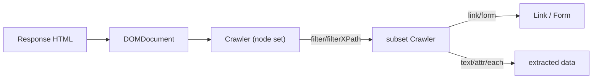

# The Crawler

!!! tip "In a nutshell"
    Le `Crawler` est un ensemble de nœuds immuable sur le DOM de la response :
    interrogez-le avec `filter()` (CSS) ou `filterXPath()`, puis dérivez des
    objets `Link` et `Form`. Point d'examen : `filter()` en CSS nécessite le
    composant css-selector, et `text()` lève une exception sur une
    correspondance vide sauf si vous passez une valeur par défaut.

!!! example "Real-world analogy"
    Imaginez que vous posez un pochoir sur une page de journal imprimée. Chaque
    fois que vous filtrez, vous découpez un nouveau pochoir qui n'expose que les
    parties correspondantes — la page d'origine n'est jamais modifiée, et chaque
    découpe vous donne un pochoir neuf, plus étroit (le Crawler est immuable).
    Vous pouvez alors lire les mots qui apparaissent, ou soulever un coupon
    découpé (`->link()`) ou un formulaire à remplir (`->form()`) pour agir.
    Mais si vous demandez à lire le texte d'une zone où votre pochoir n'a rien
    exposé, il n'y a tout simplement rien à lire — il proteste donc, sauf si
    vous lui avez dit quoi répondre à la place.

!!! abstract "Learning objectives"
    À la fin de ce chapitre, vous saurez :

    - [ ] Sélectionner des nœuds avec `filter()` (CSS) et `filterXPath()`
    - [ ] Cibler liens et boutons avec `selectLink()` / `selectButton()`
    - [ ] Extraire le texte et les attributs des nœuds correspondants
    - [ ] Obtenir des objets `Link` et `Form` pour la navigation et la soumission

    **Syllabus:** `Automated Tests → The Crawler` ·
    **Level:** Advanced ·
    **Est. time:** 25 min ·
    **Prerequisites:** [The Client](client.md)

---

## Theory

`Symfony\Component\DomCrawler\Crawler` enveloppe le DOM de la response et vous
permet de l'**interroger** (CSS ou XPath), d'en **extraire** du
texte/des attributs, et d'en dériver des objets de plus haut niveau `Link`,
`Form` et `Image`. Chaque navigation du client retourne un Crawler frais sur la
page courante ; c'est donc le pont entre « j'ai chargé une page » et « je
vérifie ce qu'elle contient ».

```php
$crawler = $client->request('GET', '/blog');   // fresh Crawler per navigation

// Query it (CSS or XPath) and extract text/attributes
$title = $crawler->filter('h1')->text();
$year  = $crawler->filterXPath('//footer')->attr('data-year');

// Derive the higher-level objects
$link  = $crawler->selectLink('Read more')->link();   // Link
$form  = $crawler->selectButton('Search')->form();    // Form
$image = $crawler->filter('img.cover')->image();      // Image
```

Un Crawler est un **ensemble de nœuds immuable et itérable** : filtrer retourne
un *nouveau* Crawler contenant le sous-ensemble correspondant.

!!! question "Predict first"
    `$crawler->filter('div.item')->text()` lève une exception sur une page sans
    `div.item`. Quels deux faits expliquent cette exception ?

??? note "Reveal"
    `text()` lit le **premier** nœud et lève une exception sur un ensemble vide,
    sauf si vous passez une valeur par défaut. Et `filter()` en CSS nécessite le
    composant css-selector pour convertir le sélecteur en XPath — sans lui, seul
    `filterXPath()` fonctionne.

## Deep Dive — how it works internally

En interne, le Crawler détient une liste d'objets `DOMNode` issus d'un
`DOMDocument` parsé. `filter('css selector')` convertit le sélecteur CSS en
XPath grâce au `Symfony\Component\CssSelector\CssSelectorConverter` (le
composant **css-selector** doit donc être installé — il l'est dans le
`symfony/test-pack` par défaut), puis délègue à `filterXPath()`. `selectLink()`
et `selectButton()` sont des filtres de commodité qui correspondent
respectivement au texte des ancres/`img alt` et au texte/`name`/`value` des
boutons.

```php
use Symfony\Component\CssSelector\CssSelectorConverter;

// filter() converts the CSS selector to XPath...
// (CssSelectorConverter ships with css-selector, part of symfony/test-pack)
$xpath = new CssSelectorConverter()->toXPath('div.item > a');

// ...then delegates to filterXPath(); these two lines are equivalent:
$links = $crawler->filter('div.item > a');
$links = $crawler->filterXPath($xpath);

// Underneath: \DOMNode objects from a parsed \DOMDocument
$domNode = $links->getNode(0);          // ?\DOMNode

// Convenience filters
$crawler->selectLink('Home');           // anchor text or img alt
$crawler->selectButton('Save');         // button text, name or value
```

`text()`, `attr()`, `html()` et `nodeName()` lisent le **premier** nœud de
l'ensemble (les appeler sur un Crawler vide lève une exception, sauf valeur par
défaut). `each()` et `extract()` itèrent sur tous les nœuds.

```php
$item = $crawler->filter('article');

// Read from the FIRST node (pass a default to avoid the empty-set throw)
$text = $item->text('n/a');              // normalized text
$id   = $item->attr('data-id', '0');     // attribute value
$html = $item->html();                   // inner HTML
$tag  = $item->nodeName();               // "article"

// Iterate ALL nodes
$titles = $crawler->filter('h2')->each(fn (Crawler $n): string => $n->text());
$pairs  = $crawler->filter('li')->extract(['data-id', '_text']);
```

- `->link()` construit un `Symfony\Component\DomCrawler\Link` à partir d'un
  `<a>` — passez-le à `$client->click()`.
- `->form()` construit un `Symfony\Component\DomCrawler\Form` à partir du
  `<form>` englobant, pré-rempli avec les valeurs courantes de la page ; vous
  pouvez surcharger des champs.

```php
// Link built from an <a> — pass it to $client->click()
$link = $crawler->selectLink('Next')->link();       // DomCrawler\Link
$crawler = $client->click($link);

// Form built from the enclosing <form>, pre-filled with current values
$form = $crawler->selectButton('Save')->form();     // DomCrawler\Form
$form['post[title]'] = 'Updated title';             // override one field
$client->submit($form);
```



!!! note "Source reference"
    `Crawler::filter()` requiert le composant CssSelector ; il convertit en
    XPath et appelle `filterXPath()`
    ([symfony/symfony `8.0`](https://github.com/symfony/symfony/blob/8.0/src/Symfony/Component/DomCrawler/Crawler.php)).

## Configuration & code

=== "Querying"

    ```php
    <?php
    declare(strict_types=1);

    namespace App\Tests\Controller;

    use Symfony\Bundle\FrameworkBundle\Test\WebTestCase;

    final class ProductListTest extends WebTestCase
    {
        public function testList(): void
        {
            $client = static::createClient();
            $crawler = $client->request('GET', '/products');

            // CSS filter (needs css-selector component).
            self::assertCount(3, $crawler->filter('ul.products li'));

            // First node's text and an attribute.
            $first = $crawler->filter('ul.products li')->first();
            $name = $first->filter('.name')->text();
            $id = $first->attr('data-id');

            // XPath for something CSS can't express easily.
            $prices = $crawler->filterXPath('//li[@data-featured="1"]/span[@class="price"]');

            self::assertNotSame('', $name);
            self::assertNotNull($id);
            self::assertGreaterThan(0, $prices->count());
        }
    }
    ```

=== "Extracting collections"

    ```php
    <?php
    declare(strict_types=1);

    namespace App\Tests\Controller;

    use Symfony\Bundle\FrameworkBundle\Test\WebTestCase;
    use Symfony\Component\DomCrawler\Crawler;

    final class ExtractTest extends WebTestCase
    {
        public function testEachAndExtract(): void
        {
            $client = static::createClient();
            $crawler = $client->request('GET', '/products');

            $names = $crawler->filter('.name')->each(
                static fn (Crawler $node): string => $node->text(),
            );

            // extract() pulls multiple attributes/_text at once.
            $rows = $crawler->filter('li')->extract(['data-id', '_text']);

            self::assertNotEmpty($names);
            self::assertNotEmpty($rows);
        }
    }
    ```

=== "Links & forms"

    ```php
    <?php
    declare(strict_types=1);

    namespace App\Tests\Controller;

    use Symfony\Bundle\FrameworkBundle\Test\WebTestCase;

    final class LinkFormTest extends WebTestCase
    {
        public function testLinkAndForm(): void
        {
            $client = static::createClient();
            $crawler = $client->request('GET', '/contact');

            // A Link object -> click it.
            $client->click($crawler->selectLink('Home')->link());

            $crawler = $client->request('GET', '/contact');

            // A Form object, override fields, then submit.
            $form = $crawler->selectButton('Send')->form([
                'contact[message]' => 'Hello!',
            ]);
            $form['contact[email]'] = 'me@example.com';
            $client->submit($form);

            self::assertResponseRedirects();
        }
    }
    ```

## Best practices & anti-patterns

| ✅ Do | ❌ Avoid |
|---|---|
| `filter()` avec du CSS pour la lisibilité | Du XPath verbeux quand le CSS suffit |
| `selectButton()->form()` pour les vrais forms | Construire manuellement des tableaux POST |
| `each()`/`extract()` pour les collections | `text()` dans une boucle sur un index |
| Protéger `text()` avec une valeur par défaut quand les nœuds peuvent manquer | `text()` sur un Crawler vide (lève une exception) |

## When (not) to use it / alternatives

Utilisez le Crawler pour *trouver* et *dériver* des nœuds/forms/liens. Pour
*vérifier* du contenu, préférez les [assertions par sélecteur](introspection.md)
(`assertSelectorTextContains`) à `filter()->text()` + `assertSame` — elles se
lisent mieux et donnent des messages d'échec plus clairs. Utilisez
`filterXPath()` uniquement quand le CSS ne peut pas exprimer la requête (axes,
prédicats sur le texte).

!!! danger "Certification traps"
    - `filter()` (CSS) nécessite le composant **css-selector** ; sans lui, seul
      `filterXPath()` fonctionne.
    - `text()`/`attr()` opèrent sur le **premier** nœud et **lèvent une
      exception** sur un ensemble vide sauf si un argument par défaut est fourni.
    - `->form()` retourne un `DomCrawler\Form` **pré-rempli** avec les valeurs
      existantes — vous ne surchargez que ce qui change.
    - Le Crawler est **immuable** : `filter()` retourne une nouvelle instance,
      il ne modifie pas l'original.

!!! warning "Common mistakes"
    - Sélectionner un form via le mauvais bouton — `selectButton()` correspond
      au texte, au `name`, à l'`id` ou à la `value` ; des boutons ambigus
      choisissent le mauvais form.
    - Oublier que les noms de champs sont les noms HTML complets
      (`contact[email]`).

## Exercises

1. **(Basic)** Sur `/blog`, vérifiez qu'il y a exactement 5 éléments
   `article.post` et que le titre du premier post n'est pas vide.
2. **(Intermediate)** Sur `/search`, récupérez le `Form` de recherche, mettez
   son champ `q` à "symfony", soumettez-le et vérifiez que la page de résultats
   répond avec succès.

??? success "Solutions"

    **1.**

    ```php
    <?php
    declare(strict_types=1);

    namespace App\Tests\Controller;

    use Symfony\Bundle\FrameworkBundle\Test\WebTestCase;

    final class BlogListTest extends WebTestCase
    {
        public function testPosts(): void
        {
            $client = static::createClient();
            $crawler = $client->request('GET', '/blog');

            self::assertCount(5, $crawler->filter('article.post'));
            self::assertNotSame('', $crawler->filter('article.post h2')->first()->text());
        }
    }
    ```

    **2.**

    ```php
    <?php
    declare(strict_types=1);

    namespace App\Tests\Controller;

    use Symfony\Bundle\FrameworkBundle\Test\WebTestCase;

    final class SearchTest extends WebTestCase
    {
        public function testSearch(): void
        {
            $client = static::createClient();
            $crawler = $client->request('GET', '/search');

            $form = $crawler->selectButton('Go')->form();
            $form['q'] = 'symfony';
            $client->submit($form);

            self::assertResponseIsSuccessful();
        }
    }
    ```

## Certification questions

??? question "Q1. `$crawler->filter('div.item')` requires which component?"
    - [x] A. `symfony/css-selector` ✅
    - [ ] B. `symfony/dom-crawler` only
    - [ ] C. `symfony/browser-kit`
    - [ ] D. None — CSS is built into DomCrawler

    **Why:** `filter()` convertit le CSS en XPath via CssSelectorConverter ; le
    composant css-selector est requis.
    **Ref:** [DomCrawler](https://symfony.com/doc/8.0/components/dom_crawler.html).

??? question "Q2. Calling `text()` on a Crawler that matched nothing…"
    - [x] A. Throws unless you pass a default value ✅
    - [ ] B. Returns an empty string
    - [ ] C. Returns null
    - [ ] D. Returns the whole document text

    **Why:** les méthodes de lecture de nœud opèrent sur le premier nœud et
    lèvent une exception sur un ensemble vide, sauf valeur par défaut.
    **Ref:** [DomCrawler](https://symfony.com/doc/8.0/components/dom_crawler.html#node-values).

??? question "Q3. `$crawler->selectButton('Save')->form(['title' => 'x'])` returns…"
    - [x] A. A `Form` pre-filled with page values, with `title` overridden ✅
    - [ ] B. A raw array of POST data
    - [ ] C. A `Response`
    - [ ] D. A new Crawler

    **Why:** `form()` construit un `DomCrawler\Form` initialisé depuis le DOM ;
    l'argument surcharge des champs.
    **Ref:** [Testing](https://symfony.com/doc/8.0/testing.html#forms).

??? question "Q4. To follow an anchor you first obtain…"
    - [x] A. A `Link` via `$crawler->selectLink('Text')->link()` ✅
    - [ ] B. A `Route` object
    - [ ] C. The `href` string only
    - [ ] D. A `Response`

    **Why:** `link()` construit un `DomCrawler\Link` pour `$client->click()`.
    **Ref:** [Testing](https://symfony.com/doc/8.0/testing.html#clicking-links).

## Key takeaways

- Le Crawler est un ensemble de nœuds immuable ; `filter()`/`filterXPath()`
  retournent des sous-ensembles.
- `filter()` en CSS nécessite le composant css-selector ; `filterXPath()` non.
- `text()`/`attr()` lisent le premier nœud et lèvent une exception sur un
  ensemble vide sans valeur par défaut.
- `->link()` et `->form()` produisent des objets navigables/soumissibles pour le
  client.

## Last-minute revision

!!! tip "Cheat sheet"
    - Interroger : `filter('css')`, `filterXPath('//x')`, `first()`, `last()`, `eq(n)`.
    - Sélectionner : `selectLink('text')`, `selectButton('text|name|value')`.
    - Lire : `text($default)`, `attr('href')`, `html()`, `each(fn)`, `extract([...])`.
    - Dériver : `->link()`, `->form([$overrides])`, `->image()`.

## Connections

- **Depends on:** [The Client](client.md) — chaque appel de navigation vous donne un Crawler frais.
- **Reused in:** [Introspection](introspection.md) — les assertions par sélecteur interrogent le même DOM plus lisiblement.
- **Confused with:** [Introspection](introspection.md) — le Crawler *trouve* les nœuds ; les helpers `assertSelector*` les *vérifient*.

## Official References
- [Official Symfony docs — DomCrawler](https://symfony.com/doc/8.0/components/dom_crawler.html)
- [Official Symfony docs — Testing (crawler)](https://symfony.com/doc/8.0/testing.html#the-crawler)
- [Symfony source — Crawler](https://github.com/symfony/symfony/blob/8.0/src/Symfony/Component/DomCrawler/Crawler.php)

## Video references

!!! tip "Watch & learn"
    Voici des chaînes vidéo officielles, mises à jour en continu — cherchez-y
    "Symfony testing" pour consolider ce chapitre. Nous lions des chaînes
    stables plutôt que des vidéos individuelles afin que les références ne
    périment jamais.

    - [SymfonyCasts screencasts](https://symfonycasts.com/tracks/symfony) — tutoriels scénarisés à suivre en codant.
    - [Symfony official YouTube](https://www.youtube.com/@SymfonyOfficial) — conférences et keynotes SymfonyCon.
    - [Official docs for this topic](https://symfony.com/doc/8.0/components/dom_crawler.html) — certaines pages de la doc Symfony intègrent un screencast.

## Confidence check

Je suis prêt quand je peux :

- [ ] expliquer **pourquoi** le Crawler est un ensemble de nœuds immuable sur le DOM
- [ ] interroger avec `filter()` / `filterXPath()` et dériver des objets `Link` / `Form`
- [ ] déboguer un `text()` qui lève une exception sur une correspondance vide
- [ ] repérer le piège : `filter()` en CSS nécessite le composant css-selector
- [ ] expliquer comment `filter()` convertit le CSS en XPath en interne

---

<small>Related: [The Client](client.md) · [Introspection](introspection.md) · [Functional Tests](functional-tests.md)</small>
