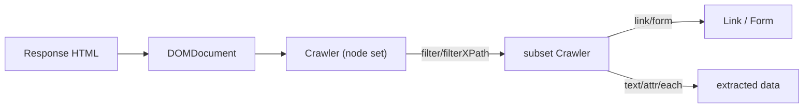

# The Crawler

!!! tip "In a nutshell"
    The `Crawler` is an immutable node set over the response DOM: query it with
    `filter()` (CSS) or `filterXPath()`, then derive `Link` and `Form` objects.
    Exam hook: CSS `filter()` needs the css-selector component, and `text()` throws
    on an empty match unless you pass a default.

!!! abstract "Learning objectives"
    By the end of this chapter you can:

    - [ ] Select nodes with `filter()` (CSS) and `filterXPath()`
    - [ ] Target links and buttons with `selectLink()` / `selectButton()`
    - [ ] Extract text and attributes from matched nodes
    - [ ] Obtain `Link` and `Form` objects for navigation and submission

    **Syllabus:** `Automated Tests → The Crawler` ·
    **Level:** Advanced ·
    **Est. time:** 25 min ·
    **Prerequisites:** [The Client](client.md)

---

## Theory

`Symfony\Component\DomCrawler\Crawler` wraps the response DOM and lets you
**query** it (CSS or XPath), **extract** text/attributes, and derive higher-level
`Link`, `Form`, and `Image` objects. Every client navigation returns a fresh
Crawler over the current page, so it is the bridge between "I loaded a page" and
"I assert what's on it".

A Crawler is an **immutable, iterable set of nodes**: filtering returns a *new*
Crawler holding the matched subset.

!!! question "Predict first"
    `$crawler->filter('div.item')->text()` throws on a page with no `div.item`.
    Which two facts explain the exception?

??? note "Reveal"
    `text()` reads the **first** node and throws on an empty set unless you pass a
    default. And CSS `filter()` needs the css-selector component to convert the
    selector to XPath — without it only `filterXPath()` works.

## Deep Dive — how it works internally

Internally the Crawler holds a list of `DOMNode` objects from a parsed
`DOMDocument`. `filter('css selector')` converts the CSS selector to XPath using
the `Symfony\Component\CssSelector\CssSelectorConverter` (so the **css-selector**
component must be installed — it is in the default `symfony/test-pack`), then
delegates to `filterXPath()`. `selectLink()` and `selectButton()` are convenience
filters matching anchor text/`img alt` and button text/`name`/`value`
respectively.

`text()`, `attr()`, `html()`, and `nodeName()` read from the **first** node of the
set (calling them on an empty Crawler throws unless you pass a default). `each()`
and `extract()` iterate all nodes.

- `->link()` builds a `Symfony\Component\DomCrawler\Link` from an `<a>` — pass it
  to `$client->click()`.
- `->form()` builds a `Symfony\Component\DomCrawler\Form` from the enclosing
  `<form>`, pre-filled with the page's current values; you can override fields.



!!! note "Source reference"
    `Crawler::filter()` requires the CssSelector component; it converts to XPath
    and calls `filterXPath()`
    ([symfony/symfony `8.0`](https://github.com/symfony/symfony/blob/8.0/src/Symfony/Component/DomCrawler/Crawler.php)).

## Configuration & code

=== "Querying"

    ```php
    <?php
    declare(strict_types=1);

    namespace App\Tests\Controller;

    use Symfony\Bundle\FrameworkBundle\Test\WebTestCase;

    final class ProductListTest extends WebTestCase
    {
        public function testList(): void
        {
            $client = static::createClient();
            $crawler = $client->request('GET', '/products');

            // CSS filter (needs css-selector component).
            self::assertCount(3, $crawler->filter('ul.products li'));

            // First node's text and an attribute.
            $first = $crawler->filter('ul.products li')->first();
            $name = $first->filter('.name')->text();
            $id = $first->attr('data-id');

            // XPath for something CSS can't express easily.
            $prices = $crawler->filterXPath('//li[@data-featured="1"]/span[@class="price"]');

            self::assertNotSame('', $name);
            self::assertNotNull($id);
            self::assertGreaterThan(0, $prices->count());
        }
    }
    ```

=== "Extracting collections"

    ```php
    <?php
    declare(strict_types=1);

    namespace App\Tests\Controller;

    use Symfony\Bundle\FrameworkBundle\Test\WebTestCase;
    use Symfony\Component\DomCrawler\Crawler;

    final class ExtractTest extends WebTestCase
    {
        public function testEachAndExtract(): void
        {
            $client = static::createClient();
            $crawler = $client->request('GET', '/products');

            $names = $crawler->filter('.name')->each(
                static fn (Crawler $node): string => $node->text(),
            );

            // extract() pulls multiple attributes/_text at once.
            $rows = $crawler->filter('li')->extract(['data-id', '_text']);

            self::assertNotEmpty($names);
            self::assertNotEmpty($rows);
        }
    }
    ```

=== "Links & forms"

    ```php
    <?php
    declare(strict_types=1);

    namespace App\Tests\Controller;

    use Symfony\Bundle\FrameworkBundle\Test\WebTestCase;

    final class LinkFormTest extends WebTestCase
    {
        public function testLinkAndForm(): void
        {
            $client = static::createClient();
            $crawler = $client->request('GET', '/contact');

            // A Link object -> click it.
            $client->click($crawler->selectLink('Home')->link());

            $crawler = $client->request('GET', '/contact');

            // A Form object, override fields, then submit.
            $form = $crawler->selectButton('Send')->form([
                'contact[message]' => 'Hello!',
            ]);
            $form['contact[email]'] = 'me@example.com';
            $client->submit($form);

            self::assertResponseRedirects();
        }
    }
    ```

## Best practices & anti-patterns

| ✅ Do | ❌ Avoid |
|---|---|
| `filter()` with CSS for readability | Verbose XPath when CSS suffices |
| `selectButton()->form()` for real forms | Manually building POST arrays |
| `each()`/`extract()` for collections | `text()` in a loop over an index |
| Guard `text()` with a default when nodes may be absent | `text()` on an empty Crawler (throws) |

## When (not) to use it / alternatives

Use the Crawler to *find* and *derive* nodes/forms/links. To *assert* content,
prefer the [selector assertions](introspection.md)
(`assertSelectorTextContains`) over `filter()->text()` + `assertSame` — they read
better and give clearer failure messages. Use `filterXPath()` only when CSS can't
express the query (axes, text predicates).

!!! danger "Certification traps"
    - `filter()` (CSS) needs the **css-selector** component; without it, only
      `filterXPath()` works.
    - `text()`/`attr()` operate on the **first** node and **throw** on an empty
      set unless a default argument is given.
    - `->form()` returns a `DomCrawler\Form` **pre-filled** with existing values —
      you only override what changes.
    - The Crawler is **immutable**: `filter()` returns a new instance, it does not
      mutate the original.

!!! warning "Common mistakes"
    - Selecting a form by the wrong button — `selectButton()` matches text,
      `name`, `id`, or `value`; ambiguous buttons pick the wrong form.
    - Forgetting that field names are the full HTML names (`contact[email]`).

## Exercises

1. **(Basic)** On `/blog`, assert exactly 5 `article.post` elements and that the
   first post's title is non-empty.
2. **(Intermediate)** On `/search`, get the search `Form`, set its `q` field to
   "symfony", submit it, and assert the results page is successful.

??? success "Solutions"

    **1.**

    ```php
    <?php
    declare(strict_types=1);

    namespace App\Tests\Controller;

    use Symfony\Bundle\FrameworkBundle\Test\WebTestCase;

    final class BlogListTest extends WebTestCase
    {
        public function testPosts(): void
        {
            $client = static::createClient();
            $crawler = $client->request('GET', '/blog');

            self::assertCount(5, $crawler->filter('article.post'));
            self::assertNotSame('', $crawler->filter('article.post h2')->first()->text());
        }
    }
    ```

    **2.**

    ```php
    <?php
    declare(strict_types=1);

    namespace App\Tests\Controller;

    use Symfony\Bundle\FrameworkBundle\Test\WebTestCase;

    final class SearchTest extends WebTestCase
    {
        public function testSearch(): void
        {
            $client = static::createClient();
            $crawler = $client->request('GET', '/search');

            $form = $crawler->selectButton('Go')->form();
            $form['q'] = 'symfony';
            $client->submit($form);

            self::assertResponseIsSuccessful();
        }
    }
    ```

## Certification questions

??? question "Q1. `$crawler->filter('div.item')` requires which component?"
    - [x] A. `symfony/css-selector` ✅
    - [ ] B. `symfony/dom-crawler` only
    - [ ] C. `symfony/browser-kit`
    - [ ] D. None — CSS is built into DomCrawler

    **Why:** `filter()` converts CSS to XPath via CssSelectorConverter; the
    css-selector component is required. **Ref:** [DomCrawler](https://symfony.com/doc/current/components/dom_crawler.html).

??? question "Q2. Calling `text()` on a Crawler that matched nothing…"
    - [x] A. Throws unless you pass a default value ✅
    - [ ] B. Returns an empty string
    - [ ] C. Returns null
    - [ ] D. Returns the whole document text

    **Why:** node-reading methods operate on the first node and throw on an empty
    set unless given a default. **Ref:** [DomCrawler](https://symfony.com/doc/current/components/dom_crawler.html#node-values).

??? question "Q3. `$crawler->selectButton('Save')->form(['title' => 'x'])` returns…"
    - [x] A. A `Form` pre-filled with page values, with `title` overridden ✅
    - [ ] B. A raw array of POST data
    - [ ] C. A `Response`
    - [ ] D. A new Crawler

    **Why:** `form()` builds a `DomCrawler\Form` seeded from the DOM; the argument
    overrides fields. **Ref:** [Testing](https://symfony.com/doc/current/testing.html#forms).

??? question "Q4. To follow an anchor you first obtain…"
    - [x] A. A `Link` via `$crawler->selectLink('Text')->link()` ✅
    - [ ] B. A `Route` object
    - [ ] C. The `href` string only
    - [ ] D. A `Response`

    **Why:** `link()` builds a `DomCrawler\Link` for `$client->click()`.
    **Ref:** [Testing](https://symfony.com/doc/current/testing.html#clicking-links).

## Key takeaways

- The Crawler is an immutable node set; `filter()`/`filterXPath()` return subsets.
- CSS `filter()` needs the css-selector component; `filterXPath()` does not.
- `text()`/`attr()` read the first node and throw on empty sets without a default.
- `->link()` and `->form()` produce navigable/submittable objects for the client.

## Last-minute revision

!!! tip "Cheat sheet"
    - Query: `filter('css')`, `filterXPath('//x')`, `first()`, `last()`, `eq(n)`.
    - Select: `selectLink('text')`, `selectButton('text|name|value')`.
    - Read: `text($default)`, `attr('href')`, `html()`, `each(fn)`, `extract([...])`.
    - Derive: `->link()`, `->form([$overrides])`, `->image()`.

## Connections

- **Depends on:** [The Client](client.md) — every navigation call hands you a fresh Crawler.
- **Reused in:** [Introspection](introspection.md) — selector assertions query the same DOM more readably.
- **Confused with:** [Introspection](introspection.md) — the Crawler *finds* nodes; the `assertSelector*` helpers *check* them.

## Official References
- [Official Symfony docs — DomCrawler](https://symfony.com/doc/current/components/dom_crawler.html)
- [Official Symfony docs — Testing (crawler)](https://symfony.com/doc/current/testing.html#the-crawler)
- [Symfony source — Crawler](https://github.com/symfony/symfony/blob/8.0/src/Symfony/Component/DomCrawler/Crawler.php)

## Confidence check

I'm ready when I can:

- [ ] explain **why** the Crawler is an immutable node set over the DOM
- [ ] query with `filter()` / `filterXPath()` and derive `Link` / `Form` objects
- [ ] debug a thrown `text()` on an empty match
- [ ] spot the trap that CSS `filter()` needs the css-selector component
- [ ] explain how `filter()` converts CSS to XPath internally

---

<small>Related: [The Client](client.md) · [Introspection](introspection.md) · [Functional Tests](functional-tests.md)</small>
