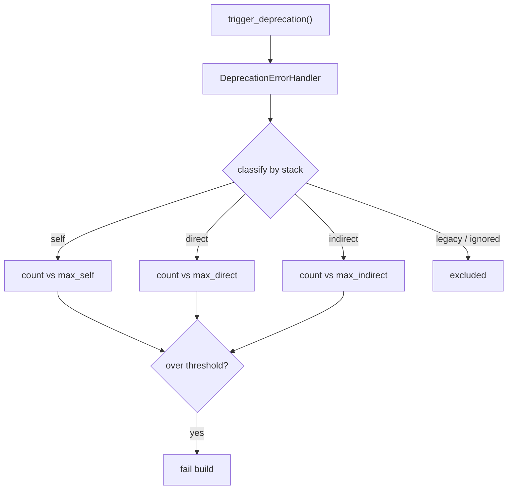

# Handling Deprecated Code in Tests

!!! tip "In a nutshell"
    Le PHPUnit bridge collecte les deprecations déclenchées et peut faire échouer
    le build, en classant chacune dans une catégorie self / direct / indirect /
    legacy. Piège d'examen : `#[IgnoreDeprecations]` (et non le `@group legacy`
    supprimé) fait taire un test, et `max[self]=0` n'échoue que sur *votre propre*
    code.

!!! example "Real-world analogy"
    Imaginez un inspecteur du bâtiment qui parcourt votre propriété et dresse la liste
    des infractions au code de la construction, chacune étiquetée selon le responsable.
    Certaines sont des choses que *vous* avez mal construites (**self**) ; d'autres viennent
    d'un entrepreneur que *vous avez engagé directement* (**direct**) ; d'autres encore sont
    enfouies dans le travail d'un sous-traitant auquel votre entrepreneur a délégué
    (**indirect**). C'est vous qui fixez la règle qui fait capoter la vente : échouer sur
    *n'importe quoi* (`max[total]=0`) ou seulement sur votre propre ouvrage (`max[self]=0`),
    en tolérant ce que d'autres doivent corriger. Une baseline, c'est la clause du droit
    acquis — une liste signée de problèmes déjà connus qui ne bloqueront pas la vente,
    si bien que seules les *nouvelles* infractions comptent.

!!! abstract "Learning objectives"
    À la fin de ce chapitre, vous saurez :

    - [ ] Expliquer les catégories de deprecations `self` / `direct` / `indirect` / `legacy`
    - [ ] Configurer les modes du helper : `max[...]`, `disabled`, `weak`
    - [ ] Faire taire les deprecations attendues avec `#[IgnoreDeprecations]`
    - [ ] Vérifier une deprecation attendue et utiliser une baseline pour la dette legacy

    **Syllabus:** `Automated Tests → Handling deprecated code` ·
    **Level:** Expert ·
    **Est. time:** 25 min ·
    **Prerequisites:** [PHPUnit Bridge](../appendices/out-of-syllabus/phpunit-bridge.md)

---

## Theory

Symfony annonce les suppressions d'API à l'avance en déclenchant
`E_USER_DEPRECATED` via `trigger_deprecation()`. Dans les tests, le
[PHPUnit bridge](../appendices/out-of-syllabus/phpunit-bridge.md) les **collecte** et peut **faire échouer le
build**, pour que les montées de version ne vous surprennent jamais. Tout l'art
consiste à distinguer *vos* deprecations (que vous devez corriger) de celles des
*tiers* (que vous tolérez en attendant qu'ils publient un correctif), et à faire
taire celles que vous testez délibérément.

```php
// Library code signals a future removal:
trigger_deprecation(
    'acme/blog',                        // package
    '2.4',                              // version that deprecated it
    'Method "%s()" is deprecated.',     // message (sprintf-style)
    'old',
);

// ...which internally triggers a silenced E_USER_DEPRECATED error:
@trigger_error(
    'Since acme/blog 2.4: Method "old()" is deprecated.',
    \E_USER_DEPRECATED,
);
```

!!! question "Predict first"
    Votre CI tourne avec `max[self]=0`. Une librairie vendor déclenche une
    deprecation au fin fond de ses propres entrailles. Le build passe-t-il au
    rouge ?

??? note "Reveal"
    Non — il s'agit d'une deprecation **indirect**, et `max[self]=0` ne compte que
    votre propre code (`self`). Elle est signalée mais ne fait pas échouer. Seule
    une deprecation `self` (ou un `max[total]=0` plus large) casserait le build.

## Deep Dive — how it works internally

Le `DeprecationErrorHandler` classe chaque deprecation en inspectant la pile
d'appels :

| Catégorie | Signification |
|---|---|
| **self** | Déclenchée par *votre propre* code (votre namespace) |
| **direct** | Déclenchée par une dépendance que vous appelez **directement** |
| **indirect** | Déclenchée au fin fond des entrailles d'une dépendance |
| **legacy** | Issue de tests marqués legacy (voir plus bas) — jamais comptée dans les seuils |

À la fin de l'exécution, le handler affiche les compteurs par catégorie et les
compare aux seuils de `SYMFONY_DEPRECATIONS_HELPER` (`max[self]`, `max[direct]`,
etc.). Dépasser n'importe quel seuil autre que `legacy` fait échouer la suite avec
un code de sortie non nul.

```console
$ # One threshold per bucket in SYMFONY_DEPRECATIONS_HELPER;
$ # exceeding any non-legacy one fails the run
$ SYMFONY_DEPRECATIONS_HELPER='max[self]=0&max[direct]=3&max[indirect]=999' \
    php bin/phpunit

$ # e.g. 1 self deprecation > max[self]=0 -> non-zero exit code
$ echo $?
1
```

### Marking and asserting deprecations

- `#[IgnoreDeprecations]` (`Symfony\Bridge\PhpUnit\Attribute\IgnoreDeprecations`)
  sur une méthode ou une classe de test indique au handler d'**ignorer** les
  deprecations de ce test — le remplaçant moderne de l'ancien docblock
  `@group legacy`.
- `ExpectUserDeprecationMessageTrait` et son helper
  `expectUserDeprecationMessage()` permettent à un test de **vérifier** qu'un
  message de deprecation précis est émis (utile quand *vous* ajoutez un
  `trigger_deprecation()` et voulez prouver qu'il se déclenche). L'ancien
  `ExpectDeprecationTrait::expectDeprecation()` a été supprimé en Symfony 7.0.

```php
use Symfony\Bridge\PhpUnit\Attribute\IgnoreDeprecations;
use Symfony\Bridge\PhpUnit\ExpectUserDeprecationMessageTrait;

final class LegacyPathTest extends TestCase
{
    use ExpectUserDeprecationMessageTrait;

    #[IgnoreDeprecations]   // handler skips this test's deprecations
    public function testDeprecatedPathStillWorks(): void
    {
        // exercising deprecated code here cannot fail the build
    }

    public function testEmitsDeprecation(): void
    {
        // asserts the message emitted by trigger_deprecation()
        // (the old ExpectDeprecationTrait::expectDeprecation() is gone)
        $this->expectUserDeprecationMessage('Since app 2.0: "foo()" is deprecated.');

        trigger_deprecation('app', '2.0', '"foo()" is deprecated.');
    }
}
```



!!! note "Source reference"
    La classification et les seuils vivent dans
    `Symfony\Bridge\PhpUnit\DeprecationErrorHandler` et sa `Configuration`
    ([symfony/symfony `8.0`](https://github.com/symfony/symfony/blob/8.0/src/Symfony/Bridge/PhpUnit/DeprecationErrorHandler/Configuration.php)).

### Baselines

Pour une base de code legacy noyée sous les deprecations, enregistrez une
**baseline** : un fichier JSON des deprecations déjà connues, qui seront ensuite
ignorées, si bien que le build n'échoue que sur les *nouvelles*. Générez-la une
fois, committez-la, puis réduisez-la au fil du temps.

Pour les règles de *rédaction* des deprecations du framework lui-même (comment et
quand appeler `trigger_deprecation()`, la promesse de BC), voir
[Architecture → Deprecations Best Practices](../architecture/deprecations.md).

## Configuration & code

=== "Helper modes"

    ```console
    $ # Fail on ANY deprecation (strictest)
    $ SYMFONY_DEPRECATIONS_HELPER='max[total]=0' php bin/phpunit

    $ # Fail only on YOUR code's deprecations; tolerate dependencies
    $ SYMFONY_DEPRECATIONS_HELPER='max[self]=0' php bin/phpunit

    $ # Report but never fail
    $ SYMFONY_DEPRECATIONS_HELPER=weak php bin/phpunit

    $ # Turn collection off entirely
    $ SYMFONY_DEPRECATIONS_HELPER=disabled=1 php bin/phpunit
    ```

=== "Ignore + assert"

    ```php
    <?php
    declare(strict_types=1);

    namespace App\Tests\Legacy;

    use App\Legacy\OldService;
    use PHPUnit\Framework\TestCase;
    use Symfony\Bridge\PhpUnit\Attribute\IgnoreDeprecations;
    use Symfony\Bridge\PhpUnit\ExpectUserDeprecationMessageTrait;

    final class OldServiceTest extends TestCase
    {
        use ExpectUserDeprecationMessageTrait;

        #[IgnoreDeprecations]                 // this test may exercise deprecated paths
        public function testStillWorks(): void
        {
            self::assertSame('ok', (new OldService())->run());
        }

        public function testEmitsDeprecation(): void
        {
            $this->expectUserDeprecationMessage(
                'Since app 2.0: Using OldService::legacy() is deprecated.',
            );

            (new OldService())->legacy();     // must trigger that exact deprecation
        }
    }
    ```

=== "Baseline"

    ```console
    $ # 1) Generate the baseline of current deprecations
    $ SYMFONY_DEPRECATIONS_HELPER='baselineFile=./tests/baseline.json&generateBaseline=true' \
        php bin/phpunit

    $ # 2) Subsequent runs ignore baselined deprecations, fail on new ones
    $ SYMFONY_DEPRECATIONS_HELPER='baselineFile=./tests/baseline.json' php bin/phpunit
    ```

## Best practices & anti-patterns

| ✅ À faire | ❌ À éviter |
|---|---|
| Garder `max[self]=0` — votre code reste propre | `disabled=1` qui masque votre propre dette |
| Utiliser une baseline pour les grosses suites legacy | Un `#[IgnoreDeprecations]` généralisé partout |
| `expectUserDeprecationMessage()` pour vos propres triggers | Vérifier le texte du message avec `assertStringContains` |
| Réduire la baseline au fil du temps | Régénérer la baseline à chaque échec |

## When (not) to use it / alternatives

Soyez **strict** (`max[self]=0` au minimum) sur votre propre code — c'est une
assurance de montée de version gratuite. Tolérez les deprecations `indirect` que
vous ne pouvez pas corriger (fixez `max[indirect]` plus haut ou utilisez une
baseline). N'utilisez `weak` que dans une CI transitoire où vous voulez de la
visibilité sans build rouge ; n'installez jamais `disabled=1` comme état
permanent.

!!! danger "Certification traps"
    - `self` = **votre** code, `direct` = une dépendance que **vous appelez**,
      `indirect` = au fin fond d'une dépendance. Les intervertir est un piège
      classique de l'examen.
    - `#[IgnoreDeprecations]` remplace l'ancien `@group legacy` pour faire taire
      les deprecations d'un test.
    - `weak` **signale** toujours ; seul `disabled=1` arrête la collecte.
    - `max[total]=0` échoue sur *n'importe quelle* catégorie ; `max[self]=0` est
      plus restreint.

!!! warning "Common mistakes"
    - Ajouter `#[IgnoreDeprecations]` pour cacher une deprecation que vous
      *devriez* corriger.
    - Oublier que le bridge/l'extension doit être actif pour que tout cela
      fonctionne.

## Exercises

1. **(Basique)** Configurez la CI pour n'échouer que lorsque *votre* code déclenche
   une deprecation, en tolérant celles des dépendances.
2. **(Intermédiaire)** Écrivez un test qui vérifie qu'appeler une méthode dépréciée
   émet le message `trigger_deprecation()` attendu.

??? success "Solutions"

    **1.**

    ```console
    $ SYMFONY_DEPRECATIONS_HELPER='max[self]=0' php bin/phpunit
    ```

    `self` ne compte que votre namespace ; les deprecations `direct`/`indirect`
    sont signalées mais ne font pas échouer le build.

    **2.**

    ```php
    <?php
    declare(strict_types=1);

    namespace App\Tests\Legacy;

    use App\Legacy\Registry;
    use PHPUnit\Framework\TestCase;
    use Symfony\Bridge\PhpUnit\ExpectUserDeprecationMessageTrait;

    final class RegistryTest extends TestCase
    {
        use ExpectUserDeprecationMessageTrait;

        public function testDeprecatedAlias(): void
        {
            $this->expectUserDeprecationMessage(
                'Since app 3.0: "Registry::add()" is deprecated, use "set()".',
            );

            (new Registry())->add('k', 'v');
        }
    }
    ```

## Certification questions

??? question "Q1. A deprecation triggered inside a vendor library's own internals is bucketed as…"
    - [ ] A. self
    - [ ] B. direct
    - [x] C. indirect ✅
    - [ ] D. legacy

    **Why:** `indirect` = déclenchée au fin fond d'une dépendance, pas par votre
    appel direct. **Ref:** [PHPUnit bridge](https://symfony.com/doc/8.0/components/phpunit_bridge.html#making-tests-fail).

??? question "Q2. Which value reports deprecations but never fails the build?"
    - [x] A. `weak` ✅
    - [ ] B. `disabled=1`
    - [ ] C. `max[total]=0`
    - [ ] D. `strict`

    **Why:** `weak` collecte et affiche sans imposer de seuils ; `disabled` arrête
    la collecte. **Ref:** [PHPUnit bridge](https://symfony.com/doc/8.0/components/phpunit_bridge.html#configuration).

??? question "Q3. The modern way to silence a single test's expected deprecations is…"
    - [x] A. `#[IgnoreDeprecations]` ✅
    - [ ] B. `@group legacy` (removed)
    - [ ] C. `error_reporting(0)`
    - [ ] D. `SYMFONY_DEPRECATIONS_HELPER=disabled`

    **Why:** l'attribut `IgnoreDeprecations` est le remplaçant actuel du groupe
    legacy. **Ref:** [PHPUnit bridge](https://symfony.com/doc/8.0/components/phpunit_bridge.html).

??? question "Q4. `max[self]=0` fails the build when…"
    - [x] A. Your own code triggers any deprecation ✅
    - [ ] B. Any dependency triggers a deprecation
    - [ ] C. Any deprecation from anywhere occurs
    - [ ] D. A test is marked legacy

    **Why:** `self` ne compte que les deprecations issues de votre code.
    **Ref:** [PHPUnit bridge](https://symfony.com/doc/8.0/components/phpunit_bridge.html#making-tests-fail).

## Key takeaways

- Catégories : **self** (vous) · **direct** (dépendance que vous appelez) ·
  **indirect** (entrailles d'une dépendance) · **legacy** (exclue).
- Modes : `max[self|direct|indirect|total]=n`, `weak` (signalement seul),
  `disabled=1` (désactivé), baseline (ignore le connu).
- `#[IgnoreDeprecations]` fait taire un test ; `expectUserDeprecationMessage()`
  en vérifie une.
- Gardez `max[self]=0` ; utilisez une baseline pour résorber la dette legacy.

## Last-minute revision

!!! tip "Cheat sheet"
    - Variable d'environnement : `SYMFONY_DEPRECATIONS_HELPER`.
    - `max[total]=0` (toutes) · `max[self]=0` (les vôtres) · `weak` · `disabled=1`.
    - Baseline : `baselineFile=…&generateBaseline=true`, puis `baselineFile=…`.
    - Attributs/traits : `#[IgnoreDeprecations]`, `ExpectUserDeprecationMessageTrait`.

## Connections

- **Depends on:** [PHPUnit Bridge](../appendices/out-of-syllabus/phpunit-bridge.md) — le `DeprecationErrorHandler` du bridge assure la classification et le contrôle des seuils.
- **Reused in:** [Architecture — Deprecations](../architecture/deprecations.md) — les règles du framework pour *rédiger* des deprecations.
- **Confused with:** [Unit Tests](unit-tests.md) — vérifier un message de deprecation diffère de vérifier une valeur de retour.

## Official References
- [Official Symfony docs — PHPUnit bridge deprecations](https://symfony.com/doc/8.0/components/phpunit_bridge.html#making-tests-fail)
- [Symfony source — DeprecationErrorHandler Configuration](https://github.com/symfony/symfony/blob/8.0/src/Symfony/Bridge/PhpUnit/DeprecationErrorHandler/Configuration.php)
- [Architecture — Deprecations Best Practices](../architecture/deprecations.md)

## Video references

!!! tip "Watch & learn"
    Voici des chaînes vidéo officielles, mises à jour en continu — cherchez-y
    « Symfony testing » pour consolider ce chapitre. Nous lions des chaînes stables
    plutôt que des vidéos individuelles pour que les références ne périment jamais.

    - [SymfonyCasts screencasts](https://symfonycasts.com/tracks/symfony) — tutoriels scénarisés à suivre en codant.
    - [Symfony official YouTube](https://www.youtube.com/@SymfonyOfficial) — conférences et keynotes SymfonyCon.
    - [Official docs for this topic](https://symfony.com/doc/8.0/components/phpunit_bridge.html#making-tests-fail) — certaines pages de la doc Symfony intègrent un screencast.

## Confidence check

Je suis prêt quand je peux :

- [ ] expliquer **pourquoi** échouer sur les deprecations est une assurance de montée de version gratuite
- [ ] configurer `max[self|direct|indirect|total]`, `weak`, `disabled` et une baseline
- [ ] déboguer pourquoi une deprecation est classée `indirect` au lieu de `self`
- [ ] repérer le piège : `#[IgnoreDeprecations]` a remplacé `@group legacy`
- [ ] expliquer comment le handler classe une deprecation d'après sa pile d'appels

---

<small>Related: [PHPUnit Bridge](../appendices/out-of-syllabus/phpunit-bridge.md) · [Architecture — Deprecations](../architecture/deprecations.md) · [Unit Tests](unit-tests.md)</small>
