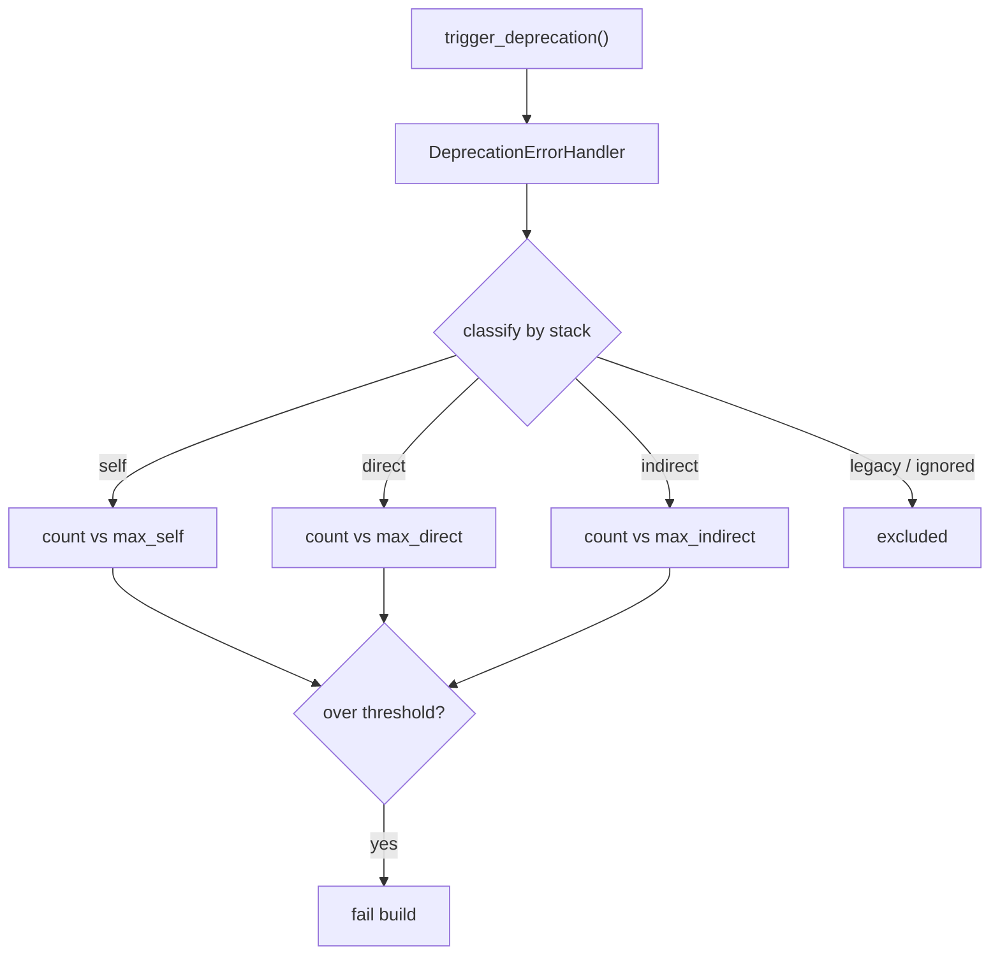

# Handling Deprecated Code in Tests

!!! tip "In a nutshell"
    The PHPUnit bridge collects triggered deprecations and can fail the build,
    sorting each into a self / direct / indirect / legacy bucket. Exam hook:
    `#[IgnoreDeprecations]` (not the removed `@group legacy`) silences a test, and
    `max[self]=0` fails only on *your own* code.

!!! example "Real-world analogy"
    Picture a building inspector walking your property and writing up code violations, each
    tagged by who is responsible. Some are things *you* built wrong (**self**); some come
    from a contractor *you hired directly* (**direct**); some are buried deep in a
    sub-contractor's work your contractor subbed out (**indirect**). You set the policy for
    when the sale falls through: fail on *anything* (`max[total]=0`) or only on your own
    workmanship (`max[self]=0`), tolerating what others must fix. A baseline is the
    grandfather clause — a signed list of already-known issues that won't block the sale, so
    only *new* violations do.

!!! abstract "Learning objectives"
    By the end of this chapter you can:

    - [ ] Explain the `self` / `direct` / `indirect` / `legacy` deprecation buckets
    - [ ] Configure the helper modes: `max[...]`, `disabled`, `weak`
    - [ ] Silence expected deprecations with `#[IgnoreDeprecations]`
    - [ ] Assert an expected deprecation and use a baseline for legacy debt

    **Syllabus:** `Automated Tests → Handling deprecated code` ·
    **Level:** Expert ·
    **Est. time:** 25 min ·
    **Prerequisites:** [PHPUnit Bridge](phpunit-bridge.md)

---

## Theory

Symfony signals API removals ahead of time by triggering `E_USER_DEPRECATED` via
`trigger_deprecation()`. In tests, the [PHPUnit bridge](phpunit-bridge.md)
**collects** these and can **fail the build** so upgrades never surprise you. The
skill is telling *your* deprecations (which you must fix) from *third-party* ones
(which you tolerate until they release a fix), and quieting the ones you
deliberately keep testing.

!!! question "Predict first"
    Your CI runs with `max[self]=0`. A vendor library triggers a deprecation deep
    inside its own internals. Does the build go red?

??? note "Reveal"
    No — that is an **indirect** deprecation, and `max[self]=0` counts only your
    own code (`self`). It is reported but does not fail. Only a `self` deprecation
    (or a broader `max[total]=0`) would break the build.

## Deep Dive — how it works internally

The `DeprecationErrorHandler` classifies each deprecation by inspecting the call
stack:

| Bucket | Meaning |
|---|---|
| **self** | Triggered by *your own* code (your namespace) |
| **direct** | Triggered by a dependency you called **directly** |
| **indirect** | Triggered deep inside a dependency's own internals |
| **legacy** | From tests marked legacy (see below) — never counted against thresholds |

At the end of the run the handler prints per-bucket counts and compares them with
the thresholds in `SYMFONY_DEPRECATIONS_HELPER` (`max[self]`, `max[direct]`, etc.).
Exceeding any non-`legacy` threshold fails the suite with a non-zero exit code.

### Marking and asserting deprecations

- `#[IgnoreDeprecations]` (`Symfony\Bridge\PhpUnit\Attribute\IgnoreDeprecations`)
  on a test method/class tells the handler to **ignore** deprecations from that
  test — the modern replacement for the old `@group legacy` docblock.
- `ExpectUserDeprecationMessageTrait` and its `expectUserDeprecationMessage()`
  helper let a test **assert** that a specific deprecation message is emitted
  (useful when *you* add a `trigger_deprecation()` and want to prove it fires). The
  old `ExpectDeprecationTrait::expectDeprecation()` was removed in Symfony 7.0.



!!! note "Source reference"
    Classification and thresholds live in
    `Symfony\Bridge\PhpUnit\DeprecationErrorHandler` and its `Configuration`
    ([symfony/symfony `8.0`](https://github.com/symfony/symfony/blob/8.0/src/Symfony/Bridge/PhpUnit/DeprecationErrorHandler/Configuration.php)).

### Baselines

For a legacy codebase drowning in deprecations, record a **baseline**: a JSON file
of currently-known deprecations that are then ignored, so the build only fails on
*new* ones. Generate it once, commit it, and reduce it over time.

For the framework's own deprecation *authoring* rules (how and when to call
`trigger_deprecation()`, the BC promise), see
[Architecture → Deprecations Best Practices](../architecture/deprecations.md).

## Configuration & code

=== "Helper modes"

    ```console
    $ # Fail on ANY deprecation (strictest)
    $ SYMFONY_DEPRECATIONS_HELPER='max[total]=0' php bin/phpunit

    $ # Fail only on YOUR code's deprecations; tolerate dependencies
    $ SYMFONY_DEPRECATIONS_HELPER='max[self]=0' php bin/phpunit

    $ # Report but never fail
    $ SYMFONY_DEPRECATIONS_HELPER=weak php bin/phpunit

    $ # Turn collection off entirely
    $ SYMFONY_DEPRECATIONS_HELPER=disabled=1 php bin/phpunit
    ```

=== "Ignore + assert"

    ```php
    <?php
    declare(strict_types=1);

    namespace App\Tests\Legacy;

    use App\Legacy\OldService;
    use PHPUnit\Framework\TestCase;
    use Symfony\Bridge\PhpUnit\Attribute\IgnoreDeprecations;
    use Symfony\Bridge\PhpUnit\ExpectUserDeprecationMessageTrait;

    final class OldServiceTest extends TestCase
    {
        use ExpectUserDeprecationMessageTrait;

        #[IgnoreDeprecations]                 // this test may exercise deprecated paths
        public function testStillWorks(): void
        {
            self::assertSame('ok', (new OldService())->run());
        }

        public function testEmitsDeprecation(): void
        {
            $this->expectUserDeprecationMessage(
                'Since app 2.0: Using OldService::legacy() is deprecated.',
            );

            (new OldService())->legacy();     // must trigger that exact deprecation
        }
    }
    ```

=== "Baseline"

    ```console
    $ # 1) Generate the baseline of current deprecations
    $ SYMFONY_DEPRECATIONS_HELPER='baselineFile=./tests/baseline.json&generateBaseline=true' \
        php bin/phpunit

    $ # 2) Subsequent runs ignore baselined deprecations, fail on new ones
    $ SYMFONY_DEPRECATIONS_HELPER='baselineFile=./tests/baseline.json' php bin/phpunit
    ```

## Best practices & anti-patterns

| ✅ Do | ❌ Avoid |
|---|---|
| Keep `max[self]=0` — your code stays clean | `disabled=1` masking your own debt |
| Use a baseline for large legacy suites | Blanket `#[IgnoreDeprecations]` everywhere |
| `expectUserDeprecationMessage()` for your own triggers | Asserting on message text with `assertStringContains` |
| Shrink the baseline over time | Regenerating the baseline on every failure |

## When (not) to use it / alternatives

Run **strict** (`max[self]=0` at minimum) on your own code — it is free upgrade
insurance. Tolerate `indirect` deprecations you can't fix (pin `max[indirect]`
higher or use a baseline). Use `weak` only in transitional CI where you want
visibility without a red build; never ship `disabled=1` as the permanent state.

!!! danger "Certification traps"
    - `self` = **your** code, `direct` = a dependency **you call**, `indirect` =
      deep inside a dependency. Getting these swapped is a classic exam trip.
    - `#[IgnoreDeprecations]` replaces the old `@group legacy` for silencing a
      test's deprecations.
    - `weak` still **reports**; only `disabled=1` stops collection.
    - `max[total]=0` fails on *any* bucket; `max[self]=0` is narrower.

!!! warning "Common mistakes"
    - Adding `#[IgnoreDeprecations]` to hide a deprecation you *should* fix.
    - Forgetting the bridge/extension must be active for any of this to work.

## Exercises

1. **(Basic)** Configure CI to fail only when *your* code triggers a deprecation,
   tolerating dependency deprecations.
2. **(Intermediate)** Write a test that asserts calling a deprecated method emits
   the expected `trigger_deprecation()` message.

??? success "Solutions"

    **1.**

    ```console
    $ SYMFONY_DEPRECATIONS_HELPER='max[self]=0' php bin/phpunit
    ```

    `self` counts only your namespace; `direct`/`indirect` deprecations are
    reported but do not fail the build.

    **2.**

    ```php
    <?php
    declare(strict_types=1);

    namespace App\Tests\Legacy;

    use App\Legacy\Registry;
    use PHPUnit\Framework\TestCase;
    use Symfony\Bridge\PhpUnit\ExpectUserDeprecationMessageTrait;

    final class RegistryTest extends TestCase
    {
        use ExpectUserDeprecationMessageTrait;

        public function testDeprecatedAlias(): void
        {
            $this->expectUserDeprecationMessage(
                'Since app 3.0: "Registry::add()" is deprecated, use "set()".',
            );

            (new Registry())->add('k', 'v');
        }
    }
    ```

## Certification questions

??? question "Q1. A deprecation triggered inside a vendor library's own internals is bucketed as…"
    - [ ] A. self
    - [ ] B. direct
    - [x] C. indirect ✅
    - [ ] D. legacy

    **Why:** `indirect` = triggered deep inside a dependency, not by your direct
    call. **Ref:** [PHPUnit bridge](https://symfony.com/doc/current/components/phpunit_bridge.html#making-tests-fail).

??? question "Q2. Which value reports deprecations but never fails the build?"
    - [x] A. `weak` ✅
    - [ ] B. `disabled=1`
    - [ ] C. `max[total]=0`
    - [ ] D. `strict`

    **Why:** `weak` collects and prints without enforcing thresholds; `disabled`
    stops collection. **Ref:** [PHPUnit bridge](https://symfony.com/doc/current/components/phpunit_bridge.html#configuration).

??? question "Q3. The modern way to silence a single test's expected deprecations is…"
    - [x] A. `#[IgnoreDeprecations]` ✅
    - [ ] B. `@group legacy` (removed)
    - [ ] C. `error_reporting(0)`
    - [ ] D. `SYMFONY_DEPRECATIONS_HELPER=disabled`

    **Why:** the `IgnoreDeprecations` attribute is the current replacement for the
    legacy group. **Ref:** [PHPUnit bridge](https://symfony.com/doc/current/components/phpunit_bridge.html).

??? question "Q4. `max[self]=0` fails the build when…"
    - [x] A. Your own code triggers any deprecation ✅
    - [ ] B. Any dependency triggers a deprecation
    - [ ] C. Any deprecation from anywhere occurs
    - [ ] D. A test is marked legacy

    **Why:** `self` counts only deprecations originating in your code.
    **Ref:** [PHPUnit bridge](https://symfony.com/doc/current/components/phpunit_bridge.html#making-tests-fail).

## Key takeaways

- Buckets: **self** (you) · **direct** (dep you call) · **indirect** (dep
  internals) · **legacy** (excluded).
- Modes: `max[self|direct|indirect|total]=n`, `weak` (report only),
  `disabled=1` (off), baseline (ignore known).
- `#[IgnoreDeprecations]` silences a test; `expectUserDeprecationMessage()`
  asserts one.
- Keep `max[self]=0`; use a baseline to burn down legacy debt.

## Last-minute revision

!!! tip "Cheat sheet"
    - Env var: `SYMFONY_DEPRECATIONS_HELPER`.
    - `max[total]=0` (any) · `max[self]=0` (yours) · `weak` · `disabled=1`.
    - Baseline: `baselineFile=…&generateBaseline=true`, then `baselineFile=…`.
    - Attributes/traits: `#[IgnoreDeprecations]`, `ExpectUserDeprecationMessageTrait`.

## Connections

- **Depends on:** [PHPUnit Bridge](phpunit-bridge.md) — the bridge's `DeprecationErrorHandler` does the bucketing and gating.
- **Reused in:** [Architecture — Deprecations](../architecture/deprecations.md) — the framework's own rules for *authoring* deprecations.
- **Confused with:** [Unit Tests](unit-tests.md) — asserting a deprecation message differs from asserting a return value.

## Official References
- [Official Symfony docs — PHPUnit bridge deprecations](https://symfony.com/doc/current/components/phpunit_bridge.html#making-tests-fail)
- [Symfony source — DeprecationErrorHandler Configuration](https://github.com/symfony/symfony/blob/8.0/src/Symfony/Bridge/PhpUnit/DeprecationErrorHandler/Configuration.php)
- [Architecture — Deprecations Best Practices](../architecture/deprecations.md)

## Video references

!!! tip "Watch & learn"
    These are official, continuously-updated video channels — search them for
    "Symfony testing" to reinforce this chapter. We link stable channels rather than
    individual videos so the references never rot.

    - [SymfonyCasts screencasts](https://symfonycasts.com/tracks/symfony) — scripted, code-along tutorials.
    - [Symfony official YouTube](https://www.youtube.com/@SymfonyOfficial) — SymfonyCon conference talks & keynotes.
    - [Official docs for this topic](https://symfony.com/doc/current/components/phpunit_bridge.html#making-tests-fail) — some Symfony doc pages embed a screencast.

## Confidence check

I'm ready when I can:

- [ ] explain **why** failing on deprecations is free upgrade insurance
- [ ] configure `max[self|direct|indirect|total]`, `weak`, `disabled`, and a baseline
- [ ] debug why a deprecation is bucketed `indirect` instead of `self`
- [ ] spot the trap that `#[IgnoreDeprecations]` replaced `@group legacy`
- [ ] explain how the handler classifies a deprecation by its call stack

---

<small>Related: [PHPUnit Bridge](phpunit-bridge.md) · [Architecture — Deprecations](../architecture/deprecations.md) · [Unit Tests](unit-tests.md)</small>
