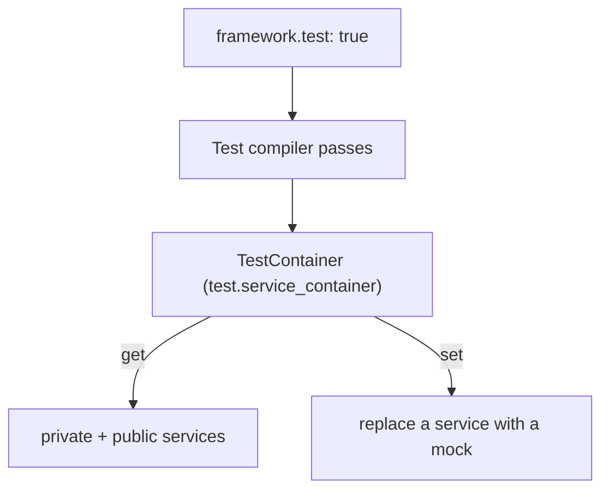

# Accessing Framework Objects in Tests

!!! tip "In a nutshell"
    Les tests atteignent les vrais services — ou y substituent des doublures —
    via le container de test de `self::getContainer()`, qui expose des services
    privés à l'exécution. Point d'examen : un remplacement par `set()` est jeté
    au prochain redémarrage du kernel, donc associez-le à `disableReboot()`.

!!! example "Real-world analogy"
    Pensez à un pass coulisses au théâtre. Pendant la vraie représentation
    (prod), l'équipe technique, les accessoires et les doublures restent cachés
    derrière le rideau — le public ne peut pas les atteindre (services privés).
    Mais à une répétition (l'environnement de test), on vous délivre un pass
    tout accès : `self::getContainer()` vous laisse aller en coulisses et saisir
    n'importe quel accessoire ou interprète, même ceux que le public ne voit
    jamais. Vous pouvez même remplacer un acteur par un remplaçant (`set()`).
    Souvenez-vous simplement que si la scène est démontée et réinitialisée entre
    les scènes (le kernel redémarre), votre remplaçant disparaît — vous devez
    verrouiller le plateau (`disableReboot()`) pour le garder à la scène
    suivante.

!!! abstract "Learning objectives"
    À la fin de ce chapitre, vous saurez :

    - [ ] Démarrer le kernel et atteindre des services avec `self::getContainer()`
    - [ ] Expliquer pourquoi le container de test expose les services **privés**
    - [ ] Remplacer ou mocker un service pour un test avec `$container->set()`
    - [ ] Choisir entre vrais services et doublures dans les tests d'intégration

    **Syllabus:** `Automated Tests → Accessing framework services` ·
    **Level:** Expert ·
    **Est. time:** 25 min ·
    **Prerequisites:** [Functional Tests](functional-tests.md), [Dependency Injection](../dependency-injection/index.md)

---

## Pour les nuls

### L'idée en une phrase
En environnement de test, tu as accès à **tous** les services — y compris les privés — via `self::getContainer()`, ce qui est impossible en production.

### Imagine dans la vraie vie
Un pass backstage dans un théâtre. Pendant la vraie représentation (prod), l'équipe, les accessoires et les doublures restent cachés derrière le rideau — le public ne peut pas les atteindre (services privés). Mais en répétition (l'environnement de test), on te délivre un pass tout accès.

### Dans Symfony
Remplacer temporairement un service de paiement réel par un double dans un test avec `$container->set('app.paiement', $double)` fonctionne — mais ce remplacement disparaît au prochain redémarrage du kernel.

### Exemple simple
```php
$container = static::getContainer();
$container->set(PaiementInterface::class, $doublePaiement);
```

### Comment le mémoriser 🧠
Un remplacement `set()` est **jeté** au prochain redémarrage du kernel — associe-le systématiquement à `disableReboot()` si tu as besoin qu'il survive à plusieurs requêtes dans le même test.

---


## Theory

Les tests ont souvent besoin de vrais objets du framework — un repository, un
mailer, le router — ou doivent en **substituer** un par une doublure
contrôlable. Symfony les expose via un **container de test** dédié, accessible
depuis `KernelTestCase::getContainer()`. C'est le même graphe que celui utilisé
par l'application, mais avec une visibilité assouplie pour que les tests
puissent y accéder.

!!! question "Predict first"
    Vous faites `set()` d'un mock sur `self::getContainer()`, lancez une
    request, puis une seconde — et la seconde utilise à nouveau le *vrai*
    service. Qu'avez-vous oublié ?

??? note "Reveal"
    `$client->disableReboot()`. Par défaut, le kernel redémarre après chaque
    request, reconstruisant le container et jetant votre remplacement.
    Désactivez le redémarrage pour garder le mock vivant entre les requests.

## Deep Dive — how it works internally

À l'exécution, Symfony rend la plupart des services **privés** : ils sont
inlinés dans leurs consommateurs et retirés de la carte publique du container,
donc `$container->get()` ne peut pas les récupérer. Excellent pour les
performances, mais hostile au testing.

Dans l'environnement `test`, `framework.test: true` déclenche les compiler
passes `TestServiceContainerRealRefPass`/`TestServiceContainerWeakRefPass`, qui
construisent un second container,
`Symfony\Component\DependencyInjection\Test\TestContainer` (id
`test.service_container`). Il conserve des références vers les services
autrement privés/supprimés, si bien que
`self::getContainer()->get(Foo::class)` fonctionne **même pour les services
privés** — mais seulement pour les services réellement **utilisés** quelque part
(les services privés inutilisés sont toujours optimisés et supprimés).

```php
// framework.test: true (config/packages/test/framework.yaml) triggers the
// TestServiceContainerRealRefPass / TestServiceContainerWeakRefPass passes,
// which compile the TestContainer (service id "test.service_container")
self::bootKernel();

$container = self::getContainer();   // the TestContainer

// works even for a PRIVATE service — as long as it is used somewhere
$repository = $container->get(Foo::class);
```

`TestContainer::set()` vous permet de **remplacer** une instance de service.
Combiné au [`disableReboot()`](client.md) du client, le remplacement persiste
entre les requests.

```php
$client = static::createClient();
$client->disableReboot();            // keep the kernel (and container) alive

// TestContainer::set() swaps the real service for a double
self::getContainer()->set(PaymentGateway::class, $this->createMock(PaymentGateway::class));

$client->request('POST', '/checkout');     // first request uses the mock
$client->request('GET', '/confirmation');  // still the mock — no reboot happened
```



!!! note "Source reference"
    `self::getContainer()` retourne `test.service_container`, un
    `TestContainer` exposant les services non publics
    ([symfony/symfony `8.0`](https://github.com/symfony/symfony/blob/8.0/src/Symfony/Component/DependencyInjection/Test/TestContainer.php)).

### `getContainer()` vs `$kernel->getContainer()`

`static::$kernel->getContainer()` retourne le container **normal** — les
services privés y sont cachés et un `get()` sur eux lève une exception.
Utilisez toujours `self::getContainer()` dans les tests. (La propriété
historique `static::$container` a été supprimée ; utilisez la méthode.)

```php
self::bootKernel();

// normal container: private services are hidden, get() throws
static::$kernel->getContainer()->get(UserRepository::class); // ServiceNotFoundException

// test container: private services are reachable
self::getContainer()->get(UserRepository::class);            // OK

// the removed static::$container property is NOT available anymore
```

## Configuration & code

=== "Fetching a real service"

    ```php
    <?php
    declare(strict_types=1);

    namespace App\Tests\Service;

    use App\Repository\UserRepository;
    use Symfony\Bundle\FrameworkBundle\Test\KernelTestCase;

    final class UserRepositoryTest extends KernelTestCase
    {
        public function testCountsUsers(): void
        {
            self::bootKernel();
            $repo = self::getContainer()->get(UserRepository::class); // private? still works

            self::assertGreaterThanOrEqual(0, $repo->count([]));
        }
    }
    ```

=== "Replacing with a mock"

    ```php
    <?php
    declare(strict_types=1);

    namespace App\Tests\Controller;

    use App\Payment\PaymentGateway;
    use Symfony\Bundle\FrameworkBundle\Test\WebTestCase;

    final class CheckoutTest extends WebTestCase
    {
        public function testCheckoutUsesGateway(): void
        {
            $client = static::createClient();
            $client->disableReboot();                 // keep the replacement alive

            $gateway = $this->createMock(PaymentGateway::class);
            $gateway->method('charge')->willReturn(true);

            self::getContainer()->set(PaymentGateway::class, $gateway);

            $client->request('POST', '/checkout');
            self::assertResponseIsSuccessful();
        }
    }
    ```

=== "Booting options"

    ```php
    <?php
    declare(strict_types=1);

    namespace App\Tests;

    use Symfony\Bundle\FrameworkBundle\Test\KernelTestCase;

    final class BootTest extends KernelTestCase
    {
        public function testBootWithOptions(): void
        {
            self::bootKernel(['environment' => 'test', 'debug' => false]);
            self::assertSame('test', self::$kernel->getEnvironment());
        }
    }
    ```

## Best practices & anti-patterns

| ✅ Do | ❌ Avoid |
|---|---|
| `self::getContainer()` pour n'importe quel service | `static::$kernel->getContainer()->get(private)` |
| Ne remplacer que la frontière (gateway, horloge) | Mocker la classe testée |
| `disableReboot()` avant le duo `set()` puis request | Espérer qu'un `set()` survive à un redémarrage |
| Préférer les vrais services dans les tests d'intégration | Tout mocker et ne rien tester de réel |

## When (not) to use it / alternatives

Récupérez les **vrais** services quand l'enjeu est l'intégration (routing →
repository). **Remplacez** un service uniquement à une *frontière externe* que
vous ne devez pas toucher (paiement, SMS, HTTP tiers) ou pour rendre le
comportement déterministe (horloge, aléa). Pour le temps en particulier,
préférez injecter `Symfony\Component\Clock\ClockInterface` et substituer un
`MockClock` plutôt que de mocker l'horloge globalement.

!!! danger "Certification traps"
    - Seul `self::getContainer()` (le container **test**) expose les services
      privés ; `$kernel->getContainer()` non.
    - Un service privé doit être **utilisé** quelque part pour apparaître dans
      le container de test ; un service privé totalement inutilisé reste
      optimisé et supprimé.
    - Les remplacements via `$container->set()` sont perdus au redémarrage du
      kernel — associez-les à `disableReboot()`.
    - L'ancienne propriété `static::$container` a disparu ; appelez
      `self::getContainer()`.

!!! warning "Common mistakes"
    - Remplacer un service **après** la request qui l'utilise.
    - Récupérer des services avant `bootKernel()`/`createClient()` (rien à
      récupérer).

## Exercises

1. **(Basic)** Dans un `KernelTestCase`, récupérez le service `router` et
   vérifiez que générer `app_home` donne `/`.
2. **(Intermediate)** Remplacez un service `Clock`/gateway par un mock et
   prouvez qu'un controller utilise la valeur mockée sur une seule request.

??? success "Solutions"

    **1.**

    ```php
    <?php
    declare(strict_types=1);

    namespace App\Tests\Service;

    use Symfony\Bundle\FrameworkBundle\Test\KernelTestCase;
    use Symfony\Component\Routing\RouterInterface;

    final class RouterServiceTest extends KernelTestCase
    {
        public function testGenerate(): void
        {
            self::bootKernel();
            $router = self::getContainer()->get(RouterInterface::class);

            self::assertSame('/', $router->generate('app_home'));
        }
    }
    ```

    **2.**

    ```php
    <?php
    declare(strict_types=1);

    namespace App\Tests\Controller;

    use App\Sms\SmsSender;
    use Symfony\Bundle\FrameworkBundle\Test\WebTestCase;

    final class OtpTest extends WebTestCase
    {
        public function testSendsOtp(): void
        {
            $client = static::createClient();
            $client->disableReboot();

            $sms = $this->createMock(SmsSender::class);
            $sms->expects(self::once())->method('send');
            self::getContainer()->set(SmsSender::class, $sms);

            $client->request('POST', '/otp/request', ['phone' => '+123']);
            self::assertResponseIsSuccessful();
        }
    }
    ```

## Certification questions

??? question "Q1. Which container exposes private services in tests?"
    - [x] A. `self::getContainer()` (the test container) ✅
    - [ ] B. `static::$kernel->getContainer()`
    - [ ] C. `$this->container`
    - [ ] D. Any container in prod

    **Why:** l'environnement `test` compile un `TestContainer` qui garde
    accessibles les services privés/non partagés.
    **Ref:** [Testing](https://symfony.com/doc/8.0/testing.html#accessing-the-container).

??? question "Q2. A private service you never inject anywhere will…"
    - [x] A. Still be removed — the test container only keeps *used* services ✅
    - [ ] B. Always be available in test
    - [ ] C. Become public automatically
    - [ ] D. Throw at compile time

    **Why:** les services privés inutilisés sont optimisés et supprimés, même en
    test.
    **Ref:** [Testing](https://symfony.com/doc/8.0/testing.html#accessing-the-container).

??? question "Q3. `getContainer()->set($id, $mock)` survives across requests only if…"
    - [x] A. You called `$client->disableReboot()` ✅
    - [ ] B. The service is public
    - [ ] C. You call `set()` twice
    - [ ] D. You enable the profiler

    **Why:** le redémarrage par défaut reconstruit le container et jette les
    remplacements.
    **Ref:** [Testing](https://symfony.com/doc/8.0/testing.html).

??? question "Q4. The correct way to boot without debug is…"
    - [x] A. `self::bootKernel(['debug' => false])` ✅
    - [ ] B. `self::bootKernel(false)`
    - [ ] C. `new Kernel('test', false)` directly
    - [ ] D. Setting `APP_DEBUG` at runtime only

    **Why:** `bootKernel()` accepte un tableau d'options avec
    `environment`/`debug`.
    **Ref:** [Testing](https://symfony.com/doc/8.0/testing.html).

## Key takeaways

- `self::getContainer()` = le container de test ; il expose les services privés
  **utilisés**.
- `$kernel->getContainer()` garde les services privés cachés — ne l'utilisez
  pas dans les tests.
- Remplacez les services de frontière avec `set()` ; associez à
  `disableReboot()` pour persister.
- `bootKernel(['environment' => ..., 'debug' => ...])` contrôle le démarrage du
  kernel.

## Last-minute revision

!!! tip "Cheat sheet"
    - Récupérer : `self::getContainer()->get(Foo::class)` (privé OK si utilisé).
    - Remplacer : `self::getContainer()->set(Foo::class, $mock)`.
    - Persister le remplacement : `$client->disableReboot()` d'abord.
    - Id du container : `test.service_container` (`TestContainer`).

## Connections

- **Depends on:** [The Container](../dependency-injection/container.md) — le container de test est le même graphe de services avec une visibilité assouplie.
- **Reused in:** [Functional Tests](functional-tests.md) — là où vous récupérez et remplacez des services en cours de test.
- **Confused with:** [The Client](client.md) — `disableReboot()` vit sur le client mais c'est lui qui fait persister un remplacement `set()`.

## Official References
- [Official Symfony docs — Accessing the container](https://symfony.com/doc/8.0/testing.html#accessing-the-container)
- [Official Symfony docs — Mocking services](https://symfony.com/doc/8.0/testing.html#mocking-services)
- [Symfony source — TestContainer](https://github.com/symfony/symfony/blob/8.0/src/Symfony/Component/DependencyInjection/Test/TestContainer.php)

## Video references

!!! tip "Watch & learn"
    Voici des chaînes vidéo officielles, mises à jour en continu — cherchez-y
    "Symfony testing" pour consolider ce chapitre. Nous lions des chaînes
    stables plutôt que des vidéos individuelles afin que les références ne
    périment jamais.

    - [SymfonyCasts screencasts](https://symfonycasts.com/tracks/symfony) — tutoriels scénarisés à suivre en codant.
    - [Symfony official YouTube](https://www.youtube.com/@SymfonyOfficial) — conférences et keynotes SymfonyCon.
    - [Official docs for this topic](https://symfony.com/doc/8.0/testing.html#accessing-the-container) — certaines pages de la doc Symfony intègrent un screencast.

## Confidence check

Je suis prêt quand je peux :

- [ ] expliquer **pourquoi** le container de test expose des services privés à l'exécution
- [ ] récupérer et remplacer des services via `self::getContainer()` dans Symfony 8
- [ ] déboguer un remplacement qui disparaît à la request suivante
- [ ] repérer le piège : un service privé *inutilisé* est quand même optimisé et supprimé
- [ ] expliquer quels compiler passes construisent le `TestContainer`

---

<small>Related: [Functional Tests](functional-tests.md) · [The Client](client.md) · [Dependency Injection](../dependency-injection/index.md)</small>
