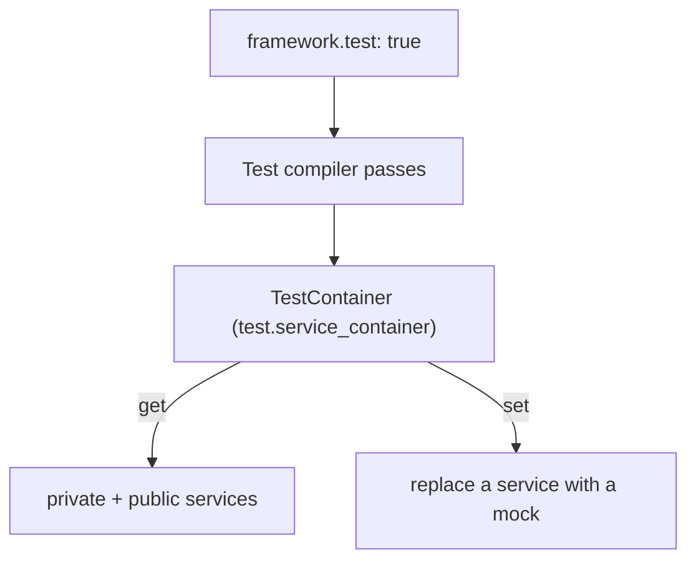

# Accessing Framework Objects in Tests

!!! tip "In a nutshell"
    Tests reach real services — or swap in doubles — through the test container from
    `self::getContainer()`, which exposes services that are private at runtime. Exam
    hook: a `set()` replacement is discarded on the next kernel reboot, so pair it
    with `disableReboot()`.

!!! abstract "Learning objectives"
    By the end of this chapter you can:

    - [ ] Boot the kernel and reach services with `self::getContainer()`
    - [ ] Explain why the test container exposes **private** services
    - [ ] Replace or mock a service for a test with `$container->set()`
    - [ ] Choose between real services and doubles in integration tests

    **Syllabus:** `Automated Tests → Accessing framework services` ·
    **Level:** Expert ·
    **Est. time:** 25 min ·
    **Prerequisites:** [Functional Tests](functional-tests.md), [Dependency Injection](../dependency-injection/index.md)

---

## Theory

Tests often need real framework objects — a repository, a mailer, the router — or
need to **swap** one for a controllable double. Symfony exposes them through a
dedicated **test container** available from `KernelTestCase::getContainer()`. It is
the same graph the app uses, but with visibility relaxed so tests can reach into
it.

## Deep Dive — how it works internally

At runtime Symfony makes most services **private**: they are inlined into their
consumers and removed from the container's public map, so `$container->get()`
can't fetch them. That is great for performance but hostile to testing.

In the `test` environment, `framework.test: true` triggers the
`TestServiceContainerRealRefPass`/`TestServiceContainerWeakRefPass` compiler passes
that build a second container, `Symfony\Component\DependencyInjection\Test\TestContainer`
(id `test.service_container`). It keeps references to services that are otherwise
private/removed, so `self::getContainer()->get(Foo::class)` works **even for
private services** — but only for services that are actually **used** somewhere
(unused private services are still optimised away).

`TestContainer::set()` lets you **replace** a service instance. Combined with the
client's [`disableReboot()`](client.md), the replacement persists across requests.



!!! note "Source reference"
    `self::getContainer()` returns `test.service_container`, a `TestContainer`
    exposing non-public services
    ([symfony/symfony `8.0`](https://github.com/symfony/symfony/blob/8.0/src/Symfony/Component/DependencyInjection/Test/TestContainer.php)).

### `getContainer()` vs `$kernel->getContainer()`

`static::$kernel->getContainer()` returns the **normal** container — private
services are hidden and `get()` on them throws. Always use `self::getContainer()`
in tests. (The historical `static::$container` property was removed; use the
method.)

## Configuration & code

=== "Fetching a real service"

    ```php
    <?php
    declare(strict_types=1);

    namespace App\Tests\Service;

    use App\Repository\UserRepository;
    use Symfony\Bundle\FrameworkBundle\Test\KernelTestCase;

    final class UserRepositoryTest extends KernelTestCase
    {
        public function testCountsUsers(): void
        {
            self::bootKernel();
            $repo = self::getContainer()->get(UserRepository::class); // private? still works

            self::assertGreaterThanOrEqual(0, $repo->count([]));
        }
    }
    ```

=== "Replacing with a mock"

    ```php
    <?php
    declare(strict_types=1);

    namespace App\Tests\Controller;

    use App\Payment\PaymentGateway;
    use Symfony\Bundle\FrameworkBundle\Test\WebTestCase;

    final class CheckoutTest extends WebTestCase
    {
        public function testCheckoutUsesGateway(): void
        {
            $client = static::createClient();
            $client->disableReboot();                 // keep the replacement alive

            $gateway = $this->createMock(PaymentGateway::class);
            $gateway->method('charge')->willReturn(true);

            self::getContainer()->set(PaymentGateway::class, $gateway);

            $client->request('POST', '/checkout');
            self::assertResponseIsSuccessful();
        }
    }
    ```

=== "Booting options"

    ```php
    <?php
    declare(strict_types=1);

    namespace App\Tests;

    use Symfony\Bundle\FrameworkBundle\Test\KernelTestCase;

    final class BootTest extends KernelTestCase
    {
        public function testBootWithOptions(): void
        {
            self::bootKernel(['environment' => 'test', 'debug' => false]);
            self::assertSame('test', self::$kernel->getEnvironment());
        }
    }
    ```

## Best practices & anti-patterns

| ✅ Do | ❌ Avoid |
|---|---|
| `self::getContainer()` for any service | `static::$kernel->getContainer()->get(private)` |
| Replace only the boundary (gateway, clock) | Mocking the class under test |
| `disableReboot()` before `set()`-then-request | Expecting `set()` to survive a reboot |
| Prefer real services in integration tests | Mocking everything, testing nothing real |

## When (not) to use it / alternatives

Fetch **real** services when the point is integration (routing → repository).
**Replace** a service only at an *external boundary* you must not hit (payment,
SMS, third-party HTTP) or to make behaviour deterministic (clock, randomness).
For time specifically, prefer injecting `Symfony\Component\Clock\ClockInterface`
and swapping a `MockClock` over global clock mocking.

!!! danger "Certification traps"
    - Only `self::getContainer()` (the **test** container) exposes private
      services; `$kernel->getContainer()` does not.
    - A private service must be **used** somewhere to appear in the test container;
      a completely unused private service is still optimised away.
    - `$container->set()` replacements are lost on kernel reboot — pair with
      `disableReboot()`.
    - The old `static::$container` property is gone; call `self::getContainer()`.

!!! warning "Common mistakes"
    - Replacing a service **after** the request that uses it.
    - Fetching services before `bootKernel()`/`createClient()` (nothing to fetch).

## Exercises

1. **(Basic)** In a `KernelTestCase`, fetch the `router` service and assert
   generating `app_home` yields `/`.
2. **(Intermediate)** Replace a `Clock`/gateway service with a mock and prove a
   controller uses the mocked value across a single request.

??? success "Solutions"

    **1.**

    ```php
    <?php
    declare(strict_types=1);

    namespace App\Tests\Service;

    use Symfony\Bundle\FrameworkBundle\Test\KernelTestCase;
    use Symfony\Component\Routing\RouterInterface;

    final class RouterServiceTest extends KernelTestCase
    {
        public function testGenerate(): void
        {
            self::bootKernel();
            $router = self::getContainer()->get(RouterInterface::class);

            self::assertSame('/', $router->generate('app_home'));
        }
    }
    ```

    **2.**

    ```php
    <?php
    declare(strict_types=1);

    namespace App\Tests\Controller;

    use App\Sms\SmsSender;
    use Symfony\Bundle\FrameworkBundle\Test\WebTestCase;

    final class OtpTest extends WebTestCase
    {
        public function testSendsOtp(): void
        {
            $client = static::createClient();
            $client->disableReboot();

            $sms = $this->createMock(SmsSender::class);
            $sms->expects(self::once())->method('send');
            self::getContainer()->set(SmsSender::class, $sms);

            $client->request('POST', '/otp/request', ['phone' => '+123']);
            self::assertResponseIsSuccessful();
        }
    }
    ```

## Certification questions

??? question "Q1. Which container exposes private services in tests?"
    - [x] A. `self::getContainer()` (the test container) ✅
    - [ ] B. `static::$kernel->getContainer()`
    - [ ] C. `$this->container`
    - [ ] D. Any container in prod

    **Why:** the `test` env compiles a `TestContainer` that keeps private/non-shared
    services reachable. **Ref:** [Testing](https://symfony.com/doc/current/testing.html#accessing-the-container).

??? question "Q2. A private service you never inject anywhere will…"
    - [x] A. Still be removed — the test container only keeps *used* services ✅
    - [ ] B. Always be available in test
    - [ ] C. Become public automatically
    - [ ] D. Throw at compile time

    **Why:** unused private services are optimised out even in test.
    **Ref:** [Testing](https://symfony.com/doc/current/testing.html#accessing-the-container).

??? question "Q3. `getContainer()->set($id, $mock)` survives across requests only if…"
    - [x] A. You called `$client->disableReboot()` ✅
    - [ ] B. The service is public
    - [ ] C. You call `set()` twice
    - [ ] D. You enable the profiler

    **Why:** the default reboot rebuilds the container and discards replacements.
    **Ref:** [Testing](https://symfony.com/doc/current/testing.html).

??? question "Q4. The correct way to boot without debug is…"
    - [x] A. `self::bootKernel(['debug' => false])` ✅
    - [ ] B. `self::bootKernel(false)`
    - [ ] C. `new Kernel('test', false)` directly
    - [ ] D. Setting `APP_DEBUG` at runtime only

    **Why:** `bootKernel()` accepts an options array with `environment`/`debug`.
    **Ref:** [Testing](https://symfony.com/doc/current/testing.html).

## Key takeaways

- `self::getContainer()` = the test container; it exposes **used** private services.
- `$kernel->getContainer()` keeps private services hidden — don't use it in tests.
- Replace boundary services with `set()`; pair with `disableReboot()` to persist.
- `bootKernel(['environment' => ..., 'debug' => ...])` controls how the kernel boots.

## Last-minute revision

!!! tip "Cheat sheet"
    - Fetch: `self::getContainer()->get(Foo::class)` (private OK if used).
    - Replace: `self::getContainer()->set(Foo::class, $mock)`.
    - Persist replacement: `$client->disableReboot()` first.
    - Container id: `test.service_container` (`TestContainer`).

## Official References
- [Official Symfony docs — Accessing the container](https://symfony.com/doc/current/testing.html#accessing-the-container)
- [Official Symfony docs — Mocking services](https://symfony.com/doc/current/testing.html#mocking-services)
- [Symfony source — TestContainer](https://github.com/symfony/symfony/blob/8.0/src/Symfony/Component/DependencyInjection/Test/TestContainer.php)

---

<small>Related: [Functional Tests](functional-tests.md) · [The Client](client.md) · [Dependency Injection](../dependency-injection/index.md)</small>
