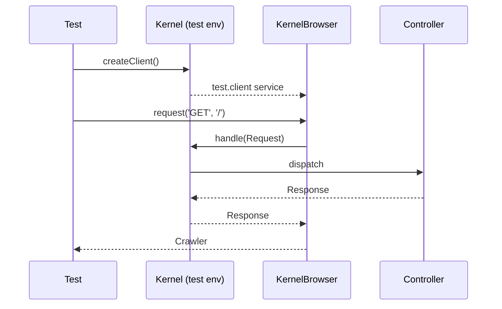

# Functional Tests

!!! tip "In a nutshell"
    Les tests fonctionnels démarrent le *vrai* kernel et le pilotent comme un
    navigateur pour prouver qu'une request complète fonctionne de bout en bout.
    `WebTestCase` (HTTP + client) étend `KernelTestCase` (kernel seul). Point
    d'examen : `self::getContainer()` retourne le container **test** spécial, il
    peut donc vous donner même des services **privés**.

!!! example "Real-world analogy"
    Un test fonctionnel est une répétition générale sur la vraie scène — vrais
    décors, vrais éclairages, toute la troupe — plutôt que des acteurs lisant
    leur texte dans une salle annexe. Vous jouez la représentation entière du
    lever au baisser de rideau (routing → controller → Twig → sécurité) et vous
    jugez le résultat. `WebTestCase` est la version avec un siège de spectateur
    et des jumelles de théâtre (un client navigateur) depuis lequel vous
    observez et réagissez ; `KernelTestCase` fait seulement monter la troupe sur
    scène sans public, pour quand vous n'avez qu'à vérifier le travail d'un seul
    interprète. Et comme c'est une répétition, vous avez ce pass coulisses tout
    accès — le container de test vous donne même l'équipe technique que le
    public payant ne voit jamais.

!!! abstract "Learning objectives"
    À la fin de ce chapitre, vous saurez :

    - [ ] Distinguer `KernelTestCase` de `WebTestCase` et choisir le bon
    - [ ] Démarrer un client avec `static::createClient()` et envoyer une request
    - [ ] Expliquer ce que change l'environnement `test` et où vit sa configuration
    - [ ] Atteindre des services avec `self::getContainer()` et savoir pourquoi ils sont visibles

    **Syllabus:** `Automated Tests → Functional Testing` ·
    **Level:** Advanced → Expert ·
    **Est. time:** 30 min ·
    **Prerequisites:** [Unit Tests](unit-tests.md), [Controllers](../controllers/index.md)

---

## Theory

Un **test fonctionnel** démarre le *vrai* kernel Symfony et le pilote comme un
navigateur : il envoie une request HTTP à travers toute la pile (routing →
controller → Twig → sécurité) et fait des assertions sur la response. Il existe
deux classes de base :

| Base class | Boots kernel | Has a Client | Use for |
|---|---|---|---|
| `KernelTestCase` | ✅ | ❌ | Services, commandes, BDD — pas de HTTP |
| `WebTestCase` | ✅ | ✅ | Tests HTTP request/response complets |

`WebTestCase` **étend** `KernelTestCase`, en ajoutant le client navigateur. Si
vous n'avez besoin que du container (par exemple pour tester un service avec le
vrai câblage ou exécuter un handler Messenger), utilisez `KernelTestCase`.

```php
// KernelTestCase: boots the kernel only — no HTTP client
final class InvoiceHandlerTest extends KernelTestCase
{
    public function testHandler(): void
    {
        self::bootKernel();
        $handler = self::getContainer()->get(InvoiceHandler::class);
    }
}

// WebTestCase extends KernelTestCase and adds the browser client
final class HomeTest extends WebTestCase
{
    public function testHome(): void
    {
        $client = static::createClient(); // the only addition
        $client->request('GET', '/');
    }
}
```

!!! question "Predict first"
    Vous appelez `self::getContainer()->get()` dans un `WebTestCase` et
    récupérez avec succès un service qui est `private` à l'exécution. D'où vient
    ce service ?

??? note "Reveal"
    Pas du container d'exécution — l'environnement `test` compile un *second*
    container, `test.service_container` (un `TestContainer`), qui garde
    accessibles les services privés/non partagés. `static::$kernel->getContainer()`
    le cacherait toujours.

## Deep Dive — how it works internally

`Symfony\Bundle\FrameworkBundle\Test\KernelTestCase` crée le kernel via
`static::createKernel()` / `static::bootKernel()`, en le stockant dans
`static::$kernel`. `Symfony\Bundle\FrameworkBundle\Test\WebTestCase::createClient()`
démarre le kernel **puis** récupère le service `test.client` — un
`Symfony\Bundle\FrameworkBundle\KernelBrowser`. Ce service n'existe que lorsque
`framework.test: true`, ce que le fichier par défaut
`config/packages/test/framework.yaml` active.

```php
// In a KernelTestCase: bootKernel() calls static::createKernel() internally
self::bootKernel();
$kernel = static::$kernel;          // the booted kernel is stored statically

// In a WebTestCase: createClient() boots the kernel then fetches "test.client"
$client = static::createClient();   // a KernelBrowser instance

// test.client exists only with framework.test: true
// (enabled by config/packages/test/framework.yaml)
```

`createClient()` **redémarre le kernel** avant de retourner (état frais), et le
client le redémarre encore après chaque request, sauf si vous appelez
[`disableReboot()`](client.md). Un **seul** client/kernel peut être actif par
test ; appeler `createClient()` une seconde fois lève une exception.

```php
$client = static::createClient();   // reboots the kernel: fresh state
$client->disableReboot();           // keep the same kernel across requests

$client->request('GET', '/first');
$client->request('GET', '/second'); // same container — no reboot in between

// static::createClient();          // second call in the same test: throws
```

### The test container and private services

`self::getContainer()` ne retourne **pas** le container d'exécution normal.
Dans l'environnement `test`, le framework compile un
`Symfony\Component\DependencyInjection\Test\TestContainer` spécial (id de
service `test.service_container`) qui expose aussi les services **privés** et
**non partagés**, afin que les tests puissent récupérer et remplacer des
collaborateurs invisibles à l'exécution. C'est le fait le plus testé de cette
étape.

```php
self::bootKernel();

// getContainer() returns the TestContainer ("test.service_container"),
// NOT the runtime container
$container = self::getContainer();

// private / non-shared services are reachable and replaceable
$mailer = $container->get(NewsletterMailer::class);
$container->set(NewsletterMailer::class, $this->createMock(NewsletterMailer::class));
```



!!! note "Source reference"
    `WebTestCase::createClient()` retourne `test.client` (un `KernelBrowser`) ;
    `getContainer()` retourne `test.service_container`
    ([symfony/symfony `8.0`](https://github.com/symfony/symfony/blob/8.0/src/Symfony/Bundle/FrameworkBundle/Test/KernelTestCase.php)).

## Configuration & code

=== "WebTestCase"

    ```php
    <?php
    declare(strict_types=1);

    namespace App\Tests\Controller;

    use Symfony\Bundle\FrameworkBundle\Test\WebTestCase;

    final class HomeControllerTest extends WebTestCase
    {
        public function testHomepageIsSuccessful(): void
        {
            $client = static::createClient();
            $crawler = $client->request('GET', '/');

            self::assertResponseIsSuccessful();
            self::assertSelectorTextContains('h1', 'Welcome');
        }
    }
    ```

=== "KernelTestCase"

    ```php
    <?php
    declare(strict_types=1);

    namespace App\Tests\Service;

    use App\Pricing\PriceCalculator;
    use Symfony\Bundle\FrameworkBundle\Test\KernelTestCase;

    final class PriceCalculatorServiceTest extends KernelTestCase
    {
        public function testRealWiring(): void
        {
            self::bootKernel();
            $calc = self::getContainer()->get(PriceCalculator::class); // even if private

            self::assertSame(1200, $calc->withTax(1000, 'FR'));
        }
    }
    ```

=== "test config"

    ```yaml
    # config/packages/test/framework.yaml
    framework:
        test: true            # enables the test.client + test container
        session:
            storage_factory_id: session.storage.factory.mock_file
    ```

=== "Console"

    ```console
    $ APP_ENV=test php bin/console cache:clear
    $ php bin/phpunit
    ```

`static::createClient(array $options = [], array $server = [])` accepte des
options de kernel (`environment`, `debug`) et des paramètres serveur par
défaut — voir [Client Configuration](client-configuration.md).

## Best practices & anti-patterns

| ✅ Do | ❌ Avoid |
|---|---|
| `WebTestCase` pour le comportement HTTP | Démarrer un client complet pour tester un seul service |
| `self::getContainer()` pour les services | `static::$kernel->getContainer()` (services privés cachés) |
| Un `createClient()` par test | Appeler `createClient()` deux fois dans un test |
| Laisser chaque test redémarrer pour l'isolation | Partager l'état entre tests via des statiques |

## When (not) to use it / alternatives

Utilisez les tests fonctionnels pour prouver l'*intégration* — la vraie valeur
que l'examen attend de vous. Ne testez **pas** fonctionnellement de la logique
pure qu'un [test unitaire](unit-tests.md) rapide couvre déjà. Quand vous avez
besoin du container sans HTTP, `KernelTestCase` est plus léger que
`WebTestCase`.

!!! danger "Certification traps"
    - `self::getContainer()` retourne le **container de test** exposant les
      services **privés** ; `static::$kernel->getContainer()` ne le fait **pas**.
    - `WebTestCase` **étend** `KernelTestCase` — le client est le seul ajout.
    - `createClient()` ne peut être appelé qu'**une fois** par test ; un second
      appel lève une exception.
    - Le service `test.client` n'existe que lorsque `framework.test: true`.

!!! warning "Common mistakes"
    - Appeler `self::getContainer()` avant de démarrer — il démarre pour vous
      dans les versions récentes, mais le mélanger avec un `bootKernel()` manuel
      plus `createClient()` est une source fréquente d'erreurs
      "kernel already booted".
    - Oublier la configuration de l'environnement `test`, si bien que
      `test.client` est absent.

## Exercises

1. **(Basic)** Écrivez un `WebTestCase` qui demande `/about` et vérifie un 200
   et un titre contenant "About".
2. **(Intermediate)** Dans un `KernelTestCase`, récupérez un service privé par
   son id de classe et vérifiez qu'il est du type attendu.

??? success "Solutions"

    **1.**

    ```php
    <?php
    declare(strict_types=1);

    namespace App\Tests\Controller;

    use Symfony\Bundle\FrameworkBundle\Test\WebTestCase;

    final class AboutControllerTest extends WebTestCase
    {
        public function testAbout(): void
        {
            $client = static::createClient();
            $client->request('GET', '/about');

            self::assertResponseIsSuccessful();
            self::assertSelectorTextContains('h1', 'About');
        }
    }
    ```

    **2.**

    ```php
    <?php
    declare(strict_types=1);

    namespace App\Tests\Service;

    use App\Report\ReportGenerator;
    use Symfony\Bundle\FrameworkBundle\Test\KernelTestCase;

    final class ReportGeneratorTest extends KernelTestCase
    {
        public function testServiceIsWired(): void
        {
            self::bootKernel();
            self::assertInstanceOf(
                ReportGenerator::class,
                self::getContainer()->get(ReportGenerator::class),
            );
        }
    }
    ```

## Certification questions

??? question "Q1. Which class adds an HTTP client on top of the kernel booting?"
    - [ ] A. `KernelTestCase`
    - [x] B. `WebTestCase` (extends `KernelTestCase`) ✅
    - [ ] C. `TestCase`
    - [ ] D. `BrowserTestCase`

    **Why:** `WebTestCase` étend `KernelTestCase` et fournit `createClient()`.
    **Ref:** [Testing](https://symfony.com/doc/current/testing.html#application-tests).

??? question "Q2. Why can `self::getContainer()->get()` return a private service?"
    - [x] A. It returns the special test container (`test.service_container`) ✅
    - [ ] B. All services are public in test
    - [ ] C. It uses reflection to bypass visibility
    - [ ] D. Private services do not exist in test

    **Why:** l'environnement `test` compile un `TestContainer` exposant les
    services privés/non partagés.
    **Ref:** [Testing](https://symfony.com/doc/current/testing.html#accessing-the-container).

??? question "Q3. How many times can you call `createClient()` in one test?"
    - [x] A. Once — a second call throws ✅
    - [ ] B. Twice
    - [ ] C. Any number
    - [ ] D. Once per HTTP request

    **Why:** un seul kernel/client peut être démarré par test ; un nouvel appel
    lève une exception.
    **Ref:** [Testing](https://symfony.com/doc/current/testing.html).

??? question "Q4. Which config flag makes the `test.client` service available?"
    - [x] A. `framework.test: true` ✅
    - [ ] B. `framework.client: true`
    - [ ] C. `framework.profiler.enabled: true`
    - [ ] D. `kernel.debug: true`

    **Why:** `framework.test: true` (par défaut dans `config/packages/test/`)
    enregistre le client et le container de test.
    **Ref:** [Testing](https://symfony.com/doc/current/testing.html).

## Key takeaways

- `WebTestCase` (HTTP + client) étend `KernelTestCase` (kernel seul).
- `static::createClient()` démarre le kernel et retourne un `KernelBrowser`.
- `self::getContainer()` est le **container de test** — services privés
  visibles.
- `framework.test: true` active tout le câblage de test ; un seul client par
  test.

## Last-minute revision

!!! tip "Cheat sheet"
    - `KernelTestCase` → `self::bootKernel()`, `self::getContainer()`, `static::$kernel`.
    - `WebTestCase` → `static::createClient($options, $server)` → `KernelBrowser`.
    - Id du container de test : `test.service_container` (`TestContainer`).
    - Activation via `framework.test: true` dans `config/packages/test/`.

## Connections

- **Depends on:** [Controllers](../controllers/index.md) — la request que vous pilotez est routée vers une action de controller.
- **Reused in:** [The Client](client.md) — `createClient()` retourne le `KernelBrowser` que ce chapitre introduit.
- **Confused with:** [Unit Tests](unit-tests.md) — les tests unitaires ne démarrent aucun kernel ; les tests fonctionnels démarrent le vrai.

## Official References
- [Official Symfony docs — Testing](https://symfony.com/doc/current/testing.html)
- [Symfony source — WebTestCase](https://github.com/symfony/symfony/blob/8.0/src/Symfony/Bundle/FrameworkBundle/Test/WebTestCase.php)
- [Symfony source — KernelTestCase](https://github.com/symfony/symfony/blob/8.0/src/Symfony/Bundle/FrameworkBundle/Test/KernelTestCase.php)

## Video references

!!! tip "Watch & learn"
    Voici des chaînes vidéo officielles, mises à jour en continu — cherchez-y
    "Symfony testing" pour consolider ce chapitre. Nous lions des chaînes
    stables plutôt que des vidéos individuelles afin que les références ne
    périment jamais.

    - [SymfonyCasts screencasts](https://symfonycasts.com/tracks/symfony) — tutoriels scénarisés à suivre en codant.
    - [Symfony official YouTube](https://www.youtube.com/@SymfonyOfficial) — conférences et keynotes SymfonyCon.
    - [Official docs for this topic](https://symfony.com/doc/current/testing.html#application-tests) — certaines pages de la doc Symfony intègrent un screencast.

## Confidence check

Je suis prêt quand je peux :

- [ ] expliquer **pourquoi** `WebTestCase` étend `KernelTestCase` et quand choisir chacun
- [ ] démarrer un client avec `static::createClient()` et piloter une request HTTP complète
- [ ] déboguer une erreur "kernel already booted" due au mélange de `bootKernel()` et `createClient()`
- [ ] repérer le piège : `static::$kernel->getContainer()` cache les services privés
- [ ] expliquer comment le container `test` expose les services privés en interne

---

<small>Related: [The Client Object](client.md) · [Framework Objects](framework-objects.md) · [Introspection](introspection.md)</small>
