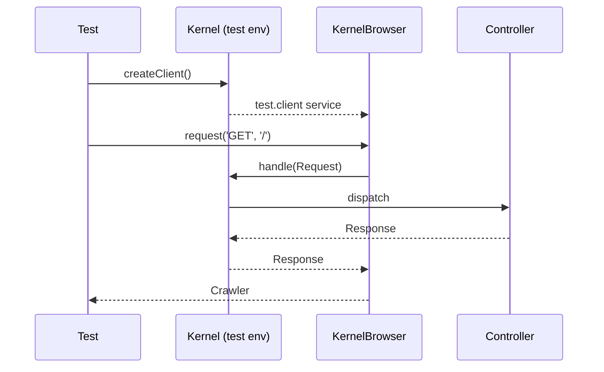

# Functional Tests

!!! tip "In a nutshell"
    Functional tests boot the *real* kernel and drive it like a browser to prove a
    whole request works end to end. `WebTestCase` (HTTP + client) extends
    `KernelTestCase` (kernel only). Exam hook: `self::getContainer()` returns the
    special **test** container, so it can hand you even **private** services.

!!! abstract "Learning objectives"
    By the end of this chapter you can:

    - [ ] Distinguish `KernelTestCase` from `WebTestCase` and pick the right one
    - [ ] Boot a client with `static::createClient()` and send a request
    - [ ] Explain what the `test` environment changes and where its config lives
    - [ ] Reach services with `self::getContainer()` and know why they are visible

    **Syllabus:** `Automated Tests → Functional Testing` ·
    **Level:** Advanced → Expert ·
    **Est. time:** 30 min ·
    **Prerequisites:** [Unit Tests](unit-tests.md), [Controllers](../controllers/index.md)

---

## Theory

A **functional test** boots the *real* Symfony kernel and drives it like a
browser: it sends an HTTP request through the whole stack (routing → controller →
Twig → security) and asserts on the response. There are two base classes:

| Base class | Boots kernel | Has a Client | Use for |
|---|---|---|---|
| `KernelTestCase` | ✅ | ❌ | Services, commands, DB — no HTTP |
| `WebTestCase` | ✅ | ✅ | Full HTTP request/response tests |

`WebTestCase` **extends** `KernelTestCase`, adding the browser client. If you only
need the container (e.g. to test a service with real wiring or run a Messenger
handler), use `KernelTestCase`.

!!! question "Predict first"
    You call `self::getContainer()->get()` in a `WebTestCase` and successfully
    fetch a service that is `private` at runtime. Where did that service come from?

??? note "Reveal"
    Not the runtime container — the `test` env compiles a *second* container,
    `test.service_container` (a `TestContainer`), that keeps private/non-shared
    services reachable. `static::$kernel->getContainer()` would still hide it.

## Deep Dive — how it works internally

`Symfony\Bundle\FrameworkBundle\Test\KernelTestCase` creates the kernel via
`static::createKernel()` / `static::bootKernel()`, storing it in
`static::$kernel`. `Symfony\Bundle\FrameworkBundle\Test\WebTestCase::createClient()`
boots the kernel **then** fetches the `test.client` service — a
`Symfony\Bundle\FrameworkBundle\KernelBrowser`. That service exists only when
`framework.test: true`, which the default `config/packages/test/framework.yaml`
enables.

`createClient()` **reboots the kernel** before returning (fresh state), and the
client reboots it again after each request unless you call
[`disableReboot()`](client.md). Only **one** client/kernel may be live per test;
calling `createClient()` a second time throws.

### The test container and private services

`self::getContainer()` does **not** return the normal runtime container. In the
`test` environment the framework compiles a special
`Symfony\Component\DependencyInjection\Test\TestContainer` (service id
`test.service_container`) that also exposes **private** and **non-shared**
services, so tests can fetch and replace collaborators that are invisible at
runtime. This is the single most-tested fact of the stage.



!!! note "Source reference"
    `WebTestCase::createClient()` returns `test.client` (a `KernelBrowser`);
    `getContainer()` returns `test.service_container`
    ([symfony/symfony `8.0`](https://github.com/symfony/symfony/blob/8.0/src/Symfony/Bundle/FrameworkBundle/Test/KernelTestCase.php)).

## Configuration & code

=== "WebTestCase"

    ```php
    <?php
    declare(strict_types=1);

    namespace App\Tests\Controller;

    use Symfony\Bundle\FrameworkBundle\Test\WebTestCase;

    final class HomeControllerTest extends WebTestCase
    {
        public function testHomepageIsSuccessful(): void
        {
            $client = static::createClient();
            $crawler = $client->request('GET', '/');

            self::assertResponseIsSuccessful();
            self::assertSelectorTextContains('h1', 'Welcome');
        }
    }
    ```

=== "KernelTestCase"

    ```php
    <?php
    declare(strict_types=1);

    namespace App\Tests\Service;

    use App\Pricing\PriceCalculator;
    use Symfony\Bundle\FrameworkBundle\Test\KernelTestCase;

    final class PriceCalculatorServiceTest extends KernelTestCase
    {
        public function testRealWiring(): void
        {
            self::bootKernel();
            $calc = self::getContainer()->get(PriceCalculator::class); // even if private

            self::assertSame(1200, $calc->withTax(1000, 'FR'));
        }
    }
    ```

=== "test config"

    ```yaml
    # config/packages/test/framework.yaml
    framework:
        test: true            # enables the test.client + test container
        session:
            storage_factory_id: session.storage.factory.mock_file
    ```

=== "Console"

    ```console
    $ APP_ENV=test php bin/console cache:clear
    $ php bin/phpunit
    ```

`static::createClient(array $options = [], array $server = [])` accepts kernel
options (`environment`, `debug`) and default server parameters — see
[Client Configuration](client-configuration.md).

## Best practices & anti-patterns

| ✅ Do | ❌ Avoid |
|---|---|
| `WebTestCase` for HTTP behaviour | Booting a full client to test one service |
| `self::getContainer()` for services | `static::$kernel->getContainer()` (private services hidden) |
| One `createClient()` per test | Calling `createClient()` twice in one test |
| Let each test reboot for isolation | Sharing state across tests via statics |

## When (not) to use it / alternatives

Use functional tests to prove *integration* — the real value the exam expects
you to know. Do **not** functional-test pure logic that a fast
[unit test](unit-tests.md) covers. When you need the container without HTTP,
`KernelTestCase` is lighter than `WebTestCase`.

!!! danger "Certification traps"
    - `self::getContainer()` returns the **test container** exposing **private**
      services; `static::$kernel->getContainer()` does **not**.
    - `WebTestCase` **extends** `KernelTestCase` — the client is the only addition.
    - `createClient()` may be called **once** per test; a second call throws.
    - The `test.client` service exists only when `framework.test: true`.

!!! warning "Common mistakes"
    - Calling `self::getContainer()` before booting — it boots for you in recent
      versions, but mixing it with a manual `bootKernel()` plus `createClient()`
      is a common source of "kernel already booted" errors.
    - Forgetting the `test` env config, so `test.client` is missing.

## Exercises

1. **(Basic)** Write a `WebTestCase` that requests `/about` and asserts a 200 and a
   heading containing "About".
2. **(Intermediate)** In a `KernelTestCase`, fetch a private service by its class
   id and assert it is the expected type.

??? success "Solutions"

    **1.**

    ```php
    <?php
    declare(strict_types=1);

    namespace App\Tests\Controller;

    use Symfony\Bundle\FrameworkBundle\Test\WebTestCase;

    final class AboutControllerTest extends WebTestCase
    {
        public function testAbout(): void
        {
            $client = static::createClient();
            $client->request('GET', '/about');

            self::assertResponseIsSuccessful();
            self::assertSelectorTextContains('h1', 'About');
        }
    }
    ```

    **2.**

    ```php
    <?php
    declare(strict_types=1);

    namespace App\Tests\Service;

    use App\Report\ReportGenerator;
    use Symfony\Bundle\FrameworkBundle\Test\KernelTestCase;

    final class ReportGeneratorTest extends KernelTestCase
    {
        public function testServiceIsWired(): void
        {
            self::bootKernel();
            self::assertInstanceOf(
                ReportGenerator::class,
                self::getContainer()->get(ReportGenerator::class),
            );
        }
    }
    ```

## Certification questions

??? question "Q1. Which class adds an HTTP client on top of the kernel booting?"
    - [ ] A. `KernelTestCase`
    - [x] B. `WebTestCase` (extends `KernelTestCase`) ✅
    - [ ] C. `TestCase`
    - [ ] D. `BrowserTestCase`

    **Why:** `WebTestCase` extends `KernelTestCase` and provides `createClient()`.
    **Ref:** [Testing](https://symfony.com/doc/current/testing.html#application-tests).

??? question "Q2. Why can `self::getContainer()->get()` return a private service?"
    - [x] A. It returns the special test container (`test.service_container`) ✅
    - [ ] B. All services are public in test
    - [ ] C. It uses reflection to bypass visibility
    - [ ] D. Private services do not exist in test

    **Why:** the `test` env compiles a `TestContainer` exposing private/non-shared
    services. **Ref:** [Testing](https://symfony.com/doc/current/testing.html#accessing-the-container).

??? question "Q3. How many times can you call `createClient()` in one test?"
    - [x] A. Once — a second call throws ✅
    - [ ] B. Twice
    - [ ] C. Any number
    - [ ] D. Once per HTTP request

    **Why:** only one kernel/client may be booted per test; re-calling throws.
    **Ref:** [Testing](https://symfony.com/doc/current/testing.html).

??? question "Q4. Which config flag makes the `test.client` service available?"
    - [x] A. `framework.test: true` ✅
    - [ ] B. `framework.client: true`
    - [ ] C. `framework.profiler.enabled: true`
    - [ ] D. `kernel.debug: true`

    **Why:** `framework.test: true` (default in `config/packages/test/`) registers
    the test client and container. **Ref:** [Testing](https://symfony.com/doc/current/testing.html).

## Key takeaways

- `WebTestCase` (HTTP + client) extends `KernelTestCase` (kernel only).
- `static::createClient()` boots the kernel and returns a `KernelBrowser`.
- `self::getContainer()` is the **test container** — private services visible.
- `framework.test: true` enables the whole test wiring; only one client per test.

## Last-minute revision

!!! tip "Cheat sheet"
    - `KernelTestCase` → `self::bootKernel()`, `self::getContainer()`, `static::$kernel`.
    - `WebTestCase` → `static::createClient($options, $server)` → `KernelBrowser`.
    - Test container id: `test.service_container` (`TestContainer`).
    - Enable via `framework.test: true` in `config/packages/test/`.

## Connections

- **Depends on:** [Controllers](../controllers/index.md) — the request you drive is routed into a controller action.
- **Reused in:** [The Client](client.md) — `createClient()` returns the `KernelBrowser` this chapter introduces.
- **Confused with:** [Unit Tests](unit-tests.md) — unit tests boot no kernel; functional tests boot the real one.

## Official References
- [Official Symfony docs — Testing](https://symfony.com/doc/current/testing.html)
- [Symfony source — WebTestCase](https://github.com/symfony/symfony/blob/8.0/src/Symfony/Bundle/FrameworkBundle/Test/WebTestCase.php)
- [Symfony source — KernelTestCase](https://github.com/symfony/symfony/blob/8.0/src/Symfony/Bundle/FrameworkBundle/Test/KernelTestCase.php)

## Confidence check

I'm ready when I can:

- [ ] explain **why** `WebTestCase` extends `KernelTestCase` and when to pick each
- [ ] boot a client with `static::createClient()` and drive a full HTTP request
- [ ] debug a "kernel already booted" error from mixing `bootKernel()` with `createClient()`
- [ ] spot the trap that `static::$kernel->getContainer()` hides private services
- [ ] explain how the `test` container exposes private services internally

---

<small>Related: [The Client Object](client.md) · [Framework Objects](framework-objects.md) · [Introspection](introspection.md)</small>
