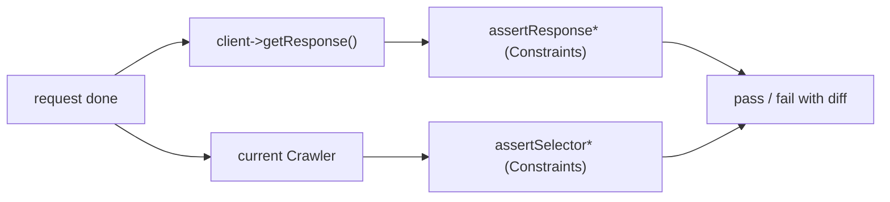

# Request/Response Introspection

!!! tip "In a nutshell"
    Après une request, vérifiez le résultat avec les helpers intégrés
    (`assertResponse*`, `assertSelector*`, `assertRoute*`) plutôt qu'en lisant
    `getResponse()` à la main — ils affichent la response en cas d'échec. Point
    d'examen : `assertResponseIsSuccessful()` accepte **n'importe quel 2xx** ;
    utilisez `assertResponseStatusCodeSame()` pour un code exact.

!!! example "Real-world analogy"
    Les helpers d'introspection sont la checklist de contrôle qualité en bout de
    chaîne de montage, plutôt que vous scrutant chaque pièce à la main. Au lieu
    de démonter l'article fini pour lire un numéro de série
    (`getResponse()->getStatusCode()`), vous cochez des contrôles standard qui
    tamponnent réussite ou échec — et quand l'un échoue, le poste photographie
    automatiquement l'article défectueux (affiche la response) pour que vous
    voyiez ce qui a mal tourné. Notez que les contrôles varient en sévérité :
    « a passé l'inspection » signifie n'importe quoi dans la plage acceptable
    (n'importe quel 2xx), ce qui est plus large que « est exactement le modèle
    numéro 200 ».

!!! abstract "Learning objectives"
    À la fin de ce chapitre, vous saurez :

    - [ ] Lire la dernière request/response avec `getRequest()` / `getResponse()`
    - [ ] Vérifier le statut avec `assertResponseIsSuccessful` / `assertResponseStatusCodeSame`
    - [ ] Vérifier redirections et headers avec `assertResponseRedirects` / `assertResponseHasHeader`
    - [ ] Vérifier le contenu du DOM avec `assertSelectorTextContains` et consorts

    **Syllabus:** `Automated Tests → Request/response introspection` ·
    **Level:** Advanced → Expert ·
    **Est. time:** 25 min ·
    **Prerequisites:** [The Client](client.md), [The Crawler](crawler.md)

---

## Theory

Après une request, vous pouvez inspecter deux choses : les **objets** bruts
(`$client->getRequest()` / `getResponse()`) et, de façon plus idiomatique,
utiliser les **helpers d'assertion** qui lisent ces objets et le
[Crawler](crawler.md) courant pour vous. Les helpers produisent des messages
d'échec lisibles (ils affichent la response en cas d'échec) : préférez-les à un
`assertSame($response->getStatusCode())` fait main.

```php
$client = static::createClient();
$client->request('GET', '/');

// Raw objects from the last request
$request  = $client->getRequest();   // last Request
$response = $client->getResponse();  // last Response

// Hand-rolled assertion: terse failure message
self::assertSame(200, $response->getStatusCode());

// Idiomatic helper: prints the whole response on failure
self::assertResponseIsSuccessful();
```

!!! question "Predict first"
    Un controller retourne `204 No Content`. `assertResponseIsSuccessful()`
    passe-t-il ? Et `assertResponseStatusCodeSame(200)` ?

??? note "Reveal"
    `assertResponseIsSuccessful()` passe — il accepte **n'importe quel 2xx**.
    Mais `assertResponseStatusCodeSame(200)` échoue, car 204 ≠ 200. Utilisez le
    helper exact uniquement quand le code précis compte.

## Deep Dive — how it works internally

`$client->getResponse()` retourne la `HttpFoundation\Response` de la dernière
request ; `getRequest()` retourne la `HttpFoundation\Request`. Il existe aussi
`getInternalRequest()` / `getInternalResponse()` au niveau BrowserKit si vous
avez besoin de la vue transport.

```php
// Framework view: HttpFoundation objects
$response = $client->getResponse();  // HttpFoundation\Response
$request  = $client->getRequest();   // HttpFoundation\Request

// Transport view: BrowserKit-level objects
$rawRequest  = $client->getInternalRequest();   // BrowserKit\Request
$rawResponse = $client->getInternalResponse();  // BrowserKit\Response
```

Les assertions vivent dans des traits intégrés à `WebTestCase` :

- `Symfony\Bundle\FrameworkBundle\Test\WebTestAssertionsTrait` — les assertions
  response/router à la sauce Symfony.
- `Symfony\Bundle\FrameworkBundle\Test\BrowserKitAssertionsTrait` — statut de
  response/navigateur, headers, cookies.
- `Symfony\Bundle\FrameworkBundle\Test\DomCrawlerAssertionsTrait` — assertions
  DOM par sélecteur.

```php
// One assertion from each trait, all available on WebTestCase:
self::assertRouteSame('app_home');                 // WebTestAssertionsTrait
self::assertResponseHeaderSame(                    // BrowserKitAssertionsTrait
    'Content-Type', 'text/html; charset=UTF-8'
);
self::assertSelectorTextContains('h1', 'Welcome'); // DomCrawlerAssertionsTrait
```

Chaque `assert*` est une fine enveloppe déléguant à une `Constraint` PHPUnit
(par exemple `ResponseStatusCodeSame`, `ResponseIsSuccessful`), si bien que les
échecs s'intègrent à la sortie de diff de PHPUnit.

```php
use Symfony\Component\HttpFoundation\Test\Constraint\ResponseIsSuccessful;
use Symfony\Component\HttpFoundation\Test\Constraint\ResponseStatusCodeSame;

// assertResponseIsSuccessful() is roughly this assert* wrapper:
self::assertThat($client->getResponse(), new ResponseIsSuccessful());

// assertResponseStatusCodeSame(200) delegates to another Constraint:
self::assertThat($client->getResponse(), new ResponseStatusCodeSame(200));
```



!!! note "Source reference"
    Les constraints de response/sélecteur vivent sous
    `Symfony\Component\HttpFoundation\Test\Constraint` et
    `Symfony\Component\DomCrawler\Test\Constraint`
    ([symfony/symfony `8.0`](https://github.com/symfony/symfony/tree/8.0/src/Symfony/Component/HttpFoundation/Test/Constraint)).

## Configuration & code

=== "Status & redirects"

    ```php
    <?php
    declare(strict_types=1);

    namespace App\Tests\Controller;

    use Symfony\Bundle\FrameworkBundle\Test\WebTestCase;
    use Symfony\Component\HttpFoundation\Response;

    final class StatusTest extends WebTestCase
    {
        public function testStatuses(): void
        {
            $client = static::createClient();
            $client->request('GET', '/');

            self::assertResponseIsSuccessful();                 // 2xx
            self::assertResponseStatusCodeSame(Response::HTTP_OK);

            $client->request('POST', '/login', []);
            self::assertResponseRedirects('/dashboard', Response::HTTP_FOUND);

            $client->request('POST', '/register', ['email' => '']);
            self::assertResponseIsUnprocessable();              // 422
        }
    }
    ```

=== "Headers, cookies, route"

    ```php
    <?php
    declare(strict_types=1);

    namespace App\Tests\Controller;

    use Symfony\Bundle\FrameworkBundle\Test\WebTestCase;

    final class HeaderTest extends WebTestCase
    {
        public function testHeaders(): void
        {
            $client = static::createClient();
            $client->request('GET', '/feed.json');

            self::assertResponseHasHeader('Content-Type');
            self::assertResponseHeaderSame('Content-Type', 'application/json');
            self::assertResponseHasCookie('PHPSESSID');
            self::assertRouteSame('app_feed');
        }
    }
    ```

=== "DOM content"

    ```php
    <?php
    declare(strict_types=1);

    namespace App\Tests\Controller;

    use Symfony\Bundle\FrameworkBundle\Test\WebTestCase;

    final class ContentTest extends WebTestCase
    {
        public function testContent(): void
        {
            $client = static::createClient();
            $client->request('GET', '/');

            self::assertSelectorExists('nav.main');
            self::assertSelectorTextContains('h1', 'Welcome');
            self::assertSelectorTextSame('title', 'Home — Acme');
            self::assertPageTitleContains('Home');
            self::assertAnySelectorTextContains('li', 'Docs');
        }
    }
    ```

=== "Raw objects"

    ```php
    <?php
    declare(strict_types=1);

    namespace App\Tests\Controller;

    use Symfony\Bundle\FrameworkBundle\Test\WebTestCase;

    final class RawTest extends WebTestCase
    {
        public function testRaw(): void
        {
            $client = static::createClient();
            $client->request('GET', '/');

            $response = $client->getResponse();
            self::assertStringContainsString('<html', (string) $response->getContent());
            self::assertSame('GET', $client->getRequest()->getMethod());
        }
    }
    ```

## Best practices & anti-patterns

| ✅ Do | ❌ Avoid |
|---|---|
| `assertResponseIsSuccessful()` | `assertSame(200, $r->getStatusCode())` |
| `assertResponseRedirects($to, $code)` | Vérifier le header `Location` à la main |
| `assertSelectorTextContains()` | `filter()->text()` + `assertStringContains` |
| `assertRouteSame()` pour le routing | Parser l'URL pour deviner la route |

## When (not) to use it / alternatives

Utilisez les helpers pour tout ce qu'ils couvrent — ils sont plus clairs et
affichent la response en cas d'échec. Ne descendez à `getResponse()` que pour
les assertions qu'aucun helper ne couvre (par exemple inspecter un corps
binaire ou une structure sérialisée spécifique). Pour les requêtes DOM au-delà
des assertions, utilisez directement le [Crawler](crawler.md).

!!! danger "Certification traps"
    - `assertResponseIsSuccessful()` accepte **n'importe quel 2xx**, pas
      seulement 200 — utilisez `assertResponseStatusCodeSame(200)` pour un code
      exact.
    - `assertResponseRedirects()` sans argument vérifie juste que c'*est* un
      3xx ; passez une cible et/ou un code pour être précis.
    - `assertSelectorTextContains` vs `assertSelectorTextSame` : *contains* est
      une sous-chaîne, *same* est exact.
    - Les assertions par sélecteur nécessitent le composant css-selector (elles
      utilisent des sélecteurs CSS).

!!! warning "Common mistakes"
    - Vérifier du contenu **après** une redirection non suivie — le DOM courant
      est la page de redirection, pas la cible. Appelez d'abord
      `followRedirect()`.
    - Utiliser `assertResponseHeaderSame` avec un header qui a plusieurs
      valeurs.

## Exercises

1. **(Basic)** Vérifiez que `/` retourne 200, a un `<title>` contenant "Acme"
   et un `h1` contenant "Welcome".
2. **(Intermediate)** Vérifiez que `POST /logout` redirige vers `/` avec un 302
   et que la response efface le cookie de session.

??? success "Solutions"

    **1.**

    ```php
    <?php
    declare(strict_types=1);

    namespace App\Tests\Controller;

    use Symfony\Bundle\FrameworkBundle\Test\WebTestCase;

    final class HomeAssertTest extends WebTestCase
    {
        public function testHome(): void
        {
            $client = static::createClient();
            $client->request('GET', '/');

            self::assertResponseIsSuccessful();
            self::assertPageTitleContains('Acme');
            self::assertSelectorTextContains('h1', 'Welcome');
        }
    }
    ```

    **2.**

    ```php
    <?php
    declare(strict_types=1);

    namespace App\Tests\Controller;

    use Symfony\Bundle\FrameworkBundle\Test\WebTestCase;
    use Symfony\Component\HttpFoundation\Response;

    final class LogoutTest extends WebTestCase
    {
        public function testLogout(): void
        {
            $client = static::createClient();
            $client->request('POST', '/logout');

            self::assertResponseRedirects('/', Response::HTTP_FOUND);
            self::assertResponseHasHeader('Set-Cookie');
        }
    }
    ```

## Certification questions

??? question "Q1. `assertResponseIsSuccessful()` passes for which codes?"
    - [x] A. Any 2xx status ✅
    - [ ] B. Only 200
    - [ ] C. 2xx and 3xx
    - [ ] D. Only 200 and 204

    **Why:** il vérifie que la response est dans la plage de succès (2xx) ;
    utilisez `assertResponseStatusCodeSame` pour les codes exacts.
    **Ref:** [Testing assertions](https://symfony.com/doc/8.0/testing.html#the-assertions).

??? question "Q2. Which asserts an exact element text (not substring)?"
    - [ ] A. `assertSelectorTextContains('h1', 'Hi')`
    - [x] B. `assertSelectorTextSame('h1', 'Hi')` ✅
    - [ ] C. `assertSelectorExists('h1')`
    - [ ] D. `assertPageTitleContains('Hi')`

    **Why:** `...Same` exige une correspondance exacte ; `...Contains` est une
    sous-chaîne.
    **Ref:** [Testing assertions](https://symfony.com/doc/8.0/testing.html#the-assertions).

??? question "Q3. To assert the matched route name you use…"
    - [x] A. `assertRouteSame('app_home')` ✅
    - [ ] B. `assertResponseHasHeader('Route')`
    - [ ] C. `assertSame($request->getPathInfo(), '/')`
    - [ ] D. `assertResponseRedirects()`

    **Why:** `assertRouteSame` vérifie l'attribut de request `_route`.
    **Ref:** [Testing assertions](https://symfony.com/doc/8.0/testing.html#the-assertions).

??? question "Q4. Where do the response assertions ultimately delegate?"
    - [x] A. PHPUnit `Constraint` objects under `...Test\Constraint` ✅
    - [ ] B. Twig functions
    - [ ] C. The router
    - [ ] D. Doctrine

    **Why:** chaque helper enveloppe une Constraint PHPUnit pour une bonne
    sortie de diff.
    **Ref:** [Testing](https://symfony.com/doc/8.0/testing.html#the-assertions).

## Key takeaways

- `getResponse()`/`getRequest()` exposent les objets HttpFoundation bruts.
- Préférez `assertResponse*`, `assertSelector*`, `assertRoute*`,
  `assertBrowser*`.
- `IsSuccessful` = n'importe quel 2xx ; utilisez `StatusCodeSame` pour un code
  exact.
- `...Contains` = sous-chaîne, `...Same` = exact ; vérifiez *après* avoir suivi
  les redirections.

## Last-minute revision

!!! tip "Cheat sheet"
    - Statut : `assertResponseIsSuccessful()`, `assertResponseStatusCodeSame(n)`,
      `assertResponseIsUnprocessable()`.
    - Redirection : `assertResponseRedirects($to?, $code?)`.
    - Headers/cookies : `assertResponseHasHeader`, `assertResponseHeaderSame`,
      `assertResponseHasCookie`.
    - DOM : `assertSelectorExists`, `assertSelectorTextContains/Same`,
      `assertPageTitleContains`, `assertRouteSame`.

## Connections

- **Depends on:** [The Client](client.md) — les assertions lisent la dernière request/response du client.
- **Reused in:** [The Profiler](profiler.md) — les assertions plus profondes lisent les collectors quand la response seule ne suffit pas.
- **Confused with:** [The Crawler](crawler.md) — le Crawler *interroge* le DOM ; `assertSelector*` fait des *assertions* dessus.

## Official References
- [Official Symfony docs — The assertions](https://symfony.com/doc/8.0/testing.html#the-assertions)
- [Symfony source — HttpFoundation test constraints](https://github.com/symfony/symfony/tree/8.0/src/Symfony/Component/HttpFoundation/Test/Constraint)
- [Symfony source — DomCrawler test constraints](https://github.com/symfony/symfony/tree/8.0/src/Symfony/Component/DomCrawler/Test/Constraint)

## Video references

!!! tip "Watch & learn"
    Voici des chaînes vidéo officielles, mises à jour en continu — cherchez-y
    "Symfony testing" pour consolider ce chapitre. Nous lions des chaînes
    stables plutôt que des vidéos individuelles afin que les références ne
    périment jamais.

    - [SymfonyCasts screencasts](https://symfonycasts.com/tracks/symfony) — tutoriels scénarisés à suivre en codant.
    - [Symfony official YouTube](https://www.youtube.com/@SymfonyOfficial) — conférences et keynotes SymfonyCon.
    - [Official docs for this topic](https://symfony.com/doc/8.0/testing.html#the-assertions) — certaines pages de la doc Symfony intègrent un screencast.

## Confidence check

Je suis prêt quand je peux :

- [ ] expliquer **pourquoi** les helpers battent un `assertSame` fait main sur `getStatusCode()`
- [ ] vérifier statut, redirections, headers et contenu du DOM dans Symfony 8
- [ ] déboguer une assertion par sélecteur exécutée sur la mauvaise page (redirection non suivie)
- [ ] repérer le piège : `IsSuccessful` accepte n'importe quel 2xx, pas seulement 200
- [ ] expliquer comment chaque `assert*` délègue à une `Constraint` PHPUnit

---

<small>Related: [The Client](client.md) · [The Crawler](crawler.md) · [The Profiler](profiler.md)</small>
