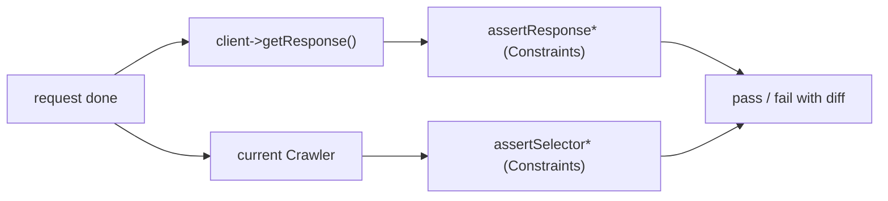

# Request/Response Introspection

!!! abstract "Learning objectives"
    By the end of this chapter you can:

    - [ ] Read the last request/response with `getRequest()` / `getResponse()`
    - [ ] Assert status with `assertResponseIsSuccessful` / `assertResponseStatusCodeSame`
    - [ ] Assert redirects and headers with `assertResponseRedirects` / `assertResponseHasHeader`
    - [ ] Assert DOM content with `assertSelectorTextContains` and friends

    **Syllabus:** `Automated Tests → Request/response introspection` ·
    **Level:** Advanced → Expert ·
    **Est. time:** 25 min ·
    **Prerequisites:** [The Client](client.md), [The Crawler](crawler.md)

---

## Theory

After a request you can inspect two things: the raw **objects**
(`$client->getRequest()` / `getResponse()`) and, more idiomatically, use the
**assertion helpers** that read those objects and the current [Crawler](crawler.md)
for you. The helpers produce readable failure messages (they print the response on
failure), so prefer them over hand-rolled `assertSame($response->getStatusCode())`.

## Deep Dive — how it works internally

`$client->getResponse()` returns the `HttpFoundation\Response` from the last
request; `getRequest()` returns the `HttpFoundation\Request`. There are also
BrowserKit-level `getInternalRequest()` / `getInternalResponse()` if you need the
transport view.

The assertions live in traits mixed into `WebTestCase`:

- `Symfony\Bundle\FrameworkBundle\Test\WebTestAssertionsTrait` — the Symfony-flavoured
  response/router assertions.
- `Symfony\Bundle\FrameworkBundle\Test\BrowserKitAssertionsTrait` — response/browser
  status, headers, cookies.
- `Symfony\Bundle\FrameworkBundle\Test\DomCrawlerAssertionsTrait` — selector-based
  DOM assertions.

Each `assert*` is a thin wrapper delegating to a PHPUnit `Constraint`
(e.g. `ResponseStatusCodeSame`, `ResponseIsSuccessful`), so failures integrate with
PHPUnit's diff output.



!!! note "Source reference"
    Response/selector constraints live under
    `Symfony\Component\HttpFoundation\Test\Constraint` and
    `Symfony\Component\DomCrawler\Test\Constraint`
    ([symfony/symfony `8.0`](https://github.com/symfony/symfony/tree/8.0/src/Symfony/Component/HttpFoundation/Test/Constraint)).

## Configuration & code

=== "Status & redirects"

    ```php
    <?php
    declare(strict_types=1);

    namespace App\Tests\Controller;

    use Symfony\Bundle\FrameworkBundle\Test\WebTestCase;
    use Symfony\Component\HttpFoundation\Response;

    final class StatusTest extends WebTestCase
    {
        public function testStatuses(): void
        {
            $client = static::createClient();
            $client->request('GET', '/');

            self::assertResponseIsSuccessful();                 // 2xx
            self::assertResponseStatusCodeSame(Response::HTTP_OK);

            $client->request('POST', '/login', []);
            self::assertResponseRedirects('/dashboard', Response::HTTP_FOUND);

            $client->request('POST', '/register', ['email' => '']);
            self::assertResponseIsUnprocessable();              // 422
        }
    }
    ```

=== "Headers, cookies, route"

    ```php
    <?php
    declare(strict_types=1);

    namespace App\Tests\Controller;

    use Symfony\Bundle\FrameworkBundle\Test\WebTestCase;

    final class HeaderTest extends WebTestCase
    {
        public function testHeaders(): void
        {
            $client = static::createClient();
            $client->request('GET', '/feed.json');

            self::assertResponseHasHeader('Content-Type');
            self::assertResponseHeaderSame('Content-Type', 'application/json');
            self::assertResponseHasCookie('PHPSESSID');
            self::assertRouteSame('app_feed');
        }
    }
    ```

=== "DOM content"

    ```php
    <?php
    declare(strict_types=1);

    namespace App\Tests\Controller;

    use Symfony\Bundle\FrameworkBundle\Test\WebTestCase;

    final class ContentTest extends WebTestCase
    {
        public function testContent(): void
        {
            $client = static::createClient();
            $client->request('GET', '/');

            self::assertSelectorExists('nav.main');
            self::assertSelectorTextContains('h1', 'Welcome');
            self::assertSelectorTextSame('title', 'Home — Acme');
            self::assertPageTitleContains('Home');
            self::assertAnySelectorTextContains('li', 'Docs');
        }
    }
    ```

=== "Raw objects"

    ```php
    <?php
    declare(strict_types=1);

    namespace App\Tests\Controller;

    use Symfony\Bundle\FrameworkBundle\Test\WebTestCase;

    final class RawTest extends WebTestCase
    {
        public function testRaw(): void
        {
            $client = static::createClient();
            $client->request('GET', '/');

            $response = $client->getResponse();
            self::assertStringContainsString('<html', (string) $response->getContent());
            self::assertSame('GET', $client->getRequest()->getMethod());
        }
    }
    ```

## Best practices & anti-patterns

| ✅ Do | ❌ Avoid |
|---|---|
| `assertResponseIsSuccessful()` | `assertSame(200, $r->getStatusCode())` |
| `assertResponseRedirects($to, $code)` | Asserting `Location` header by hand |
| `assertSelectorTextContains()` | `filter()->text()` + `assertStringContains` |
| `assertRouteSame()` for routing | Parsing the URL to infer the route |

## When (not) to use it / alternatives

Use the helpers for everything they cover — they are clearer and print the
response on failure. Drop to `getResponse()` only for assertions no helper covers
(e.g. inspecting a binary body or a specific serialized structure). For DOM
queries beyond assertions, use the [Crawler](crawler.md) directly.

!!! danger "Certification traps"
    - `assertResponseIsSuccessful()` accepts **any 2xx**, not only 200 — use
      `assertResponseStatusCodeSame(200)` for an exact code.
    - `assertResponseRedirects()` with no args just checks it *is* a 3xx; pass a
      target and/or code to be specific.
    - `assertSelectorTextContains` vs `assertSelectorTextSame`: *contains* is a
      substring, *same* is exact.
    - Selector assertions need the css-selector component (they use CSS selectors).

!!! warning "Common mistakes"
    - Asserting content **after** an unfollowed redirect — the current DOM is the
      redirect page, not the target. Call `followRedirect()` first.
    - Using `assertResponseHeaderSame` with a header that has multiple values.

## Exercises

1. **(Basic)** Assert `/` returns 200, has a `<title>` containing "Acme", and an
   `h1` containing "Welcome".
2. **(Intermediate)** Assert `POST /logout` redirects to `/` with a 302 and that
   the response clears the session cookie.

??? success "Solutions"

    **1.**

    ```php
    <?php
    declare(strict_types=1);

    namespace App\Tests\Controller;

    use Symfony\Bundle\FrameworkBundle\Test\WebTestCase;

    final class HomeAssertTest extends WebTestCase
    {
        public function testHome(): void
        {
            $client = static::createClient();
            $client->request('GET', '/');

            self::assertResponseIsSuccessful();
            self::assertPageTitleContains('Acme');
            self::assertSelectorTextContains('h1', 'Welcome');
        }
    }
    ```

    **2.**

    ```php
    <?php
    declare(strict_types=1);

    namespace App\Tests\Controller;

    use Symfony\Bundle\FrameworkBundle\Test\WebTestCase;
    use Symfony\Component\HttpFoundation\Response;

    final class LogoutTest extends WebTestCase
    {
        public function testLogout(): void
        {
            $client = static::createClient();
            $client->request('POST', '/logout');

            self::assertResponseRedirects('/', Response::HTTP_FOUND);
            self::assertResponseHasHeader('Set-Cookie');
        }
    }
    ```

## Certification questions

??? question "Q1. `assertResponseIsSuccessful()` passes for which codes?"
    - [x] A. Any 2xx status ✅
    - [ ] B. Only 200
    - [ ] C. 2xx and 3xx
    - [ ] D. Only 200 and 204

    **Why:** it checks the response is in the successful (2xx) range; use
    `assertResponseStatusCodeSame` for exact codes.
    **Ref:** [Testing assertions](https://symfony.com/doc/current/testing.html#the-assertions).

??? question "Q2. Which asserts an exact element text (not substring)?"
    - [ ] A. `assertSelectorTextContains('h1', 'Hi')`
    - [x] B. `assertSelectorTextSame('h1', 'Hi')` ✅
    - [ ] C. `assertSelectorExists('h1')`
    - [ ] D. `assertPageTitleContains('Hi')`

    **Why:** `...Same` requires an exact match; `...Contains` is a substring.
    **Ref:** [Testing assertions](https://symfony.com/doc/current/testing.html#the-assertions).

??? question "Q3. To assert the matched route name you use…"
    - [x] A. `assertRouteSame('app_home')` ✅
    - [ ] B. `assertResponseHasHeader('Route')`
    - [ ] C. `assertSame($request->getPathInfo(), '/')`
    - [ ] D. `assertResponseRedirects()`

    **Why:** `assertRouteSame` checks the `_route` request attribute.
    **Ref:** [Testing assertions](https://symfony.com/doc/current/testing.html#the-assertions).

??? question "Q4. Where do the response assertions ultimately delegate?"
    - [x] A. PHPUnit `Constraint` objects under `...Test\Constraint` ✅
    - [ ] B. Twig functions
    - [ ] C. The router
    - [ ] D. Doctrine

    **Why:** each helper wraps a PHPUnit Constraint for good diff output.
    **Ref:** [Testing](https://symfony.com/doc/current/testing.html#the-assertions).

## Key takeaways

- `getResponse()`/`getRequest()` expose the raw HttpFoundation objects.
- Prefer `assertResponse*`, `assertSelector*`, `assertRoute*`, `assertBrowser*`.
- `IsSuccessful` = any 2xx; use `StatusCodeSame` for an exact code.
- `...Contains` = substring, `...Same` = exact; assert *after* following redirects.

## Last-minute revision

!!! tip "Cheat sheet"
    - Status: `assertResponseIsSuccessful()`, `assertResponseStatusCodeSame(n)`,
      `assertResponseIsUnprocessable()`.
    - Redirect: `assertResponseRedirects($to?, $code?)`.
    - Headers/cookies: `assertResponseHasHeader`, `assertResponseHeaderSame`,
      `assertResponseHasCookie`.
    - DOM: `assertSelectorExists`, `assertSelectorTextContains/Same`,
      `assertPageTitleContains`, `assertRouteSame`.

## Official References
- [Official Symfony docs — The assertions](https://symfony.com/doc/current/testing.html#the-assertions)
- [Symfony source — HttpFoundation test constraints](https://github.com/symfony/symfony/tree/8.0/src/Symfony/Component/HttpFoundation/Test/Constraint)
- [Symfony source — DomCrawler test constraints](https://github.com/symfony/symfony/tree/8.0/src/Symfony/Component/DomCrawler/Test/Constraint)

---

<small>Related: [The Client](client.md) · [The Crawler](crawler.md) · [The Profiler](profiler.md)</small>
