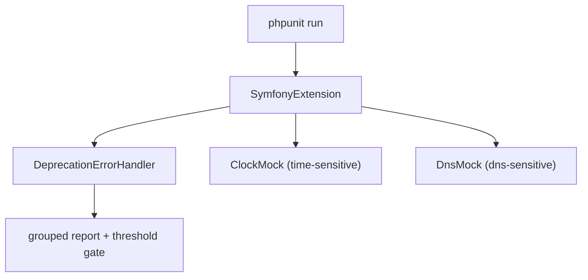

# The PHPUnit Bridge

**Excluded from Symfony 8 certification.** The PHPUnit Bridge does not
appear in the official Symfony 8 certification syllabus. This chapter is
kept as additional/enrichment content — see `specs/TraceabilityMatrix.md`
for the official-vs-additional split — and is not tested in generated exams
or counted toward official syllabus coverage.

!!! tip "In a nutshell"
    `symfony/phpunit-bridge` augments PHPUnit with deprecation collection plus clock
    and DNS mocking, all wired by registering `SymfonyExtension`. Exam hook:
    clock/DNS mocking is opt-in per group (`time-sensitive` / `dns-sensitive`), and
    `SYMFONY_DEPRECATIONS_HELPER` is an env var, not a CLI flag.

!!! example "Real-world analogy"
    Think of a film studio's soundstage add-ons that you bolt onto an ordinary set. One is a
    script supervisor who notes every outdated line of dialogue and tallies them at the end
    of the shoot (deprecation collection). Another is a controllable studio clock that lets
    you skip hours in an instant, and a fake-weather rig that fabricates rain on cue (clock
    and DNS mocking). Crucially, the clock and weather rig only switch on for scenes you have
    explicitly labelled "time-sensitive" or "dns-sensitive," and none of the crew shows up at
    all unless you've signed them onto the call sheet first (registering `SymfonyExtension`).

!!! abstract "Learning objectives"
    By the end of this chapter you can:

    - [ ] List what `symfony/phpunit-bridge` adds on top of PHPUnit
    - [ ] Register the bridge's PHPUnit extension in `phpunit.dist.xml`
    - [ ] Mock time and DNS with the bridge's clock/DNS helpers
    - [ ] Configure deprecation reporting via `SYMFONY_DEPRECATIONS_HELPER`

    **Syllabus:** `Automated Tests → PHPUnit bridge` ·
    **Level:** Expert ·
    **Est. time:** 25 min ·
    **Prerequisites:** [Unit Tests](unit-tests.md)

---

## Theory

`symfony/phpunit-bridge` is a small package that **augments PHPUnit** with
Symfony-aware behaviour. Its headline feature is **deprecation collection**: it
counts every `E_USER_DEPRECATED` triggered during the suite and prints a grouped
report, failing the build if you exceed configured thresholds. It also provides
**clock mocking** and **DNS mocking** so time- and network-sensitive code becomes
deterministic.

```php
// symfony/phpunit-bridge intercepts every E_USER_DEPRECATED raised in the suite...
@trigger_error('Since acme/lib 2.1: "legacyCall()" is deprecated.', E_USER_DEPRECATED);

// ...and prints a grouped report at the end, failing on configured thresholds:
//   Remaining direct deprecations (1)
//     1x: Since acme/lib 2.1: "legacyCall()" is deprecated.
```

!!! question "Predict first"
    You add `sleep(61)` to a test expecting it to run instantly via clock mocking,
    but the suite really waits 61 seconds. What is missing?

??? note "Reveal"
    Clock mocking is opt-in **per group**: the test (or class) must be in the
    `time-sensitive` group, and `SymfonyExtension` must be registered. Without both,
    `ClockMock` never overrides the global `sleep()`.

## Deep Dive — how it works internally

The bridge installs a PHPUnit **extension**,
`Symfony\Bridge\PhpUnit\SymfonyExtension`, registered in the PHPUnit XML config.
The extension wires:

- `Symfony\Bridge\PhpUnit\DeprecationErrorHandler` — an error handler that
  intercepts `E_USER_DEPRECATED`, buckets each deprecation as **self / direct /
  indirect / legacy**, and at the end of the run prints counts and enforces the
  thresholds from `SYMFONY_DEPRECATIONS_HELPER`.
- `Symfony\Bridge\PhpUnit\ClockMock` — when a test/class is in the
  `time-sensitive` group, it overrides `time()`, `microtime()`, `sleep()`,
  `usleep()`, `date()` etc. **in the tested namespace** so time can be advanced
  programmatically without real waits.
- `Symfony\Bridge\PhpUnit\DnsMock` — for the `dns-sensitive` group, stubs
  `dns_get_record()`, `checkdnsrr()`, `gethostbyname()`, etc.

```php
// Everything below is wired by SymfonyExtension (registered in phpunit XML).

// 1) DeprecationErrorHandler: intercepts E_USER_DEPRECATED,
//    thresholds read from SYMFONY_DEPRECATIONS_HELPER (e.g. "max[direct]=0")
@trigger_error('Since acme/lib 2.1: X is deprecated.', E_USER_DEPRECATED);

// 2) ClockMock ("time-sensitive" group): virtual time, no real waits
ClockMock::register(Rate::class);   // override time() etc. in Rate's namespace
ClockMock::withClockMock(true);
sleep(60);                          // instant: advances the virtual clock
usleep(500);                        // mocked too
echo time(), microtime(true), date('H:i'); // all read the virtual clock

// 3) DnsMock ("dns-sensitive" group): stubbed DNS, no network
DnsMock::withMockedHosts(['example.com' => [['type' => 'A', 'ip' => '1.2.3.4']]]);
checkdnsrr('example.com', 'A');        // true (stubbed)
gethostbyname('example.com');          // "1.2.3.4"
dns_get_record('example.com', DNS_A);  // stubbed records
```

Grouping uses PHPUnit's `#[Group('time-sensitive')]` /
`#[Group('dns-sensitive')]` attributes (or the `@group` docblock on older setups).

```php
use PHPUnit\Framework\Attributes\Group;

#[Group('time-sensitive')]   // ClockMock activates for this class
final class ExpiryTest extends TestCase { /* ... */ }

#[Group('dns-sensitive')]    // DnsMock activates for this class
final class MxLookupTest extends TestCase { /* ... */ }

// Older setups: docblock equivalent of the attribute
/** @group time-sensitive */
```



!!! note "Source reference"
    `Symfony\Bridge\PhpUnit\DeprecationErrorHandler` and `SymfonyExtension`
    ([symfony/symfony `8.0`](https://github.com/symfony/symfony/blob/8.0/src/Symfony/Bridge/PhpUnit/DeprecationErrorHandler.php)).

### `SYMFONY_DEPRECATIONS_HELPER`

This env var (set in `phpunit.dist.xml` or the shell) tunes the handler:

| Value | Effect |
|---|---|
| `max[total]=0` | fail if **any** deprecation is triggered |
| `max[self]=0` | fail on deprecations from **your own** code only |
| `max[direct]=0` | fail on deprecations from **your direct** calls |
| `disabled=1` | do not collect or report at all |
| `weak` | report but **never** fail the build |
| `baselineFile=…&generateBaseline=true` | record current deprecations to ignore later |

`self`, `direct`, `indirect` classify *whose* code triggered the deprecation
(yours, a dependency you call directly, or deep inside a dependency) — see the
[deprecations chapter](deprecations.md).

```console
# self: your own code triggers the deprecation
$ SYMFONY_DEPRECATIONS_HELPER='max[self]=0' php bin/phpunit

# direct: your code calls a deprecated API of a direct dependency
$ SYMFONY_DEPRECATIONS_HELPER='max[direct]=0' php bin/phpunit

# indirect: triggered deep inside a dependency calling another dependency
$ SYMFONY_DEPRECATIONS_HELPER='max[indirect]=5' php bin/phpunit
```

## Configuration & code

=== "phpunit.dist.xml"

    ```xml
    <?xml version="1.0" encoding="UTF-8"?>
    <phpunit xmlns:xsi="https://www.w3.org/2001/XMLSchema-instance"
             xsi:noNamespaceSchemaLocation="vendor/phpunit/phpunit/phpunit.xsd"
             bootstrap="tests/bootstrap.php">
        <php>
            <env name="APP_ENV" value="test" force="true"/>
            <server name="SYMFONY_DEPRECATIONS_HELPER" value="max[direct]=0"/>
        </php>

        <extensions>
            <bootstrap class="Symfony\Bridge\PhpUnit\SymfonyExtension"/>
        </extensions>

        <testsuites>
            <testsuite name="Project Test Suite">
                <directory>tests</directory>
            </testsuite>
        </testsuites>
    </phpunit>
    ```

=== "Time-sensitive test"

    ```php
    <?php
    declare(strict_types=1);

    namespace App\Tests\Time;

    use App\Time\Rate;
    use PHPUnit\Framework\Attributes\Group;
    use PHPUnit\Framework\TestCase;

    #[Group('time-sensitive')]              // ClockMock overrides time() in Rate's namespace
    final class RateTest extends TestCase
    {
        public function testExpires(): void
        {
            $rate = new Rate(ttl: 60);      // uses time() internally
            self::assertFalse($rate->isExpired());

            sleep(61);                       // mocked: instant, advances virtual clock
            self::assertTrue($rate->isExpired());
        }
    }
    ```

=== "Console"

    ```console
    $ composer require --dev symfony/phpunit-bridge
    $ php bin/phpunit
    $ SYMFONY_DEPRECATIONS_HELPER=max[total]=0 php bin/phpunit
    ```

## Best practices & anti-patterns

| ✅ Do | ❌ Avoid |
|---|---|
| Register `SymfonyExtension` in the XML | Relying on the removed `simple-phpunit` binary |
| `#[Group('time-sensitive')]` for clock tests | Real `sleep()` in tests |
| Fail on `self` deprecations at least | `disabled=1` hiding your own tech debt |
| Prefer the Clock component `MockClock` for DI code | Global clock mock when you inject a clock |

## When (not) to use it / alternatives

Use the bridge in essentially every Symfony project — it is part of the default
test pack. For **application code that injects `ClockInterface`**, prefer swapping
a `Symfony\Component\Clock\MockClock` (cleaner, no group magic) over `ClockMock`;
reserve `ClockMock` for legacy code calling global `time()`/`sleep()` directly.

!!! danger "Certification traps"
    - The bridge registers `Symfony\Bridge\PhpUnit\SymfonyExtension` — clock/DNS
      mocking and deprecation collection do **not** work without it.
    - Clock/DNS mocking is opt-in **per group**: `time-sensitive` / `dns-sensitive`.
    - `SYMFONY_DEPRECATIONS_HELPER` is an **env/server var**, not a CLI flag.
    - The legacy `bin/simple-phpunit` wrapper is deprecated in favour of the
      extension + plain PHPUnit.

!!! warning "Common mistakes"
    - Expecting `sleep()` to be mocked without the `time-sensitive` group.
    - Setting the deprecation helper as `--option` instead of an env var.

## Exercises

1. **(Basic)** Add the `SymfonyExtension` and a `SYMFONY_DEPRECATIONS_HELPER` value
   to `phpunit.dist.xml` that fails the build on any *direct* deprecation.
2. **(Intermediate)** Write a `time-sensitive` test proving a token created with a
   60s TTL is expired after a mocked `sleep(61)`.

??? success "Solutions"

    **1.**

    ```xml
    <php>
        <server name="SYMFONY_DEPRECATIONS_HELPER" value="max[direct]=0"/>
    </php>
    <extensions>
        <bootstrap class="Symfony\Bridge\PhpUnit\SymfonyExtension"/>
    </extensions>
    ```

    Fails as soon as your code triggers a deprecation from a direct dependency
    call.

    **2.**

    ```php
    <?php
    declare(strict_types=1);

    namespace App\Tests\Security;

    use App\Security\Token;
    use PHPUnit\Framework\Attributes\Group;
    use PHPUnit\Framework\TestCase;

    #[Group('time-sensitive')]
    final class TokenTest extends TestCase
    {
        public function testExpiry(): void
        {
            $token = new Token(ttl: 60);
            sleep(61);
            self::assertTrue($token->isExpired());
        }
    }
    ```

## Certification questions

??? question "Q1. Which class must be registered to enable the bridge's features?"
    - [x] A. `Symfony\Bridge\PhpUnit\SymfonyExtension` ✅
    - [ ] B. `Symfony\Bridge\PhpUnit\PhpUnitBundle`
    - [ ] C. `Symfony\Component\PhpUnit\Extension`
    - [ ] D. `PHPUnit\Bridge\Symfony`

    **Why:** the PHPUnit extension wires the deprecation handler and clock/DNS
    mocks. **Ref:** [PHPUnit bridge](https://symfony.com/doc/current/components/phpunit_bridge.html).

??? question "Q2. To mock `time()`/`sleep()` in a test you…"
    - [x] A. Put the test in the `time-sensitive` group ✅
    - [ ] B. Call `time_mock_enable()`
    - [ ] C. Set `APP_MOCK_TIME=1`
    - [ ] D. Extend `ClockTestCase`

    **Why:** `ClockMock` activates for the `time-sensitive` group.
    **Ref:** [PHPUnit bridge — time-sensitive](https://symfony.com/doc/current/components/phpunit_bridge.html#time-sensitive-tests).

??? question "Q3. `SYMFONY_DEPRECATIONS_HELPER=weak` means…"
    - [x] A. Deprecations are reported but never fail the build ✅
    - [ ] B. Deprecations are hidden entirely
    - [ ] C. The build fails on the first deprecation
    - [ ] D. Only self deprecations count

    **Why:** `weak` collects and prints but does not enforce thresholds; `disabled`
    turns collection off. **Ref:** [PHPUnit bridge](https://symfony.com/doc/current/components/phpunit_bridge.html#configuration).

??? question "Q4. `SYMFONY_DEPRECATIONS_HELPER` is set as…"
    - [x] A. An environment/server variable (e.g. in phpunit XML `<php>`) ✅
    - [ ] B. A PHPUnit CLI flag
    - [ ] C. A composer script
    - [ ] D. A PHP ini setting

    **Why:** it is read from the environment; put it in `<php><server .../></php>`.
    **Ref:** [PHPUnit bridge](https://symfony.com/doc/current/components/phpunit_bridge.html#configuration).

## Key takeaways

- The bridge adds deprecation collection + clock/DNS mocking, wired by
  `SymfonyExtension`.
- Clock/DNS mocking is opt-in via `time-sensitive` / `dns-sensitive` groups.
- `SYMFONY_DEPRECATIONS_HELPER` (env var) tunes reporting: `max[...]`, `weak`,
  `disabled`, baseline.
- Prefer the Clock component's `MockClock` for code that injects `ClockInterface`.

## Last-minute revision

!!! tip "Cheat sheet"
    - Install: `composer require --dev symfony/phpunit-bridge`.
    - Register: `<bootstrap class="Symfony\Bridge\PhpUnit\SymfonyExtension"/>`.
    - Groups: `#[Group('time-sensitive')]`, `#[Group('dns-sensitive')]`.
    - Env: `SYMFONY_DEPRECATIONS_HELPER=max[direct]=0` / `weak` / `disabled=1`.

## Connections

- **Depends on:** [Unit Tests](unit-tests.md) — the bridge augments plain PHPUnit `TestCase` runs.
- **Reused in:** [Handling Deprecated Code](deprecations.md) — the bridge's handler buckets and gates deprecations.
- **Confused with:** [Clock Component](../miscellaneous/clock.md) — inject `MockClock` for DI code; reserve `ClockMock` for global `time()`/`sleep()`.

## Official References
- [Official Symfony docs — PHPUnit bridge](https://symfony.com/doc/current/components/phpunit_bridge.html)
- [Symfony source — DeprecationErrorHandler](https://github.com/symfony/symfony/blob/8.0/src/Symfony/Bridge/PhpUnit/DeprecationErrorHandler.php)
- [Symfony source — ClockMock](https://github.com/symfony/symfony/blob/8.0/src/Symfony/Bridge/PhpUnit/ClockMock.php)

## Video references

!!! tip "Watch & learn"
    These are official, continuously-updated video channels — search them for
    "Symfony testing" to reinforce this chapter. We link stable channels rather than
    individual videos so the references never rot.

    - [SymfonyCasts screencasts](https://symfonycasts.com/tracks/symfony) — scripted, code-along tutorials.
    - [Symfony official YouTube](https://www.youtube.com/@SymfonyOfficial) — SymfonyCon conference talks & keynotes.
    - [Official docs for this topic](https://symfony.com/doc/current/components/phpunit_bridge.html) — some Symfony doc pages embed a screencast.

## Confidence check

I'm ready when I can:

- [ ] explain **why** the bridge exists on top of vanilla PHPUnit
- [ ] register `SymfonyExtension` and configure `SYMFONY_DEPRECATIONS_HELPER` in Symfony 8
- [ ] debug clock mocking that never activates (missing group or extension)
- [ ] spot the trap that the helper is an env/server var, not a CLI flag
- [ ] explain how the extension wires the deprecation handler and clock/DNS mocks

---

<small>Related: [Handling Deprecated Code](deprecations.md) · [Unit Tests](unit-tests.md) · [Clock Component](../miscellaneous/clock.md)</small>
