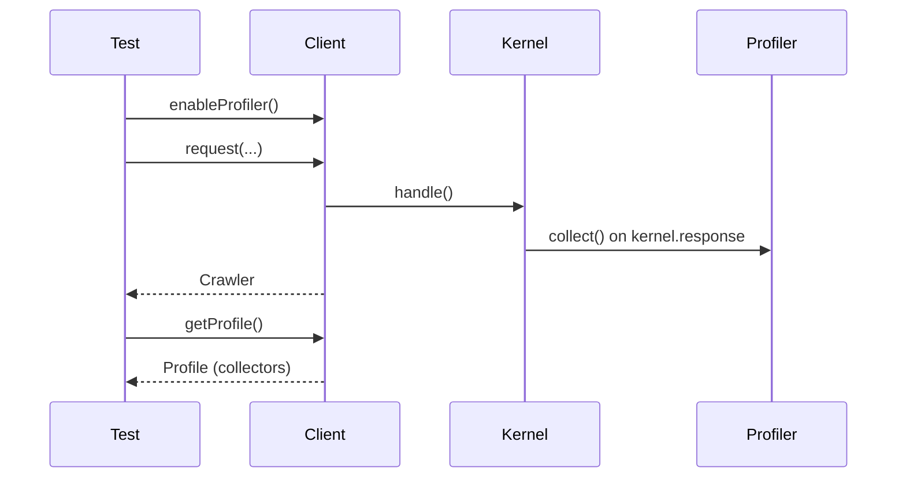

# The Profiler in Tests

!!! tip "In a nutshell"
    Le profiler enregistre les entrailles d'une request (temps, events, emails
    envoyés) dans un `Profile` composé de data collectors, mais la collecte est
    désactivée par défaut dans l'environnement de test. Point d'examen : appelez
    `enableProfiler()` **avant** la request, sinon `getProfile()` retourne
    `false` (pas `null`).

!!! example "Real-world analogy"
    Le profiler est une boîte noire d'avion qu'il faut armer *avant* le
    décollage. Pendant les vols d'essai normaux, l'enregistreur est éteint pour
    économiser poids et carburant, donc rien n'est consigné. Si vous actionnez
    l'interrupteur après l'atterrissage — ou l'oubliez complètement — puis allez
    lire la boîte noire, il n'y a aucune bande : elle est vide (`false`), et pas
    seulement un enregistrement blanc. Armez-la d'abord avec `enableProfiler()`,
    faites voler la request, et vous pourrez ensuite lire la trace de chaque
    instrument — la jauge de temps, le journal des events, le manifeste du
    courrier sortant — depuis la boîte récupérée.

!!! abstract "Learning objectives"
    À la fin de ce chapitre, vous saurez :

    - [ ] Activer le profiling pour une request avec `enableProfiler()`
    - [ ] Récupérer un `Profile` avec `$client->getProfile()`
    - [ ] Lire les data collectors (mailer, time, events) d'un profile
    - [ ] Préférer les assertions mailer dédiées pour vérifier les emails

    **Syllabus:** `Automated Tests → Profiler in tests` ·
    **Level:** Expert ·
    **Est. time:** 25 min ·
    **Prerequisites:** [Functional Tests](functional-tests.md), [The Client](client.md)

---

## Theory

Le **Profiler** enregistre ce qui s'est passé pendant une request — controller,
temps d'exécution, events, emails envoyés, données dumpées — dans un `Profile`
composé de **data collectors**. Dans l'environnement `test`, la collecte est
**désactivée par défaut** pour la vitesse ; vous l'activez request par request
avec `$client->enableProfiler()` **avant** la request, puis lisez le profile
ensuite pour vérifier des internes qu'une simple response ne peut pas révéler.

!!! question "Predict first"
    Vous appelez `$client->request('GET', '/')` puis `$client->getProfile()`,
    en attendant un `Profile`. Vous obtenez `false`. Pourquoi ?

??? note "Reveal"
    Dans l'environnement `test`, `framework.profiler.collect` vaut `false` ;
    vous devez donc appeler `$client->enableProfiler()` **avant** la request.
    Appelé après (ou pas du tout), aucun profile n'est conservé — et il retourne
    `false`, pas `null`.

## Deep Dive — how it works internally

`KernelBrowser::enableProfiler()` pose un drapeau pour que la prochaine request
conserve son profile au lieu de le jeter. Pendant `kernel.response`, le
`Symfony\Component\HttpKernel\EventListener\ProfilerListener` demande au
`Symfony\Component\HttpKernel\Profiler\Profiler` de `collect()` — chaque
`DataCollectorInterface` enregistré capture sa tranche d'état dans un
`Symfony\Component\HttpKernel\Profiler\Profile`.

Après la request, `$client->getProfile()` retourne ce `Profile` (ou `false` si
le profiling n'était pas activé ou si le collector était désactivé). Vous
récupérez ensuite les collectors individuels par nom :

| Collector name | Class (approx.) | Exposes |
|---|---|---|
| `time` | `TimeDataCollector` | durée totale, timeline des events |
| `events` | `EventDataCollector` | listeners appelés/non appelés |
| `mailer` | `MessageDataCollector` | messages `Email` envoyés |
| `request` | `RequestDataCollector` | route, attributs, statut |



!!! note "Source reference"
    `ProfilerListener` déclenche `Profiler::collect()` ; `enableProfiler()`
    active une request explicitement
    ([symfony/symfony `8.0`](https://github.com/symfony/symfony/blob/8.0/src/Symfony/Component/HttpKernel/Profiler/Profiler.php)).

### Emails: prefer the assertion trait

Pour les emails, vous avez rarement besoin du collector brut. `WebTestCase`
intègre le trait
`Symfony\Bundle\FrameworkBundle\Test\MailerAssertionsTrait`, qui fournit
`assertEmailCount()`, `assertQueuedEmailCount()`, `getMailerMessage()` et
`assertEmailHtmlBodyContains()` — ces méthodes lisent le collector mailer pour
vous et n'exigent **pas** `enableProfiler()` quand le profiler est disponible en
test.

## Configuration & code

=== "Reading collectors"

    ```php
    <?php
    declare(strict_types=1);

    namespace App\Tests\Controller;

    use Symfony\Bundle\FrameworkBundle\Test\WebTestCase;
    use Symfony\Component\HttpKernel\DataCollector\TimeDataCollector;

    final class ProfilerTest extends WebTestCase
    {
        public function testTimeCollector(): void
        {
            $client = static::createClient();
            $client->enableProfiler();          // BEFORE the request
            $client->request('GET', '/');

            $profile = $client->getProfile();
            self::assertNotFalse($profile, 'Profiler must be enabled in test env');

            /** @var TimeDataCollector $time */
            $time = $profile->getCollector('time');
            self::assertGreaterThan(0.0, $time->getDuration());
        }
    }
    ```

=== "Asserting emails (preferred)"

    ```php
    <?php
    declare(strict_types=1);

    namespace App\Tests\Controller;

    use Symfony\Bundle\FrameworkBundle\Test\WebTestCase;
    use Symfony\Component\Mime\Email;

    final class MailTest extends WebTestCase
    {
        public function testWelcomeEmail(): void
        {
            $client = static::createClient();
            $client->request('POST', '/register', ['email' => 'ada@example.com']);

            self::assertEmailCount(1);

            /** @var Email $email */
            $email = self::getMailerMessage();
            self::assertEmailHeaderSame($email, 'To', 'ada@example.com');
            self::assertEmailHtmlBodyContains($email, 'Welcome');
        }
    }
    ```

=== "test config"

    ```yaml
    # config/packages/test/web_profiler.yaml
    framework:
        profiler:
            collect: false   # collected only when enableProfiler() is called
    ```

## Best practices & anti-patterns

| ✅ Do | ❌ Avoid |
|---|---|
| `enableProfiler()` **avant** la request | L'appeler après — aucune donnée collectée |
| Utiliser `assertEmail*` pour les emails | Fouiller le collector mailer à la main |
| Protéger `getProfile()` contre `false` | Supposer qu'un profile existe toujours |
| Vérifier les collectors uniquement pour les internes | Profiler dans des tests qui ne vérifient que du HTML |

## When (not) to use it / alternatives

Utilisez le profiler quand vous devez vérifier quelque chose **d'invisible dans
la response** : un event déclenché, un nombre de requêtes SQL, un temps, une
variable dumpée. Pour les emails, utilisez les
[assertions mailer](introspection.md) ; pour le corps/statut de la response,
les [assertions de response](introspection.md). Le profiling ajoute un
surcoût : n'activez-le que dans les tests qui en ont besoin.

!!! danger "Certification traps"
    - `enableProfiler()` doit être appelé **avant** `request()` ; sinon
      `getProfile()` retourne `false`.
    - `getProfile()` retourne `false` (pas `null`) quand le profiling est
      désactivé.
    - En `test`, `profiler.collect` vaut **false** par défaut — les profiles
      n'existent que pour les requests explicitement activées.
    - Le collector mailer s'appelle `mailer` et n'est **pas** le collector `db`
      de Doctrine — les assertions d'emails ont des helpers dédiés.

!!! warning "Common mistakes"
    - Oublier que le `web-profiler` / profiler est disponible (il est livré dans
      le test pack par défaut) puis se demander pourquoi `getProfile()` vaut
      `false`.
    - Vérifier un nombre d'emails sans installation capable de profiler.

## Exercises

1. **(Intermediate)** Activez le profiler sur une request `GET /` et vérifiez la
   route correspondante via le collector `request`.
2. **(Intermediate)** Vérifiez que la soumission du form de contact envoie
   exactement un email dont le sujet contient "Thanks".

??? success "Solutions"

    **1.**

    ```php
    <?php
    declare(strict_types=1);

    namespace App\Tests\Controller;

    use Symfony\Bundle\FrameworkBundle\Test\WebTestCase;
    use Symfony\Component\HttpKernel\DataCollector\RequestDataCollector;

    final class RouteCollectorTest extends WebTestCase
    {
        public function testRoute(): void
        {
            $client = static::createClient();
            $client->enableProfiler();
            $client->request('GET', '/');

            $profile = $client->getProfile();
            self::assertNotFalse($profile);

            /** @var RequestDataCollector $request */
            $request = $profile->getCollector('request');
            self::assertSame('app_home', $request->getRoute());
        }
    }
    ```

    **2.**

    ```php
    <?php
    declare(strict_types=1);

    namespace App\Tests\Controller;

    use Symfony\Bundle\FrameworkBundle\Test\WebTestCase;

    final class ContactMailTest extends WebTestCase
    {
        public function testContactSendsEmail(): void
        {
            $client = static::createClient();
            $client->request('POST', '/contact', ['message' => 'hi']);

            self::assertEmailCount(1);
            self::assertEmailSubjectContains(self::getMailerMessage(), 'Thanks');
        }
    }
    ```

## Certification questions

??? question "Q1. When must `enableProfiler()` be called?"
    - [x] A. Before the request whose profile you want ✅
    - [ ] B. After the request
    - [ ] C. In `setUp()` only
    - [ ] D. It is enabled automatically in test

    **Why:** il active la request *suivante* ; l'appeler après ne collecte rien.
    **Ref:** [Testing — profiler](https://symfony.com/doc/current/testing/profiling.html).

??? question "Q2. `$client->getProfile()` when profiling was not enabled returns…"
    - [x] A. `false` ✅
    - [ ] B. `null`
    - [ ] C. An empty `Profile`
    - [ ] D. Throws

    **Why:** il retourne `false` si aucun profile n'a été collecté.
    **Ref:** [Testing — profiler](https://symfony.com/doc/current/testing/profiling.html).

??? question "Q3. The recommended way to assert a sent email is…"
    - [x] A. `assertEmailCount()` / `getMailerMessage()` from MailerAssertionsTrait ✅
    - [ ] B. Reading the `db` collector
    - [ ] C. Parsing the response HTML
    - [ ] D. Inspecting SMTP logs

    **Why:** `WebTestCase` fournit des assertions mailer adossées au collector
    mailer.
    **Ref:** [Mailer testing](https://symfony.com/doc/current/mailer.html#testing-emails).

??? question "Q4. In the `test` environment, `framework.profiler.collect` defaults to…"
    - [x] A. `false` — profiles collected only per opted-in request ✅
    - [ ] B. `true` for every request
    - [ ] C. Not configurable
    - [ ] D. `true` only for redirects

    **Why:** la configuration du profiler en test pose `collect: false` pour la
    vitesse.
    **Ref:** [Profiler config](https://symfony.com/doc/current/reference/configuration/framework.html#profiler).

## Key takeaways

- Activation par request avec `enableProfiler()` **avant** `request()`.
- `getProfile()` retourne un `Profile` ou `false`.
- Lisez les collectors par nom : `time`, `events`, `mailer`, `request`.
- Préférez les helpers `assertEmail*` au collector mailer brut.

## Last-minute revision

!!! tip "Cheat sheet"
    - `$client->enableProfiler();` puis `$profile = $client->getProfile();`.
    - `$profile->getCollector('time'|'events'|'mailer'|'request')`.
    - Emails : `assertEmailCount()`, `getMailerMessage()`, `assertEmailHtmlBodyContains()`.
    - Défaut en test : `framework.profiler.collect: false`.

## Connections

- **Depends on:** [Functional Tests](functional-tests.md) — le profiling s'attache à une request pilotée par le client.
- **Reused in:** [Introspection](introspection.md) — les assertions mailer lisent le collector mailer du profiler.
- **Confused with:** [Web Profiler & Data Collectors](../miscellaneous/profiler.md) — ce chapitre-là concerne la toolbar de dev ; ici on vérifie les collectors dans les tests.

## Official References
- [Official Symfony docs — Profiling tests](https://symfony.com/doc/current/testing/profiling.html)
- [Official Symfony docs — Testing emails](https://symfony.com/doc/current/mailer.html#testing-emails)
- [Symfony source — Profiler](https://github.com/symfony/symfony/blob/8.0/src/Symfony/Component/HttpKernel/Profiler/Profiler.php)

## Video references

!!! tip "Watch & learn"
    Voici des chaînes vidéo officielles, mises à jour en continu — cherchez-y
    "Symfony testing" pour consolider ce chapitre. Nous lions des chaînes
    stables plutôt que des vidéos individuelles afin que les références ne
    périment jamais.

    - [SymfonyCasts screencasts](https://symfonycasts.com/tracks/symfony) — tutoriels scénarisés à suivre en codant.
    - [Symfony official YouTube](https://www.youtube.com/@SymfonyOfficial) — conférences et keynotes SymfonyCon.
    - [Official docs for this topic](https://symfony.com/doc/current/testing/profiling.html) — certaines pages de la doc Symfony intègrent un screencast.

## Confidence check

Je suis prêt quand je peux :

- [ ] expliquer **pourquoi** le profiling est désactivé par défaut en environnement de test
- [ ] activer et lire les collectors d'un `Profile` dans Symfony 8
- [ ] déboguer un `getProfile()` qui retourne `false`
- [ ] repérer le piège : `enableProfiler()` doit précéder la request
- [ ] expliquer comment `ProfilerListener` déclenche la collecte sur `kernel.response`

---

<small>Related: [Introspection](introspection.md) · [Web Profiler & Data Collectors](../miscellaneous/profiler.md) · [Functional Tests](functional-tests.md)</small>
