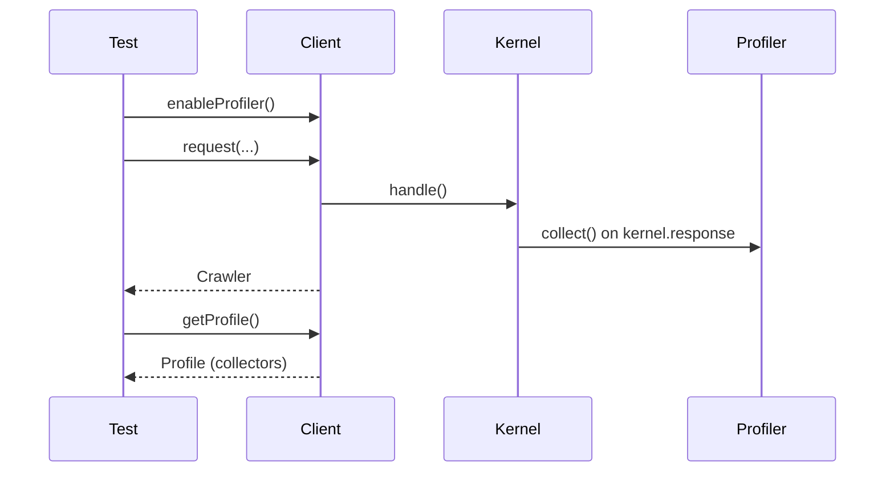

# The Profiler in Tests

!!! tip "In a nutshell"
    The profiler records a request's internals (timings, events, sent emails) into a
    `Profile` of data collectors, but collection is off by default in the test env.
    Exam hook: call `enableProfiler()` **before** the request, or `getProfile()`
    returns `false` (not `null`).

!!! example "Real-world analogy"
    The profiler is a flight data recorder that you have to arm *before* takeoff. During
    normal test flights the recorder is switched off to save weight and fuel, so nothing is
    logged. If you flip the switch after landing — or forget it entirely — and then go to
    read the black box, there is no tape at all: it reads empty (`false`), not merely a blank
    recording. Arm it first with `enableProfiler()`, fly the request, and afterward you can
    read each instrument's trace — the timing gauge, the events log, the outgoing-mail
    manifest — from the recovered box.

!!! abstract "Learning objectives"
    By the end of this chapter you can:

    - [ ] Enable profiling for a request with `enableProfiler()`
    - [ ] Retrieve a `Profile` with `$client->getProfile()`
    - [ ] Read data collectors (mailer, time, events) from a profile
    - [ ] Prefer the dedicated mailer assertions for asserting emails

    **Syllabus:** `Automated Tests → Profiler in tests` ·
    **Level:** Expert ·
    **Est. time:** 25 min ·
    **Prerequisites:** [Functional Tests](functional-tests.md), [The Client](client.md)

---

## Theory

The **Profiler** records what happened during a request — controller, timings,
events, sent emails, dumped data — into a `Profile` made of **data collectors**.
In the `test` environment collection is **off by default** for speed; you turn it
on per request with `$client->enableProfiler()` **before** the request, then read
the profile afterwards to assert on internals a plain response can't reveal.

```php
$client = static::createClient();
$client->enableProfiler();          // BEFORE the request (collection is off in test)
$client->request('GET', '/');

$profile = $client->getProfile();   // the recorded Profile, made of data collectors
```

!!! question "Predict first"
    You call `$client->request('GET', '/')` then `$client->getProfile()`,
    expecting a `Profile`. You get `false`. Why?

??? note "Reveal"
    In the `test` env `framework.profiler.collect` is `false`, so you must call
    `$client->enableProfiler()` **before** the request. Called after (or not at
    all), no profile is kept — and it returns `false`, not `null`.

## Deep Dive — how it works internally

`KernelBrowser::enableProfiler()` sets a flag so the next request keeps its
profile instead of discarding it. During `kernel.response` the
`Symfony\Component\HttpKernel\EventListener\ProfilerListener` asks the
`Symfony\Component\HttpKernel\Profiler\Profiler` to `collect()` — each registered
`DataCollectorInterface` snapshots its slice of state into a
`Symfony\Component\HttpKernel\Profiler\Profile`.

```php
// KernelBrowser::enableProfiler() flags the NEXT request only
$client->enableProfiler();
$client->request('GET', '/');
// during kernel.response, ProfilerListener asks the Profiler to collect():
// each registered DataCollectorInterface snapshots its state into a Profile
```

After the request, `$client->getProfile()` returns that `Profile` (or `false` if
profiling wasn't enabled or the collector was disabled). You then fetch individual
collectors by name:

```php
$profile = $client->getProfile();            // Profile, or false if not enabled
self::assertNotFalse($profile);

$time = $profile->getCollector('time');      // TimeDataCollector
$mailer = $profile->getCollector('mailer');  // MessageDataCollector
```

| Collector name | Class (approx.) | Exposes |
|---|---|---|
| `time` | `TimeDataCollector` | total/duration, events timeline |
| `events` | `EventDataCollector` | called/not-called listeners |
| `mailer` | `MessageDataCollector` | sent `Email` messages |
| `request` | `RequestDataCollector` | route, attributes, status |



!!! note "Source reference"
    `ProfilerListener` triggers `Profiler::collect()`; `enableProfiler()` opts a
    request in
    ([symfony/symfony `8.0`](https://github.com/symfony/symfony/blob/8.0/src/Symfony/Component/HttpKernel/Profiler/Profiler.php)).

### Emails: prefer the assertion trait

For emails you rarely need the raw collector. `WebTestCase` mixes in
`Symfony\Bundle\FrameworkBundle\Test\MailerAssertionsTrait`, giving
`assertEmailCount()`, `assertQueuedEmailCount()`, `getMailerMessage()` and
`assertEmailHtmlBodyContains()` — these read the mailer collector for you and do
**not** require `enableProfiler()` when the profiler is available in test.

```php
// MailerAssertionsTrait is already mixed into WebTestCase — no enableProfiler() needed
$client->request('POST', '/register', ['email' => 'ada@example.com']);

self::assertEmailCount(1);         // emails sent during the request
self::assertQueuedEmailCount(0);   // emails still queued (not sent)

$email = self::getMailerMessage(); // first collected Email
self::assertEmailHtmlBodyContains($email, 'Welcome');
```

## Configuration & code

=== "Reading collectors"

    ```php
    <?php
    declare(strict_types=1);

    namespace App\Tests\Controller;

    use Symfony\Bundle\FrameworkBundle\Test\WebTestCase;
    use Symfony\Component\HttpKernel\DataCollector\TimeDataCollector;

    final class ProfilerTest extends WebTestCase
    {
        public function testTimeCollector(): void
        {
            $client = static::createClient();
            $client->enableProfiler();          // BEFORE the request
            $client->request('GET', '/');

            $profile = $client->getProfile();
            self::assertNotFalse($profile, 'Profiler must be enabled in test env');

            /** @var TimeDataCollector $time */
            $time = $profile->getCollector('time');
            self::assertGreaterThan(0.0, $time->getDuration());
        }
    }
    ```

=== "Asserting emails (preferred)"

    ```php
    <?php
    declare(strict_types=1);

    namespace App\Tests\Controller;

    use Symfony\Bundle\FrameworkBundle\Test\WebTestCase;
    use Symfony\Component\Mime\Email;

    final class MailTest extends WebTestCase
    {
        public function testWelcomeEmail(): void
        {
            $client = static::createClient();
            $client->request('POST', '/register', ['email' => 'ada@example.com']);

            self::assertEmailCount(1);

            /** @var Email $email */
            $email = self::getMailerMessage();
            self::assertEmailHeaderSame($email, 'To', 'ada@example.com');
            self::assertEmailHtmlBodyContains($email, 'Welcome');
        }
    }
    ```

=== "test config"

    ```yaml
    # config/packages/test/web_profiler.yaml
    framework:
        profiler:
            collect: false   # collected only when enableProfiler() is called
    ```

## Best practices & anti-patterns

| ✅ Do | ❌ Avoid |
|---|---|
| `enableProfiler()` **before** the request | Calling it after — no data collected |
| Use `assertEmail*` for emails | Digging into the mailer collector by hand |
| Guard `getProfile()` against `false` | Assuming a profile always exists |
| Assert on collectors for internals only | Profiling in tests that assert only HTML |

## When (not) to use it / alternatives

Reach for the profiler when you must assert something **not visible in the
response**: an event fired, a query count, a timing, a dumped variable. For emails
use the [mailer assertions](introspection.md); for the response body/status use
the [response assertions](introspection.md). Profiling adds overhead, so enable it
only in the tests that need it.

!!! danger "Certification traps"
    - `enableProfiler()` must be called **before** `request()`; otherwise
      `getProfile()` returns `false`.
    - `getProfile()` returns `false` (not `null`) when profiling is off.
    - In `test`, `profiler.collect` is **false** by default — profiles exist only
      for opted-in requests.
    - The mailer collector is named `mailer` and is **not** Doctrine's `db`
      collector — email assertions have dedicated helpers.

!!! warning "Common mistakes"
    - Forgetting the `web-profiler` / profiler is available (it ships in the
      default test pack) and then wondering why `getProfile()` is `false`.
    - Asserting email count without a profiler-capable setup.

## Exercises

1. **(Intermediate)** Enable the profiler on a `GET /` request and assert the
   matched route via the `request` collector.
2. **(Intermediate)** Assert that submitting the contact form sends exactly one
   email whose subject contains "Thanks".

??? success "Solutions"

    **1.**

    ```php
    <?php
    declare(strict_types=1);

    namespace App\Tests\Controller;

    use Symfony\Bundle\FrameworkBundle\Test\WebTestCase;
    use Symfony\Component\HttpKernel\DataCollector\RequestDataCollector;

    final class RouteCollectorTest extends WebTestCase
    {
        public function testRoute(): void
        {
            $client = static::createClient();
            $client->enableProfiler();
            $client->request('GET', '/');

            $profile = $client->getProfile();
            self::assertNotFalse($profile);

            /** @var RequestDataCollector $request */
            $request = $profile->getCollector('request');
            self::assertSame('app_home', $request->getRoute());
        }
    }
    ```

    **2.**

    ```php
    <?php
    declare(strict_types=1);

    namespace App\Tests\Controller;

    use Symfony\Bundle\FrameworkBundle\Test\WebTestCase;

    final class ContactMailTest extends WebTestCase
    {
        public function testContactSendsEmail(): void
        {
            $client = static::createClient();
            $client->request('POST', '/contact', ['message' => 'hi']);

            self::assertEmailCount(1);
            self::assertEmailSubjectContains(self::getMailerMessage(), 'Thanks');
        }
    }
    ```

## Certification questions

??? question "Q1. When must `enableProfiler()` be called?"
    - [x] A. Before the request whose profile you want ✅
    - [ ] B. After the request
    - [ ] C. In `setUp()` only
    - [ ] D. It is enabled automatically in test

    **Why:** it opts the *next* request in; calling it after collects nothing.
    **Ref:** [Testing — profiler](https://symfony.com/doc/current/testing/profiling.html).

??? question "Q2. `$client->getProfile()` when profiling was not enabled returns…"
    - [x] A. `false` ✅
    - [ ] B. `null`
    - [ ] C. An empty `Profile`
    - [ ] D. Throws

    **Why:** it returns `false` if no profile was collected.
    **Ref:** [Testing — profiler](https://symfony.com/doc/current/testing/profiling.html).

??? question "Q3. The recommended way to assert a sent email is…"
    - [x] A. `assertEmailCount()` / `getMailerMessage()` from MailerAssertionsTrait ✅
    - [ ] B. Reading the `db` collector
    - [ ] C. Parsing the response HTML
    - [ ] D. Inspecting SMTP logs

    **Why:** `WebTestCase` provides mailer assertions backed by the mailer
    collector. **Ref:** [Mailer testing](https://symfony.com/doc/current/mailer.html#testing-emails).

??? question "Q4. In the `test` environment, `framework.profiler.collect` defaults to…"
    - [x] A. `false` — profiles collected only per opted-in request ✅
    - [ ] B. `true` for every request
    - [ ] C. Not configurable
    - [ ] D. `true` only for redirects

    **Why:** the test profiler config sets `collect: false` for speed.
    **Ref:** [Profiler config](https://symfony.com/doc/current/reference/configuration/framework.html#profiler).

## Key takeaways

- Enable per request with `enableProfiler()` **before** `request()`.
- `getProfile()` returns a `Profile` or `false`.
- Read collectors by name: `time`, `events`, `mailer`, `request`.
- Prefer `assertEmail*` helpers over the raw mailer collector.

## Last-minute revision

!!! tip "Cheat sheet"
    - `$client->enableProfiler();` then `$profile = $client->getProfile();`.
    - `$profile->getCollector('time'|'events'|'mailer'|'request')`.
    - Emails: `assertEmailCount()`, `getMailerMessage()`, `assertEmailHtmlBodyContains()`.
    - Test default: `framework.profiler.collect: false`.

## Connections

- **Depends on:** [Functional Tests](functional-tests.md) — profiling attaches to a client-driven request.
- **Reused in:** [Introspection](introspection.md) — the mailer assertions read the profiler's mailer collector.
- **Confused with:** [Web Profiler & Data Collectors](../miscellaneous/profiler.md) — that chapter is the dev toolbar; this is asserting collectors in tests.

## Official References
- [Official Symfony docs — Profiling tests](https://symfony.com/doc/current/testing/profiling.html)
- [Official Symfony docs — Testing emails](https://symfony.com/doc/current/mailer.html#testing-emails)
- [Symfony source — Profiler](https://github.com/symfony/symfony/blob/8.0/src/Symfony/Component/HttpKernel/Profiler/Profiler.php)

## Video references

!!! tip "Watch & learn"
    These are official, continuously-updated video channels — search them for
    "Symfony testing" to reinforce this chapter. We link stable channels rather than
    individual videos so the references never rot.

    - [SymfonyCasts screencasts](https://symfonycasts.com/tracks/symfony) — scripted, code-along tutorials.
    - [Symfony official YouTube](https://www.youtube.com/@SymfonyOfficial) — SymfonyCon conference talks & keynotes.
    - [Official docs for this topic](https://symfony.com/doc/current/testing/profiling.html) — some Symfony doc pages embed a screencast.

## Confidence check

I'm ready when I can:

- [ ] explain **why** profiling is off by default in the test env
- [ ] enable and read a `Profile`'s collectors in Symfony 8
- [ ] debug a `getProfile()` that returns `false`
- [ ] spot the trap that `enableProfiler()` must precede the request
- [ ] explain how `ProfilerListener` triggers collection on `kernel.response`

---

<small>Related: [Introspection](introspection.md) · [Web Profiler & Data Collectors](../miscellaneous/profiler.md) · [Functional Tests](functional-tests.md)</small>
