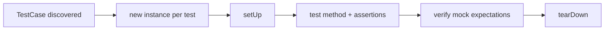

# Unit Tests with PHPUnit

!!! tip "In a nutshell"
    Un test unitaire exerce une seule classe isolément, en remplaçant ses
    collaborateurs par des doublures de test afin qu'un échec pointe exactement
    une unité. Vous étendez directement `TestCase` de PHPUnit — Symfony ne
    fournit aucune classe de base pour les tests unitaires. Point d'examen :
    PHPUnit 11/12 fonctionne uniquement par attributs, c'est donc
    `#[DataProvider]`, jamais `@dataProvider`.

!!! example "Real-world analogy"
    Un test unitaire, c'est comme tester une pièce de voiture seule sur l'établi
    avec des connecteurs factices, au lieu de la monter dans la voiture entière
    et de rouler. Comme tout ce qui entoure la pièce est simulé, si le voyant de
    l'établi passe au rouge, vous savez que le défaut vient de *cette* pièce et
    de rien d'autre. Un **stub** est un capteur factice qui se contente de
    fournir à la pièce une mesure fixe pour qu'elle ait de quoi travailler —
    vous ne vérifiez jamais le capteur lui-même. Un **mock** est une doublure
    plus sophistiquée qui compte aussi si et comment la pièce l'a sollicitée, et
    déclenche une alarme à la fin si les sollicitations attendues n'ont pas eu
    lieu.

!!! abstract "Learning objectives"
    À la fin de ce chapitre, vous saurez :

    - [ ] Écrire un test PHPUnit étendant `PHPUnit\Framework\TestCase`
    - [ ] Alimenter des cas avec `#[DataProvider]` et `#[TestWith]`
    - [ ] Choisir correctement entre un **stub** (`createStub`) et un **mock** (`createMock`)
    - [ ] Tester un service Symfony isolément en injectant des doublures pour ses collaborateurs

    **Syllabus:** `Automated Tests → Unit Testing` ·
    **Level:** Advanced ·
    **Est. time:** 30 min ·
    **Prerequisites:** [Dependency Injection](../dependency-injection/index.md)

---

## Theory

Un **test unitaire** exerce une seule classe isolément, en remplaçant ses
collaborateurs par des *doublures de test* (test doubles) afin qu'un échec
pointe exactement une unité. Symfony ne fournit pas sa propre classe de base
pour les tests unitaires — vous étendez directement
`PHPUnit\Framework\TestCase`. Aucun kernel n'est démarré, aucun container n'est
construit ; c'est du PHPUnit pur.

Symfony 8 cible **PHPUnit 11/12**, qui est entièrement **piloté par
attributs** : les annotations en docblock comme `@dataProvider` et `@covers`
sont supprimées. Les méthodes de test sont découvertes par le préfixe `test` ou
l'attribut `#[Test]`.

```php
use PHPUnit\Framework\Attributes\Test;
use PHPUnit\Framework\TestCase;

final class DiscoveryTest extends TestCase
{
    // discovered via the "test" prefix
    public function testItWorks(): void { self::assertTrue(true); }

    #[Test] // discovered via the attribute — no prefix needed
    public function itAlsoWorks(): void { self::assertTrue(true); }

    // @dataProvider / @covers docblock annotations: REMOVED in PHPUnit 11/12
}
```

!!! question "Predict first"
    Vous faites `createStub(Foo::class)` mais la classe testée ne l'appelle
    jamais, et vous n'affirmez rien sur le stub. Le test échoue-t-il ?

??? note "Reveal"
    Non — un **stub** fournit uniquement des valeurs préparées et ne vérifie
    jamais les interactions. Seul un **mock** avec `->expects(...)` est vérifié
    au teardown ; un appel manqué sur un mock échoue, un appel manqué sur un
    stub non.

## Deep Dive — how it works internally

PHPUnit construit une **suite de tests** par réflexion sur les classes qui
étendent `TestCase`. Pour chaque méthode de test, il crée une nouvelle
**instance de la classe de test** (l'état ne fuit jamais entre les tests),
exécute `setUp()`, le test, puis `tearDown()`. Les assertions lèvent
`PHPUnit\Framework\ExpectationFailedException` ; un throwable non attrapé marque
le test comme *errored* plutôt que *failed*.

```php
final class LifecycleTest extends TestCase   // a fresh instance per test method
{
    protected function setUp(): void { /* runs before EACH test */ }
    protected function tearDown(): void { /* runs after EACH test */ }

    public function testExample(): void
    {
        // a failing assertion throws ExpectationFailedException => test "fails";
        // any other uncaught throwable marks the test as "errored"
        self::assertTrue(true);
    }
}
```

Les doublures de test proviennent de la machinerie **MockObject** de PHPUnit
(`PHPUnit\Framework\MockObject\MockBuilder`). `createStub()` et `createMock()`
génèrent à l'exécution une sous-classe du type cible :

- **Stub** — fournit des valeurs de retour préparées ; il n'affirme **pas**
  comment il est utilisé.
- **Mock** — un stub qui vérifie *aussi* des **attentes** (`expects()`),
  contrôlées automatiquement par la vérification propre à PHPUnit lors du
  teardown.

Les deux se configurent avec `method()`, `willReturn()`,
`willReturnCallback()`, `willThrowException()`, et des matchers comme
`$this->once()`, `$this->exactly(2)`, `$this->never()`.

```php
// createStub() / createMock() generate a runtime subclass (MockBuilder machinery)
$stub = $this->createStub(Mailer::class);
$stub->method('send')->willReturn(true);                              // canned value
$stub->method('render')->willReturnCallback(fn (string $t): string => "<p>$t</p>");
$stub->method('connect')->willThrowException(new \RuntimeException('down'));

// A mock adds verified expectations, checked automatically at teardown
$mock = $this->createMock(Mailer::class);
$mock->expects($this->once())->method('connect');    // exactly one call
$mock->expects($this->exactly(2))->method('send');   // exactly two calls
$mock->expects($this->never())->method('render');    // must never be called
```



!!! note "Source reference"
    Les classes de base de Symfony étendent celles de PHPUnit —
    `Symfony\Bundle\FrameworkBundle\Test\KernelTestCase` étend
    `PHPUnit\Framework\TestCase`
    ([symfony/symfony `8.0`](https://github.com/symfony/symfony/blob/8.0/src/Symfony/Bundle/FrameworkBundle/Test/KernelTestCase.php)).

### Data providers

Un `#[DataProvider('methodName')]` désigne une méthode **public static**
retournant un iterable de tableaux d'arguments ; PHPUnit exécute le test une
fois par ligne. `#[TestWith]` inline une seule ligne sans méthode de provider.
Le caractère statique des méthodes de provider est imposé depuis PHPUnit 10+
(un provider non statique est une erreur).

## Configuration & code

=== "Service under test"

    ```php
    <?php
    declare(strict_types=1);

    namespace App\Pricing;

    final readonly class PriceCalculator
    {
        public function __construct(private TaxRateProvider $rates) {}

        public function withTax(int $netCents, string $country): int
        {
            $rate = $this->rates->rateFor($country); // e.g. 0.20
            return (int) round($netCents * (1 + $rate));
        }
    }
    ```

=== "Unit test"

    ```php
    <?php
    declare(strict_types=1);

    namespace App\Tests\Pricing;

    use App\Pricing\PriceCalculator;
    use App\Pricing\TaxRateProvider;
    use PHPUnit\Framework\Attributes\DataProvider;
    use PHPUnit\Framework\Attributes\TestWith;
    use PHPUnit\Framework\TestCase;

    final class PriceCalculatorTest extends TestCase
    {
        #[TestWith([1000, 'FR', 1200])]
        #[DataProvider('provideRates')]
        public function testWithTax(int $net, string $country, int $expected): void
        {
            // Stub: only canned data, no interaction assertion.
            $rates = $this->createStub(TaxRateProvider::class);
            $rates->method('rateFor')->willReturn(match ($country) {
                'FR' => 0.20, 'DE' => 0.19, default => 0.0,
            });

            self::assertSame($expected, (new PriceCalculator($rates))->withTax($net, $country));
        }

        public static function provideRates(): iterable
        {
            yield 'germany' => [1000, 'DE', 1190];
            yield 'zero' => [1000, 'XX', 1000];
        }
    }
    ```

=== "Mock with expectation"

    ```php
    <?php
    declare(strict_types=1);

    namespace App\Tests\Pricing;

    use App\Pricing\TaxRateProvider;
    use PHPUnit\Framework\TestCase;

    final class InteractionTest extends TestCase
    {
        public function testLooksUpRateExactlyOnce(): void
        {
            $rates = $this->createMock(TaxRateProvider::class);
            $rates->expects(self::once())     // expectation is verified at teardown
                  ->method('rateFor')
                  ->with('FR')
                  ->willReturn(0.20);

            $rates->rateFor('FR');
        }
    }
    ```

=== "Console"

    ```console
    $ php bin/phpunit --testsuite unit
    $ php bin/phpunit tests/Pricing/PriceCalculatorTest.php
    ```

## Best practices & anti-patterns

| ✅ Do | ❌ Avoid |
|---|---|
| Étendre `TestCase` pour la logique pure | Démarrer le kernel pour un test unitaire |
| Utiliser `createStub` quand seuls des retours suffisent | Ajouter des `expects()` que vous ne vérifiez pas |
| Rendre les providers `public static` | Providers non statiques ou non publics |
| Utiliser `assertSame` pour les scalaires | `assertEquals` qui masque la coercition de types |

## When (not) to use it / alternatives

Testez unitairement le code **algorithmique** et les services aux collaborateurs
clairs. Quand le comportement *est* le câblage du framework (le routing atteint
le bon controller, la sécurité bloque une page), un test unitaire prouve peu de
chose — préférez un [test fonctionnel](functional-tests.md). Si vous avez besoin
du container mais pas de HTTP, utilisez
[`KernelTestCase`](framework-objects.md).

!!! danger "Certification traps"
    - `#[DataProvider]` vit dans `PHPUnit\Framework\Attributes` et désigne une
      méthode **`public static`** — la forme annotation a disparu dans
      PHPUnit 11/12.
    - `createStub()` n'échoue jamais sur une interaction ; seul `createMock()` +
      `expects()` vérifie les appels.
    - `assertSame` vérifie le type **et** la valeur (`===`) ; `assertEquals` est
      permissif (`==`).
    - Une nouvelle instance de la classe de test est créée **par méthode de
      test** — ne comptez pas sur un état posé dans un autre test.

!!! warning "Common mistakes"
    - Poser `expects(self::once())` puis ne rien affirmer — c'est l'attente qui
      en fait un test ; sans appel, il échoue au teardown.
    - Mocker un *value object* au lieu de simplement le construire.

## Exercises

1. **(Basic)** Écrivez un test piloté par data provider pour une méthode
   `Slugger::slugify()` couvrant les espaces, les accents et une entrée déjà
   sluggée.
2. **(Intermediate)** Testez qu'un `NotificationService` appelle son
   `Transport::send()` injecté exactement une fois, avec un mock et une
   correspondance d'arguments via `with()`.

??? success "Solutions"

    **1.**

    ```php
    <?php
    declare(strict_types=1);

    namespace App\Tests;

    use App\Slugger;
    use PHPUnit\Framework\Attributes\DataProvider;
    use PHPUnit\Framework\TestCase;

    final class SluggerTest extends TestCase
    {
        #[DataProvider('cases')]
        public function testSlugify(string $in, string $out): void
        {
            self::assertSame($out, (new Slugger())->slugify($in));
        }

        public static function cases(): iterable
        {
            yield ['Hello World', 'hello-world'];
            yield ['Éléphant', 'elephant'];
            yield ['already-slug', 'already-slug'];
        }
    }
    ```

    **2.**

    ```php
    <?php
    declare(strict_types=1);

    namespace App\Tests;

    use App\Notification\NotificationService;
    use App\Notification\Transport;
    use PHPUnit\Framework\TestCase;

    final class NotificationServiceTest extends TestCase
    {
        public function testSendsOnce(): void
        {
            $transport = $this->createMock(Transport::class);
            $transport->expects(self::once())
                      ->method('send')
                      ->with('hi@example.com', 'Welcome');

            (new NotificationService($transport))->welcome('hi@example.com');
        }
    }
    ```

## Certification questions

??? question "Q1. Which attribute binds a test to a data-provider method in PHPUnit 11/12?"
    - [ ] A. `#[Provider]`
    - [x] B. `#[DataProvider('methodName')]` ✅
    - [ ] C. `@dataProvider methodName`
    - [ ] D. `#[UseProvider]`

    **Why:** `PHPUnit\Framework\Attributes\DataProvider` remplace l'annotation
    `@dataProvider`, supprimée. **Ref:** [Testing](https://symfony.com/doc/current/testing.html).

??? question "Q2. A data-provider method must be…"
    - [x] A. `public static`, returning an iterable ✅
    - [ ] B. `private`, returning an array
    - [ ] C. `public` but not static
    - [ ] D. protected and non-static

    **Why:** PHPUnit 10+ exige que les méthodes de provider soient publiques et
    statiques.
    **Ref:** [PHPUnit docs](https://docs.phpunit.de/en/11.0/writing-tests-for-phpunit.html#data-providers).

??? question "Q3. You only need canned return values and no call verification. Use…"
    - [x] A. `$this->createStub(Foo::class)` ✅
    - [ ] B. `$this->createMock(Foo::class)` with `expects()`
    - [ ] C. `new Foo()` always
    - [ ] D. `$this->getMockForAbstractClass()`

    **Why:** un stub fournit des valeurs sans affirmer d'interactions ; un mock
    ajoute des attentes vérifiables dont vous n'avez pas besoin ici.
    **Ref:** [PHPUnit test doubles](https://docs.phpunit.de/en/11.0/test-doubles.html).

??? question "Q4. `assertSame(1, '1')` will…"
    - [x] A. Fail — different types ✅
    - [ ] B. Pass — values are equal
    - [ ] C. Emit a deprecation
    - [ ] D. Throw a TypeError

    **Why:** `assertSame` utilise `===` ; utilisez `assertEquals` pour une
    comparaison permissive.
    **Ref:** [PHPUnit assertions](https://docs.phpunit.de/en/11.0/assertions.html#assertsame).

## Key takeaways

- Les tests unitaires étendent `PHPUnit\Framework\TestCase` ; pas de kernel, pas
  de container.
- PHPUnit 11/12 fonctionne uniquement par attributs : `#[DataProvider]`,
  `#[TestWith]`, `#[Test]`.
- **Stub** = valeurs ; **Mock** = valeurs + `expects()` vérifiés.
- Une instance fraîche par méthode de test — l'état ne fuit jamais.

## Last-minute revision

!!! tip "Cheat sheet"
    - Classe de base : `PHPUnit\Framework\TestCase`.
    - Providers : `#[DataProvider('m')]` → `public static function m(): iterable`.
    - Ligne inline : `#[TestWith([1, 2, 3])]`.
    - Doublures : `createStub()` (valeurs) vs `createMock()` + `expects()`.
    - Matchers : `self::once()`, `self::never()`, `self::exactly(n)`.

## Connections

- **Depends on:** [Dependency Injection](../dependency-injection/index.md) — les classes testables reçoivent leurs collaborateurs en arguments de constructeur, que vous pouvez doubler.
- **Reused in:** [Functional Tests](functional-tests.md) — les mêmes doublures remplacent les services de frontière une fois le kernel démarré.
- **Confused with:** [PHPUnit Bridge](phpunit-bridge.md) — le bridge ajoute l'outillage dépréciations/horloge par-dessus PHPUnit pur, pas la classe de base `TestCase`.

## Official References
- [Official Symfony docs — Testing](https://symfony.com/doc/current/testing.html)
- [PHPUnit — Writing tests](https://docs.phpunit.de/en/11.0/writing-tests-for-phpunit.html)
- [Symfony source — KernelTestCase](https://github.com/symfony/symfony/blob/8.0/src/Symfony/Bundle/FrameworkBundle/Test/KernelTestCase.php)

## Video references

!!! tip "Watch & learn"
    Voici des chaînes vidéo officielles, mises à jour en continu — cherchez-y
    "Symfony testing" pour consolider ce chapitre. Nous lions des chaînes
    stables plutôt que des vidéos individuelles afin que les références ne
    périment jamais.

    - [SymfonyCasts screencasts](https://symfonycasts.com/tracks/symfony) — tutoriels scénarisés à suivre en codant.
    - [Symfony official YouTube](https://www.youtube.com/@SymfonyOfficial) — conférences et keynotes SymfonyCon.
    - [Official docs for this topic](https://symfony.com/doc/current/testing.html) — certaines pages de la doc Symfony intègrent un screencast.

## Confidence check

Je suis prêt quand je peux :

- [ ] expliquer **pourquoi** isoler une unité avec des doublures permet de localiser un échec
- [ ] écrire un test `#[DataProvider]` / `#[TestWith]` sur PHPUnit 11/12
- [ ] déboguer une erreur "data provider must be public static"
- [ ] repérer le piège : un stub ne vérifie jamais les appels (seul un mock le fait)
- [ ] expliquer comment PHPUnit construit une instance de test fraîche par méthode

---

<small>Related: [Functional Tests](functional-tests.md) · [Framework Objects](framework-objects.md) · [PHPUnit Bridge](phpunit-bridge.md)</small>
