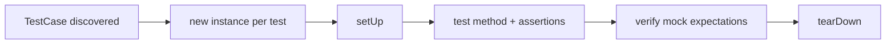

# Unit Tests with PHPUnit

!!! tip "In a nutshell"
    A unit test exercises one class in isolation, faking its collaborators with
    test doubles so a failure points at exactly one unit. You extend PHPUnit's
    `TestCase` directly — Symfony ships no unit-test base class. Exam hook: PHPUnit
    11/12 is attribute-only, so it is `#[DataProvider]`, never `@dataProvider`.

!!! example "Real-world analogy"
    A unit test is like bench-testing a single car part on the workbench with dummy connectors,
    instead of bolting it into the whole car and driving around. Because everything around the
    part is faked, if the bench light goes red you know the fault is in *that* part, nothing
    else. A **stub** is a dummy sensor that just feeds the part a fixed reading so it has
    something to work with — you never check the sensor itself. A **mock** is a fancier dummy
    that also keeps a tally of whether and how the part poked it, and raises an alarm at the
    end if the expected pokes never happened.

!!! abstract "Learning objectives"
    By the end of this chapter you can:

    - [ ] Write a PHPUnit test extending `PHPUnit\Framework\TestCase`
    - [ ] Feed cases with `#[DataProvider]` and `#[TestWith]`
    - [ ] Choose correctly between a **stub** (`createStub`) and a **mock** (`createMock`)
    - [ ] Test a Symfony service in isolation by injecting doubles for its collaborators

    **Syllabus:** `Automated Tests → Unit Testing` ·
    **Level:** Advanced ·
    **Est. time:** 30 min ·
    **Prerequisites:** [Dependency Injection](../dependency-injection/index.md)

---

## Theory

A **unit test** exercises one class in isolation, replacing its collaborators with
*test doubles* so a failure points at exactly one unit. Symfony does not ship its
own unit-test base class — you extend PHPUnit's `PHPUnit\Framework\TestCase`
directly. No kernel is booted, no container is built; this is plain PHPUnit.

Symfony 8 targets **PHPUnit 11/12**, which is fully **attribute-driven**:
docblock annotations such as `@dataProvider` and `@covers` are removed. Test
methods are discovered by the `test` prefix or the `#[Test]` attribute.

```php
use PHPUnit\Framework\Attributes\Test;
use PHPUnit\Framework\TestCase;

final class DiscoveryTest extends TestCase
{
    // discovered via the "test" prefix
    public function testItWorks(): void { self::assertTrue(true); }

    #[Test] // discovered via the attribute — no prefix needed
    public function itAlsoWorks(): void { self::assertTrue(true); }

    // @dataProvider / @covers docblock annotations: REMOVED in PHPUnit 11/12
}
```

!!! question "Predict first"
    You `createStub(Foo::class)` but the class under test never actually calls it,
    and you assert nothing about the stub. Does the test fail?

??? note "Reveal"
    No — a **stub** only supplies canned values and never verifies interactions.
    Only a **mock** with `->expects(...)` is checked at teardown; a missed call on
    a mock fails, a missed call on a stub does not.

## Deep Dive — how it works internally

PHPUnit builds a **test suite** by reflecting over classes that extend
`TestCase`. For each test method it creates a fresh **instance of the test class**
(state never leaks between tests), runs `setUp()`, the test, then `tearDown()`.
Assertions throw `PHPUnit\Framework\ExpectationFailedException`; an uncaught
throwable marks the test *errored* rather than *failed*.

```php
final class LifecycleTest extends TestCase   // a fresh instance per test method
{
    protected function setUp(): void { /* runs before EACH test */ }
    protected function tearDown(): void { /* runs after EACH test */ }

    public function testExample(): void
    {
        // a failing assertion throws ExpectationFailedException => test "fails";
        // any other uncaught throwable marks the test as "errored"
        self::assertTrue(true);
    }
}
```

Test doubles come from PHPUnit's **MockObject** machinery
(`PHPUnit\Framework\MockObject\MockBuilder`). `createStub()` and `createMock()`
generate a subclass of the target type at runtime:

- **Stub** — supplies canned return values; it does **not** assert how it is used.
- **Mock** — a stub that *also* verifies **expectations** (`expects()`), checked
  automatically by PHPUnit's own verification during teardown.

Both are configured with `method()`, `willReturn()`, `willReturnCallback()`,
`willThrowException()`, and matchers like `$this->once()`,
`$this->exactly(2)`, `$this->never()`.

```php
// createStub() / createMock() generate a runtime subclass (MockBuilder machinery)
$stub = $this->createStub(Mailer::class);
$stub->method('send')->willReturn(true);                              // canned value
$stub->method('render')->willReturnCallback(fn (string $t): string => "<p>$t</p>");
$stub->method('connect')->willThrowException(new \RuntimeException('down'));

// A mock adds verified expectations, checked automatically at teardown
$mock = $this->createMock(Mailer::class);
$mock->expects($this->once())->method('connect');    // exactly one call
$mock->expects($this->exactly(2))->method('send');   // exactly two calls
$mock->expects($this->never())->method('render');    // must never be called
```



!!! note "Source reference"
    Symfony's own base classes extend PHPUnit's —
    `Symfony\Bundle\FrameworkBundle\Test\KernelTestCase` extends
    `PHPUnit\Framework\TestCase`
    ([symfony/symfony `8.0`](https://github.com/symfony/symfony/blob/8.0/src/Symfony/Bundle/FrameworkBundle/Test/KernelTestCase.php)).

### Data providers

A `#[DataProvider('methodName')]` names a **public static** method returning an
iterable of argument arrays; PHPUnit runs the test once per row. `#[TestWith]`
inlines a single row without a provider method. Provider methods being static is
enforced in PHPUnit 10+ (a non-static provider is an error).

```php
use PHPUnit\Framework\Attributes\DataProvider;
use PHPUnit\Framework\Attributes\TestWith;

#[TestWith(['Hello World', 'hello-world'])]  // one inline row, no provider method
#[DataProvider('provideSlugs')]              // rows come from the method below
public function testSlugify(string $in, string $out): void
{
    self::assertSame($out, (new Slugger())->slugify($in));
}

public static function provideSlugs(): iterable  // MUST be public static (PHPUnit 10+)
{
    yield 'accents' => ['Éléphant', 'elephant'];
}
```

## Configuration & code

=== "Service under test"

    ```php
    <?php
    declare(strict_types=1);

    namespace App\Pricing;

    final readonly class PriceCalculator
    {
        public function __construct(private TaxRateProvider $rates) {}

        public function withTax(int $netCents, string $country): int
        {
            $rate = $this->rates->rateFor($country); // e.g. 0.20
            return (int) round($netCents * (1 + $rate));
        }
    }
    ```

=== "Unit test"

    ```php
    <?php
    declare(strict_types=1);

    namespace App\Tests\Pricing;

    use App\Pricing\PriceCalculator;
    use App\Pricing\TaxRateProvider;
    use PHPUnit\Framework\Attributes\DataProvider;
    use PHPUnit\Framework\Attributes\TestWith;
    use PHPUnit\Framework\TestCase;

    final class PriceCalculatorTest extends TestCase
    {
        #[TestWith([1000, 'FR', 1200])]
        #[DataProvider('provideRates')]
        public function testWithTax(int $net, string $country, int $expected): void
        {
            // Stub: only canned data, no interaction assertion.
            $rates = $this->createStub(TaxRateProvider::class);
            $rates->method('rateFor')->willReturn(match ($country) {
                'FR' => 0.20, 'DE' => 0.19, default => 0.0,
            });

            self::assertSame($expected, (new PriceCalculator($rates))->withTax($net, $country));
        }

        public static function provideRates(): iterable
        {
            yield 'germany' => [1000, 'DE', 1190];
            yield 'zero' => [1000, 'XX', 1000];
        }
    }
    ```

=== "Mock with expectation"

    ```php
    <?php
    declare(strict_types=1);

    namespace App\Tests\Pricing;

    use App\Pricing\TaxRateProvider;
    use PHPUnit\Framework\TestCase;

    final class InteractionTest extends TestCase
    {
        public function testLooksUpRateExactlyOnce(): void
        {
            $rates = $this->createMock(TaxRateProvider::class);
            $rates->expects(self::once())     // expectation is verified at teardown
                  ->method('rateFor')
                  ->with('FR')
                  ->willReturn(0.20);

            $rates->rateFor('FR');
        }
    }
    ```

=== "Console"

    ```console
    $ php bin/phpunit --testsuite unit
    $ php bin/phpunit tests/Pricing/PriceCalculatorTest.php
    ```

## Best practices & anti-patterns

| ✅ Do | ❌ Avoid |
|---|---|
| Extend `TestCase` for pure logic | Booting the kernel for a unit test |
| Use `createStub` when you only need return values | Adding `expects()` you don't verify |
| Make providers `public static` | Non-static or non-public providers |
| Assert with `assertSame` for scalars | `assertEquals` hiding type coercion |

## When (not) to use it / alternatives

Unit-test **algorithmic** code and services with clear collaborators. When the
behaviour *is* the framework wiring (routing hits the right controller, security
blocks a page), a unit test proves little — reach for a
[functional test](functional-tests.md). If you need the container but not HTTP,
use [`KernelTestCase`](framework-objects.md).

!!! danger "Certification traps"
    - `#[DataProvider]` lives in `PHPUnit\Framework\Attributes` and names a
      **`public static`** method — the annotation form is gone in PHPUnit 11/12.
    - `createStub()` never fails on interaction; only `createMock()` +
      `expects()` verifies calls.
    - `assertSame` checks type **and** value (`===`); `assertEquals` is loose (`==`).
    - A fresh test-class instance is created **per test method** — do not rely on
      state set in another test.

!!! warning "Common mistakes"
    - Setting `expects(self::once())` and then asserting nothing — the expectation
      is what makes it a test; without a call it fails at teardown.
    - Mocking a *value object* instead of just constructing it.

## Exercises

1. **(Basic)** Write a data-provider-driven test for a `Slugger::slugify()` method
   covering spaces, accents, and an already-slugged input.
2. **(Intermediate)** Test that a `NotificationService` calls its injected
   `Transport::send()` exactly once, using a mock with `with()` argument matching.

??? success "Solutions"

    **1.**

    ```php
    <?php
    declare(strict_types=1);

    namespace App\Tests;

    use App\Slugger;
    use PHPUnit\Framework\Attributes\DataProvider;
    use PHPUnit\Framework\TestCase;

    final class SluggerTest extends TestCase
    {
        #[DataProvider('cases')]
        public function testSlugify(string $in, string $out): void
        {
            self::assertSame($out, (new Slugger())->slugify($in));
        }

        public static function cases(): iterable
        {
            yield ['Hello World', 'hello-world'];
            yield ['Éléphant', 'elephant'];
            yield ['already-slug', 'already-slug'];
        }
    }
    ```

    **2.**

    ```php
    <?php
    declare(strict_types=1);

    namespace App\Tests;

    use App\Notification\NotificationService;
    use App\Notification\Transport;
    use PHPUnit\Framework\TestCase;

    final class NotificationServiceTest extends TestCase
    {
        public function testSendsOnce(): void
        {
            $transport = $this->createMock(Transport::class);
            $transport->expects(self::once())
                      ->method('send')
                      ->with('hi@example.com', 'Welcome');

            (new NotificationService($transport))->welcome('hi@example.com');
        }
    }
    ```

## Certification questions

??? question "Q1. Which attribute binds a test to a data-provider method in PHPUnit 11/12?"
    - [ ] A. `#[Provider]`
    - [x] B. `#[DataProvider('methodName')]` ✅
    - [ ] C. `@dataProvider methodName`
    - [ ] D. `#[UseProvider]`

    **Why:** `PHPUnit\Framework\Attributes\DataProvider` replaces the removed
    `@dataProvider` annotation. **Ref:** [Testing](https://symfony.com/doc/current/testing.html).

??? question "Q2. A data-provider method must be…"
    - [x] A. `public static`, returning an iterable ✅
    - [ ] B. `private`, returning an array
    - [ ] C. `public` but not static
    - [ ] D. protected and non-static

    **Why:** PHPUnit 10+ requires provider methods to be public and static.
    **Ref:** [PHPUnit docs](https://docs.phpunit.de/en/11.0/writing-tests-for-phpunit.html#data-providers).

??? question "Q3. You only need canned return values and no call verification. Use…"
    - [x] A. `$this->createStub(Foo::class)` ✅
    - [ ] B. `$this->createMock(Foo::class)` with `expects()`
    - [ ] C. `new Foo()` always
    - [ ] D. `$this->getMockForAbstractClass()`

    **Why:** a stub supplies values without asserting interactions; a mock adds
    verifiable expectations you don't need here.
    **Ref:** [PHPUnit test doubles](https://docs.phpunit.de/en/11.0/test-doubles.html).

??? question "Q4. `assertSame(1, '1')` will…"
    - [x] A. Fail — different types ✅
    - [ ] B. Pass — values are equal
    - [ ] C. Emit a deprecation
    - [ ] D. Throw a TypeError

    **Why:** `assertSame` uses `===`; use `assertEquals` for loose comparison.
    **Ref:** [PHPUnit assertions](https://docs.phpunit.de/en/11.0/assertions.html#assertsame).

## Key takeaways

- Unit tests extend `PHPUnit\Framework\TestCase`; no kernel, no container.
- PHPUnit 11/12 is attribute-only: `#[DataProvider]`, `#[TestWith]`, `#[Test]`.
- **Stub** = values; **Mock** = values + verified `expects()`.
- One fresh instance per test method — state never leaks.

## Last-minute revision

!!! tip "Cheat sheet"
    - Base class: `PHPUnit\Framework\TestCase`.
    - Providers: `#[DataProvider('m')]` → `public static function m(): iterable`.
    - Inline row: `#[TestWith([1, 2, 3])]`.
    - Doubles: `createStub()` (values) vs `createMock()` + `expects()`.
    - Matchers: `self::once()`, `self::never()`, `self::exactly(n)`.

## Connections

- **Depends on:** [Dependency Injection](../dependency-injection/index.md) — testable classes take collaborators as constructor arguments you can double.
- **Reused in:** [Functional Tests](functional-tests.md) — the same doubles replace boundary services once the kernel is booted.
- **Confused with:** [PHPUnit Bridge](phpunit-bridge.md) — the bridge adds deprecation/clock tooling on top of plain PHPUnit, not the base `TestCase`.

## Official References
- [Official Symfony docs — Testing](https://symfony.com/doc/current/testing.html)
- [PHPUnit — Writing tests](https://docs.phpunit.de/en/11.0/writing-tests-for-phpunit.html)
- [Symfony source — KernelTestCase](https://github.com/symfony/symfony/blob/8.0/src/Symfony/Bundle/FrameworkBundle/Test/KernelTestCase.php)

## Video references

!!! tip "Watch & learn"
    These are official, continuously-updated video channels — search them for
    "Symfony testing" to reinforce this chapter. We link stable channels rather than
    individual videos so the references never rot.

    - [SymfonyCasts screencasts](https://symfonycasts.com/tracks/symfony) — scripted, code-along tutorials.
    - [Symfony official YouTube](https://www.youtube.com/@SymfonyOfficial) — SymfonyCon conference talks & keynotes.
    - [Official docs for this topic](https://symfony.com/doc/current/testing.html) — some Symfony doc pages embed a screencast.

## Confidence check

I'm ready when I can:

- [ ] explain **why** isolating one unit with doubles pinpoints a failure
- [ ] write a `#[DataProvider]` / `#[TestWith]` test on PHPUnit 11/12
- [ ] debug a "data provider must be public static" error
- [ ] spot the trap that a stub never verifies calls (only a mock does)
- [ ] explain how PHPUnit builds a fresh test instance per method

---

<small>Related: [Functional Tests](functional-tests.md) · [Framework Objects](framework-objects.md) · [PHPUnit Bridge](phpunit-bridge.md)</small>
