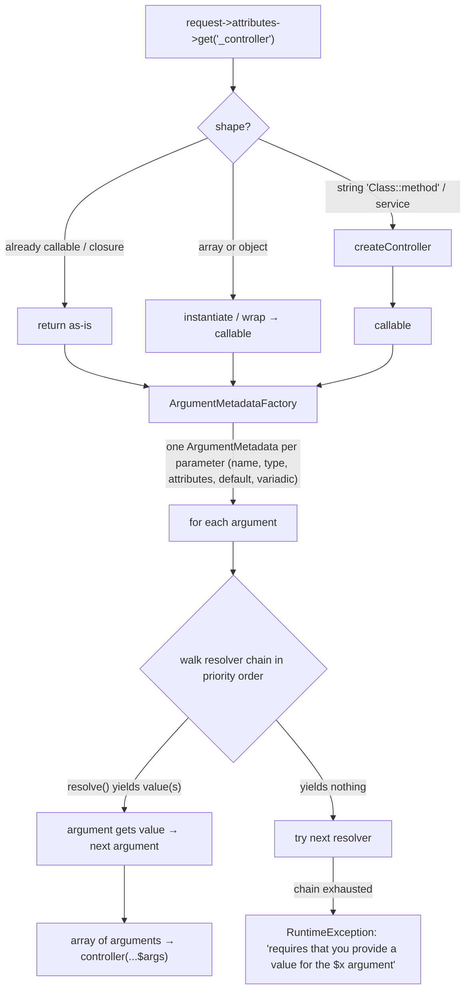

# Tour : ControllerResolver & ArgumentResolver

**Source anchors :**
[`Controller/ControllerResolver.php` (8.0)](https://github.com/symfony/symfony/blob/8.0/src/Symfony/Component/HttpKernel/Controller/ControllerResolver.php)
et
[`Controller/ArgumentResolver.php` (8.0)](https://github.com/symfony/symfony/blob/8.0/src/Symfony/Component/HttpKernel/Controller/ArgumentResolver.php)
— ouvrez les deux côte à côte. Ce tour passe au microscope les Stops 3 et 5 du
[tour HttpKernel::handle()](httpkernel-handle.md).

!!! tip "What you'll be able to answer"
    - Étant donné une valeur `_controller` (`"App\Controller\Foo::bar"`, un tableau, un
      id de service, une classe invokable), quel callable en sort — et quelle erreur
      en sort quand rien n'en sort ?
    - Dans la chaîne de value resolvers, que signifie mécaniquement « un resolver
      gagne », et que se passe-t-il quand zéro resolver yield, ou quand l'un yield deux valeurs ?
    - Quel statut HTTP résulte d'un `#[MapRequestPayload]` en échec vs un
      `#[MapQueryParameter]` en échec vs un attribut de route manquant ?

## The map



## The walkthrough

### Stop 1 — `ControllerResolver::getController()`: from `_controller` to callable

Entrée : ce que `RouterListener` a stocké dans `$request->attributes->get('_controller')`.
Le travail du resolver est purement de la *normalisation de forme* :

- **déjà une closure callable** → retournée telle quelle ;
- **tableau** `[$classOrObject, 'method']` → complété en callable (un nom de
  classe est d'abord instancié) ;
- **objet avec `__invoke()`** → retourné comme le callable ;
- **chaîne** → le cas intéressant, géré par `createController()` : une chaîne
  `"Class::method"` est découpée, la classe instanciée (constructeur sans argument)
  via `instantiateController()`, et la méthode liée ; un simple nom de classe invokable
  est instancié et utilisé directement ; un simple nom de fonction est utilisé tel quel.

```php
// simplified sketch — not verbatim source
public function getController(Request $request): callable|false
{
    if (!$controller = $request->attributes->get('_controller')) {
        return false; // HttpKernel turns this into a NotFoundHttpException
    }

    if (\is_array($controller) || \is_object($controller) || $controller instanceof \Closure) {
        return $this->normalize($controller);
    }

    return $this->createController($controller); // "Class::method", invokable class...
}
```

Dans une application framework complète, vous n'atteignez jamais le `instantiateController()`
nu : le FrameworkBundle câble un **resolver conscient du container** qui essaie d'abord de récupérer la
classe/le service depuis le container — c'est ainsi que fonctionnent les controllers-as-services et
l'injection par constructeur dans les controllers. La classe de base supporte aussi une
liste d'autorisation de types/attributs de controller (`#[AsController]` est la raison pour laquelle vos
controllers invokables n'ont besoin d'aucune gymnastique manuelle avec `controller.service_arguments`).

**Extension point :** implémentez/décorez `ControllerResolverInterface` — p. ex. pour
supporter votre propre notation `_controller`. Contrat d'échec : `getController()`
retournant `false` → le kernel lève `NotFoundHttpException` (404) ; une chaîne
qui *semble* résoluble mais ne l'est pas → `InvalidArgumentException` (500).

### Stop 2 — `ArgumentMetadataFactory`: reflecting the signature once

Avant que toute valeur ne soit résolue, `ArgumentResolver` demande à sa
`ArgumentMetadataFactoryInterface` de faire la réflexion du callable et de construire un
`ArgumentMetadata` par paramètre, capturant : **nom**, **type**, **variadique ?**,
**a une valeur par défaut ? / valeur par défaut**, **nullable ?**, et — crucial depuis que les attributs
ont pris le relais — les **attributs PHP** du paramètre (`$metadata->getAttributes()`).

Cet objet de métadonnées est la *seule* chose que les resolvers voient en dehors de la `Request` :
les resolvers ne touchent jamais eux-mêmes à la réflexion.

### Stop 3 — `getArguments()`: each argument walks the chain

Le cœur du fichier. Pour **chaque** argument, on itère les resolvers par ordre de
priorité ; le **premier resolver dont le `resolve()` yield au moins une valeur gagne**
et la chaîne s'arrête pour cet argument.

```php
// simplified sketch — not verbatim source
public function getArguments(Request $request, callable $controller, ?\ReflectionFunctionAbstract $reflector = null): array
{
    $arguments = [];

    foreach ($this->argumentMetadataFactory->createArgumentMetadata($controller, $reflector) as $metadata) {
        foreach ($this->getResolvers($metadata) as $resolver) {
            $count = 0;
            foreach ($resolver->resolve($request, $metadata) as $value) {
                ++$count;
                $arguments[] = $value;
            }

            if ($count > 1 && !$metadata->isVariadic()) {
                throw new \InvalidArgumentException('...must yield at most one value...');
            }
            if ($count) {
                continue 2; // this argument is done — first yielding resolver wins
            }
        }

        throw new \RuntimeException(\sprintf('...requires that you provide a value for the "$%s" argument...', $metadata->getName()));
    }

    return $arguments;
}
```

Les mécaniques clés à mémoriser :

- `ValueResolverInterface::resolve()` retourne un **iterable**. Ne rien
  yield signifie « pas mon argument, au suivant » — il n'y a pas de méthode
  `supports()` séparée sur l'interface moderne.
- Yield **plus d'une** valeur n'est légal que pour les paramètres **variadiques**
  (c'est tout le travail du `VariadicValueResolver`).
- Si la chaîne est épuisée avec zéro yield → `RuntimeException` → l'échec
  générique de type 500 (« Controller ... requires that you provide a value »).
- Deux attributs de paramètre pilotent la chaîne elle-même : `#[ValueResolver('name')]`
  épingle l'argument à un unique resolver nommé, et
  `#[ValueResolver('name', disabled: true)]` en exclut un.

**Extension point :** implémentez `ValueResolverInterface`, taguez-le
`controller.argument_value_resolver` (autoconfiguré), choisissez une `priority` pour vous insérer
dans la chaîne, et rendez-le éventuellement ciblable avec `#[AsTargetedValueResolver]`.

### Stop 4 — the built-in chain, in the order that decides ties

Les resolvers par défaut (priorité la plus haute d'abord, conceptuellement) :

1. **`RequestAttributeValueResolver`** — le nom de l'argument correspond à un
   attribut de la request (paramètres de route : `/blog/{slug}` → `string $slug`).
2. **`RequestValueResolver`** — le type du paramètre est `Request`.
3. **`SessionValueResolver`** — le type du paramètre est `SessionInterface`.
4. **`ServiceValueResolver`** — résout les services pour les arguments de
   controller-as-service enregistrés dans le locator d'arguments.
5. **`DefaultValueResolver`** — se rabat sur la valeur par défaut déclarée / null pour
   les types nullables.
6. **`VariadicValueResolver`** — étale un attribut tableau dans un variadique.

Cet ordre explique les égalités classiques : un paramètre de route nommé `$request` serait
servi par le resolver 1 *avant* que le resolver 2 ne le voie — les correspondances par nom/attribut
battent les correspondances par type.

### Stop 5 — attribute-driven resolvers, conceptually

Les favoris de l'examen moderne sont les resolvers déclenchés par un **attribut de paramètre**
trouvé dans `ArgumentMetadata::getAttributes()` :

- **`#[MapRequestPayload]`** / **`#[MapQueryString]`** — gérés par le
  `RequestPayloadValueResolver`, qui désérialise le corps (ou la query string) vers
  votre DTO via le Serializer, puis le valide via le Validator. Contrat
  d'échec : payload malformé/indésérialisable → **400**, format non supporté →
  **415**, violations de validation → **422** `HttpException`. (Mécaniquement, ce
  resolver reporte le gros du mapping à un listener `kernel.controller_arguments`
  afin de pouvoir lever de vraies exceptions HTTP — une jolie pépite de lecture de source.)
- **`#[MapQueryParameter]`** — `QueryParameterValueResolver` mappe un paramètre
  de query scalaire avec filtrage/validation ; un paramètre manquant-mais-requis ou invalide
  → **404** `NotFoundHttpException`.
- **`#[MapEntity]`** (pont Doctrine) — charge une entité depuis les paramètres de route ;
  introuvable → **404**.
- **`#[CurrentUser]`** — le `UserValueResolver` de Security yield l'utilisateur du token ;
  sans utilisateur, il ne yield rien pour un paramètre nullable (vous obtenez `null` via
  `DefaultValueResolver`) et la chaîne échoue pour un paramètre non nullable.

Donc « échec = 404 ou 500 ? » n'a pas de réponse unique : **cela dépend du resolver qui
possède l'argument** — c'est précisément pourquoi l'examen le demande.

!!! danger "Exam trap"
    « Aucun value resolver ne supporte l'argument » ne produit **pas** un 404. Cela
    produit une `RuntimeException` (→ 500) depuis `ArgumentResolver::getArguments()`.
    Les 404 viennent de *resolvers spécifiques qui décident de lever*
    `NotFoundHttpException` (`#[MapQueryParameter]`, `#[MapEntity]`) — et les 400/415/422
    de `#[MapRequestPayload]`. Associez le code de statut au resolver, pas au
    mécanisme.

## Extension points recap

| Stop | Hook | Usage typique |
| --- | --- | --- |
| 1 | `ControllerResolverInterface` (décorer/remplacer) | Notations `_controller` personnalisées, listes d'autorisation de controllers |
| 2 | `ArgumentMetadataFactoryInterface` | Rare — introspection de signature personnalisée |
| 3 | `ValueResolverInterface` + tag `controller.argument_value_resolver` | Injecter des objets métier comme arguments de controller |
| 3 | `#[ValueResolver]` / `#[AsTargetedValueResolver]` | Épingler ou désactiver un resolver par argument |
| 5 | `#[MapRequestPayload]`, `#[MapQueryString]`, `#[MapQueryParameter]`, `#[CurrentUser]`, `#[MapEntity]` | Mapping piloté par attribut avec des codes d'échec bien définis |

## Test yourself

??? question "Q1. `_controller` is `\"App\\Controller\\BlogController::show\"` and the class is registered as a service. Who instantiates it?"
    Dans une application framework, le resolver conscient du container récupère le service depuis
    le container (l'injection par constructeur fonctionne) ; le
    `ControllerResolver` de base ne ferait un `new` que si ce n'était pas un service et qu'il avait un
    constructeur sans paramètre. Dans tous les cas, le résultat est normalisé en un callable
    `[$instance, 'show']`.

??? question "Q2. A custom resolver for `Money $price` yields nothing on a given request. Is that an error?"
    Non — ne rien yield est le signal standard de « je passe » ; la chaîne passe simplement
    au resolver suivant. Cela ne devient une erreur que si *chaque* resolver passe :
    alors `getArguments()` lève une `RuntimeException` nommant l'argument `$price`
    (un 500, pas un 404).

??? question "Q3. Your resolver yields two values for a non-variadic argument. What happens?"
    `ArgumentResolver` lève une `InvalidArgumentException` : plusieurs valeurs
    yieldées ne sont permises que quand `ArgumentMetadata::isVariadic()` est true
    (le cas du `VariadicValueResolver`).

??? question "Q4. `#[MapRequestPayload] OrderDto $dto` receives JSON that deserializes fine but fails validation. Status code?"
    422 Unprocessable Entity, porteur des violations de contraintes. Comparez : un corps
    qui ne peut pas du tout être désérialisé → 400 ; un content type non supporté → 415 ;
    et un `#[MapQueryParameter]` en échec → 404.

??? question "Q5. Controller `show(string $slug, Request $request)`. Which resolver serves each parameter, and why in that order?"
    `$slug` → `RequestAttributeValueResolver` (correspondance par nom d'attribut de route).
    `$request` → `RequestValueResolver` (correspondance par type). Chaque *argument* parcourt la
    chaîne entière indépendamment, depuis le haut ; les resolvers basés sur le nom/attribut se placent
    au-dessus de ceux basés sur le type, ce qui explique pourquoi un attribut nommé `request`
    masquerait l'objet `Request` pour un paramètre du même nom.

## Official References

- [ControllerResolver.php (8.0 source)](https://github.com/symfony/symfony/blob/8.0/src/Symfony/Component/HttpKernel/Controller/ControllerResolver.php)
- [ArgumentResolver.php (8.0 source)](https://github.com/symfony/symfony/blob/8.0/src/Symfony/Component/HttpKernel/Controller/ArgumentResolver.php)
- [Extending Action Argument Resolving](https://symfony.com/doc/current/controller/value_resolver.html)
- [Mapping Request Data to Typed Objects](https://symfony.com/doc/current/controller.html#mapping-request-data-to-typed-objects)

---
<small>Related: [Value Resolvers](../controllers/value-resolvers.md) ·
[The Request](../controllers/request.md) ·
[Request Handling](../architecture/request-handling.md) ·
[Tour: HttpKernel::handle()](httpkernel-handle.md)</small>
