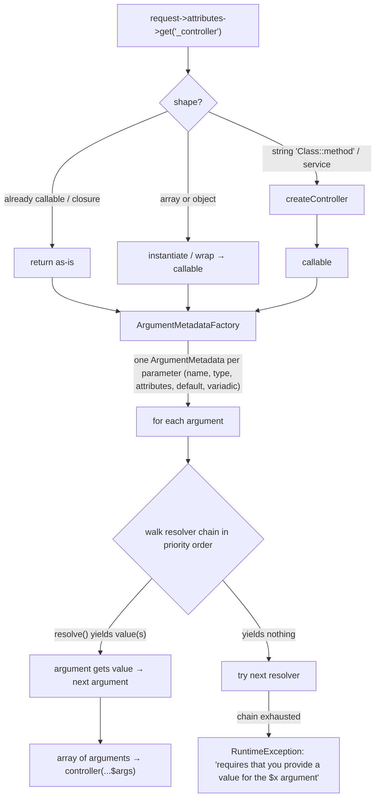

# Tour: ControllerResolver & ArgumentResolver

**Source anchors:**
[`Controller/ControllerResolver.php` (8.0)](https://github.com/symfony/symfony/blob/8.0/src/Symfony/Component/HttpKernel/Controller/ControllerResolver.php)
and
[`Controller/ArgumentResolver.php` (8.0)](https://github.com/symfony/symfony/tree/8.0/src/Symfony/Component/HttpKernel/Controller/ArgumentResolver.php)
— open both side-by-side. This tour covers Stops 3 and 5 of the
[HttpKernel::handle() tour](httpkernel-handle.md) under a microscope.

!!! tip "What you'll be able to answer"
    - Given a `_controller` value (`"App\Controller\Foo::bar"`, an array, a
      service id, an invokable class), what callable comes out — and what error
      comes out when nothing does?
    - In the value-resolver chain, what does "a resolver wins" mean mechanically,
      and what happens when zero resolvers yield, or one yields two values?
    - Which HTTP status results from a failed `#[MapRequestPayload]` vs a failed
      `#[MapQueryParameter]` vs a missing route attribute?

## 🧠 Pour les nuls

**C'est quoi ce tour ?** Comment Symfony transforme le nom d'un contrôleur (une simple chaîne comme `"App\Controller\Foo::bar"`) en un vrai appel PHP, puis comment chaque argument de ta méthode reçoit sa valeur.

**Pourquoi ça existe ?** Ce mécanisme est totalement invisible en usage normal — tu écris juste `public function show(int $id)` et ça marche — mais l'examen teste ce qui se passe derrière ce "ça marche".

**🏠 Analogie de la vraie vie :** Une chaîne de traducteurs spécialisés en file. Chaque traducteur regarde l'étiquette d'un argument et soit le traduit (résout sa valeur), soit hausse les épaules et passe au traducteur suivant — jusqu'à ce qu'un le résolve, ou que la chaîne entière échoue.

**Symfony dans la vraie vie :** Un contrôleur `public function show(Produit $produit)` reçoit directement l'entité déjà chargée depuis la base — un résolveur dédié a déjà fait `$produit = $repo->find($id)` à ta place, avant même que ta méthode ne s'exécute.

**⚠️ Erreur fréquente :** supposer qu'un seul résolveur gère tous les types d'arguments — en réalité, une **chaîne** de résolveurs est essayée dans l'ordre de priorité jusqu'à ce que l'un d'eux accepte.

**🧠 Comment le mémoriser :** "Refuser un argument, c'est hausser les épaules et le passer au suivant — jamais planter tout de suite."

## The map



## The walkthrough

### Stop 1 — `ControllerResolver::getController()`: from `_controller` to callable

Input: whatever `RouterListener` stored in `$request->attributes->get('_controller')`.
The resolver's job is purely *shape normalization*:

- **already a callable closure** → returned as-is;
- **array** `[$classOrObject, 'method']` → completed into a callable (a class
  name gets instantiated first);
- **object with `__invoke()`** → returned as the callable;
- **string** → the interesting case, handled by `createController()`: a
  `"Class::method"` string is split, the class instantiated (no-arg constructor)
  via `instantiateController()`, and the method bound; a bare invokable class
  name is instantiated and used directly; a plain function name is used as-is.

```php
// simplified sketch — not verbatim source
public function getController(Request $request): callable|false
{
    if (!$controller = $request->attributes->get('_controller')) {
        return false; // HttpKernel turns this into a NotFoundHttpException
    }

    if (\is_array($controller) || \is_object($controller) || $controller instanceof \Closure) {
        return $this->normalize($controller);
    }

    return $this->createController($controller); // "Class::method", invokable class...
}
```

In a full framework app you never hit bare `instantiateController()`: the
FrameworkBundle wires a **container-aware resolver** that first tries to fetch the
class/service from the container — that is how controllers-as-services and
constructor injection in controllers work. The base class also supports an
allow-list of controller types/attributes (`#[AsController]` is why your invokable
controllers need no `controller.service_arguments` gymnastics by hand).

**Extension point:** implement/decorate `ControllerResolverInterface` — e.g. to
support your own `_controller` notation. Failure contract: `getController()`
returning `false` → the kernel throws `NotFoundHttpException` (404); a string
that *looks* resolvable but isn't → `InvalidArgumentException` (500).

### Stop 2 — `ArgumentMetadataFactory`: reflecting the signature once

Before any value is resolved, `ArgumentResolver` asks its
`ArgumentMetadataFactoryInterface` to reflect the callable and build one
`ArgumentMetadata` per parameter, capturing: **name**, **type**, **variadic?**,
**has default? / default value**, **nullable?**, and — crucial since attributes
took over — the parameter's **PHP attributes** (`$metadata->getAttributes()`).

This metadata object is the *only* thing resolvers see besides the `Request`:
resolvers never touch reflection themselves.

### Stop 3 — `getArguments()`: each argument walks the chain

The heart of the file. For **each** argument, iterate the resolvers in priority
order; the **first resolver whose `resolve()` yields at least one value wins**
and the chain stops for that argument.

```php
// simplified sketch — not verbatim source
public function getArguments(Request $request, callable $controller, ?\ReflectionFunctionAbstract $reflector = null): array
{
    $arguments = [];

    foreach ($this->argumentMetadataFactory->createArgumentMetadata($controller, $reflector) as $metadata) {
        foreach ($this->getResolvers($metadata) as $resolver) {
            $count = 0;
            foreach ($resolver->resolve($request, $metadata) as $value) {
                ++$count;
                $arguments[] = $value;
            }

            if ($count > 1 && !$metadata->isVariadic()) {
                throw new \InvalidArgumentException('...must yield at most one value...');
            }
            if ($count) {
                continue 2; // this argument is done — first yielding resolver wins
            }
        }

        throw new \RuntimeException(\sprintf('...requires that you provide a value for the "$%s" argument...', $metadata->getName()));
    }

    return $arguments;
}
```

Key mechanics worth memorizing:

- `ValueResolverInterface::resolve()` returns an **iterable**. Yielding
  *nothing* means "not my argument, next please" — there is no separate
  `supports()` method on the modern interface.
- Yielding **more than one** value is only legal for **variadic** parameters
  (that's the whole job of `VariadicValueResolver`).
- If the chain is exhausted with zero yields → `RuntimeException` → the generic
  500-style failure ("Controller ... requires that you provide a value").
- Two parameter attributes steer the chain itself: `#[ValueResolver('name')]`
  pins the argument to a single named resolver, and
  `#[ValueResolver('name', disabled: true)]` excludes one.

**Extension point:** implement `ValueResolverInterface`, tag it
`controller.argument_value_resolver` (autoconfigured), pick a `priority` to slot
into the chain, optionally make it targetable with `#[AsTargetedValueResolver]`.

### Stop 4 — the built-in chain, in the order that decides ties

Default resolvers (highest priority first, conceptually):

1. **`RequestAttributeValueResolver`** — argument name matches a request
   attribute (route params: `/blog/{slug}` → `string $slug`).
2. **`RequestValueResolver`** — parameter type is `Request`.
3. **`SessionValueResolver`** — parameter type is `SessionInterface`.
4. **`ServiceValueResolver`** — resolves services for controller-as-service
   arguments registered in the argument locator.
5. **`DefaultValueResolver`** — falls back to the declared default / null for
   nullable types.
6. **`VariadicValueResolver`** — spreads an array attribute into a variadic.

The ordering explains classic ties: a route param named `$request` would be
served by resolver 1 *before* resolver 2 ever sees it — name/attribute matches
beat type matches.

### Stop 5 — attribute-driven resolvers, conceptually

The modern exam favourites are resolvers triggered by a **parameter attribute**
found in `ArgumentMetadata::getAttributes()`:

- **`#[MapRequestPayload]`** / **`#[MapQueryString]`** — handled by the
  `RequestPayloadValueResolver`, which deserializes body (or query string) into
  your DTO via the Serializer, then validates it via the Validator. Failure
  contract: malformed/undeserializable payload → **400**, unsupported format →
  **415**, validation violations → **422** `HttpException`. (Mechanically this
  resolver defers the heavy mapping to a `kernel.controller_arguments` listener
  so it can throw proper HTTP exceptions — a nice source-reading nugget.)
- **`#[MapQueryParameter]`** — `QueryParameterValueResolver` maps one scalar
  query parameter with filtering/validation; a missing-but-required or invalid
  parameter → **404** `NotFoundHttpException`.
- **`#[MapEntity]`** (Doctrine bridge) — loads an entity from route params;
  not found → **404**.
- **`#[CurrentUser]`** — Security's `UserValueResolver` yields the token's user;
  with no user, it yields nothing for a nullable parameter (you get `null` via
  `DefaultValueResolver`) and the chain fails for a non-nullable one.

So "failure = 404 or 500?" has no single answer: **it depends on which resolver
owns the argument** — that is precisely why the exam asks it.

!!! danger "Exam trap"
    "No value resolver supports the argument" does **not** produce a 404. It
    produces a `RuntimeException` (→ 500) from `ArgumentResolver::getArguments()`.
    The 404s come from *specific resolvers deciding to throw*
    `NotFoundHttpException` (`#[MapQueryParameter]`, `#[MapEntity]`) — and 400/415/422
    from `#[MapRequestPayload]`. Match the status code to the resolver, not to
    the mechanism.

## Extension points recap

| Stop | Hook | Typical use |
| --- | --- | --- |
| 1 | `ControllerResolverInterface` (decorate/replace) | Custom `_controller` notations, controller allow-lists |
| 2 | `ArgumentMetadataFactoryInterface` | Rare — custom signature introspection |
| 3 | `ValueResolverInterface` + tag `controller.argument_value_resolver` | Inject domain objects as controller arguments |
| 3 | `#[ValueResolver]` / `#[AsTargetedValueResolver]` | Pin or disable a resolver per argument |
| 5 | `#[MapRequestPayload]`, `#[MapQueryString]`, `#[MapQueryParameter]`, `#[CurrentUser]`, `#[MapEntity]` | Attribute-driven mapping with well-defined failure codes |

## Test yourself

??? question "Q1. `_controller` is `\"App\\Controller\\BlogController::show\"` and the class is registered as a service. Who instantiates it?"
    In a framework app, the container-aware resolver fetches the service from
    the container (constructor injection works); the base
    `ControllerResolver` would `new` it only if it were not a service and had a
    parameterless constructor. Either way the result is normalized to a callable
    `[$instance, 'show']`.

??? question "Q2. A custom resolver for `Money $price` yields nothing on a given request. Is that an error?"
    No — yielding nothing is the standard "pass" signal; the chain simply moves
    to the next resolver. It only becomes an error if *every* resolver passes:
    then `getArguments()` throws a `RuntimeException` naming the `$price`
    argument (a 500, not a 404).

??? question "Q3. Your resolver yields two values for a non-variadic argument. What happens?"
    `ArgumentResolver` throws an `InvalidArgumentException`: multiple yielded
    values are only permitted when `ArgumentMetadata::isVariadic()` is true
    (the `VariadicValueResolver` case).

??? question "Q4. `#[MapRequestPayload] OrderDto $dto` receives JSON that deserializes fine but fails validation. Status code?"
    422 Unprocessable Entity, carrying the constraint violations. Compare: body
    that cannot be deserialized at all → 400; unsupported content type → 415;
    and a failed `#[MapQueryParameter]` → 404.

??? question "Q5. Controller `show(string $slug, Request $request)`. Which resolver serves each parameter, and why in that order?"
    `$slug` → `RequestAttributeValueResolver` (route attribute name match).
    `$request` → `RequestValueResolver` (type match). Each *argument* walks the
    whole chain independently from the top; name/attribute-based resolvers sit
    above type-based ones, which is why an attribute named `request` would
    shadow the `Request` object for a same-named parameter.

## Official References

- [ControllerResolver.php (8.0 source)](https://github.com/symfony/symfony/blob/8.0/src/Symfony/Component/HttpKernel/Controller/ControllerResolver.php)
- [ArgumentResolver.php (8.0 source)](https://github.com/symfony/symfony/tree/8.0/src/Symfony/Component/HttpKernel/Controller/ArgumentResolver.php)
- [Extending Action Argument Resolving](https://symfony.com/doc/8.0/controller/value_resolver.html)
- [Mapping Request Data to Typed Objects](https://symfony.com/doc/8.0/controller.html#mapping-request-data-to-typed-objects)

---
<small>Related: [Value Resolvers](../controllers/value-resolvers.md) ·
[The Request](../controllers/request.md) ·
[Request Handling](../architecture/request-handling.md) ·
[Tour: HttpKernel::handle()](httpkernel-handle.md)</small>
