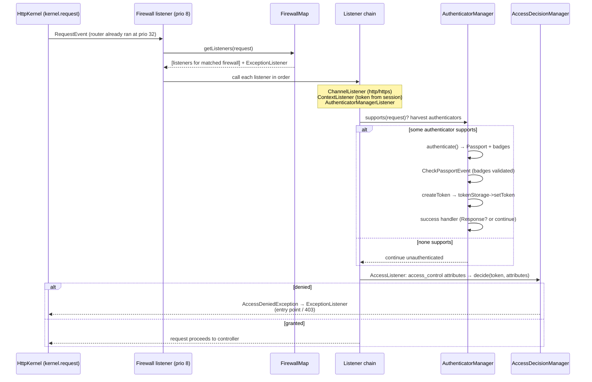

# Tour : une request traverse le Firewall

**Source anchors :**
[`Security/Http/Firewall.php` (8.0)](https://github.com/symfony/symfony/blob/8.0/src/Symfony/Component/Security/Http/Firewall.php)
et
[`Security/Http/Authentication/AuthenticatorManager.php` (8.0)](https://github.com/symfony/symfony/blob/8.0/src/Symfony/Component/Security/Http/Authentication/AuthenticatorManager.php)
— ouvrez les deux côte à côte. (Le `TraceableFirewallListener` du SecurityBundle que vous
voyez dans le profiler est un wrapper de debug autour du même flux — lisez plutôt le vrai
`Firewall`.)

!!! tip "What you'll be able to answer"
    - À quel event du kernel, et à quelle priorité par rapport au router,
      la sécurité entre-t-elle dans la request — et pourquoi le routing doit-il s'exécuter d'abord ?
    - Dans `AuthenticatorManager`, quelle est la séquence exacte de `supports()` à
      un token en storage, et où les badges sont-ils vérifiés ?
    - Qui applique `access_control`, avec quelles entrées, et quelle exception se transforme
      en 403 vs en redirection vers le login ?

## 🧠 Pour les nuls

**C'est quoi ce tour ?** Le trajet exact que fait une requête à travers le système de sécurité de Symfony — du moment où le firewall l'intercepte jusqu'à la décision finale d'autoriser ou refuser l'accès.

**Pourquoi ça existe ?** Le firewall est un des listeners les plus discutés à l'examen (priorités, ordre d'exécution) — le voir tracé dans le vrai code lève toute ambiguïté.

**🏠 Analogie de la vraie vie :** Un poste de sécurité d'aéroport avec plusieurs contrôles successifs (papiers, scanner, fouille) — chaque contrôle doit réussir dans un ordre précis avant d'accéder à l'embarquement (l'accès à la ressource protégée).

**Symfony dans la vraie vie :** Le routeur doit s'exécuter **avant** la sécurité (priorité 32 contre 8) — sans ça, le firewall ne saurait même pas quel pattern d'URL vérifier.

**⚠️ Erreur fréquente :** croire que le firewall vérifie lui-même les permissions précises (`ROLE_ADMIN`) — c'est le rôle de `AccessDecisionManager` et des voters, une étape séparée après l'authentification.

**🧠 Comment le mémoriser :** "D'abord savoir où tu vas (routage), ensuite vérifier qui tu es (firewall), enfin si tu as le droit d'y aller (voters)."


## The map



## The walkthrough

Tracez une request dans votre tête : `POST /login` avec un mauvais mot de passe sur un
firewall `form_login`, puis un `GET /admin` dans la foulée.

### Stop 1 — the Firewall is "just" a `kernel.request` listener

La classe `Firewall` s'abonne à `KernelEvents::REQUEST` à la **priorité 8** —
délibérément *après* le `RouterListener` (priorité 32), afin que les attributs de route
existent, et assez tôt pour court-circuiter le controller. Dans une application complète, la
classe abonnée est le `FirewallListener` du SecurityBundle (qui étend celle-ci,
en ajoutant le câblage des events de logout ; `TraceableFirewallListener` en debug), mais le flux
que vous devez connaître se trouve dans `Firewall::onKernelRequest()`.

```php
// simplified sketch — not verbatim source
public static function getSubscribedEvents(): array
{
    return [
        KernelEvents::REQUEST => ['onKernelRequest', 8],
        KernelEvents::FINISH_REQUEST => 'onKernelFinishRequest',
    ];
}
```

**Extension point :** aucun ici directement — mais le numéro de priorité lui-même est matière
à examen : *router 32 → firewall 8*.

### Stop 2 — `FirewallMap` picks exactly one context

`onKernelRequest()` demande à la `FirewallMapInterface` les listeners qui s'appliquent :
la map exécute le **request matcher** de chaque firewall configuré (son `pattern`,
`host`, `methods`…) dans l'ordre de configuration et retourne la chaîne du **premier
firewall correspondant uniquement** — plus l'`ExceptionListener` et le listener de logout de ce
firewall. Une request, un contexte de firewall ; un firewall `security: false`
retourne une chaîne vide (c'est pourquoi les firewalls `/\_(profiler|wdt)` ne coûtent rien).

**Extension point :** la config `security.firewalls` est la façade publique ; la
`FirewallMapInterface` elle-même est remplaçable pour les configurations exotiques.

### Stop 3 — the listener chain runs in a fixed order

`callListeners()` itère la chaîne ; les listeners modernes implémentent
`FirewallListenerInterface` avec une vérification `supports(Request)` peu coûteuse avant que
`authenticate(RequestEvent)` ne soit appelé. L'ordre canonique :

1. **`ChannelListener`** — applique `requires_channel` (redirection http↔https ;
   pose une response de redirection et arrête la chaîne si le schéma est mauvais).
2. **`ContextListener`** (firewalls stateful uniquement) — désérialise le token depuis
   la **session**, rafraîchit l'utilisateur via le user provider, et place le token
   dans le `TokenStorage`. C'est pour cela que vous restez connecté entre les requests.
3. **`AuthenticatorManagerListener`** — la passerelle vers le Stop 4.
4. **`AccessListener`** — l'autorisation, Stop 6.

Si un listener pose une response sur l'event, la boucle s'interrompt — le firewall a
répondu lui-même à la request (une redirection vers la page de login, un challenge 401…).

```php
// simplified sketch — not verbatim source
protected function callListeners(RequestEvent $event, iterable $listeners): void
{
    foreach ($listeners as $listener) {
        if (!$listener instanceof FirewallListenerInterface || $listener->supports($event->getRequest())) {
            $listener($event); // may setResponse() and...
        }

        if ($event->hasResponse()) {
            break; // ...stop the chain
        }
    }
}
```

**Extension point :** des listeners de firewall personnalisés via une security factory
(`AuthenticatorFactoryInterface`) — rare, mais c'est le mécanisme à connaître.

### Stop 4 — `AuthenticatorManager`: harvest, authenticate, badge-check

Changez maintenant de fichier pour `AuthenticatorManager`. Sa passe `supports()` boucle sur les
authenticators du firewall, demandant à chacun `supports(Request)` ; ceux qui supportent sont
mis de côté dans un attribut de la request (un authenticator peut aussi retourner `null` =
« peut-être, décision différée »). Si aucun ne supporte, la request continue
**non authentifiée** — sans erreur ; la navigation anonyme des pages publiques passe exactement
par ce chemin.

`authenticateRequest()` exécute ensuite chaque authenticator retenu, tour à tour :

```php
// simplified sketch — not verbatim source
private function executeAuthenticator(AuthenticatorInterface $authenticator, Request $request): ?Response
{
    try {
        $passport = $authenticator->authenticate($request);   // Passport + badges

        $this->eventDispatcher->dispatch(new CheckPassportEvent($authenticator, $passport));

        foreach ($passport->getBadges() as $badge) {
            if (!$badge->isResolved()) {
                throw new BadCredentialsException(\sprintf('...security badge "%s" is not resolved...', $badge::class));
            }
        }

        $token = $authenticator->createToken($passport, $this->firewallName);
        // AuthenticationTokenCreatedEvent, then:
        $this->tokenStorage->setToken($token);

        return $this->handleAuthenticationSuccess($token, $passport, $request, $authenticator);  // LoginSuccessEvent
    } catch (AuthenticationException $e) {
        return $this->handleAuthenticationFailure($e, $request, $authenticator, $passport ?? null); // LoginFailureEvent
    }
}
```

La répartition des rôles est le péché mignon de l'examen :

- **`authenticate()`** construit un `Passport` à partir de la request — `UserBadge`
  (comment charger l'utilisateur), `PasswordCredentials`, `CsrfTokenBadge`,
  `RememberMeBadge`… Il ne vérifie **pas** le mot de passe.
- **`CheckPassportEvent`** est l'endroit où les listeners du core effectuent la vérification réelle :
  l'utilisateur est chargé depuis le `UserBadge`, `CheckCredentialsListener` vérifie
  `PasswordCredentials` contre le hasher, le listener CSRF valide le
  token, les user checkers s'exécutent. Chaque badge doit finir **résolu** — un badge non
  résolu est en soi un échec d'authentification.
- Succès → `createToken()` (par défaut : un `PostAuthenticationToken`), token dans le
  `TokenStorage`, `LoginSuccessEvent`, et le `onAuthenticationSuccess()` de
  l'authenticator peut retourner une `Response` (le form login redirige) ou
  `null` (les API stateless laissent la request continuer).
- Échec → `LoginFailureEvent` + `onAuthenticationFailure()` (redirection vers
  le formulaire de login avec l'erreur, ou un corps JSON 401).

**Extension point :** des authenticators personnalisés (`AbstractAuthenticator`), des
badges personnalisés + un listener `CheckPassportEvent` pour les résoudre, et les quatre
events de login (`CheckPassportEvent`, `AuthenticationTokenCreatedEvent`,
`LoginSuccessEvent`, `LoginFailureEvent`).

!!! danger "Exam trap"
    La vérification du mot de passe ne se produit **pas** dans le
    `authenticate()` de votre authenticator, ni dans `createToken()` — elle se produit dans un
    **listener sur `CheckPassportEvent`** (`CheckCredentialsListener`) qui résout
    le badge `PasswordCredentials`. Corollaire : oubliez le loader du `UserBadge` ou
    laissez un badge personnalisé non résolu et l'authentification échoue avec
    `BadCredentialsException` *même si le mot de passe était correct*. « Où le
    mot de passe est-il vérifié ? » — répondez avec l'event, pas avec l'authenticator.

### Stop 5 — success/failure handlers decide: respond or pass through

Ce que retournent `onAuthenticationSuccess()` / `onAuthenticationFailure()` constitue la
décision de response du listener : une `Response` arrête la chaîne du firewall (et le
kernel — souvenez-vous du break sur `hasResponse()` du Stop 3, qui alimente le chemin
de response anticipée de `kernel.request`) ; `null` laisse la request continuer vers le listener suivant avec
le token frais en place. Les logins interactifs dispatchent aussi
`InteractiveLoginEvent`, et les firewalls stateful persistent le token en session
via la gestion côté response du context listener.

### Stop 6 — `AccessListener` + `AccessDecisionManager`: authorization

Dernier de la chaîne, l'`AccessListener` consulte l'**`AccessMap`** (construite à partir de
vos règles `access_control` — là encore *la première correspondance gagne*) pour obtenir les attributs
requis pour cette request (p. ex. `ROLE_ADMIN`, `PUBLIC_ACCESS`). Attributs en
main, il demande à l'**`AccessDecisionManager`** de `decide($token, $attributes,
$request)` ; le manager sonde ses **voters** selon la stratégie configurée
(par défaut : *affirmative* — un seul vote `GRANTED` suffit). Refus → il lève
`AccessDeniedException`.

Cette exception n'atteint pas l'utilisateur telle quelle : l'`ExceptionListener` du firewall
(abonné à `kernel.exception`) la traduit — utilisateur non authentifié → démarrage
de l'**entry point** (redirection vers le login / challenge 401) ; authentifié mais
insuffisant → **403** (ou l'`access_denied_handler`). `isGranted()` dans les
controllers/Twig s'appuie sur le *même* `AccessDecisionManager`, simplement déclenché
manuellement au lieu de l'être par `access_control`.

**Extension point :** `VoterInterface` / `Voter` (tag `security.voter`), la config de
stratégie de décision, `access_denied_handler`, des entry points personnalisés.

## Extension points recap

| Stop | Hook | Usage typique |
| --- | --- | --- |
| 2 | Matchers `security.firewalls` / `FirewallMapInterface` | Quel contexte de firewall possède un espace d'URL |
| 3 | `FirewallListenerInterface` + security factories | Listener personnalisé par firewall (rare, puissant) |
| 4 | `AuthenticatorInterface` / `AbstractAuthenticator` | Mécanique de login personnalisée (clés d'API, SSO…) |
| 4 | `CheckPassportEvent` + badges personnalisés | Vérifications d'identifiants supplémentaires (code 2FA, captcha) |
| 4–5 | `LoginSuccessEvent` / `LoginFailureEvent` | Journalisation d'audit, hooks de throttling, ajustements de response |
| 6 | `VoterInterface` (tag `security.voter`) | Autorisation métier (`isGranted('EDIT', $post)`) |
| 6 | `access_denied_handler` / entry point | Comportement 403 / challenge de login personnalisé |

## Test yourself

??? question "Q1. Why does the firewall listener run at priority 8 and not 40?"
    Parce que le `RouterListener` s'exécute à 32 et que le firewall peut avoir besoin des résultats
    du routing (et, plus important, ne doit pas gaspiller de travail sur des requests que le router
    pourrait rediriger). À 40, il s'exécuterait avant que `_route`/`_controller` n'existent.
    Ordre sur `kernel.request` : router (32) → firewall (8).

??? question "Q2. Two firewalls' patterns both match `/admin/login`. Which applies?"
    Seul le **premier firewall correspondant** dans l'ordre de configuration — `FirewallMap`
    s'arrête au premier matcher qui touche. C'est pourquoi les firewalls `dev`/spécifiques sont
    déclarés *au-dessus* du firewall fourre-tout `main`.

??? question "Q3. No authenticator's `supports()` returns true for a request to a URL with no `access_control` rule. What happens?"
    Rien de dramatique : l'authenticator manager n'authentifie simplement pas,
    l'`AccessListener` ne trouve aucun attribut requis (ou `PUBLIC_ACCESS`), et
    la request atteint le controller non authentifiée. « Aucun authenticator ne
    supporte » est le chemin anonyme normal, pas une erreur.

??? question "Q4. An anonymous user hits a `ROLE_ADMIN` path vs. a logged-in `ROLE_USER` hitting the same path — outcomes?"
    Les deux déclenchent une `AccessDeniedException` issue de la décision d'accès, mais
    l'`ExceptionListener` fait la différence : pas (complètement) authentifié → l'**entry point**
    du firewall démarre l'authentification (redirection login/401) ;
    authentifié mais sans le rôle → **403** (ou votre
    `access_denied_handler`).

??? question "Q5. Your custom authenticator returns a Passport whose custom `TwoFactorBadge` is never resolved. Result?"
    `AuthenticatorManager` vérifie chaque badge après `CheckPassportEvent` ; un
    badge non résolu lève `BadCredentialsException`, donc l'authentification échoue
    et `LoginFailureEvent` est dispatché — même avec un mot de passe correct. Vous devez
    enregistrer un listener `CheckPassportEvent` qui valide et résout le
    badge.

## Official References

- [Firewall.php (8.0 source)](https://github.com/symfony/symfony/blob/8.0/src/Symfony/Component/Security/Http/Firewall.php)
- [AuthenticatorManager.php (8.0 source)](https://github.com/symfony/symfony/blob/8.0/src/Symfony/Component/Security/Http/Authentication/AuthenticatorManager.php)
- [Security — Firewalls & Authentication](https://symfony.com/doc/8.0/security.html)
- [Custom Authenticators & Passport Badges](https://symfony.com/doc/8.0/security/custom_authenticator.html)
- [Voters and Voting Strategies](https://symfony.com/doc/8.0/security/voters.html)

---
<small>Related: [Firewalls](../security/firewalls.md) ·
[Authenticators](../security/authenticators.md) ·
[Access Control](../security/access-control.md) ·
[Voters](../security/voters.md) ·
[Tour: HttpKernel::handle()](httpkernel-handle.md)</small>
