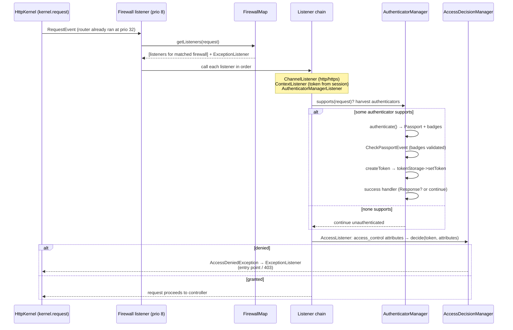

# Tour: a request crosses the Firewall

**Source anchors:**
[`Security/Http/Firewall.php` (8.0)](https://github.com/symfony/symfony/blob/8.0/src/Symfony/Component/Security/Http/Firewall.php)
and
[`Security/Http/Authentication/AuthenticatorManager.php` (8.0)](https://github.com/symfony/symfony/blob/8.0/src/Symfony/Component/Security/Http/Authentication/AuthenticatorManager.php)
— open both side-by-side. (The SecurityBundle's `TraceableFirewallListener` you
see in the profiler is a debug-only wrapper around the same flow — read the real
`Firewall` instead.)

!!! tip "What you'll be able to answer"
    - At which kernel event, and at which priority relative to the router, does
      security enter the request — and why must routing run first?
    - In `AuthenticatorManager`, what is the exact sequence from `supports()` to
      a token in storage, and where do badges get checked?
    - Who enforces `access_control`, with what inputs, and what exception turns
      into a 403 vs a redirect to login?

## The map



## The walkthrough

Trace one request in your head: `POST /login` with a wrong password on a
`form_login` firewall, then a follow-up `GET /admin`.

### Stop 1 — the Firewall is "just" a `kernel.request` listener

The `Firewall` class subscribes to `KernelEvents::REQUEST` at **priority 8** —
deliberately *after* the `RouterListener` (priority 32), so route attributes
exist, and early enough to short-circuit the controller. In a full app the
subscribed class is the SecurityBundle's `FirewallListener` (extending this one,
adding logout-event wiring; `TraceableFirewallListener` in debug), but the flow
you must know is in `Firewall::onKernelRequest()`.

```php
// simplified sketch — not verbatim source
public static function getSubscribedEvents(): array
{
    return [
        KernelEvents::REQUEST => ['onKernelRequest', 8],
        KernelEvents::FINISH_REQUEST => 'onKernelFinishRequest',
    ];
}
```

**Extension point:** none here directly — but the priority number itself is exam
material: *router 32 → firewall 8*.

### Stop 2 — `FirewallMap` picks exactly one context

`onKernelRequest()` asks the `FirewallMapInterface` for the listeners that apply:
the map runs each configured firewall's **request matcher** (its `pattern`,
`host`, `methods`…) in configuration order and returns the chain for the **first
matching firewall only** — plus that firewall's `ExceptionListener` and logout
listener. One request, one firewall context; a `security: false` firewall
returns an empty chain (that's why `/\_(profiler|wdt)` firewalls cost nothing).

**Extension point:** the `security.firewalls` config is the public face; the
`FirewallMapInterface` itself is replaceable for exotic setups.

### Stop 3 — the listener chain runs in a fixed order

`callListeners()` iterates the chain; modern listeners implement
`FirewallListenerInterface` with a cheap `supports(Request)` check before
`authenticate(RequestEvent)` is called. The canonical order:

1. **`ChannelListener`** — enforces `requires_channel` (http↔https redirect;
   sets a redirect response and stops the chain if the scheme is wrong).
2. **`ContextListener`** (stateful firewalls only) — deserializes the token from
   the **session**, refreshes the user via the user provider, and puts the token
   into `TokenStorage`. This is why you stay logged in between requests.
3. **`AuthenticatorManagerListener`** — the gateway to Stop 4.
4. **`AccessListener`** — authorization, Stop 6.

If any listener sets a response on the event, the loop breaks — the firewall has
answered the request itself (a redirect to the login page, a 401 challenge…).

```php
// simplified sketch — not verbatim source
protected function callListeners(RequestEvent $event, iterable $listeners): void
{
    foreach ($listeners as $listener) {
        if (!$listener instanceof FirewallListenerInterface || $listener->supports($event->getRequest())) {
            $listener($event); // may setResponse() and...
        }

        if ($event->hasResponse()) {
            break; // ...stop the chain
        }
    }
}
```

**Extension point:** custom firewall listeners via a security factory
(`AuthenticatorFactoryInterface`) — rare, but the mechanism to know.

### Stop 4 — `AuthenticatorManager`: harvest, authenticate, badge-check

Now switch files to `AuthenticatorManager`. Its `supports()` pass loops over the
firewall's authenticators, asking each `supports(Request)`; supporting ones are
stashed on a request attribute (an authenticator may also return `null` =
"maybe, decide lazily"). If none supports, the request continues
**unauthenticated** — no error; anonymous browsing of public pages is exactly
this path.

`authenticateRequest()` then executes each harvested authenticator in turn:

```php
// simplified sketch — not verbatim source
private function executeAuthenticator(AuthenticatorInterface $authenticator, Request $request): ?Response
{
    try {
        $passport = $authenticator->authenticate($request);   // Passport + badges

        $this->eventDispatcher->dispatch(new CheckPassportEvent($authenticator, $passport));

        foreach ($passport->getBadges() as $badge) {
            if (!$badge->isResolved()) {
                throw new BadCredentialsException(\sprintf('...security badge "%s" is not resolved...', $badge::class));
            }
        }

        $token = $authenticator->createToken($passport, $this->firewallName);
        // AuthenticationTokenCreatedEvent, then:
        $this->tokenStorage->setToken($token);

        return $this->handleAuthenticationSuccess($token, $passport, $request, $authenticator);  // LoginSuccessEvent
    } catch (AuthenticationException $e) {
        return $this->handleAuthenticationFailure($e, $request, $authenticator, $passport ?? null); // LoginFailureEvent
    }
}
```

The division of labour is the exam's favourite:

- **`authenticate()`** builds a `Passport` from the request — `UserBadge`
  (how to load the user), `PasswordCredentials`, `CsrfTokenBadge`,
  `RememberMeBadge`… It does **not** verify the password.
- **`CheckPassportEvent`** is where core listeners do the actual checking:
  the user is loaded from the `UserBadge`, `CheckCredentialsListener` verifies
  `PasswordCredentials` against the hasher, the CSRF listener validates the
  token, user checkers run. Every badge must end up **resolved** — an unresolved
  badge is itself an authentication failure.
- Success → `createToken()` (default: a `PostAuthenticationToken`), token into
  `TokenStorage`, `LoginSuccessEvent`, and the authenticator's
  `onAuthenticationSuccess()` may return a `Response` (form login redirects) or
  `null` (stateless APIs let the request continue).
- Failure → `LoginFailureEvent` + `onAuthenticationFailure()` (redirect back to
  the login form with the error, or a 401 JSON body).

**Extension point:** custom authenticators (`AbstractAuthenticator`), custom
badges + a `CheckPassportEvent` listener to resolve them, and the four
login events (`CheckPassportEvent`, `AuthenticationTokenCreatedEvent`,
`LoginSuccessEvent`, `LoginFailureEvent`).

!!! danger "Exam trap"
    Password verification does **not** happen in your authenticator's
    `authenticate()` and not in `createToken()` either — it happens in a
    **listener on `CheckPassportEvent`** (`CheckCredentialsListener`) resolving
    the `PasswordCredentials` badge. Corollary: forget the `UserBadge` loader or
    leave a custom badge unresolved and authentication fails with
    `BadCredentialsException` *even if the password was right*. "Where is the
    password checked?" — answer with the event, not the authenticator.

### Stop 5 — success/failure handlers decide: respond or pass through

Whatever `onAuthenticationSuccess()` / `onAuthenticationFailure()` return is the
listener's response decision: a `Response` stops the firewall chain (and the
kernel — remember Stop 3's `hasResponse()` break, feeding `kernel.request`'s
early-response path); `null` lets the request continue to the next listener with
the fresh token in place. Interactive logins also dispatch
`InteractiveLoginEvent`, and stateful firewalls persist the token to the session
via the context listener's response-side handling.

### Stop 6 — `AccessListener` + `AccessDecisionManager`: authorization

Last in the chain, the `AccessListener` consults the **`AccessMap`** (built from
your `access_control` rules — again *first match wins*) to get the attributes
required for this request (e.g. `ROLE_ADMIN`, `PUBLIC_ACCESS`). With attributes
in hand it asks the **`AccessDecisionManager`** to `decide($token, $attributes,
$request)`; the manager polls its **voters** using the configured strategy
(default: *affirmative* — one `GRANTED` vote suffices). Deny → it throws
`AccessDeniedException`.

That exception does not reach the user raw: the firewall's `ExceptionListener`
(subscribed to `kernel.exception`) translates it — unauthenticated user → start
the **entry point** (redirect to login / 401 challenge); authenticated but
insufficient → **403** (or the `access_denied_handler`). `isGranted()` in
controllers/Twig rides the *same* `AccessDecisionManager`, just triggered
manually instead of by `access_control`.

**Extension point:** `VoterInterface` / `Voter` (tag `security.voter`), decision
strategy config, `access_denied_handler`, custom entry points.

## Extension points recap

| Stop | Hook | Typical use |
| --- | --- | --- |
| 2 | `security.firewalls` matchers / `FirewallMapInterface` | Which firewall context owns a URL space |
| 3 | `FirewallListenerInterface` + security factories | Custom per-firewall listener (rare, powerful) |
| 4 | `AuthenticatorInterface` / `AbstractAuthenticator` | Custom login mechanics (API keys, SSO…) |
| 4 | `CheckPassportEvent` + custom badges | Extra credential checks (2FA code, captcha) |
| 4–5 | `LoginSuccessEvent` / `LoginFailureEvent` | Audit logging, throttling hooks, response tweaks |
| 6 | `VoterInterface` (tag `security.voter`) | Domain authorization (`isGranted('EDIT', $post)`) |
| 6 | `access_denied_handler` / entry point | Custom 403 / login-challenge behaviour |

## Test yourself

??? question "Q1. Why does the firewall listener run at priority 8 and not 40?"
    Because the `RouterListener` runs at 32 and the firewall may need routing
    results (and, more importantly, must not waste work on requests the router
    might redirect). At 40 it would run before `_route`/`_controller` exist.
    Order on `kernel.request`: router (32) → firewall (8).

??? question "Q2. Two firewalls' patterns both match `/admin/login`. Which applies?"
    Only the **first matching** firewall in configuration order — `FirewallMap`
    stops at the first matcher hit. This is why `dev`/specific firewalls are
    declared *above* the catch-all `main` firewall.

??? question "Q3. No authenticator's `supports()` returns true for a request to a URL with no `access_control` rule. What happens?"
    Nothing dramatic: the authenticator manager simply doesn't authenticate,
    the `AccessListener` finds no required attributes (or `PUBLIC_ACCESS`), and
    the request reaches the controller unauthenticated. "No authenticator
    supports" is the normal anonymous path, not an error.

??? question "Q4. An anonymous user hits a `ROLE_ADMIN` path vs. a logged-in `ROLE_USER` hitting the same path — outcomes?"
    Both trigger `AccessDeniedException` from the access decision, but the
    `ExceptionListener` differentiates: not (fully) authenticated → the
    firewall's **entry point** starts authentication (login redirect/401);
    authenticated but lacking the role → **403** (or your
    `access_denied_handler`).

??? question "Q5. Your custom authenticator returns a Passport whose custom `TwoFactorBadge` is never resolved. Result?"
    `AuthenticatorManager` checks every badge after `CheckPassportEvent`; an
    unresolved badge throws `BadCredentialsException`, so authentication fails
    and `LoginFailureEvent` fires — even with a correct password. You must
    register a `CheckPassportEvent` listener that validates and resolves the
    badge.

## Official References

- [Firewall.php (8.0 source)](https://github.com/symfony/symfony/blob/8.0/src/Symfony/Component/Security/Http/Firewall.php)
- [AuthenticatorManager.php (8.0 source)](https://github.com/symfony/symfony/blob/8.0/src/Symfony/Component/Security/Http/Authentication/AuthenticatorManager.php)
- [Security — Firewalls & Authentication](https://symfony.com/doc/8.0/security.html)
- [Custom Authenticators & Passport Badges](https://symfony.com/doc/8.0/security/custom_authenticator.html)
- [Voters and Voting Strategies](https://symfony.com/doc/8.0/security/voters.html)

---
<small>Related: [Firewalls](../security/firewalls.md) ·
[Authenticators](../security/authenticators.md) ·
[Access Control](../security/access-control.md) ·
[Voters](../security/voters.md) ·
[Tour: HttpKernel::handle()](httpkernel-handle.md)</small>
