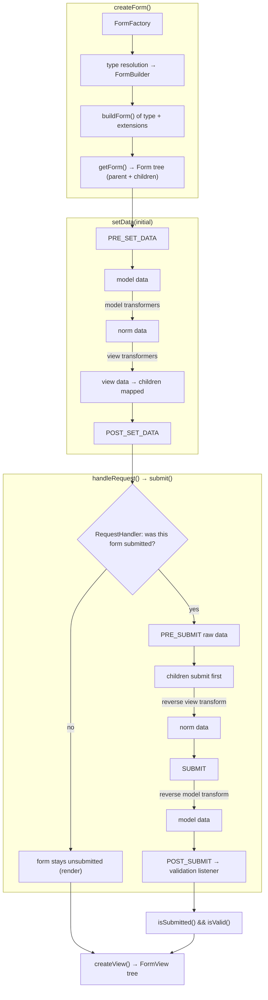

# Tour : la vie d'un Form

**Source anchor:**
[`src/Symfony/Component/Form/Form.php` (8.0)](https://github.com/symfony/symfony/blob/8.0/src/Symfony/Component/Form/Form.php)
— ouvrez-le côte à côte. Les méthodes au programme de l'itinéraire : `setData()`,
`handleRequest()`, `submit()`, `isSubmitted()`, `isValid()`, `createView()`.
C'est un long fichier ; ce tour est votre carte de randonnée pour le parcourir.

!!! tip "What you'll be able to answer"
    - Dans quel ordre exact les six `FormEvents` se déclenchent-ils au cours d'un
      cycle affichage-puis-soumission, et dans quel sens les transformers
      s'exécutent-ils à chacun d'eux ?
    - Quelle est la différence entre les données *model*, *norm(alized)* et
      *view*, et quel event permet de modifier chacune d'elles ?
    - Où la validation a-t-elle réellement lieu — et pourquoi appeler `isValid()`
      avant `isSubmitted()` provoque-t-il une `LogicException` ?

## The map



## The walkthrough

Suivez mentalement un form : un `TaskType` avec un enfant `dueDate` de type
`DateType`, affiché, puis renvoyé en POST avec une date invalide.

### Stop 1 — `createForm()`: from type class to `Form` tree

Le `createForm(TaskType::class, $task)` de votre controller délègue à la
`FormFactory`. La factory résout le type à travers la **chaîne de types**
(le type, ses types parents jusqu'à `FormType`, plus toutes les *type
extensions* enregistrées), produisant un `ResolvedFormType`. Les options sont
résolues via le `configureOptions()` de chaque niveau (une passe
d'`OptionsResolver`), puis `buildForm()` s'exécute en descendant la chaîne,
ajoutant des enfants à un `FormBuilder`. Enfin, `getForm()` fige le builder en
un arbre de `Form` à structure immuable — une instance de `Form` par champ,
reliée à son parent.

**Point d'extension :** des classes `FormTypeInterface` personnalisées, et
`FormTypeExtensionInterface` (tag `form.type_extension`) pour modifier des types
*existants* — par exemple ajouter une option à tous les `TextType` de
l'application.

### Stop 2 — `setData()`: one datum, three representations

Le `$task` passé à `createForm()` aboutit dans `Form::setData()`. C'est là que
naissent les trois fameuses représentations :

- **model data** — votre valeur métier (une `Task`, un `DateTimeImmutable`) ;
- **norm data** — l'intermédiaire normalisé sur lequel travaille la logique du
  type ;
- **view data** — ce que les widgets affichent (des chaînes, des tableaux de
  scalaires).

```php
// simplified sketch — not verbatim source
public function setData(mixed $modelData): static
{
    if ($this->hasListeners(FormEvents::PRE_SET_DATA)) {
        $event = new PreSetDataEvent($this, $modelData);
        $this->dispatch($event, FormEvents::PRE_SET_DATA);   // may REPLACE the data
        $modelData = $event->getData();
    }

    $this->modelData = $modelData;
    $normData = $this->modelToNorm($modelData);   // model transformers, forward
    $viewData = $this->normToView($normData);     // view transformers, forward

    $this->normData = $normData;
    $this->viewData = $viewData;
    // ... compound forms: the DataMapper maps view data onto children (mapDataToForms)

    $this->dispatch(new PostSetDataEvent($this, $modelData), FormEvents::POST_SET_DATA);

    return $this;
}
```

Ordre à mémoriser : **PRE_SET_DATA → model → (model transformers) → norm →
(view transformers) → view → enfants mappés → POST_SET_DATA**. `PRE_SET_DATA`
est le seul event côté « set » qui peut encore *remplacer* les données — le
crochet classique « ajouter/retirer des champs selon l'objet sous-jacent ».
`POST_SET_DATA` est en lecture seule vis-à-vis des données.

**Point d'extension :** des listeners `FormEvents::PRE_SET_DATA` /
`POST_SET_DATA` ; `DataTransformerInterface` via `addModelTransformer()` /
`addViewTransformer()` ; `DataMapperInterface` (`setDataMapper()`) pour un
mapping objet↔champs personnalisé.

### Stop 3 — `handleRequest()`: the polite bouncer

`Form::handleRequest($request)` ne soumet rien lui-même — il confie la request
au `RequestHandlerInterface` du form (dans une application web, le
`HttpFoundationRequestHandler`). Le handler décide **si cette request est une
soumission de ce form** : la méthode HTTP correspond-elle à celle configurée sur
le form ? Pour les forms en GET, le nom du form est-il présent dans la query ?
Pour les forms en POST, y a-t-il des données sous le nom du form (plus les
fichiers uploadés) ? Si non — il rend la main sans toucher au form :
`isSubmitted()` reste à `false`, et votre appel à `render()` se poursuit avec un
form vierge. Si oui — il extrait le tableau brut et appelle
`$form->submit($data)`.

**Point d'extension :** `RequestHandlerInterface` (par exemple le
`NativeRequestHandler` utilisé sans HttpFoundation) ; les options
`method`/`name` du form sont ce que le handler consulte.

### Stop 4 — `submit()`: the reverse trip

`submit($submittedData, $clearMissing = true)` est l'image miroir du Stop 2,
avec les transformers s'exécutant en sens **inverse** :

```php
// simplified sketch — not verbatim source
public function submit(mixed $submittedData, bool $clearMissing = true): static
{
    $event = new PreSubmitEvent($this, $submittedData);
    $this->dispatch($event, FormEvents::PRE_SUBMIT);     // raw client data, still mutable
    $submittedData = $event->getData();

    // compound form: dispatch each child's share to $child->submit(...)
    // then the DataMapper reads children back (mapFormsToData)

    $normData = $this->viewToNorm($viewData);            // view transformers, REVERSE

    $event = new SubmitEvent($this, $normData);
    $this->dispatch($event, FormEvents::SUBMIT);         // norm data, mutable
    $normData = $event->getData();

    $modelData = $this->normToModel($normData);          // model transformers, REVERSE

    $this->submitted = true;
    $this->dispatch(new PostSubmitEvent($this, $viewData), FormEvents::POST_SUBMIT);

    return $this;
}
```

Ordre à mémoriser : **PRE_SUBMIT (brut) → soumission des enfants → view
transform inverse → norm → SUBMIT → model transform inverse → model →
POST_SUBMIT**. `PRE_SUBMIT` voit exactement ce que le client a envoyé (le
crochet classique pour des champs `city` dynamiques dépendant du `country`
posté) ; `SUBMIT` voit les données norm ; `POST_SUBMIT` ne peut plus modifier
les données — mais c'est exactement là que la validation se branche (prochain
stop). Une `TransformationFailedException` lancée par un transformer inverse ne
fait pas exploser la request : elle marque le form comme *non synchronisé*, ce
qui ressortira plus tard sous la forme de l'erreur `invalid_message`.

**Point d'extension :** des listeners `FormEvents::PRE_SUBMIT` / `SUBMIT` /
`POST_SUBMIT` ; le sens inverse de vos implémentations de
`DataTransformerInterface`.

!!! danger "Exam trap"
    Le *type* et le *sens* des transformers forment le duo de pièges favori.
    Sens direct (`setData`) : **les model transformers d'abord, puis les view
    transformers**. Sens inverse (`submit`) : **les view transformers d'abord
    (reverseTransform), puis les model transformers**. Et les events voient des
    représentations différentes : `PRE_SUBMIT` = données brutes du client,
    `SUBMIT` = données norm, `POST_SUBMIT` = trop tard pour changer quoi que ce
    soit. Si une question dit « modifier la valeur soumise dans `POST_SUBMIT` »,
    c'est un piège.

### Stop 5 — `isSubmitted()` / `isValid()`: validation is a listener

`isSubmitted()` retourne simplement le drapeau positionné dans `submit()`.
`isValid()` commence par **lancer une `LogicException` si le form n'a jamais été
soumis** — d'où le canonique `if ($form->isSubmitted() && $form->isValid())`,
dans cet ordre. Une fois le form soumis, `isValid()` vérifie simplement que le
form (et, récursivement, ses enfants) n'a collecté **aucune erreur**.

Mais qui a *mis* les erreurs là ? Pas `isValid()` — la validation a déjà eu lieu
pendant le Stop 4 : le bridge Form↔Validator enregistre un **listener
`POST_SUBMIT`** (`ValidationListener`) sur le form racine, qui exécute le
**Validator** contre le form. Le constraint validator `Form` valide l'*objet
model mappé* (en cascadant vos contraintes `#[Assert\...]` plus l'option
`constraints` propre au form), puis le **`ViolationMapper`** parcourt le
property path de chaque violation et attache une `FormError` à l'*enfant de
form correspondant* (en respectant `error_mapping`) ; les violations non
mappables remontent aux ancêtres selon `error_bubbling`.

**Point d'extension :** les options `constraints` et `validation_groups`,
`error_mapping`, des contraintes personnalisées sur le model — et rappelez-vous
que tout cela dépend de l'ordre de priorité sur `POST_SUBMIT` si vous y ajoutez
vous-même des listeners.

### Stop 6 — `createView()`: the render-side snapshot

`createView()` parcourt l'arbre une dernière fois, laissant chaque type résolu
exécuter `buildView()` (de haut en bas : les parents avant les enfants) puis
`finishView()` (de bas en haut : les enfants existent quand il s'exécute),
produisant un arbre parallèle d'objets `FormView` légers — des tableaux `vars`
consommés par les thèmes de form. Les erreurs attachées au Stop 5 voyagent
jusque dans `view.vars['errors']`, raison pour laquelle vous devez soumettre et
valider *avant* de créer la vue.

**Point d'extension :** `buildView()`/`finishView()` dans vos types et type
extensions (par exemple injecter une `var` supplémentaire pour le template).

## Extension points recap

| Stop | Hook | Usage typique |
| --- | --- | --- |
| 1 | `FormTypeInterface` / `FormTypeExtensionInterface` | Nouveaux types de champs ; modifier globalement des types existants |
| 2 | `PRE_SET_DATA` / `POST_SET_DATA` | Ajouter/retirer des champs selon les données initiales |
| 2, 4 | `DataTransformerInterface` (model/view) | Convertir entre représentations (`entity ↔ id`, `DateTime ↔ string`) |
| 2, 4 | `DataMapperInterface` | Mapping objet↔champs personnalisé (value objects, immuables) |
| 3 | `RequestHandlerInterface` | Piles sans HttpFoundation, détection de soumission personnalisée |
| 4 | `PRE_SUBMIT` / `SUBMIT` | Modifier les données brutes du client ; champs dynamiques d'après les valeurs soumises |
| 5 | `POST_SUBMIT` + Validator (`constraints`, `error_mapping`) | Validation, post-traitement nécessitant l'objet final |
| 6 | `buildView()` / `finishView()` | Vars de template supplémentaires, ajustements de vue dépendant des enfants |

## Test yourself

??? question "Q1. List the six FormEvents in the order they fire across one create-then-submit cycle."
    `PRE_SET_DATA`, `POST_SET_DATA` (pendant `setData()`, à la création), puis
    `PRE_SUBMIT`, `SUBMIT`, `POST_SUBMIT` (pendant `submit()`). Cela fait cinq
    noms — le sixième point consiste à se rappeler que
    `PRE_SET_DATA`/`POST_SET_DATA` se déclenchent *à nouveau* si vous rappelez
    `setData()` ; il n'existe pas d'event « validate » séparé : la validation se
    greffe sur `POST_SUBMIT`.

??? question "Q2. You need to add a `state` field only when the submitted `country` is `US`. Which event, and why not SUBMIT?"
    `PRE_SUBMIT` — c'est le seul event côté soumission qui voit le tableau brut
    du client *avant* qu'il ne soit distribué aux enfants, donc un champ ajouté
    là reçoit encore sa part des données. Au moment de `SUBMIT`, les enfants ont
    déjà été soumis ; un nouvel enfant resterait vide.

??? question "Q3. A reverse view transformer throws `TransformationFailedException`. Is the request a 500?"
    Non. Le form l'attrape, se marque comme **non synchronisé**, et
    l'utilisateur voit l'erreur `invalid_message` ; `isValid()` retourne false.
    Appeler `getData()` fonctionne toujours mais retourne les dernières données
    model synchronisées (d'avant la soumission) — un détail subtil au niveau du
    code source qui mérite une lecture de `Form.php`.

??? question "Q4. Why does `$form->isValid()` throw if you forgot `handleRequest()`?"
    Parce que `isValid()` vérifie d'abord « ce form a-t-il été soumis ? » et
    lance une `LogicException` sinon — un form non soumis n'est ni valide ni
    invalide. `handleRequest()` sur une request qui ne correspond pas (par
    exemple le GET initial) laisse volontairement le form non soumis, afin que
    la même action de controller puisse à la fois afficher et traiter.

??? question "Q5. Where does a violation on `Task::$dueDate` become a red error under the right widget?"
    Pendant `POST_SUBMIT` : le listener de validation exécute le Validator sur
    le form ; la `ConstraintViolation` résultante porte le property path
    `data.dueDate`, que le `ViolationMapper` résout à travers l'arbre de form
    (en honorant `property_path` et `error_mapping`) jusqu'à l'enfant `dueDate`,
    où il ajoute une `FormError`. `createView()` la copie ensuite dans le
    `view.vars['errors']` de cet enfant.

## Official References

- [Form.php (8.0 source)](https://github.com/symfony/symfony/blob/8.0/src/Symfony/Component/Form/Form.php)
- [Form Events](https://symfony.com/doc/current/form/events.html)
- [Data Transformers](https://symfony.com/doc/current/form/data_transformers.html)
- [Forms — processing](https://symfony.com/doc/current/forms.html#processing-forms)
- [When and How to Use Data Mappers](https://symfony.com/doc/current/form/data_mappers.html)

---
<small>Related: [Form Events](../forms/events.md) ·
[Data Transformers](../forms/data-transformers.md) ·
[Form Handling](../forms/handling.md) ·
[Form Creation](../forms/creation.md)</small>
