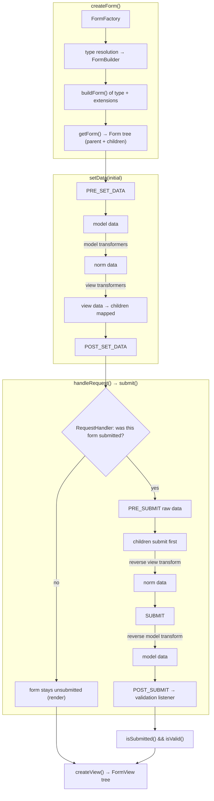

# Tour: a Form's life

**Source anchor:**
[`src/Symfony/Component/Form/Form.php` (8.0)](https://github.com/symfony/symfony/blob/8.0/src/Symfony/Component/Form/Form.php)
— open it side-by-side. The methods on the itinerary: `setData()`,
`handleRequest()`, `submit()`, `isSubmitted()`, `isValid()`, `createView()`.
It is a long file; this tour is your trail map through it.

!!! tip "What you'll be able to answer"
    - In which exact order do the six `FormEvents` fire across one
      render-then-submit cycle, and which direction do the transformers run at
      each of them?
    - What is the difference between *model*, *norm(alized)* and *view* data,
      and which event lets you change each?
    - Where does validation actually happen — and why is `isValid()` before
      `isSubmitted()` a `LogicException`?

## The map



## The walkthrough

Trace one form in your head: `TaskType` with a `dueDate` `DateType` child,
rendered, then POSTed back with an invalid date.

### Stop 1 — `createForm()`: from type class to `Form` tree

Your controller's `createForm(TaskType::class, $task)` delegates to the
`FormFactory`. The factory resolves the type through the **type chain**
(the type, its parent types up to `FormType`, plus all registered *type
extensions*), producing a `ResolvedFormType`. Options are resolved via each
level's `configureOptions()` (an `OptionsResolver` pass), then `buildForm()` runs
down the chain, adding children to a `FormBuilder`. Finally `getForm()` freezes
the builder into an immutable-structure `Form` tree — one `Form` instance per
field, wired to its parent.

**Extension point:** custom `FormTypeInterface` classes, and
`FormTypeExtensionInterface` (tag `form.type_extension`) to alter *existing*
types — e.g. add an option to every `TextType` app-wide.

### Stop 2 — `setData()`: one datum, three representations

Passing `$task` to `createForm()` ends up in `Form::setData()`. This is where the
famous three representations are minted:

- **model data** — your domain value (a `Task`, a `DateTimeImmutable`);
- **norm data** — the normalized intermediate the type logic works on;
- **view data** — what widgets render (strings, arrays of scalars).

```php
// simplified sketch — not verbatim source
public function setData(mixed $modelData): static
{
    if ($this->hasListeners(FormEvents::PRE_SET_DATA)) {
        $event = new PreSetDataEvent($this, $modelData);
        $this->dispatch($event, FormEvents::PRE_SET_DATA);   // may REPLACE the data
        $modelData = $event->getData();
    }

    $this->modelData = $modelData;
    $normData = $this->modelToNorm($modelData);   // model transformers, forward
    $viewData = $this->normToView($normData);     // view transformers, forward

    $this->normData = $normData;
    $this->viewData = $viewData;
    // ... compound forms: the DataMapper maps view data onto children (mapDataToForms)

    $this->dispatch(new PostSetDataEvent($this, $modelData), FormEvents::POST_SET_DATA);

    return $this;
}
```

Order to memorize: **PRE_SET_DATA → model → (model transformers) → norm →
(view transformers) → view → children mapped → POST_SET_DATA**. `PRE_SET_DATA`
is the only set-side event that can still *replace* the data — the classic
"add/remove fields based on the underlying object" hook. `POST_SET_DATA` is
read-only with respect to the data.

**Extension point:** `FormEvents::PRE_SET_DATA` / `POST_SET_DATA` listeners;
`DataTransformerInterface` via `addModelTransformer()` / `addViewTransformer()`;
`DataMapperInterface` (`setDataMapper()`) for custom object↔fields mapping.

### Stop 3 — `handleRequest()`: the polite bouncer

`Form::handleRequest($request)` does *not* submit anything itself — it hands the
request to the form's `RequestHandlerInterface` (in a web app, the
`HttpFoundationRequestHandler`). The handler decides **whether this request is a
submission of this form**: HTTP method matches the form's configured method? For
GET forms, is the form's name present in the query? For POST forms, is there data
under the form's name (plus uploaded files)? If not — return without touching the
form: `isSubmitted()` stays `false`, and your `render()` call proceeds with a
pristine form. If yes — extract the raw array and call `$form->submit($data)`.

**Extension point:** `RequestHandlerInterface` (e.g. the `NativeRequestHandler`
used without HttpFoundation); the form's `method`/`name` options are what the
handler consults.

### Stop 4 — `submit()`: the reverse trip

`submit($submittedData, $clearMissing = true)` is the mirror image of Stop 2,
transformers running in **reverse**:

```php
// simplified sketch — not verbatim source
public function submit(mixed $submittedData, bool $clearMissing = true): static
{
    $event = new PreSubmitEvent($this, $submittedData);
    $this->dispatch($event, FormEvents::PRE_SUBMIT);     // raw client data, still mutable
    $submittedData = $event->getData();

    // compound form: dispatch each child's share to $child->submit(...)
    // then the DataMapper reads children back (mapFormsToData)

    $normData = $this->viewToNorm($viewData);            // view transformers, REVERSE

    $event = new SubmitEvent($this, $normData);
    $this->dispatch($event, FormEvents::SUBMIT);         // norm data, mutable
    $normData = $event->getData();

    $modelData = $this->normToModel($normData);          // model transformers, REVERSE

    $this->submitted = true;
    $this->dispatch(new PostSubmitEvent($this, $viewData), FormEvents::POST_SUBMIT);

    return $this;
}
```

Order to memorize: **PRE_SUBMIT (raw) → children submit → reverse view
transform → norm → SUBMIT → reverse model transform → model → POST_SUBMIT**.
`PRE_SUBMIT` sees exactly what the client sent (the classic hook for dynamic
`city` fields depending on the posted `country`); `SUBMIT` sees norm data;
`POST_SUBMIT` can no longer change the data — but it is exactly where validation
plugs in (next stop). A `TransformationFailedException` thrown by a reverse
transformer does not explode the request: it marks the form as
*not synchronized*, which later surfaces as the `invalid_message` error.

**Extension point:** `FormEvents::PRE_SUBMIT` / `SUBMIT` / `POST_SUBMIT`
listeners; reverse sides of your `DataTransformerInterface` implementations.

!!! danger "Exam trap"
    Transformer *type* and *direction* are the favourite trap pair. Forward
    (`setData`): **model transformers first, then view transformers**. Reverse
    (`submit`): **view transformers first (reverseTransform), then model
    transformers**. And the events see different representations: `PRE_SUBMIT` =
    raw client data, `SUBMIT` = norm data, `POST_SUBMIT` = too late to change
    anything. If a question says "modify the submitted value in `POST_SUBMIT`",
    it's a trap.

### Stop 5 — `isSubmitted()` / `isValid()`: validation is a listener

`isSubmitted()` just returns the flag set in `submit()`. `isValid()` first
**throws a `LogicException` if the form was never submitted** — hence the
canonical `if ($form->isSubmitted() && $form->isValid())`, in that order. When
submitted, `isValid()` simply checks that the form (and, recursively, its
children) collected **no errors**.

But who *put* errors there? Not `isValid()` — validation already ran during
Stop 4: the Form↔Validator bridge registers a **`POST_SUBMIT` listener**
(`ValidationListener`) on the root form that runs the **Validator** against the
form. The `Form` constraint validator validates the *mapped model object*
(cascading your `#[Assert\...]` constraints plus the form's own `constraints`
option), then the **`ViolationMapper`** walks each violation's property path and
attaches a `FormError` to the *matching form child* (respecting
`error_mapping`); unmappable violations bubble to ancestors according to
`error_bubbling`.

**Extension point:** the `constraints` and `validation_groups` options,
`error_mapping`, custom constraints on the model — and remember it all hangs off
`POST_SUBMIT` priority ordering if you add listeners there yourself.

### Stop 6 — `createView()`: the render-side snapshot

`createView()` walks the tree once more, letting each resolved type run
`buildView()` (top-down: parents before children) and `finishView()` (bottom-up:
children exist when it runs), producing a parallel tree of lightweight
`FormView` objects — `vars` arrays consumed by the form themes. Errors attached
in Stop 5 travel into `view.vars['errors']`, which is why you must submit and
validate *before* creating the view.

**Extension point:** `buildView()`/`finishView()` in your types and type
extensions (e.g. inject an extra `var` for the template).

## Extension points recap

| Stop | Hook | Typical use |
| --- | --- | --- |
| 1 | `FormTypeInterface` / `FormTypeExtensionInterface` | New field types; alter existing types globally |
| 2 | `PRE_SET_DATA` / `POST_SET_DATA` | Add/remove fields based on initial data |
| 2, 4 | `DataTransformerInterface` (model/view) | Convert between representations (`entity ↔ id`, `DateTime ↔ string`) |
| 2, 4 | `DataMapperInterface` | Custom object↔fields mapping (value objects, immutables) |
| 3 | `RequestHandlerInterface` | Non-HttpFoundation stacks, custom submission detection |
| 4 | `PRE_SUBMIT` / `SUBMIT` | Mutate raw client data; dynamic fields from submitted values |
| 5 | `POST_SUBMIT` + Validator (`constraints`, `error_mapping`) | Validation, post-processing that needs the final object |
| 6 | `buildView()` / `finishView()` | Extra template vars, child-dependent view tweaks |

## Test yourself

??? question "Q1. List the six FormEvents in the order they fire across one create-then-submit cycle."
    `PRE_SET_DATA`, `POST_SET_DATA` (during `setData()`, at creation), then
    `PRE_SUBMIT`, `SUBMIT`, `POST_SUBMIT` (during `submit()`). That's five names —
    the sixth is remembering `PRE_SET_DATA`/`POST_SET_DATA` fire *again* if you
    call `setData()` again; there is no separate "validate" event: validation
    rides `POST_SUBMIT`.

??? question "Q2. You need to add a `state` field only when the submitted `country` is `US`. Which event, and why not SUBMIT?"
    `PRE_SUBMIT` — it is the only submit-side event that sees the raw client
    array *before* it is dispatched to children, so a field added there still
    receives its share of the data. At `SUBMIT` the children have already been
    submitted; a new child would stay empty.

??? question "Q3. A reverse view transformer throws `TransformationFailedException`. Is the request a 500?"
    No. The form catches it, marks itself **not synchronized**, and the user
    sees the `invalid_message` error; `isValid()` returns false. Calling
    `getData()` still works but returns the last synchronized (pre-submit) model
    data — a subtle source-level detail worth reading in `Form.php`.

??? question "Q4. Why does `$form->isValid()` throw if you forgot `handleRequest()`?"
    Because `isValid()` guards with "has this form been submitted?" and throws a
    `LogicException` otherwise — an unsubmitted form is neither valid nor
    invalid. `handleRequest()` on a non-matching request (e.g. the initial GET)
    leaves the form unsubmitted on purpose, so the same controller action can
    both render and process.

??? question "Q5. Where does a violation on `Task::$dueDate` become a red error under the right widget?"
    During `POST_SUBMIT`: the validation listener runs the Validator on the
    form; the resulting `ConstraintViolation` has property path `data.dueDate`,
    which the `ViolationMapper` resolves through the form tree (honouring
    `property_path` and `error_mapping`) to the `dueDate` child, adding a
    `FormError` there. `createView()` then copies it into that child's
    `view.vars['errors']`.

## Official References

- [Form.php (8.0 source)](https://github.com/symfony/symfony/blob/8.0/src/Symfony/Component/Form/Form.php)
- [Form Events](https://symfony.com/doc/8.0/form/events.html)
- [Data Transformers](https://symfony.com/doc/8.0/form/data_transformers.html)
- [Forms — processing](https://symfony.com/doc/8.0/forms.html#processing-forms)
- [When and How to Use Data Mappers](https://symfony.com/doc/8.0/form/data_mappers.html)

---
<small>Related: [Form Events](../forms/events.md) ·
[Data Transformers](../forms/data-transformers.md) ·
[Form Handling](../forms/handling.md) ·
[Form Creation](../forms/creation.md)</small>
