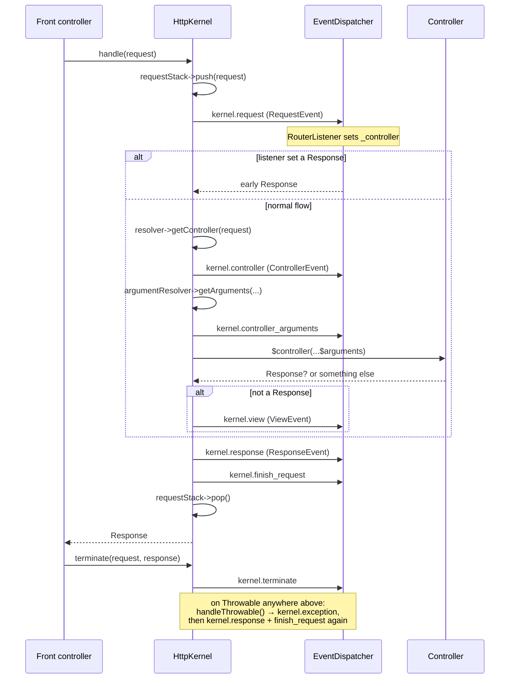

# Tour : HttpKernel::handle()

**Source anchor:**
[`src/Symfony/Component/HttpKernel/HttpKernel.php` (8.0)](https://github.com/symfony/symfony/blob/8.0/src/Symfony/Component/HttpKernel/HttpKernel.php)
— ouvrez-le côte à côte. Tout le tour se déroule dans `handle()`, `handleRaw()`,
`filterResponse()`, `finishRequest()`, `handleThrowable()` et `terminate()`.

!!! tip "What you'll be able to answer"
    - Dans quel ordre exact les huit `KernelEvents` se déclenchent-ils pour une
      request dont le controller retourne une `Response` — et lequel se
      déclenche en plus lorsqu'il lance une exception ?
    - Que se passe-t-il quand un controller retourne une chaîne au lieu d'une
      `Response`, et quel event peut le sauver d'une exception ?
    - Quels events s'exécutent encore sur le chemin d'exception, et quand
      `kernel.terminate` se déclenche-t-il par rapport à la réception de la
      response par le client ?

## The map



## The walkthrough

Suivez mentalement une request : `GET /blog/42`, le controller retourne une
`Response`.

### Stop 1 — `handle()`: push the request, promise to pop it

`handle(Request $request, int $type = self::MAIN_REQUEST, bool $catch = true)`
fait trois choses : elle pousse la request sur la `RequestStack`, délègue le
vrai travail à la méthode privée `handleRaw()`, et enveloppe le tout de sorte
que la pile soit dépilée quoi qu'il arrive — succès ou exception.

```php
// simplified sketch — not verbatim source
public function handle(Request $request, int $type = self::MAIN_REQUEST, bool $catch = true): Response
{
    $this->requestStack->push($request);

    try {
        return $this->handleRaw($request, $type);
    } catch (\Throwable $e) {
        if (false === $catch) {
            throw $e; // after dispatching kernel.finish_request
        }

        return $this->handleThrowable($e, $request, $type);
    } finally {
        $this->requestStack->pop();
    }
}
```

C'est pourquoi `RequestStack::getCurrentRequest()` fonctionne partout pendant le
cycle de vie, et pourquoi les sub-requests (qui rentrent à nouveau dans
`handle()` avec `SUB_REQUEST`) s'imbriquent proprement : chaque push est
compensé par un pop.

**Point d'extension :** aucun ici — c'est de la tuyauterie. Mais notez le
drapeau `$catch` : les sub-requests créées par le `FragmentHandler` peuvent
passer `false` pour que les exceptions remontent jusqu'à la gestion d'exception
de la request *parente*.

### Stop 2 — `kernel.request`: the "anything can happen" event

Première ligne de `handleRaw()` : un `RequestEvent` est dispatché en tant que
`KernelEvents::REQUEST` (`kernel.request`). Parmi les listeners du framework à
cet endroit figure le **`RouterListener`** (priorité 32), qui confronte la
request à la table de routing et écrit le résultat dans
`$request->attributes` — surtout **`_controller`** et **`_route`**, plus chaque
paramètre de route.

Si *n'importe quel* listener appelle `$event->setResponse()`, `handleRaw()`
saute immédiatement à `filterResponse()` — pas de controller, pas de
`kernel.view`. C'est ainsi que les pages de maintenance, certaines redirections
et les points d'entrée de sécurité court-circuitent le kernel.

```php
// simplified sketch
$event = new RequestEvent($this, $request, $type);
$this->dispatcher->dispatch($event, KernelEvents::REQUEST);

if ($event->hasResponse()) {
    return $this->filterResponse($event->getResponse(), $request, $type);
}
```

**Point d'extension :** n'importe quel listener/subscriber sur
`kernel.request`. La priorité compte énormément : exécutez-vous *avant* 32 et
`_controller` n'est pas encore défini ; le `Firewall` de sécurité s'exécute à la
priorité 8, délibérément *après* le routing.

### Stop 3 — controller resolution

`handleRaw()` demande au `ControllerResolverInterface` de transformer la request
en un callable. L'implémentation par défaut lit `_controller` dans les
attributs. Si le resolver retourne `false`, le kernel lance une
`NotFoundHttpException` — c'est le 404 « aucune route n'a matché *et* aucun
listener n'est venu à la rescousse ».

```php
// simplified sketch
if (false === $controller = $this->resolver->getController($request)) {
    throw new NotFoundHttpException('Unable to find the controller...');
}
```

**Point d'extension :** remplacer ou décorer `ControllerResolverInterface`
(voir le [tour dédié](argument-resolver.md)).

### Stop 4 — `kernel.controller`: last chance to swap the callable

Un `ControllerEvent` est dispatché en tant que `KernelEvents::CONTROLLER`. Les
listeners peuvent inspecter le callable résolu (y compris sa réflexion et ses
attributs PHP — `ControllerEvent::getAttributes()`) et **le remplacer
entièrement** avec `$event->setController()`. C'est ainsi que `#[Cache]`,
`#[IsGranted]` et la logique de style ParamConverter attachent un comportement
aux attributs de controller.

**Point d'extension :** un listener sur `kernel.controller` ; lire les
attributs de classe/méthode via l'event est l'idiome moderne.

### Stop 5 — argument resolution + `kernel.controller_arguments`

L'`ArgumentResolverInterface` calcule le tableau d'arguments pour le callable
(tous les détails dans le [tour ControllerResolver & ArgumentResolver](argument-resolver.md)).
Puis `KernelEvents::CONTROLLER_ARGUMENTS` se déclenche avec un
`ControllerArgumentsEvent` : les listeners peuvent encore modifier les arguments
*ou le controller*. L'`IsGrantedAttributeListener` de la sécurité se branche
ici, parce qu'il peut avoir besoin des arguments résolus (par exemple
`#[IsGranted('EDIT', subject: 'post')]`).

```php
// simplified sketch
$arguments = $this->argumentResolver->getArguments($request, $controller, $event->getControllerReflector());

$event = new ControllerArgumentsEvent($this, $event, $arguments, $request, $type);
$this->dispatcher->dispatch($event, KernelEvents::CONTROLLER_ARGUMENTS);
$controller = $event->getController();
$arguments = $event->getArguments();
```

**Point d'extension :** des listeners `kernel.controller_arguments` ; des
implémentations personnalisées de `ValueResolverInterface` en amont.

### Stop 6 — the controller runs

Une seule ligne, aucun event autour :

```php
// simplified sketch
$response = $controller(...$arguments);
```

Quel que soit votre controller — closure, service invokable,
`[Class, 'method']` — il est simplement appelé avec les arguments décomposés.

### Stop 7 — not a `Response`? → `kernel.view`

Si la valeur de retour n'est **pas** une instance de `Response`, le kernel
dispatche un `ViewEvent` (`KernelEvents::VIEW`) transportant le résultat brut du
controller. Un listener doit le convertir en `Response` via
`$event->setResponse()`. Si aucun ne le fait, le kernel lance une
`ControllerDoesNotReturnResponseException` avec un message très citable
("The controller must return a Response object...").

C'est le crochet derrière la sérialisation d'API Platform et derrière le rendu
de style `#[Template]`.

!!! danger "Exam trap"
    `kernel.view` se déclenche **uniquement** quand le controller retourne une
    valeur autre qu'une `Response`. Un controller retournant une `Response` le
    saute entièrement — donc « les huit events se déclenchent toujours dans
    l'ordre » est *faux* : une request HTML normale à travers un controller
    typique en déclenche sept (`request`, `controller`,
    `controller_arguments`, `response`, `finish_request`, `terminate` — et
    `exception` seulement en cas d'erreur). Les questions d'ordonnancement
    adorent glisser `kernel.view` dans des séquences où il ne s'est jamais
    déclenché.

### Stop 8 — `filterResponse()`: `kernel.response` + `finishRequest()`

*Tous* les chemins de sortie — response anticipée du Stop 2, response normale du
controller, response issue du view event, même les responses du chemin
d'exception — convergent vers `filterResponse()` :

```php
// simplified sketch
private function filterResponse(Response $response, Request $request, int $type): Response
{
    $event = new ResponseEvent($this, $request, $type, $response);
    $this->dispatcher->dispatch($event, KernelEvents::RESPONSE);
    $this->finishRequest($request, $type);

    return $event->getResponse();
}
```

Les listeners `kernel.response` modifient ou remplacent la response finale
(ajouter des headers, injecter la WDT, définir des directives de cache). Puis
`finishRequest()` dispatche `KernelEvents::FINISH_REQUEST` — le signal de
nettoyage, utilisé par exemple par le `LocaleListener` pour restaurer la locale
de la request parente après une sub-request.

**Point d'extension :** `kernel.response` (le dernier mot sur la response),
`kernel.finish_request` (nettoyage par request, se déclenche aussi pour les
sub-requests).

### Stop 9 — the exception path: `handleThrowable()` → `kernel.exception`

Tout ce qui est lancé n'importe où dans `handleRaw()` (quand `$catch` vaut true)
atterrit dans `handleThrowable()`. Celle-ci dispatche un `ExceptionEvent`
(`KernelEvents::EXCEPTION`). Un listener peut appeler `setResponse()` — c'est
ainsi que l'`ErrorListener` rend les pages d'erreur et que la sécurité convertit
une `AccessDeniedException` en redirection vers le login ou en 403. Si **aucun**
listener ne définit de response, le throwable d'origine est relancé.

Le kernel ajuste ensuite le code de statut : si le throwable implémente
`HttpExceptionInterface`, son code de statut et ses headers l'emportent ; sinon
500 — sauf si un listener a invoqué `allowCustomResponseCode()`. Enfin la
response repasse par `filterResponse()` **une nouvelle fois**, si bien que
`kernel.response` et `kernel.finish_request` se déclenchent aussi sur les
chemins d'erreur.

**Point d'extension :** des listeners `kernel.exception` ; lancer des
implémentations de `HttpExceptionInterface` depuis n'importe où pour contrôler
le code de statut.

### Stop 10 — `terminate()`: after the response is (usually) sent

`terminate(Request, Response)` est appelée par le front controller **après**
`$response->send()`. Elle dispatche `KernelEvents::TERMINATE`
(`TerminateEvent`) — les travaux lourds (e-mails via le repli synchrone de
Messenger, stockage du profiler, flush des logs) s'exécutent ici sans retarder
le client, à condition que votre SAPI/serveur envoie réellement la response
d'abord (le `fastcgi_finish_request()` de FastCGI le fait ; certaines
configurations non).

**Point d'extension :** des listeners `kernel.terminate` ; le kernel lui-même
doit implémenter `TerminableInterface` pour que cela soit appelé.

## Extension points recap

| Stop | Hook | Usage typique |
| --- | --- | --- |
| 2 | `kernel.request` (`RequestEvent`) | Routing, locale, firewall, responses/redirections anticipées |
| 3 | `ControllerResolverInterface` | Conventions `_controller` personnalisées |
| 4 | `kernel.controller` (`ControllerEvent`) | Remplacer le controller, lire les attributs de controller |
| 5 | `ValueResolverInterface` + `kernel.controller_arguments` | Injecter des arguments personnalisés, vérifications basées sur les attributs |
| 7 | `kernel.view` (`ViewEvent`) | Transformer les valeurs de retour de controller en Responses (sérialisation) |
| 8 | `kernel.response` / `kernel.finish_request` | Injection de headers, WDT, nettoyage par request |
| 9 | `kernel.exception` (`ExceptionEvent`) | Pages d'erreur, mapping exception→response, codes de statut |
| 10 | `kernel.terminate` (`TerminateEvent`) | Travaux lourds après la response |

## Test yourself

??? question "Q1. A `kernel.request` listener calls `setResponse()`. List every event that still fires."
    Seulement `kernel.response` et `kernel.finish_request` (puis, après l'envoi,
    `kernel.terminate`). La résolution du controller, `kernel.controller`,
    `kernel.controller_arguments` et `kernel.view` sont tous sautés —
    `handleRaw()` retourne directement via `filterResponse()`.

??? question "Q2. A controller returns an array and no listener handles `kernel.view`. What exactly happens?"
    Le kernel lance `ControllerDoesNotReturnResponseException` (une
    `LogicException`, pas une exception HTTP). Comme elle *est* lancée à
    l'intérieur de `handleRaw()`, le chemin d'exception s'enclenche :
    `kernel.exception` se déclenche et l'`ErrorListener` rend une 500 dans une
    configuration standard.

??? question "Q3. Does `kernel.response` fire when an exception occurs?"
    Oui — les candidats trop méfiants se trompent sur ce point.
    `handleThrowable()` fait passer la response d'erreur fournie par le listener
    à travers `filterResponse()`, donc `kernel.response` et
    `kernel.finish_request` se déclenchent aussi sur le chemin d'exception. Ce
    n'est que si *aucun* listener `kernel.exception` ne définit de response (le
    throwable est relancé) qu'ils sont sautés.

??? question "Q4. Where does the `RequestStack` get popped, and why does it matter?"
    Dans le `finally` de `handle()` — garantissant un pop par push même quand
    une exception s'échappe (`$catch = false`). C'est important pour les
    sub-requests : les services qui lisent `getCurrentRequest()` voient la
    sub-request pendant son traitement, et à nouveau la parente ensuite.

??? question "Q5. `kernel.terminate` never seems to speed anything up on your server. Most likely reason?"
    La response n'est réellement envoyée avant le travail de terminate que si la
    SAPI supporte le flush anticipé (par exemple le `fastcgi_finish_request()`
    de PHP-FPM). Sans cela, le client attend que les listeners de `terminate()`
    aient terminé. L'*ordre* des events est le même ; le bénéfice en *latence
    perçue* dépend de la SAPI.

## Official References

- [HttpKernel.php (8.0 source)](https://github.com/symfony/symfony/blob/8.0/src/Symfony/Component/HttpKernel/HttpKernel.php)
- [The HttpKernel Component — the workflow of a request](https://symfony.com/doc/8.0/components/http_kernel.html)
- [Built-in Symfony Events (KernelEvents)](https://symfony.com/doc/8.0/reference/events.html)

---
<small>Related: [Request Handling](../architecture/request-handling.md) ·
[Events](../architecture/events.md) ·
[Exception Handling](../architecture/exception-handling.md) ·
[Tour: ControllerResolver & ArgumentResolver](argument-resolver.md)</small>
