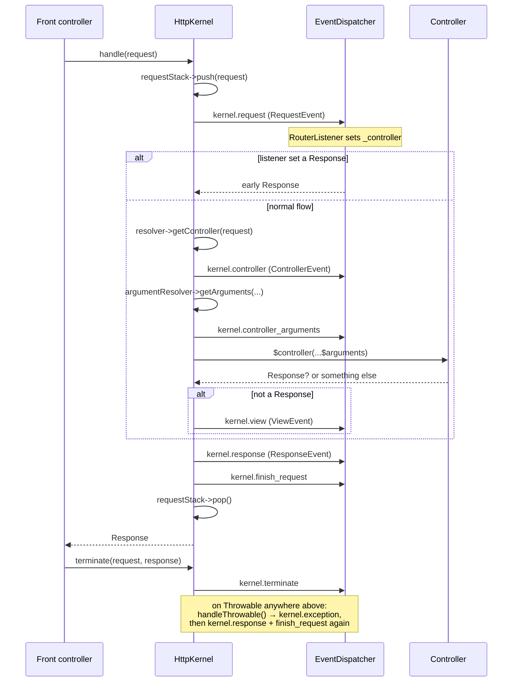

# Tour: HttpKernel::handle()

**Source anchor:**
[`src/Symfony/Component/HttpKernel/HttpKernel.php` (8.0)](https://github.com/symfony/symfony/blob/8.0/src/Symfony/Component/HttpKernel/HttpKernel.php)
— open it side-by-side. The whole tour lives in `handle()`, `handleRaw()`,
`filterResponse()`, `finishRequest()`, `handleThrowable()` and `terminate()`.

!!! tip "What you'll be able to answer"
    - In what exact order do the eight `KernelEvents` fire for a request whose
      controller returns a `Response` — and which extra one fires when it throws?
    - What happens when a controller returns a string instead of a `Response`,
      and which event can save it from an exception?
    - Which events still run on the exception path, and when does
      `kernel.terminate` fire relative to the client receiving the response?

## The map



## The walkthrough

Trace one request in your head: `GET /blog/42`, controller returns a `Response`.

### Stop 1 — `handle()`: push the request, promise to pop it

`handle(Request $request, int $type = self::MAIN_REQUEST, bool $catch = true)`
does three things: it pushes the request onto the `RequestStack`, delegates the
real work to the private `handleRaw()`, and wraps everything so that the stack is
popped again no matter what — success or throw.

```php
// simplified sketch — not verbatim source
public function handle(Request $request, int $type = self::MAIN_REQUEST, bool $catch = true): Response
{
    $this->requestStack->push($request);

    try {
        return $this->handleRaw($request, $type);
    } catch (\Throwable $e) {
        if (false === $catch) {
            throw $e; // after dispatching kernel.finish_request
        }

        return $this->handleThrowable($e, $request, $type);
    } finally {
        $this->requestStack->pop();
    }
}
```

This is why `RequestStack::getCurrentRequest()` works everywhere during the
lifecycle, and why sub-requests (which re-enter `handle()` with
`SUB_REQUEST`) nest cleanly: each push is matched by a pop.

**Extension point:** none here — this is plumbing. But note the `$catch` flag:
sub-requests created by `FragmentHandler` may pass `false` so exceptions bubble
to the *parent* request's exception handling.

### Stop 2 — `kernel.request`: the "anything can happen" event

First line of `handleRaw()`: a `RequestEvent` is dispatched as
`KernelEvents::REQUEST` (`kernel.request`). Framework listeners here include the
**`RouterListener`** (priority 32), which matches the request against the routing
table and writes the result into `$request->attributes` — crucially
**`_controller`** and **`_route`**, plus every route parameter.

If *any* listener calls `$event->setResponse()`, `handleRaw()` immediately jumps
to `filterResponse()` — no controller, no `kernel.view`. This is how maintenance
pages, some redirects and security entry points short-circuit the kernel.

```php
// simplified sketch
$event = new RequestEvent($this, $request, $type);
$this->dispatcher->dispatch($event, KernelEvents::REQUEST);

if ($event->hasResponse()) {
    return $this->filterResponse($event->getResponse(), $request, $type);
}
```

**Extension point:** any listener/subscriber on `kernel.request`. Priority
matters enormously: run *before* 32 and `_controller` is not set yet; the
security `Firewall` runs at priority 8, deliberately *after* routing.

### Stop 3 — controller resolution

`handleRaw()` asks the `ControllerResolverInterface` to turn the request into a
callable. The default implementation reads `_controller` from the attributes. If
the resolver returns `false`, the kernel throws a `NotFoundHttpException` — this
is the "no route matched *and* no listener helped" 404.

```php
// simplified sketch
if (false === $controller = $this->resolver->getController($request)) {
    throw new NotFoundHttpException('Unable to find the controller...');
}
```

**Extension point:** swap or decorate `ControllerResolverInterface` (see the
[dedicated tour](argument-resolver.md)).

### Stop 4 — `kernel.controller`: last chance to swap the callable

A `ControllerEvent` is dispatched as `KernelEvents::CONTROLLER`. Listeners can
inspect the resolved callable (including its reflection and its PHP attributes —
`ControllerEvent::getAttributes()`) and **replace it entirely** with
`$event->setController()`. This is how `#[Cache]`, `#[IsGranted]` and
ParamConverter-style logic attach behaviour to controller attributes.

**Extension point:** listener on `kernel.controller`; reading class/method
attributes via the event is the modern idiom.

### Stop 5 — argument resolution + `kernel.controller_arguments`

The `ArgumentResolverInterface` computes the array of arguments for the callable
(full detail in the [ControllerResolver & ArgumentResolver tour](argument-resolver.md)).
Then `KernelEvents::CONTROLLER_ARGUMENTS` fires with a
`ControllerArgumentsEvent`: listeners may still change the arguments *or the
controller*. Security's `IsGrantedAttributeListener` hooks here, because it may
need the resolved arguments (e.g. `#[IsGranted('EDIT', subject: 'post')]`).

```php
// simplified sketch
$arguments = $this->argumentResolver->getArguments($request, $controller, $event->getControllerReflector());

$event = new ControllerArgumentsEvent($this, $event, $arguments, $request, $type);
$this->dispatcher->dispatch($event, KernelEvents::CONTROLLER_ARGUMENTS);
$controller = $event->getController();
$arguments = $event->getArguments();
```

**Extension point:** `kernel.controller_arguments` listeners; custom
`ValueResolverInterface` implementations upstream.

### Stop 6 — the controller runs

One line, no event around it:

```php
// simplified sketch
$response = $controller(...$arguments);
```

Whatever your controller is — closure, invokable service, `[Class, 'method']` —
it is simply called with the spread arguments.

### Stop 7 — not a `Response`? → `kernel.view`

If the return value is **not** a `Response` instance, the kernel dispatches a
`ViewEvent` (`KernelEvents::VIEW`) carrying the raw controller result. A listener
must convert it into a `Response` via `$event->setResponse()`. If none does, the
kernel throws a `ControllerDoesNotReturnResponseException` with a very quotable
message ("The controller must return a Response object...").

This is the hook behind API Platform's serialization and behind
`#[Template]`-style rendering.

!!! danger "Exam trap"
    `kernel.view` fires **only** when the controller returns a non-`Response`
    value. A controller returning a `Response` skips it entirely — so "the eight
    events always fire in order" is *false*: a normal HTML request through a
    typical controller fires seven (`request`, `controller`,
    `controller_arguments`, `response`, `finish_request`, `terminate` — and
    `exception` only on error). Ordering questions love to sneak `kernel.view`
    into runs where it never fired.

### Stop 8 — `filterResponse()`: `kernel.response` + `finishRequest()`

*Every* exit path — early response from Stop 2, normal controller response,
view-event response, even exception-path responses — funnels through
`filterResponse()`:

```php
// simplified sketch
private function filterResponse(Response $response, Request $request, int $type): Response
{
    $event = new ResponseEvent($this, $request, $type, $response);
    $this->dispatcher->dispatch($event, KernelEvents::RESPONSE);
    $this->finishRequest($request, $type);

    return $event->getResponse();
}
```

`kernel.response` listeners mutate or replace the final response (add headers,
inject the WDT, set cache directives). Then `finishRequest()` dispatches
`KernelEvents::FINISH_REQUEST` — the cleanup signal, used e.g. by the
`LocaleListener` to restore the parent request's locale after a sub-request.

**Extension point:** `kernel.response` (last word on the response),
`kernel.finish_request` (per-request cleanup, fires for sub-requests too).

### Stop 9 — the exception path: `handleThrowable()` → `kernel.exception`

Anything thrown anywhere in `handleRaw()` (when `$catch` is true) lands in
`handleThrowable()`. It dispatches an `ExceptionEvent`
(`KernelEvents::EXCEPTION`). A listener may `setResponse()` — that's how the
`ErrorListener` renders error pages and how security converts
`AccessDeniedException` into a login redirect or 403. If **no** listener sets a
response, the original throwable is re-thrown.

The kernel then adjusts the status code: if the throwable implements
`HttpExceptionInterface`, its status code and headers win; otherwise 500 — unless
a listener claimed `allowCustomResponseCode()`. Finally the response goes
through `filterResponse()` **again**, so `kernel.response` and
`kernel.finish_request` also fire on error paths.

**Extension point:** `kernel.exception` listeners; throwing
`HttpExceptionInterface` implementations from anywhere to control the status code.

### Stop 10 — `terminate()`: after the response is (usually) sent

`terminate(Request, Response)` is called by the front controller **after**
`$response->send()`. It dispatches `KernelEvents::TERMINATE`
(`TerminateEvent`) — heavy work (emails via Messenger's sync fallback, profiler
storage, log flushing) runs here without delaying the client, provided your
SAPI/server actually flushes the response first (FastCGI's
`fastcgi_finish_request()` does; some setups don't).

**Extension point:** `kernel.terminate` listeners; the kernel itself must
implement `TerminableInterface` for this to be called.

## Extension points recap

| Stop | Hook | Typical use |
| --- | --- | --- |
| 2 | `kernel.request` (`RequestEvent`) | Routing, locale, firewall, early responses/redirects |
| 3 | `ControllerResolverInterface` | Custom `_controller` conventions |
| 4 | `kernel.controller` (`ControllerEvent`) | Swap controller, read controller attributes |
| 5 | `ValueResolverInterface` + `kernel.controller_arguments` | Inject custom arguments, attribute-based checks |
| 7 | `kernel.view` (`ViewEvent`) | Turn controller return values into Responses (serialization) |
| 8 | `kernel.response` / `kernel.finish_request` | Header injection, WDT, per-request cleanup |
| 9 | `kernel.exception` (`ExceptionEvent`) | Error pages, exception→response mapping, status codes |
| 10 | `kernel.terminate` (`TerminateEvent`) | Post-response heavy work |

## Test yourself

??? question "Q1. A `kernel.request` listener calls `setResponse()`. List every event that still fires."
    Only `kernel.response` and `kernel.finish_request` (then, after sending,
    `kernel.terminate`). Controller resolution, `kernel.controller`,
    `kernel.controller_arguments` and `kernel.view` are all skipped —
    `handleRaw()` returns straight through `filterResponse()`.

??? question "Q2. A controller returns an array and no listener handles `kernel.view`. What exactly happens?"
    The kernel throws `ControllerDoesNotReturnResponseException` (a `LogicException`,
    not an HTTP exception). Because it *is* thrown inside `handleRaw()`, the
    exception path kicks in: `kernel.exception` fires and the `ErrorListener`
    renders a 500 in a standard setup.

??? question "Q3. Does `kernel.response` fire when an exception occurs?"
    Yes — twice-shy candidates get this wrong. `handleThrowable()` passes the
    listener-provided error response through `filterResponse()`, so both
    `kernel.response` and `kernel.finish_request` fire on the exception path too.
    Only if *no* `kernel.exception` listener sets a response (the throwable is
    re-thrown) do they get skipped.

??? question "Q4. Where does the `RequestStack` get popped, and why does it matter?"
    In the `finally` of `handle()` — guaranteeing a pop per push even when an
    exception escapes (`$catch = false`). It matters for sub-requests: services
    reading `getCurrentRequest()` see the sub-request during its handling and
    the parent again afterwards.

??? question "Q5. `kernel.terminate` never seems to speed anything up on your server. Most likely reason?"
    The response is only truly sent before terminate work when the SAPI supports
    early flushing (e.g. PHP-FPM's `fastcgi_finish_request()`). Without it, the
    client waits until `terminate()` listeners finish. The event *order* is the
    same; the *perceived latency* benefit depends on the SAPI.

## Official References

- [HttpKernel.php (8.0 source)](https://github.com/symfony/symfony/blob/8.0/src/Symfony/Component/HttpKernel/HttpKernel.php)
- [The HttpKernel Component — the workflow of a request](https://symfony.com/doc/8.0/components/http_kernel.html)
- [Built-in Symfony Events (KernelEvents)](https://symfony.com/doc/8.0/reference/events.html)

---
<small>Related: [Request Handling](../architecture/request-handling.md) ·
[Events](../architecture/events.md) ·
[Exception Handling](../architecture/exception-handling.md) ·
[Tour: ControllerResolver & ArgumentResolver](argument-resolver.md)</small>
